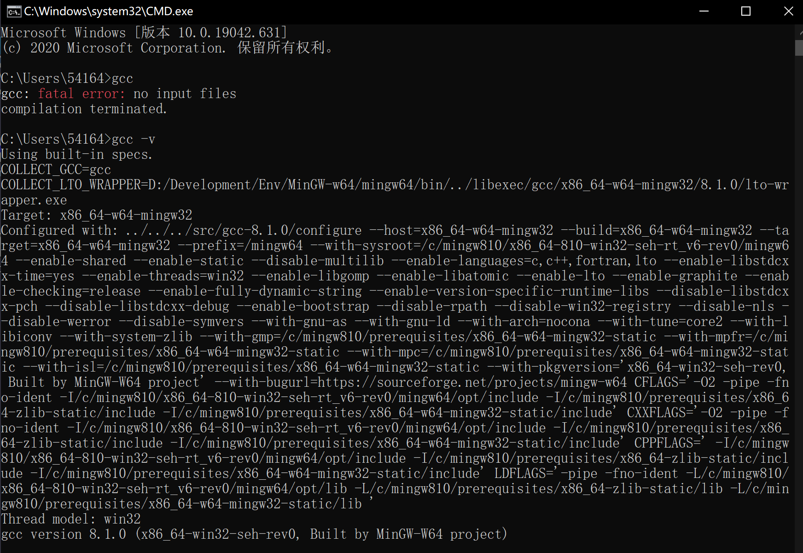

# 编译器

编译器把源代码变成可执行文件

gcc是C/C++编译器组合，但gcc也指编译C语言的程序，g++才是C++编译器。即gcc程序和g++程序包含在gcc套件以及MinGW里，当只说gcc时要根据语境区分

[MinGW vs MinGW-W64](https://github.com/FrankHB/pl-docs/blob/master/zh-CN/mingw-vs-mingw-v64.md)

## MinGW

Minimalist GNU on Windows 

它是将开源的**C语言编译器**GCC移植到了Windows平台下，并且包含了 Win32API （GCC 的 Windows 版本 ）

- 因此它可以将源代码编译为可在Windows中运行的可执行程序
- 还可以使用一些 Windows 不具备的，Linux平台下的开发工具

## MinGW-w64

MinGW只能编译生成32位可执行程序，MinGW-w64则可以编译生成64位或32位的可执行程序

- MinGW-w64是开源软件，可以免费使用
- MinGW-w64由一个活跃的开源社区在持续维护，因此不会过时
- MinGW-w64支持最新的C语言标准
- MinGW-w64 使用Windows的C语言运行库，因此编译出的程序不需要第三方DLL ，可以直接在 Windows 下运行

> MinGW现已被MinGW-w64所取代，且MinGW也早已停止了更新，内置的GCC停滞在了4.8.1版本
>
> 开源IDE实际只是将MinGW-w64 封装了起来，使它拥有友好的图形化界面，简化了操作，但内部核心仍然是 MinGW-w64

## 安装

> VSCode只是一个纯文本编辑器(editor)，不是IDE(集成开发环境)，不含编译器(compiler)和许多其它功能，所以编译器要自己安装

**下载**：

选择MinGW-W64 Online Installer下的MinGW-W64-install.exe或者最新版本中的`x86_64-posix-seh`

[MinGW-w64 - for 32 and 64 bit Windows](https://link.zhihu.com/?target=https%3A//sourceforge.net/projects/mingw-w64/files/) 

**选项**：

- Version：选择当前支持的最高版本。

- Architecture：64位选择x86_64，32位需要选择i686

- Threads：
  - 开发Windows程序选择win32 
  - 开发 Linux、Unix、MacOS等其他操作系统下的程序选择posix
- Exception：
  - 架构选择的是64位，有seh（新）和sjlj（老）两个异常处理模型
    - seh性能比较好，但不支持 32位
    - sjlj稳定性好，支持 32位
  - 架构选择的是32位，有dwarf和sjlj两种异常处理模型。dwarf的性能要优于sjlj，它们都不支持 64位
- Build revision：使用默认值。

**配置环境变量**：

将bin文件夹的完整路径添加到环境变量中的PATH中

**验证**：

Win+R运行cmd

- 输入`gcc`应该会提示`no input files`而不是**不是内部命令或外部命令**或者**无法将 "gcc" 项识别为 cmdlet、函数、脚本文件或可运行程序的名称**
- 输入`gcc -v`可以显示gcc的版本

> 如果显示出来的版本与下载的不同说明Path里原本有老版本的编译器，可能是安装其它IDE时装上的，最好去掉老的
>
> 如果是**不是内部命令或外部命令**，说明没有配置环境变量



# VSCode

## 扩展

- C/C++：cpptools，提供Debug和Format功能
- Code Runner：右键即可编译运行单文件，但无法Debug


## 断点调试

- 在列号前点一下可以加断点，右键可以加条件断点，断点加在main函数就在一开始就停下来

  - 按F11是一步一步运行，箭头所指的那行代码就是下一步要运行的代码
  - 按F5是一直运行到下一个断点，右键某一行代码可以选择一直运行到指定的那一行代码

- 调试栏可以查看变量值。自动栏没有的变量可以在Watch里手动添加，或者在代码中选中右键直接添加

- 栈帧对于观察递归很有用。栈溢出和段错误时还可以抓取**异常**，自动跳转到出错的行

- C语言的数组经过函数传递以后会退化为指针，直接添加表达式只能看到第一个元素。此时可以强制转换成指向固定大小的数组指针再解引

  > 例如`int arr[10]`传进函数里后就变成了`int* arr`，在Watch里添加`*(int(*)[10])arr`就能看到完整的数组了。但长度必须是固定的，小心越界

- vscode不在程序末尾停止（和IDE不一样），可以在最后加一个断点或者`getchar()`或者`system("pause"); `

- VSCode输出中文可能乱码。这是因为VSCode的源代码默认是UTF-8编码，而cmd/PowerShell是GBK编码

  > 使用VSCode打开别人用Dev Cpp或CB编写的代码文件时需要手动选择用GBK打开

## c_cpp_properties.json文件配置

在cmd中输入：`gcc -v -E -x c++ -`

```
C:/Env/Compiler/mingw64/bin/../lib/gcc/x86_64-w64-mingw32/8.1.0/include/c++
C:/Env/Compiler/mingw64/bin/../lib/gcc/x86_64-w64-mingw32/8.1.0/include/c++/x86_64-w64-mingw32
C:/Env/Compiler/mingw64/bin/../lib/gcc/x86_64-w64-mingw32/8.1.0/include/c++/backward
C:/Env/Compiler/mingw64/bin/../lib/gcc/x86_64-w64-mingw32/8.1.0/include
C:/Env/Compiler/mingw64/bin/../lib/gcc/x86_64-w64-mingw32/8.1.0/include-fixed
C:/Env/Compiler/mingw64/bin/../lib/gcc/x86_64-w64-mingw32/8.1.0/../../../../x86_64-w64-mingw32/include
```

## 运行

会在工作目录下的生成一个launch.json的启动配置文件:

> launch.json中有很多属性可以设置，通过智能提示查看有哪些属性可以设置，如果要查看属性的具体含义, 可以把鼠标悬停在属性上面，会属性的使用说明

# const

const 关键字可以限定一个变量的值不允许改变

> const不能定义真正意义上的常量，它只是告诉编译器，该变量不能出现在赋值符号的左边
>
> const修饰的变量是只读的，本质还是变量

> 在clang编译器上，用指针修改不会报错但是并不会修改其值，而在gcc上就会修改它的值
>
> c primer plus301页 c标准规定，使用非const标识符，修改const数据的结果是未定义的。所以才会有刚开始clang和gcc的区别

const int 类型的 i 的地址是不能赋值给指向 int 类型地址的指针 p 的（否则 p 能修改i的值）

```c
//不合法
const int i=10;
p = &i;
```

可以通过**强制类型转换**进行赋值

> const修饰的局部变量仍然是在栈上分配，可以通过指针修改其值。
>
> const将具有全局生命周期的变量存储在只读存储区（全局生命周期的变量除了全局变量还有static关键字修饰的变量），所以不能通过指针修改他们的值

```c
//合法，但不同的编译器结果不同
p= (int *) &i;
*p=20;
```

const的两种写法

- const int
- int const

```c
//均会报错，所以两种写法相等
const int i=10;
i++;
int const i=10;
i++;
```


# 指针

指针是一种**对象类型**，它引用函数或另一种类型的对象，可以添加**限定符**`const`。指针亦可以不引用任何内容，这通过一个特定的**空指针值**`NULL`指示。

成员访问运算符`*`：指针解引用

根据*和p的位置关系有不同的修饰

## const int* p

**p是指向（const int）的非const指针**

const修饰的是整个`*p`（即int），而不是p。所以这里的`*p`是不能被赋值的，也就是说不能通过`*p`来修改值。

指针变量p并没有用 const 关键字进行修饰，能被赋值**重新指向另一内存地址**（从而改变了值）

```c
const int * p = &n; 
*p = 2; // 错误：不能通过*p修改n的值
p = &m; // 正确： p自身可修改
```

## int* const p

**p 是一个指向（非 const 的 int） 的 const 指针**

p 因为有了 const 的修饰，所以只是一个指针常量，它只能永远指向初始化时的内存地址

```c
int * const p = &n; 
*p = 2; // 正确：通过p修改 n
p = &m; // 错误：p自身不能修改
```

## int * const * p = &n

指向 （ 指向（非 const 的 int）的 const 指针) 的 非 const 指针


# typedef

typedef为C语言的关键字，作用是为一种数据类型定义一个**别名**。这里的数据类型包括内部数据类型（int,char等）和自定义的数据类型（struct等）。

## 结构体

在C中，struct不能包含函数

```c
//正常的结构体
struct Node{

};
struct Node n1,n2;

//用typedef后声明变量的时候不需要在前面加struct
typedef struct Node{

}Node;
Node n1,n2;
```

## 结构体指针

```c
//Bitree不是结构体指针变量
//而是typedef给结构体指针的别名(Bitree~struct Treenode *)
typedef struct TreeNode{
	TNType  _value;
	struct TreeNode* _left;
	struct TreeNode* _right;
}TreeNode, * Bitree;
// 相当于定义了两次
typedef struct TreeNode{
	TNType  _value;
	struct TreeNode* _left;
	struct TreeNode* _right;
};
//typedef struct TreeNode TreeNode;
//typedef struct TreeNode* Bitree;
```


# ifndef

```c
#ifndef <标识> 	// if not define 
#define <标识> 	// then define 
#endif
```

当第一次包含标识时，由于没有定义标识，条件为真，这样就会包含（执行）#ifndef 标识和#endif之间的代码，当第二次包含标识时前面一次已经定义了标识，条件为假，#ifndef 和#endif之间的代码也就不会再次被包含，这样就避免了重定义。

## 标识

每个头文件的这个“标识”都应该是唯一的。

标识的命名规则一般是**头文件名全大写，前后加下划线，并把文件名中的“.”也变成下划线**。`stdio.h`就是`_STDIO_H_` 

# 读取输入

- gets：读入一行，并将**换行符**转换为字符串结束符
- scanf("%s",s)读入时，遇到**空白字符**（包括空格，制表符，换行符）时停止输入。

输入"test\nabcd"

- 执行gets后，**\n不会留在缓冲区中**，即这时调用getchar得到的字符是'a'
- 执行scanf后，**\n会留在缓冲区**，这时调用getchar得到的字符是'\n'