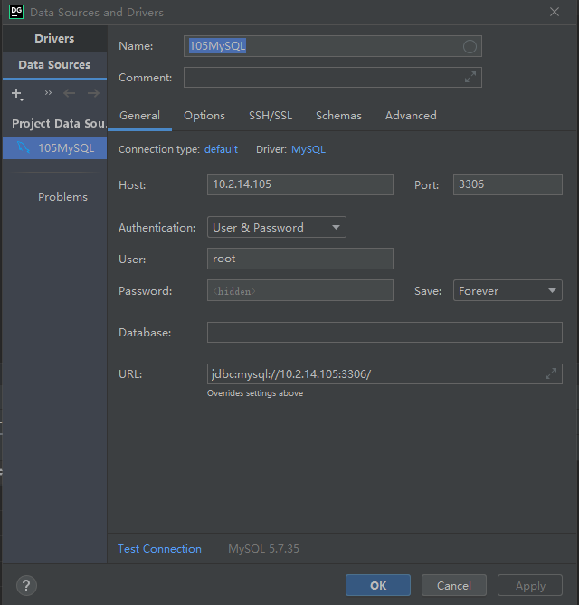
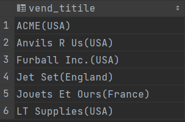

# 部署MySQL

## 获取配置目录

- `/etc/mysql/`是docker中配置文件的文件夹
- `/var/lib/mysql/`是docker中数据的文件夹
- `/var/log/mysql`是docker中mysql日志的文件夹

```mysql
# 下载镜像
docker pull mysql:5.7
# 查看
docker images | grep mysql
# 创建
docker run --name=mysql -p 3307:3306 -d -e MYSQL_ROOT_PASSWORD=1 mysql:5.7
```


## 创建映射目录

- 配置目录：`/home/dog/yinke/mysql/conf`
- 数据目录：`/home/dog/yinke/mysql/data`
- 日志目录：`/home/dog/yinke/mysql/log`

在`conf`目录下创建`my.cnf`配置文件

```bash
[mysqld]
user=mysql
character-set-server=utf8
default_authentication_plugin=mysql_native_password
secure_file_priv=/var/lib/mysql
expire_logs_days=7
sql_mode=STRICT_TRANS_TABLES,NO_ZERO_IN_DATE,NO_ZERO_DATE,ERROR_FOR_DIVISION_BY_ZERO,NO_ENGINE_SUBSTITUTION
max_connections=1000

[client]
default-character-set=utf8

[mysql]
default-character-set=utf8
```


## 创建MySQL容器

- `--restart=always`： Docker重启时容器会自动启动
- `--privileged=true`：容器内的root拥有真正root权限，否则容器内root只是外部普通用户权限


```bash
# 删除上一步创建的mysql容器
docker kill 21b7a7edd083
docker rm 21b7a7edd083

-v /home/mysql/conf.d:/etc/mysql/conf.d 
-v /home/mysql/my.cnf:/etc/mysql/my.cnf -p 33306:3306 --name my-mysql -e MYSQL_ROOT_PASSWORD=123456 mysql:5.7


# 运行mysql容器
docker run --restart=always --privileged=true -d -p 3306:3306 --name inkmysql -v /home/dog/yinke/mysql/conf/my.cnf:/etc/mysql/my.cnf -v /home/dog/yinke/mysql/data:/var/lib/mysql -v /home/dog/yinke/mysql/log:/var/log/mysql -e MYSQL_ROOT_PASSWORD=1 mysql:5.7
```


## 查看MySQL容器ip

172.17.0.9

```bash
# 在显示信息里面找
# "NetworkSettings"的"IPAddress"
docker inspect

# -f直接指定查看ip
docker inspect --format='{{.NetworkSettings.IPAddress}}' a9757d991f3c
```


## 启动MySQL数据库

- `-u`后面可以省略空格
- `-p`指定密码时中间不能有空格

> MySQL的第一个非选项参数被当作默认数据库的名称，如果没有这样的选项MySQL就不会选择默认数据库
>
> 所以说在命令行中，root的密码和`-p`或者`--password`参数之间有空格的话，MySQL会认为输入的是登录mysql后自动选择的数据库而不是密码

```bash
# 进入mysql容器
docker exec -it a9757d991f3c /bin/bash

# 直接用密码登录
mysql -uroot -p1

# 交互输入密码登录
mysql -u root -p
```


## 配置远程连接

要想在外部连接MySQL容器进行远程管理，就需要配置容器里的MySQL的root账户的主机host

- 将它修改成通配符`％`，这样就可以让任意主机连接MySQL容器

> 一般MySQL中默认的`host`是`localhost`，可以以`root`用户登录MySQL
>
> MySQL使用mysql数据库中的user表来管理权限，修改user表就可以修改权限（只有root账号可以修改）

```mysql
# 查看数据库
show databases;

# 选择数据库
use mysql;

# 查看数据库的表
show tables;

# 查看user表信息
show table status like 'user'\G;

# 查看user表的所有字段信息
show full columns from user;

# 查看Host字段的信息
SELECT Host FROM user;

# 查看2个字段信息
select user, host from user;

# 修改配置
update user set host ='％'where user ='root'

# 允许任何主机使用root账号和root的密码连接到mysql服务器
# mysql8之后要求先创建用户再授权，而不能在授权时创建用户
GRANT ALL PRIVILEGES ON *.* TO 'root'@'%' IDENTIFIED BY '1' WITH GRANT OPTION;

# 刷新
flush privileges;
```


## 导入数据

拷贝sql文件到MySQL容器中

```bash
#docker cp 宿主机文件路径 容器id:拷贝到容器里面的绝对路径
docker cp /home/dog/yinke/mysql/CrashCourse/create.sql a9757d991f3c:/root/course
docker cp /home/dog/yinke/mysql/CrashCourse/populate.sql a9757d991f3c:/root/course
```

## 创建数据库

DATABASE（数据库）或者SCHEMA（模式）都可以

> `CREATE Schema databaseName;`
>
> `show Schemas;`

```mysql
# 创建数据库
CREATE DATABASE course；
# 切换
use course;
# 提示Query OK，表示sql文件已经被成功执行
source /root/course/create.sql;
source /root/course/populate.sql;
```


# DataGrip

## 连接数据库

输入MySQL服务器的url，用户和密码



## 打开控制台

右键数据库或表，打开控制台，就可以写sql


## 执行sql

- 打开sql文件运行
- 在控制台（console）运行（
  - 快捷键：`ctrl+enter`

> 可以运行sql文件作为一个整体


# MySQL基本概念

## DBMS数据库管理系统

MySQL是数据库软件（DBMS）

数据库（database）是通过数据库软件创建和操作的容器，使用DBMS访问数据库

## table表

特定类型数据的结构化清单

- 数据库中表的名字是唯一的
- 表具有一些特性，描述表的这组信息就**模式**

> 模式用来描述数据库中特定的表以及整个数据库（和其中表的关系）

### col列

表中的一个字段

每个col都有相应的数据类型（datatype）

### row行

表中的一个记录

表中数据按行存储

> 相当于数据库记录（record）

### primary key主键

表中一列（或一组列），其值能唯一区分表中的每一行，这个列（或一组列）成为主键

- 每个表应该都具有一个主键
- 表中任意列都可以作为主键，主要满足
  - 任意两行都具有不同的值
  - 每个行都具有一个值

> 主键不允许`NULL`值

## schema模式

关于数据库和表的布局及特性的信息

通常模式可以作为数据库的同义词

## SQL

structed query language结构化查询语句

- sql语句不区分大小写
- sql语句所有空格都被忽略
- sql语句可以分成多行书写，最后以分号`;`结束
- 多条sql语句必须以分号`;`分隔

> MySQL不需要在单条sql语句后加分号`;`，但是mysql命令行上必须加分号`;`

### select子句顺序

`select`

1. `from`
2. `where`
3. `group by`
4. `having`
5. `order by`
6. `limit`

### `连接数据库`

1. 查看数据库
   1. `show databases;`
2. 连接数据库
   1. `use databaseName;`

### auto_increment自动增量

某些表的列需要唯一值，MySQL可以自动为每一行分配一个可用值

> 需要create创建表时把它作为表定义的组成部分

### DESCRIBE

`show columns from`的快捷方式

`describe customers` = `show columns from customers`


### 子句

SQL语句由子句构成

子句通常由关键字和数据组成，如`select`的`from`子句


# 检索数据

- `select`

## 检索单列

查询语句如果未过滤或排序，则返回结果的顺序无意义

`select prod_name from products;`

## 检索多列

col之间用逗号`,`隔开

`select prod_id,prod_name,prod_price from products;`


## 检索所有列

使用通配符`*`

- 返回所有col的顺序无意义
- 可以检索出名字未知的col

`select * from table;`

## 检索去重

`distinct`

- 只返回不同的值
- 必须直接放在col的前面
- 会应用于后面的所有col

`select distinct vend_id from products;`

> distinct：清晰的; 清楚的; 明白的; 明显的; 截然不同的; 有区别的; 不同种类的; 确定无疑的; 确实的; 确切的


## 限制数目

`limit`

- 限制返回不多于n col
- 指定返回从n到m的col（闭区间[n,m]）
- 必须在`order by`子句之后

`select prod_name from products limit 10;`

`select prod_name from products limit 5,5;`

> 检索结果从col 0开始
>
> 返回特定行使用`limit n,n`

## 完全限制

同时使用database，table和col指定检索

`select products.prod_name from products;`

`select products.prod_name from course.products;`


# 排序检索数据

- `select`
- `order by`

检索返回的col不是纯粹的随机顺序，一般是将以它在底层table中出现的顺序，可能是数据最开始添加到table中的顺序，但是数据经过更新或者删除，顺序就会受到MySQL重用回收空间的影响

> 关系型数据库设计理论认为，如果不明确规定排序，就不应该假定检索出的数据的顺序有序

## 排序数据

`order by`子句

- 默认以字母升序排序（`ASC`）
- 也可以用非检索的列排序
- 必须在`from`子句之后

`select prod_name from products order by prod_name;`

## 按多个列排序

指定col，用逗号`,`分开

- 排序按指定的col执行
- 只有第一个col排序具有相同的值的情况才会按照第二个col进行排序
- 如果第一个col排序没有相同的，则不会再根据第二个col进行排序

`select prod_price,prod_name from products order by prod_price,prod_name;`

## 指定排序方向

`desc`

- 按降序排列
- 只应用于直接位于其前面的col
- 不直接位于`desc`前面的col仍默认按升序排列
- 如果要在多个col上进行降序排序，必须每一个都指定`desc`

`select prod_id,prod_price,prod_name from products order by prod_price desc;`

`select prod_id,prod_price,prod_name from products order by prod_price desc,prod_name;`

> 可以用`ASC`指定升序，但默认就是升序
>
> 可以结合`limit`检索最值


# 过滤数据

- `select`

- `where`

通常根据指定的搜索条件（search criteria）提取table的子集

> 搜索条件也称为过滤条件（filter condition）

## 搜索条件

`where`

- 操作符：`>`,`<`,`>=`,`<=`,`!=`,`<>`,`between`

- 在`from`子句之后
- 在`order by`子句之前
- 不区分大小写

`select prod_name,prod_price from products where prod_price = 2.5;`

`select prod_name,prod_price from products where prod_name = 'safe';`

`select prod_name,prod_price from products where prod_price <= 10;`

> 相等测试：检索一个col是否有指定的值
>
> `单引号`用来限定字符串

## 不匹配检查

`select prod_name,prod_price from products where prod_price <> 10;`

`select prod_name,prod_price from products where prod_price != 10;`

## 范围值检查

`between`

- 指定范围的低端值和高端值
- 低端值和高端值用`and`连接

`select prod_name,prod_price from products where prod_price between 5 and 10;`

## 空值检查

`is null`子句

- 一个col不包含值时，称为包含空值`null`
- `null`指无值（no value），和0,空字符串，空格不同
- `null`值不会包含在不匹配的返回数据中（数据库不知道是否匹配）

`select prod_name,prod_price from products where prod_price is null;`

`select cust_id from customers where cust_email is null;`

## 组合过滤

通过逻辑操作符（logical operator）连结多个`where`子句

- `and`
- `or`
- `in`
- `not`

`and`优先级大于`or`，需要使用圆括号`()`来设置计算次序

> `where`子句可以包含任意的`and`和`or`操作符

### and操作符

检索匹配多个条件

`select prod_id,prod_price,prod_name from products where vend_id = 1003 and prod_price <= 10;`

### or操作符

检索匹配任一条件

`select prod_price,prod_name from products where vend_id = 1003 or vend_id = 1002;`

### in操作符

`in`

- 指定条件范围（范围中的每个条件都可以进行匹配）
- 实现功能和`or`相同，但是有很多优点
  - 使用长的合法选项清单时，`in`的语法更清楚直观
  - `in`的计算次序更容易管理
  - `in`一般比`or`快
  - `in`可以包含其他`select`子句

`select prod_name,prod_price from products where vend_id in (1002,1003) order by prod_name;`

`select prod_name,prod_price from products where vend_id = 1002 or vend_id = 1003 order by prod_name;`

### not操作符

`not`

- 否定`not`之后的所有条件
- 一般和`in`联合使用
- MySQL支持`not`对`in`,`betweed`,`exists`子句取反

`select prod_name,prod_price from products where vend_id not in (1002,1003) order by prod_name;`

## 通配符过滤

- 通配符（wildcard）
  - 用来匹配值的一部分的特殊字符
- 搜索模式（search pattern）
  - 由字面值，通配符或二者结合组合成的搜索条件（search criteria）
- `Like`操作符
  - 指示MySQL后面跟的搜索模式利用通配符匹配而不是直接相等匹配

**注意**

- 通配符的搜索处理要花费更多时间
- 一般不要将通配符放在搜索模式的开始处

> 之前的数据过滤都是基于已知值的
>
> wildcard即sql中`where`子句中有特殊含义的字符

### 百分号%操作符

`%`

- 匹配任意个数的任意字符
- 可以匹配0个字符，但无法匹配空值`null`
- 通配符可以在搜索模式的任意位置使用，并且可以使用多个通配符

`select prod_id,prod_name from products where prod_name like 'jet%';`

`select prod_id,prod_name from products where prod_name like '%anvil%';`

`select prod_id,prod_name from products where prod_name like 's%e';`

> `'jet%'`：匹配由`jet`开头的，后面是任意个数的任意字符的值
>
> `'%anvil%'`：匹配包含`anvil`的值，`anvil`前后可以是任意个数的任意字符
>
> `'s%e'`：匹配由`s`开头，`e`结尾的，中间可以是任意个数的任意字符的值

### 下划线_操作符

`_`

- 匹配单个任意字符

`select prod_id,prod_name from products where prod_name like '_ ton anvil';`


# 正则表达式搜索

- 正则表达式（regexp）是用来匹配文本的特殊的字符集合

- MySQL允许使用正则表达式过滤select检索出来的数据
  - MySQL仅支持多数正则表达式实现的一个子集
- `regexp`操作符
  - 指示MySQL后面跟的搜索模式利用正则表达式匹配

> 所有种类的程序设计语言，文本编辑器和操作系统都支持正则表达式

## 基本字符匹配

`.`

- 用于匹配任意一个字符
- `regexp`是col值内匹配
- `like`是col整行值匹配

`binary`

- 用于匹配区分大小写

`select prod_id,prod_name from products where prod_name regexp '1000';`

`select prod_id,prod_name from products where prod_name regexp '.000';`

> 默认不区分大小写

## or匹配

`|`

- 用于匹配其中的一个条件

`select prod_id,prod_name from products where prod_name regexp '1000|2000' order by prod_name;`

## 匹配几个字符之一

`[]`

- 匹配方括号中的任意一个字符

`select prod_id,prod_name from products where prod_name regexp '[123] Ton' order by prod_name;`

> [123]相当于[1|2|3]

## 反义匹配

`[^]`

- 匹配除了指定字符外的所有字符

`select prod_id,prod_name from products where prod_name regexp '[^123] Ton' order by prod_name;`

> 需要在`[]`中来否定指定的字符集

## 匹配范围

`-`

- 定义一个范围

`select prod_id,prod_name from products where prod_name regexp '[0-9] Ton' order by prod_name;`

## 匹配特殊字符

`\\`

- 用来匹配转义字符（正则表达式所用的特殊字符）
- `\\f`：换页
- `\\n`：换行
- `\\r`：回车
- `\\\`：`\`本身

`select prod_id,prod_name from products where prod_name regexp '\\.' order by prod_name;`

## 匹配字符类

字符类（character class）

- 预定义的字符集
- `[[:alnum:]]`：文字，数字字符
- `[[:alpha:]]`：字母字符
- `[[:lower:]]`：小写字母
- `[[:upper:]]`：大写字母
- `[[:digit:]]`：小数
- `[[:space:]]`：空格
- `[[:punct:]]`：标点符号

## 匹配多个实例

控制匹配的字符的个数

- `*`：匹配0个或者多个
- `+`：匹配1个或者多个
- `?`：匹配0个或者1个
- `{n}`：指定匹配n个
- `{n,}`：指定匹配n个或者更多个
- `{n,m}`：指定匹配的个数不少于n个，不多于m个（m<=255）

`select prod_name from products where prod_name regexp '\\([0-9] sticks?\\)' order by prod_name;`

`select prod_name from products where prod_name regexp '[[:digit:]]{4}' order by prod_name;`

> - `s?`用于匹配0个或者1个`s`，这样可以匹配出`stick`和`sticks`
> - `[[:digit:]]{4}`：也可以表示为`[0-9][0-9][0-9][0-9]`


## 位置匹配

定位符用来限制搜索匹配字符所在的位置

- `^`：文本开始
- `$`：文本结尾
- `[[:<:]]`：词的开始
- `[[:>:]]`：词的结尾

`select prod_name from products where prod_name regexp '^[0-9\\.]' order by prod_name;`

> 以数字或者小数点开头的字符
>
> 使用定位符可以让`regexp`和`like`达到同一个效果


# 计算字段

存储在table中的数据往往不是直接需要的（不同的信息包含在不同的table和col中），所以要在database中检索出计算或格式化后的数据再返回

- 字段（`field`）：与col同义
- 计算字段运行时在select语句中创建
- 只有database知道select语句中哪些col是实际存储的col，哪些col是计算字段

> DBMS设计用来快速转换，所以不在应用程序端处理

## 拼接字段

拼接（concatenate）

`Concat()`：MySQL的拼接函数

- 指定一个或多个串，用逗号隔开

> 多数DBMS使用`+`和`||`来拼接，所以将SQL语句转换为MySQL语句时要注意

`select Concat(vend_name,'(',vend_country,')') from vendors order by vend_name;`

`select Concat(rtrim(vend_name),'(',rtrim(vend_country),')') from vendors order by vend_name;`

> - `trim()`：去掉串左右两边的空格


## 字段别名

拼接后的col并没有名字，所以应用程序无法引用它

alias

- 一个字段或者值的替换名
- 使用`as`关键字赋予别名

> as指示SQL创建一个指定名字的计算字段的col，就像一个实际的col一样
>
> 别名也称为导出列（derived col）

`select Concat(rtrim(vend_name),'(',rtrim(vend_country),')') as vend_titile from vendors order by vend_name;`



## 算术计算

对检索出来的数据进行计算

`select prod_id,quantity,item_price,quantity*orderitems.item_price as expanded_price from orderitems where order_num=20005;`

> `expanded_price` col是一个计算字段


# 数据处理函数

函数功能

- 处理文本串
  - 删除，填充，大小写转换
- 对数值数据进行算术运算
- 处理日期和时间值
  - 从值中提取特定的日期和时间
- 返回DBMS使用的特殊信息
  - 用户登录信息，版本信息

> 函数没有SQL的可移植性（portable）强

## 数值处理

**数值处理函数**

- `Abs()`：返回一个数的绝对值
- `Exp()`：返回一个数的指数值
- `Sqrt()`：返回一个数的平方根
- `Mod()`：返回除操作的余数
- `Cos()`：返回一个数的余弦值
- `Pi()`：返回Π
- `Rand()`：返回一个随机数

## 文本处理

**文本处理函数**

- `trim()`：去掉串左右两边的空格
  - `rtrim()`：去掉串右边的空格
  - `ltrim()`：去掉串左边的空格

- `Upper()`：将文本转换为大写
- `Length()`：返回串的长度
- `Locate()`：找出串的一个字串
- `Left()`：返回串左边的字符
- `Soundex()`：返回串的soundex值
- `SubString()`：返回字串的字符

`select vend_name, upper(vend_name) as vend_name_up from vendors order by vend_name;`

> Soundex 

## 时间日期处理

日期和时间需要使用相应的数据类型（`datetime`）和特殊的数据格式来存储

- 以便快速有效地排序或过滤
- 节省存储空间

> 应用程序不会这样，所以需要用函数来处理时间和日期数据

**日期格式**

- `yyyy-mm-dd` （应该总是使用4位数的年份）

**日期时间处理函数**

- `AddDate()`：增加一个日期（周，天）

- `AddTime()`：增加一个时间（时，分）

- `CurDate()`：返回当前日期

- `CurTime()`：返回当前时间

- `Date()`：返回日期时间的日期部分

- `Time()`：返回日期时间的时间部分

- `Date_Add()`：日期运算

- `Date_Diff()`：计算两个日期的差

- `Date_Format()`：返回格式化的时期或时间字符串

- `DayOfWeek()`：返回日期对应的星期几

- `Now()`：返回当前日期和时间

- `Year()`：返回日期的年份部分

- `Month()`：返回日期的月份部分

- `Day()`：返回日期的天数部分

- `Hour()`：返回时间的小时部分

- `Minute()`：返回时间的分钟部分

- `Second()`：返回时间的秒部分

  

`select cust_id,order_num from orders where order_date = '2005-09-01';`

`select cust_id,order_num from orders where date(order_date) = '2005-09-01';`

`select cust_id,order_num from orders where date(order_date) between '2005-09-01' and '2005-09-30';`

`select cust_id,order_num from orders where year(order_date)  = 2005 and month(order_date) = 9;`

> `datetime`类型存储日期和时间，仅仅匹配日期时不够的（如果时间不是`00：00：00`）
>
> 使用`between and`来确定范围
>
> 指定年份和月份就不用考虑每个月有多少天（特别是判断闰年2月）


# 汇总数据

汇总表中的数据（col的处理），而不是实际数据

- table中的col数
- table中的col数和
- table中的col中的最大值，平均值

## 聚集函数

**aggregate function**

- `AVG()`：返回col的平均值
- `COUNT()`：返回col的row数
- `MAX()`：返回col的最大值
- `MIN()`：返回col的最小值
- `SUM()`：返回col的值的和

### AVG

- 返回所有col的平均数

- 返回特定col或row的平均数
  - `AVG(col)`
  - `where`子句指定

> 忽略值为`null`的行

`select avg(prod_price) as avg_price from products;`

`select avg(prod_price) as avg_price_1003 from products where vend_id = 1003;`

### COUNT

- 返回table中的row数目
  - 使用`*`对row计数，不忽略`null`
- 返回指定col的row数目
  - 忽略`null`值

`select count(*) as num_cust from customers;`

`select count(cust_email) as num_email from customers;`

### MAX

- 返回指定col的最大值
  - 必须指定col
- 忽略`null`值的行

`select max(prod_price) as max_price from products;`

### SUM

- 返回指定col的和
- 返回计算值的和
- 忽略`null`值的行

`select sum(quantity) as items_orderd from orderitems where order_num =  20005;`

`select sum(item_price*quantity) as totle_price from orderitems where order_num =  20005;`

## 聚集不同值

聚集函数（aggregate function）

- 对所有行计算，指定all参数或者无参数
- 只计算不同的值的行，指定`DISTINCT`参数

`DISTINCT`

- 指定col的情况下，只能用于`COUNT(col)`
- 不能用于`COUNT(*)`
- 必须使用col
- 不能用于计算和表达式

`select avg(distinct prod_price) as avg_price from products where vend_id = 1003;`

## 组合聚集函数

`select count(*) as num_items,max(prod_price) as max_price,avg(prod_price) as avg_price from products;`


# 分组数据

把数据分为多个逻辑组，在每个逻辑组上进行聚集操作

## 创建分组

`GROUP BY`子句

- 让MySQL进行分组并对每个分组进行聚集而不是整个table
- `group by`子句可以包含任意数目的col
  - `group by`子句中列出的每个col都必须是检索的col或有效的表达式（不能是聚集函数）
  - 除了聚集函数，`select`中的每个col都要在`group by`子句中给出
  - 如果在`select`中使用了表达式，则`group by`子句中必须使用相同的表达式（不能使用别名）
- 嵌套分组时，指定的所有col都要参与计算，数据在最后的分组中聚集
- 如果分组col中有`null`值，则将`null`作为一个分组
- 如果col的行中有`null`值，则将`null`作为一个分组
- `group by`子句必须在`where`子句后，`order by`子句前

`select vend_id,count(*) as num_prods from products group by vend_id;`

> `select`指定2个col，`group by`子句提示MySQL按`vend_id`排序并分组数据，对每个`vend_id`分组的数据进行`count`计算

## 过滤分组

`HAVING`

- 过滤分组

> `where`是先过滤指定的row，再分组，`having`则是先分组，再过滤row

`select cust_id,count(*) as orders from orders group by cust_id having count(*) >= 2;`

`where`和`having`联合

`select vend_id,count(*) as num_prods from products where prod_price>=10  group by vend_id having count(*) >= 2;`

## 分组排序

`group by`和`order by`的区别

- group by分组后不一定按照分组的顺序输出，order by按照排序的顺序输出
- group by必须使用选择的col或者表达式col，并且每一个col都要使用，order by可以使用任意列，甚至非选择列也可以使用

> 所以要使group by输出的分组符合想要的顺序，应该使用order by

`select order_num,sum(quantity*item_price) as total_price from orderitems group by order_num having sum(quantity*item_price)>=50 order by total_price;`


# 子查询

subquery

- 嵌套在其他查询中的查询
  - 一条`select`返回的结果作为另一条`select`的`where`子句
- 子查询总是从内向外查询
- 在where子句中使用子查询要保证子查询的select和where子句返回相同数目的col


> 以前的`selsect`都是从单个table中检索数据的简单查询

## 子查询过滤

简单查询

1. `select  order_num from orderitems where prod_id='TNT2';`
2. `select cust_id from orders where order_num in (20005,20007);`

> 第一个`select`的检索结果为20005，20007

合并查询

- 将第一个select做为第二个select的子查询

`select cust_id from orders where order_num in (select  order_num from orderitems where prod_id='TNT2');`

## 作为计算字段使用子查询

