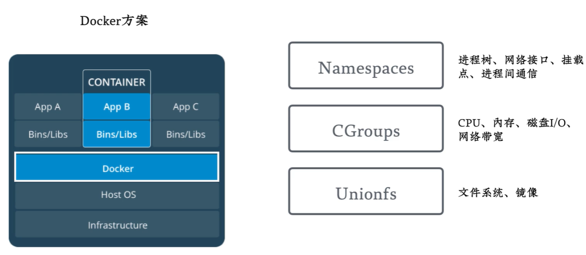
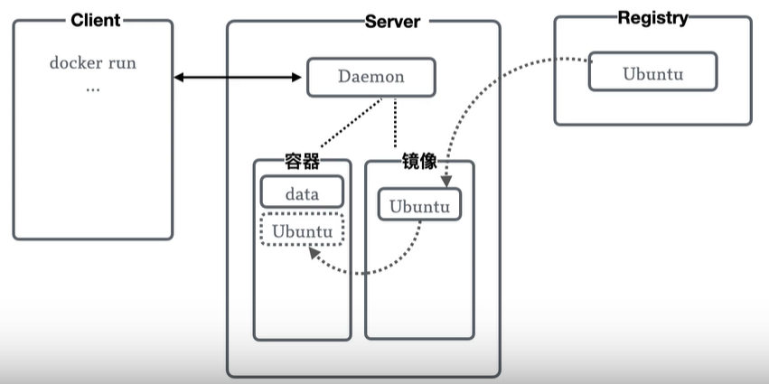
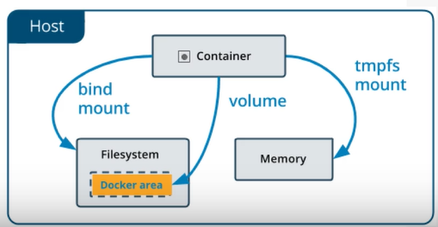
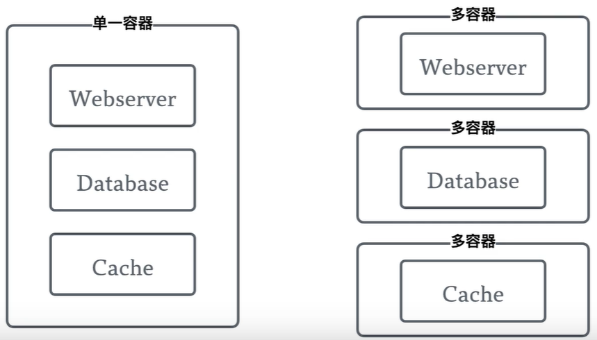
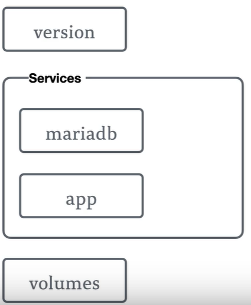

<!-- TOC -->

- [Docker](#docker)
  - [沙箱](#沙箱)
  - [why docker](#why-docker)
  - [docker原理](#docker原理)
    - [Namespaces](#namespaces)
      - [进程树](#进程树)
      - [网络接口](#网络接口)
    - [CGroups](#cgroups)
    - [Unionfs](#unionfs)
  - [docker组成](#docker组成)
  - [docker架构](#docker架构)
- [Docker安装](#docker安装)
  - [环境](#环境)
  - [安装](#安装)
  - [卸载](#卸载)
- [Docker常用命令](#docker常用命令)
  - [帮助命令](#帮助命令)
  - [镜像命令](#镜像命令)
    - [docker images](#docker-images)
    - [docker pull](#docker-pull)
    - [docker rmi](#docker-rmi)
  - [容器命令](#容器命令)
    - [docker ps](#docker-ps)
    - [docker run](#docker-run)
    - [docker exec](#docker-exec)
    - [docker commit](#docker-commit)
    - [docker build](#docker-build)
    - [docker prune](#docker-prune)
    - [docker rm](#docker-rm)
  - [其他命令](#其他命令)
- [Docker数据卷](#docker数据卷)
  - [挂载](#挂载)
- [Dockerfile](#dockerfile)
  - [构建步骤](#构建步骤)
  - [Dockerfile编写](#dockerfile编写)
    - [说明](#说明)
    - [命令](#命令)
- [Docker Compose](#docker-compose)
  - [docker-compose.yaml](#docker-composeyaml)
- [DockerHub](#dockerhub)

<!-- /TOC -->

# Docker

## 沙箱

- 语言沙箱
- 系统沙箱
  - 虚拟机方案
    - 需要Hypervisor实现硬件资源虚拟化，每个app都有独立的Guest OS）
  - 容器(docker)方案（linux kernel）
    - 只有一个HostOS，容器上的app直接使用实际物理机的硬件资源

> GuestOS： VM（虚拟机）里的的系统（OS）
> HostOS：物理机里的系统（OS）


## why docker

> 轻量级虚拟化容器方案
>
> https://docs.docker.com/engine/install/ 

## docker原理




- 通过namespaces隔离了进程树，网络接口和挂载点，实现进程之间的通信。
- 通过CGroups隔离了CPU，内存，磁盘I/O和网络带宽
- 通过联合文件系统构成docker文件，镜像等

宿主机->docker引擎->容器

### Namespaces

容器中的进程是运行在主机的操作系统上的，但是容器使用独立的PID Linux命名空间并有独立的系列号，完全独立于进程树。

#### 进程树


#### 网络接口

网络连接方式：**网桥模式**（默认）

给每一个容器一卡虚拟网卡eth0，然后将所有的虚拟网卡接到docker0上，docker0通过iptables和宿主机的网卡eth0相连。


### CGroups

分为多个group，每个group分配给一个容器，给予不同的资源配额（CPU，内存，磁盘I/O）


### Unionfs

> (linux)联合文件系统——分层
>
> 可以把不同的文件系统一层层的叠加的挂载起来，但app使用的时候看起来就是一个文件系统

容器也拥有独立的文件系统。

宿主机上多个容器运行相同的系统，这些系统里大部分文件内容都是相同的。为了节省资源，将相同的内容和不同的内容隔开，分成只读层和可写层。然后就可以挂载同一个只读层，再挂载不同的可写层上。

- 只读层（相同）：镜像
- 可写层（不同）：容器


## docker组成

- writable container
  - Debian
  - add emacs
  - add Apache
- writable container
  - BusyBox

最底层是共用的内核kernel，kernel上挂载了镜像image，蓝色的image分成了3个不同层次，红色则是1个（分层是便于修改，节省数据传输量）


## docker架构

C-S架构，分为2部分

- docker Client：输入各种docker命令
- docker Server：有一个Daemon后台进程，负责和Client通信，操作容器



# Docker安装

## 环境

```shell
uname -r 
4.15.0-96-generic #Linux要求内核3.0以上

cat /etc/os-release 
```

## 安装

```shell
#1.卸载旧版本(Docker的旧版本称为docker或docker-engine)
yum remove docker \
                docker-client \ 
                docker-client-latest \ 
                docker-common \ 
                docker-latest \ 
                docker-latest-logrotate \ 
                docker-logrotate \ 
                docker-engine
                
#2.需要的安装包 
yum install -y yum-utils

#3.设置稳定的存储库
yum-config-manager \
    --add-repo \
    https://download.docker.com/linux/centos/docker-ce.repo

#4.更新yum软件包索引 
yum makecache fast 

#5.安装docker相关的 docker-ce社区版 而ee是企业版,中间会提示接受GPG密钥，接受继续。
yum install docker-ce docker-ce-cli containerd.io 

#6. 启动docker(停止:stop,状态:status)
service docker restart

#7. 设置开机启动
systemctl enable docker

#8. 使用docker version查看是否安装成功如果输出信息中有client和service两部分则表示docker安装与启动都成功了
docker version 

#9. 测试 
docker run hello-world
```

## 卸载

```shell
#1. 卸载依赖 
yum remove docker-ce docker-ce-cli containerd.io 
#2. 删除资源 
rm -rf /var/lib/docker  #/var/lib/docker 是docker的默认工作路径！
```

# Docker常用命令

## 帮助命令

> 帮助文档
> https://docs.docker.com/engine/reference/commandline/build/

```sh
docker version 		#显示docker的版本信息。 
docker info 		#显示docker的系统信息，包括镜像和容器的数量 
docker 命令 --help   #帮助命令 
```

## 镜像命令

```sh
docker images 		#查看所有本地主机上的镜像
docker search 		#搜索镜像 
docker pull			#下载镜像 
docker push			#提交镜像 
docker tag			#给镜像打标签
docker rmi 			#删除镜像 
docker image prune	#删除不用的镜像(-a可以删除所有未被引用的镜像)
docker save			#保存镜像成压缩文件格式
docker load			#从压缩文件提取镜像
```

### docker images

- REPOSITORY：镜像的仓库源 
- TAG：镜像的标签 
- IMAGE ID：镜像的id 
- CREATED：镜像的创建时间 
- SIZE：镜像的大小

```shell
docker images
# 可选项 
Options:
-a, --all Show all images #列出所有镜像 
-q, --quiet Only show numeric IDs #只显示镜像的id

docker images -aq #显示所有镜像的id
```

### docker pull

```shell
#分层下载镜像，如果不写tag，默认latest 
docker pull 镜像名[:tag]

#Digest 签名 防伪
#真实地址
```

### docker rmi 

```sh
#删除指定的镜像 
docker rmi -f 镜像id

#删除全部的镜像
docker rmi -f $(docker images -aq) 
```

## 容器命令

```shell
docker ps            	 #列出所有运行的容器
docker run 镜像id    		#创建容器并启动 
docker start 容器id 		#启动容器 
docker restart 容器id 	#重启容器 
docker rm 容器id 			#删除指定容器 
docker stop 容器id 		#停止当前正在运行的容器(-d运行)
docker kill 容器id 		#强制停止当前容器
docker rename 容器id 		#重新命名容器
docker cp 				 #容器和宿主机中的文件互传

#列出所有容器命令
docker container 

#查看容器命令的说明
docker container COMMAND --help
```

### docker ps

```shell
# 列出当前的容器 (默认是正在运行)
docker ps	

#显示所有容器ID
docker ps -aq
# -a, --all 列出所有的容器(运行中和停止的)
# -q, --quiet Only display numeric IDs
```

### docker run

```shell
#创建容器并启动 
docker run [可选参数] image

#参数说明 
--name="Name" 	#指定容器名
-d 				#以后台方式运行(Daemon) 
--rm			#容器退出后自动删除
-it 			#使用交互方式运行进入容器
-p 				#指定容器的端口(映射到宿主机端口)
                #            -p 主机端口:容器端口(常用) 
                #            -p ip:主机端口:容器端口 
                #            -p 容器端口
				#			 -P(大写) 随机指定端口
						
						
# exit容器停止，从容器退回宿主机
# ctrl +P +Q #容器不停止，从容器退回宿主机
```

### docker exec

进入容器并开启一个新的终端运行bash，bash进程和主容器进程拥有相同的命名空间，

`exit`退出运行命令，命令运行完后就退出（运行不完就不退出）

`-it`是以交互的方式进入容器, `/bin/sh`或者`/bin/bash`

- -i：确保输标准入流保持开放，需要在shell中输入命令
- -t：分配一个伪终端TTY

```shell
# 进入
docker exec -it 容器id /bin/sh
docker exec -it 容器id /bin/bash

# 退出
exit

# 进入容器正在执行的终端
docker attach 容器id
```

> 使用`exit`退出docker容器时提示**You have stopped jobs**

```bash
# 查看哪些进程没结束
jobs -l
# 关闭对应进程
kill -9 pid
```

### docker commit

修改容器后数据并没有持久化,从修改后的容器中创建新的镜像可以保存修改(将应用和环境打包成一个镜像)

```bash
docker commit -m = "描述信息" -a = "作者" 容器id 目标镜像名:[TAG]

# 创建操作是黑盒的,并不知道修改了那些东西
# docker build就会分层写好修改,生成docker file
```

### docker build

```shell
# 使用dockerfile构建成镜像
# -f: 指定要使用的Dockerfile路径, 
# -f: .表示当前目录,使用当前目录的Dockerfile构建时可以省略 
    
# -t/--tag: 镜像名及标签(name:tag或name),可以在一次构建中为一个镜像设置多个标签
docker build -f 文件路径 -t 用户名/ImageName:TagName
docker build -t 用户名/ImageName:TagName .

#使用URL github.com/creack/docker-firefox的Dockerfile创建镜像
docker build github.com/creack/docker-firefox
```

### docker tag

不会重命名标签，而是给同一个镜像创建一个额外的标签（同一个镜像id）

```bash
docker tag 旧镜像标签 新镜像标签
```

### docker prune

```bash
# 删除所有停止的容器
docker container prune
```

### docker rm

```shell
# 删除指定的容器,不能删除正在运行的容器,强制删除:rm -rf 
docker rm 容器id 

# 删除所有容器 
docker rm -f $(docker ps -aq) 	

# 删除所有的容器（复合指令）
docker ps -a -q|xargs docker rm 
```

### docker cp

- 从容器中拷贝文件到宿主机
- 从宿主机拷贝文件到容器里面

```bash
# 从容器中拷贝文件到宿主机
docker cp 容器id:文件在容器里面的路径 拷贝到宿主机的绝对路径

# 从宿主机拷贝文件到容器里面
docker cp 宿主机文件路径 容器id:拷贝到容器里面的绝对路径

docker cp /home/dog/yinke/prometheus/config/alertrules.yml e87a0a440925:/etc/prometheus/
```


## 其他命令

```shell
# 查看日志
docker logs --help 
Options:
--details 		#Show extra details provided to logs 
-f, --follow 	#Follow log output 
--since  		#string Show logs since timestamp 
--tail string 	#Number of lines to show from the end of the logs (default "all") 
-t, --timestamps#Show timestamps 
	--until 	#string Show logs before a timestamp 

# 显示日志信息(一直更新)
docker logs -tf 

# 需要显示日志条数 
docker logs --tail number 

# 查看n行日志 
docker logs -t --tail n 容器id 

# 跟着日志
docker logs -ft 容器id 

# 显示容器状态
docker stats

# 查看容器元数据
docker inspect

# 显示容器进程
docker top

# 显示容器内产生的变化
docker diff

# 显示容器端口映射
docker port
```


# Docker数据卷

**数据持久化管理**

linux是万物皆文件，所以内存也是一种文件系统，可以通过tmpfs将一块内存挂载进来



```bash
#创建
docker volume create

#查看
docker volume ls

#元数据
docker volume inspect

#删除
docker volume rm
```

## 挂载

```shell
# -v, --volume list 
docker run -d -v 主机目录:容器内目录 images

#可以通过docker inspect查看元数据信息中的挂载地址
#三种挂载： 匿名挂载、具名挂载、指定路径挂载 
-v 容器内路径		   #匿名挂载 
-v 卷名:容器内路径		  #具名挂载 
-v /宿主机路径:容器内路径 #指定路径挂载docker volume ls 是查看不到的
```

# Dockerfile

用来构建docker镜像的文件(命令脚本)

**构建和运行时的区别：想好封装应用时变和不变的内容**

> 镜像是只读的，一旦写进去就不会变更，如果想要应用在启动后改变，就应该放在容器内（命令动态的在容器内产生数据，而不是在docker build构建时运行这些命令产生数据写入镜像中）

## 构建步骤

1. 编写dockerfile文件
2. 构建成镜像docker build 	
3. 启动容器docker run
4. 发布镜像docker push（DockerHub 、阿里云仓库)

## Dockerfile编写

### 说明

1. 每个保留关键字(指令)都是必须是**大写字母**
2. 执行从上到下顺序
3. **每一个指令都会创建提交一个新的镜像层并提交**
4. #表示注释

### 命令

**其他命令**

- FROM 			 从哪个基础镜像开始构建
- MAINTAINER  创建者（姓名+邮箱）
- WORKDIR 	  镜像的工作目录（绝对地址），进入后再运行命令 
- VOLUME 		挂载的目录 
- EXPOSE 		  镜像要暴露端口，然后才可以进行端口映射
- ONBUILD 	   当前镜像被其他镜像拿来做基础镜像构建时触发的命令
- STOPSIGNAL  用于停止容器发出的信号 

**添加文件**

- ADD				 添加文件内容,支持URL，支持从压缩文件中添加
- COPY			   添加文件内容（优先使用，更透明）

**添加信息**

- ENV 			    构建时设置环境变量
- LABEL             构建时添加元数据标记
- ARG                 设置构建时的参数

**执行命令**

- SHELL              指定运行命令的shell
- RUN 			    构建时运行的命令（命令可以用exec格式）
- CMD 			    指定容器启动时要运行的命令，只有最后一个会效
- ENTRYPOINT  指定容器启动时要运行的命令，可以追加命令 


```shell
vim mydockerfile-centos 

FROM centos 
MAINTAINER ink<541640794@qq.com> 
ENV MYPATH /usr/local 
WORKDIR $MYPATH 
RUN yum -y install vim 
RUN yum -y install net-tools 
EXPOSE 80 
CMD echo $MYPATH 
CMD echo "-----end----" 
CMD /bin/bash
```

# Docker Compose

单容器和多容器

单容器各种更新改动太麻烦，多容器存在互访问题和顺序依赖问题。



## docker-compose.yaml

docker-compose会自动读取（未 -f 指定文件时）目录下的docker-compose.yaml文件

**基本结构**

> 每个容器被称为一个服务




**service**

- 指定image或者进入指定目录build dockerfile构建
- 指定端口映射
- 挂载卷（可以是相对路径）
- 服务依赖depends_on（解决顺序问题）
- 环境变量


# DockerHub

https://hub.docker.com/ 

```shell
docker login [OPTIONS] [SERVER]
Options: 
-u, --username       #string Username
-p, --password 		 #string Password 
	--password-stdin #Take the password from stdin 

docker login -u ink3
```

docker push 如果没有前缀的话默认是push到官方的library 

```shell
# 解决方法(2种)
# 1.build的时候添加你的dockerhub用户名就可以放到自己的仓库了 
$ docker build -t ink/mytomcat:0.1 .

# 2.使用docker tag 然后再次push 
$ docker tag 容器id ink3/mytomcat:1.0 #然后再次push
```

