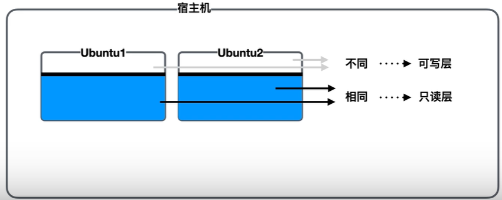
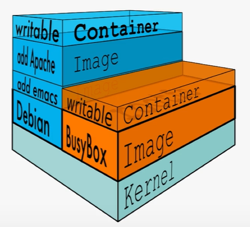
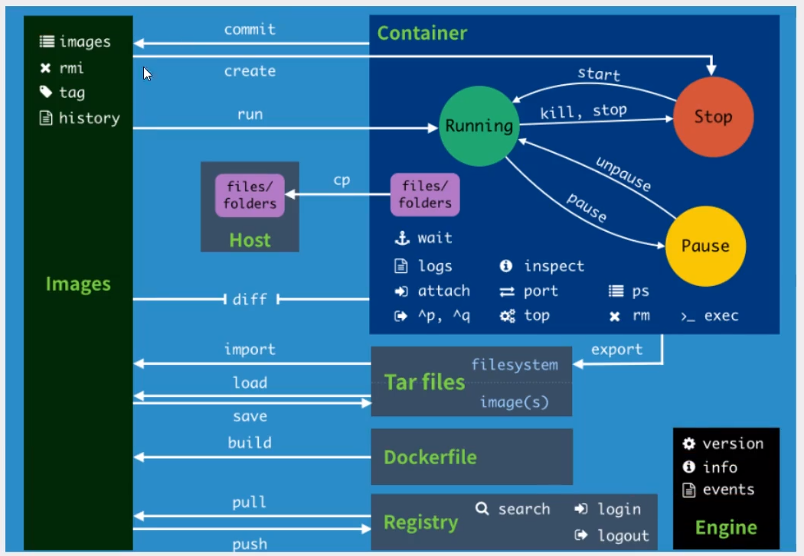

# Docker

Docker是一个容器引擎，是应用程序与系统之间的隔离层

通常应用程序对安装的系统环境会有要求，如果服务器很多，部署时系统环境的配置工作是非常繁琐的

Docker让应用程序不必再关心主机环境，各个应用安装在Docker镜像里，Docker引擎负责运行包裹了应用程序的docker镜像

## 沙箱

- 语言沙箱
- 系统沙箱
  - 虚拟机方案
    - 需要Hypervisor实现硬件资源虚拟化，每个app都有独立的Guest OS
  - 容器方案（linux kernel）
    - 只有一个HostOS，容器上的app直接使用实际物理机的硬件资源

> GuestOS： VM（虚拟机）里的的系统（OS）
> HostOS：物理机里的系统（OS）


## why docker

轻量级虚拟化容器方案

https://docs.docker.com/engine/install/ 

## docker原理

宿主机->docker引擎->容器

- 通过namespaces隔离了进程树，网络接口和挂载点，实现进程之间的通信
- 通过CGroups隔离了CPU，内存，磁盘I/O和网络带宽
- 通过联合文件系统构成docker文件，镜像等


### Namespaces

容器中的进程是运行在主机的操作系统上的，但是容器使用独立的PID Linux命名空间并有独立的系列号，完全独立于进程树

**进程树**


**网络接口**

网络连接方式：**网桥模式**（默认）

给每一个容器一卡虚拟网卡eth0，然后将所有的虚拟网卡接到docker0上，docker0通过iptables和宿主机的网卡eth0相连。


### CGroups

分为多个group，每个group分配给一个容器，给予不同的资源配额（CPU，内存，磁盘I/O）


### Unionfs

容器也拥有独立的文件系统

1. 宿主机上多个容器运行相同的系统，这些系统里大部分文件内容都是相同的
2. 为了节省资源，将相同的内容和不同的内容隔开，分成只读层和可写层
3. 然后就可以挂载同一个只读层，再挂载不同的可写层上
   1. 只读层（相同）：镜像
   2. 可写层（不同）：容器

> linux联合文件系统——分层
>
> 可以把不同的文件系统一层层的叠加的挂载起来，但app使用的时候看起来就是一个文件系统




## docker组成

- writable container
  - Debian
  - add emacs
  - add Apache
- writable container
  - BusyBox

最底层是共用的内核kernel，kernel上挂载了镜像image，蓝色的image分成了3个不同层次，红色则是1个（分层是便于修改，节省数据传输量）



## docker架构

C-S架构，分为2部分

- docker Client：输入各种docker命令
- docker Server：有一个Daemon后台进程，负责和Client通信，操作容器


# Docker安装

## CentOS

### 环境

 Linux要求内核3.0以上

```shell
uname -r 
4.15.0-96-generic

cat /etc/os-release 
```

### 安装

Docker的旧版本称为docker或docker-engine

```shell
# 1.卸载旧版本
yum remove docker \
                docker-client \ 
                docker-client-latest \ 
                docker-common \ 
                docker-latest \ 
                docker-latest-logrotate \ 
                docker-logrotate \ 
                docker-engine
                
#2.需要的安装包 
yum install -y yum-utils

#3.设置稳定的存储库
yum-config-manager \
    --add-repo \
    https://download.docker.com/linux/centos/docker-ce.repo

#4.更新yum软件包索引 
yum makecache fast 

#5.安装docker相关的 docker-ce社区版 而ee是企业版,中间会提示接受GPG密钥，接受继续。
yum install docker-ce docker-ce-cli containerd.io 

#6. 启动docker(停止:stop,状态:status)
service docker restart

#7. 设置开机启动
systemctl enable docker

#8. 使用docker version查看是否安装成功如果输出信息中有client和service两部分则表示docker安装与启动都成功了
docker version 

#9. 测试 
docker run hello-world
```

### 卸载

```shell
#1. 卸载依赖 
yum remove docker-ce docker-ce-cli containerd.io 
#2. 删除资源 
rm -rf /var/lib/docker  #/var/lib/docker 是docker的默认工作路径！
```


## Ubuntu

### 设置仓库

在新主机上首次安装Docker Engine-Community之前需要设置Docker仓库，之后可以从仓库安装和更新Docker 

先更新apt包索引

```bash
sudo apt-get update
```

卸载旧版本

```bash
sudo apt-get remove docker docker-engine docker.io containerd runc
```

让apt能通过HTTPS使用仓库

```bash
sudo apt-get install \
    apt-transport-https \
    ca-certificates \
    curl \
    software-properties-common
```

添加官方的GPG密钥

```bash
curl -fsSL https://download.docker.com/linux/ubuntu/gpg | sudo apt-key add -
```

验证密钥

> 9DC8 5822 9FC7 DD38 854A E2D8 8D81 803C 0EBF CD88 通过搜索指纹的后8个字符，验证现在是否拥有带有指纹的密钥

```bash
sudo apt-key fingerprint 0EBFCD88
```

设置Docker稳定版仓库

```bash
sudo add-apt-repository \
   "deb [arch=amd64] https://download.docker.com/linux/ubuntu \
   $(lsb_release -cs) \
   stable"
```

### 安装Docker Engine-Community

```bash
# 更新apt包索引
sudo apt-get update

# 安装
sudo apt-get install docker-ce docker-ce-cli containerd.io

# 启动
sudo service docker start

# 停止
sudo service docker stop

# 重启
sudo service docker restart
```


### 创建docker用户组

Docker守候进程绑定的是一个unix  socket而不是TCP端口。这个套接字默认的属主是root，其他是用户可以使用sudo命令来访问这个套接字文件。所以docker服务进程都是以root帐号的身份运行的

为了避免每次运行docker命令的时候都需要输入sudo，可以创建一个docker用户组，并把相应的用户添加到这个分组里面。当docker进程启动的时候，会设置该套接字可以被docker这个分组的用户读写。这样只要是在docker这个组里面的用户就可以直接执行docker命令了

```bash
# 查看用户组中有没有docker组
sudo cat /etc/group | grep docker

# 列出自己的用户组，确认在不在docker组中
groups

# 将登陆用户加入到docker用户组中
sudo gpasswd -a ${USER} docker

#更新用户组
newgrp docker  

# 列出自己的用户组，确认在不在docker组中
groups

# 重启docker服务
sudo service docker restart
```


# Docker命令

## 帮助命令

帮助文档：https://docs.docker.com/engine/reference/commandline/build/

```sh
docker version 		#显示docker的版本信息。 
docker info 		#显示docker的系统信息，包括镜像和容器的数量 
docker 命令 --help   #帮助命令 
```

## 镜像命令

```sh
docker images 		#查看所有本地主机上的镜像
docker search 		#搜索镜像 
docker pull			#下载镜像 
docker push			#提交镜像 
docker tag			#给镜像打标签
docker rmi 			#删除镜像 
docker image prune	#删除不用的镜像(-a可以删除所有未被引用的镜像)
docker save			#保存镜像成压缩文件格式
docker load			#从压缩文件提取镜像
```

### docker images

- `REPOSITORY`：镜像的仓库源 
- `TAG`：镜像的标签 
- `IMAGE ID`：镜像的id 
- `CREATED`：镜像的创建时间 
- `SIZE`：镜像的大小

```shell
docker images
# 可选项 
Options:
-a, --all Show all images #列出所有镜像 
-q, --quiet Only show numeric IDs #只显示镜像的id

docker images -aq #显示所有镜像的id
```

### docker pull

`docker pull` 的内容默认存在`/var/lib/docker`目录下

- `/var/lib/docker/image/overlay2/repositories.json`文件和docker images的内容一致
- `/var/lib/docker/containers`目录中保存是已拉取的容器ID

```shell
#分层下载镜像，如果不写tag，默认latest 
docker pull 镜像名[:tag]

#Digest 签名 防伪
#真实地址
```

### docker tag

用于将镜像推送到远程仓库之前给镜像打标签

- 不是重命名标签，而是**给同一个镜像创建一个额外的标签**
  - 会重新生成一个不同镜像标签的镜像

- 镜像名称格式：`registry host ip:port/group name/project name:tag`
  - **推送到远程仓库会根据标签名选择仓库**


```bash
# docker tag 旧image:tag 新image:tag
docker tag grafana/grafana:latest gitlab.buaanlsde.cn:4567/buaapyj/registry/msops-grafana:1.0
```

### docker push

根据镜像标签中的仓库名将镜像推送到远程仓库中

```bash
# docker push image:tag
docker push gitlab.buaanlsde.cn:4567/buaapyj/registry/msops-grafana
```

### docker rmi 

```sh
#删除指定的镜像 
docker rmi -f 镜像id

#删除全部的镜像
docker rmi -f $(docker images -aq) 
```


## 容器命令

```shell
docker ps           #列出所有运行的容器
docker run     		#创建容器并启动 
docker start  		#启动容器 
docker restart  	#重启容器 
docker rm 			#删除指定容器 
docker stop 		#停止当前正在运行的容器(-d运行)
docker kill 		#杀死正在运行的容器
docker rename 		#重新命名容器
docker cp 			#容器和宿主机中的文件互传
dockeer top			#查看容器中进程

#列出所有容器命令
docker container 

#查看容器命令的说明
docker container COMMAND --help
```

### docker ps

容器的状态共有7种

- `created`：已创建
- `restarting`：重启中
- `running`：运行中
- `removing`：迁移中
- `paused`：暂停
- `exited`：停止
- `dead`

```shell
# 显示当前正在运行的容器
docker ps	

# --all 显示所有的容器（包括未运行的）
docker ps -a 

# 显示当前正在运行的容器的ID
$ docker ps -q

# 显示所有容器ID
docker ps -aq

# 显示最后被创建的n个容器
docker ps -n 3

# 显示最后被创建的容器,相当于-n 1
docker ps -l

# 显示容器文件大小（容器虚拟大小 = 容器真实增加大小 + 容器镜像大小）

docker ps -s
```

### docker run

`docker run [可选参数] image`

**可选参数**

- `--name`：指定容器名
- `-d`：以后台方式运行
- `-e`：指定环境变量，容器中可以使用该环境变量
- `--rm`：容器退出后自动删除
- `-it`：使用交互方式运行进入容器
- `-p`：指定容器暴露的端口（映射到宿主机端口）
  - `-p` 容器端口
  - `-p` 主机端口:容器端口
  - `-p` ip:主机端口:容器端口 
  - `-P` 随机指定端口

```shell
docker run -d -p 123:80 --name inkContainer image
```

### docker exec

进入一个正在运行的容器中执行命令

- 需要容器处于运行中且`PID 1`进程也处于运行中才能执行`exec`操作
- 命令将在容器的默认目录中运行，**如果Dockerfile中使用`WORKDIR`指令指定了自定义目录，则会进入该目录**
- 如果命令中使用`-w`指定了工作目录，则会进入该目录

`-it`是以交互的方式进入容器

- `-i`：确保输标准入流保持开放，需要在shell中输入命令
- `-t`：分配一个伪终端TTY

`/bin/sh`或者`/bin/bash`：即打开容器内的终端经常，bash进程和主容器进程拥有相同的命名空间

> docker基础容器中没有vim，要自行安装
>
> ```bash
> apt-get update
> apt-get install vim
> ```

**退出容器**

- `exit`：容器不停止，从容器退回宿主机
- `ctrl+p+q`：容器不停止，从容器退回宿主机

> 设置环境变量只会在这次会话中生效

```bash
# 进入容器，指定bash目录，开启一个交互模式的终端
docker exec -it 容器id /bin/bash
docker exec -it 容器id /bin/sh

# 查看容器默认工作目录
docker exec -it 容器id pwd
```

使用`exit`退出docker容器时提示`You have stopped jobs`

```bash
# 查看哪些进程没结束
jobs -l
# 关闭对应进程
kill -9 pid
```

### docker attach

连接到正在运行中的容器（容器必须正在运行），然后进执行命令

> 使用ssh登陆进容器需要在容器中启动sshd，存在开销和攻击面增大的问题，同时也违反了Docker所倡导的一个容器一个进程的原则

**退出容器**

- `exit`：容器停止，从容器退回宿主机
- `ctrl+p+q`：容器不停止，从容器退回宿主机

```bash
docker attach 容器id
```

### docker top

查看容器中运行的进程信息

- 容器运行时不一定有`/bin/bash`终端来交互执行`top`命令
- 容器也不一定有`top`命令

> 可以配合`grep`查找指定进程

```bash
docker top inkMySQL
```

### docker logs

查看容器的日志

- `--details`：显示更多的信息
- `-f`：跟踪实时日志
  - `--since`：显示自某个timestamp之后的日志，或相对时间（如42m）
  - `--tail`：从日志末尾显示多少行日志（默认all）
- `-t`：显示时间戳
  - `--until`：显示自某个timestamp之前的日志，或相对时间（如42m）

```bash
# 显示日志信息（实时更新）
docker logs -ft

# 需要显示日志条数 
docker logs --tail number 

# 查看最近30分钟的日志
docker logs --since 30m 容器id

# 查看指定时间后的日志，只显示最后100行
docker logs -ft --since="2018-02-08" --tail=100 容器id

# 查看某时间段的日志
docker logs -t --since="2018-02-08T13:23:37" --until "2018-02-09T12:23:37" 容器id
```

### docker stats

显示容器状态（CPU和内存利用率等运行信息）

```bash
docker stats 容器id
```

### docker inspect

查看容器或者镜像的元数据

```bash
# 镜像
docker inspect mysql:5.6

# 容器
docker inspect inkMySQL

# 查看容器的ip地址
docker inspect -f ='{{.NetworkSettings.IPAddress}}' 容器id
```

### docker commit

修改容器后数据并没有持久化，从修改后的容器中创建新的镜像可以保存修改（将应用和环境打包成一个镜像）

- 创建操作是黑盒的，并不知道修改了那些东西
- `docker build`就会分层写好修改并生成Dockerfile

```bash
docker commit -m = "描述信息" -a = "作者" 容器id 目标镜像名:[TAG]
```

### docker prune

```bash
# 删除所有停止的容器
docker container prune
```

### docker rm

容器即使已经退出也仍然存在

```shell
# 删除指定的容器,不能删除正在运行的容器
docker rm 容器id 

# 删除所有容器 
docker rm -f $(docker ps -aq) 	

# 删除所有的容器
docker ps -aq | xargs docker rm 
```

### docker cp

- 从容器中拷贝文件到宿主机
- 从宿主机拷贝文件到容器里面

```bash
# 从容器中拷贝文件到宿主机
docker cp 容器id:文件在容器里面的路径 拷贝到宿主机的绝对路径

# 从宿主机拷贝文件到容器里面
docker cp 宿主机文件路径 容器id:拷贝到容器里面的绝对路径

docker cp /home/dog/yinke/prometheus/config/alertrules.yml e87a0a440925:/etc/prometheus/
```




# Docker数据卷

**数据持久化管理**

linux是万物皆文件，所以**内存也是一种文件系统**，可以通过tmpfs将一块内存挂载进来


```bash
#创建
docker volume create

#查看
docker volume ls

#元数据
docker volume inspect

#删除
docker volume rm
```

## 挂载

**挂载方式**

- 匿名挂载：`-v 容器内路径`
- 具名挂载：`-v 卷名:容器内路径`
- 指定路径挂载：`-v /宿主机路径:容器内路径`
  - `docker volume ls`是查看不到的

> `-v`可以多次使用，用来挂载多个目录
>
> 可以通过`docker inspect`命令查看元数据信息中的挂载地址

**挂载目录**

- 容器内目录不可以为相对路径
- 宿主机目录如果不存在则会自动创建
- 宿主机的相对目录的相对路径是指`/var/lib/docker/volumes/`，与宿主机的当前目录无关
- 如果`-v`只指定了一个目录，则会在`/var/lib/docker/volumes/`下随机生成一个目录
- 如果挂载了目录，即使容器销毁了，宿主机的挂载目录也不会消失（持久化存储）

```shell
docker run -v 主机目录:容器内目录 images

docker run --name inkGrafana -d -p 3000:3000 -v /home/dog/yinke/grafana/conf/defaults.ini:/usr/share/grafana/conf/defaults.ini -v /home/dog/yinke/grafana/public/index.html:/usr/share/grafana/public/views/index.html grafana/grafana
```


# Dockerfile

用来构建docker镜像的文件(命令脚本)

**构建和运行时的区别：想好封装应用时变和不变的内容**

> 镜像是只读的，一旦写进去就不会变更，如果想要应用在启动后改变，就应该放在容器内（命令动态的在容器内产生数据，而不是在docker build构建时运行这些命令产生数据写入镜像中）

## 构建步骤

1. 编写dockerfile文件
2. 构建成镜像docker build 	
3. 启动容器docker run
4. 发布镜像docker push（DockerHub 、阿里云仓库)

## Dockerfile编写

### 说明

1. 每个保留关键字（指令）都是必须是**大写字母**
2. 执行从上到下顺序
3. **每一个指令都会创建提交一个新的镜像层并提交**
4. `#`表示注释

### 命令

**其他命令**

- `FROM`：从哪个基础镜像开始构建
- `MAINTAINER`：创建者（姓名+邮箱）
- `WORKDIR`：镜像的工作目录（绝对地址），
  - Dockerfile中的`RUN`、`CMD`和`COPY`指令会在工作目录下执行

- `VOLUME`：挂载的目录 
- `EXPOSE`：镜像要暴露端口，然后才可以进行端口映射
  - 仅用于容器间通信

- `ONBUILD`：当前镜像被其他镜像拿来做基础镜像构建时触发的命令
- `STOPSIGNAL`：用于停止容器发出的信号 

**添加文件**

- `ADD`：添加文件内容，支持URL，支持从压缩文件中添加
- `COPY`：添加文件内容（优先使用，更透明）
  - `COPY src dest`


**添加信息**

- `ENV`：构建时设置环境变量
- `LABEL`：构建时添加元数据标记，一个`LABEL`指令配置一个键值对
- `ARG`：设置构建时的参数

**执行命令**

- `SHELL`：指定运行命令的shell
- `RUN`：构建时运行的命令（命令可以用exec格式）
- `CMD` ：指定容器**启动时**要运行的命令
  - Dockerfile中只允许有一个CMD指令，**如果有多个，只有最后一个会生效**

- `ENTRYPOINT`：指定容器启动时要运行的命令，可以追加命令 


```bash
# Python3.8官网镜像
FROM python:3.8.5
 
# 设置工作目录，进入后默认的目录
# 在此目录下执行相对地址的命令
WORKDIR /backend
 
# 复制文件到工作目录
COPY requirements.txt requirements.txt

# 安装pip库
# RUN pip install -r requirements.txt
RUN pip install -r requirements.txt -i https://pypi.tuna.tsinghua.edu.cn/simple/

# 暴露端口
EXPOSE 5000

# 设置环境变量
# ENV PATH=$PATH:/opt/node-v10.16.0-linux-x64/bin

# 复制当前目录所有内容到/backend下
COPY . .

ADD  ./config .kube/
ADD  ./kubectl /usr/bin/

RUN chmod  a+x  /usr/bin/kubectl

# 启动服务，可以查看日志
CMD [ "python", "-u", "server.py"]
```

## Docker镜像构建

使用Dockerfile构建成镜像

- `-f`：指定要使用的Dockerfile路径，使用当前目录的Dockerfile时可以省略
  - `.`表示当前目录，使用**当前目录下的Dockerfile**

- `-t/--tag`: 镜像名及标签，可以在一次构建中为一个镜像设置多个标签（也可以省略标签）

```bash
docker build -f 文件路径 -t 用户名/image:Tag

# .表示当前目录,使用当前目录下的Dockerfile
docker build -t ink/backend:v1 .

#使用URL github.com/creack/docker-firefox的Dockerfile创建镜像
docker build github.com/creack/docker-firefox
```


# Docker Compose

单容器和多容器

单容器各种更新改动太麻烦，多容器存在互访问题和顺序依赖问题。


## docker-compose.yaml

docker-compose会自动读取（未 -f 指定文件时）目录下的docker-compose.yaml文件

**基本结构**

> 每个容器被称为一个服务


**service**

- 指定image或者进入指定目录build dockerfile构建
- 指定端口映射
- 挂载卷（可以是相对路径）
- 服务依赖depends_on（解决顺序问题）
- 环境变量


# DockerHub

https://hub.docker.com/ 

```shell
docker login [OPTIONS] [SERVER]
Options: 
-u, --username       #string Username
-p, --password 		 #string Password 
	--password-stdin #Take the password from stdin 

docker login -u ink3
```

docker push 如果没有前缀的话默认是push到官方的library 

```shell
# 解决方法(2种)
# 1.build的时候添加你的dockerhub用户名就可以放到自己的仓库了 
$ docker build -t ink/mytomcat:0.1 .

# 2.使用docker tag 然后再次push 
$ docker tag 容器id ink3/mytomcat:1.0 #然后再次push
```

上传到gitlab容器镜像仓库

```bash
# 查看镜像
docker images
# 显示
REPOSITORY    TAG       IMAGE ID       CREATED         SIZE
ink/backend   v1        884e4ee7607e   3 minutes ago   1.26GB
# 修改镜像名
docker tag 884e4ee7607e gitlab.buaanlsde.cn:4567/buaapyj/registry/inkbackend
# 查看
docker images
REPOSITORY                                             TAG       IMAGE ID       CREATED         SIZE
ink/backend                                            v1        884e4ee7607e   5 minutes ago   1.26GB
gitlab.buaanlsde.cn:4567/buaapyj/registry/inkbackend   latest    884e4ee7607e   5 minutes ago   1.26GB
# 上传镜像
docker push gitlab.buaanlsde.cn:4567/buaapyj/registry/inkbackend
```

