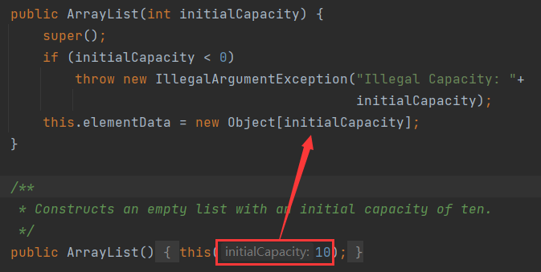
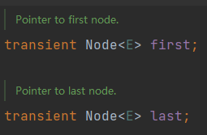

# 集合

## ArrayList

### JDK7

饿汉式

- **直接创建一个初始容量为10的数组**

> 搜索类快捷键：`ctrl+n`
>
> 搜索类中方法快捷键：`ctrl+F12`

````java
// 空参构造器的底层创建一个初始容量为10的Object数组elementData
ArrayList list = new Arraylist();

// elementData[0] = new Integer(123)
list.add(123);

// 当添加导致容量不够时,默认扩容为原来容量的1.5倍,再将原数组数据复制到新数组中
````

 

 

### JDK8

懒汉式

- **一开始创建一个长度为0的数组，当添加第一个元素时再创建一个始容量为10的数组**
- 延迟数组的创建时间，节省内存

```java
// 空参构造器的底层创建一个空的Object[] elementData
// 并没有创建一个长度为10的Object[] elementData
ArrayList list = new Arraylist();

// 创建一个长度为10的Object[] elementData
// elementData[0] = new Integer(123)
list.add(123);

// 当添加导致容量不够时,默认扩容为原来容量的1.5倍,再将原数组数据复制到新数组中
```

 

 


## LinkedList

```java
// 内部声明了Node(双向链表)类型的first和last属性,默认为NULL
LinkedList list = new LinkedList();

// 将123封装到Node中(相当于创建了Node对象)
list.add(123);
```

 

 

 

 


## HashMap

### JDK7

1. 底层数组是`Entry[]`
2. 底层结构：**数组+链表**
3. 实例化对象后，底层创建了**长度为16**的一维数组`Entry[]`

### JDK8

1. 底层数组是`Node[]`（`Node<K,V>[] table`）
2. 底层结构：**数组+链表+红黑树**
3. 当数组的某个位置上以链表形式存在的**数据个数>8**且当前**数组长度>64**时，此位置上所有的**数据改为使用红黑树存储**（方便查找）
4. 实例化对象后，底层**并不直接创建**了长度为16的一维数组
5. 调用`put()`方法后，底层才创建**长度为16**的一维数组`Node[]`
6. 调用`key`所在类的`hascode()`方法计算`key`的hashcode值，通过**散列函数**找到`key`在`Entry`数组中的存放位置
   - 如果此位置没有数据，则添加`key:value`
   - 如果此位置有数据（一个或多个数据（链表形式）），逐一比较`key`和已经存在数据的hashcode值
     - 如果`key`和已经存在数据的hashcode值都不同，则**以链表的方式**添加存储`key:value`
     - 如果`key`和已经存在的某个数据的hashcode值相同，则调用equals()方法比较
       - 如果返回false，则**以链表的方式**添加存储`key:value`
       - 如果返回true，将要添加的`value`**替换已经存在的相同数据**的`value`值（覆盖）


#### 重要常量

- `DEFAULT_INITIAL_CAPACITY`：HashMap的默认容量（16）
- `MAXIMUM_CAPACITY`：HashMap支持的最大容量（2<sup>30</sup>）
- `DEFAULT_LOAD_FACTOR`：HashMap的默认负载因子（0.75）
- `TREEIFY_THRESHOLD`：Bucket中存储的Node个数大于该默认值时转化为红黑树（8）
- `UNTREEIFY_THRESHOLD`：Bucket中红黑树存储的Node个数小于该默认值时转化为链表（6）
- `MIN_TREEIFY_CAPACITY`：Bucket中的Node被树化时最小的hash表容量（64）
- `entrySet`：HashMap存储具体元素的集合
- `size`：HashMap存储的键值对的数量
- `modCount`：HashMap扩容和结构改变的次数
- `loadFactor`：填充因子`DEFAULT_LOAD_FACTOR`
- `threshold`：HashMap扩容的临界值（**容量*负载因子** 16*0.75 = 12）

 

#### 负载因子

- 负载因子的大小决定了HashMap的数据密度
- 负载因子越大，密度越大，发生碰撞的几率越高，数组中的链表越容易长，造成查询或插入时的比较次数增多，性能会下降
- 负载因子越小，就越容易触发扩容，数据密度也越小，意味着发生碰撞的几率越小，数组中的链表也就越短，查询和插入时比较的次数也越小，性能会更高。但是会浪费一定的内容空间。而且经常扩容也会影响性能，建议初始化预设大一点的空间
- 按照其他语言的参考及研究经验，会考虑将负载因子设置为0.7~0.75，此时平均检索长度接近于常数

> 当超出threshold临界值时，若要存放的位置非空，则默认扩容为原来容量的2倍
>
> 扩容后需要重新计算所有元素存放的位置
>
> Node数组中可以存放元素的位置称之为bucket（桶）
>
> - 每个bucket都有一个对应的索引，可以根据索引快速的查找到bucket中存储的元素
> - 每个bucket中存储一个Node对象，每一个Node对象可以带一个引用变量（用于指向下一个元素）所以在一个bucket中可能是一个Node链
>
> 当Bucket中存储的Node个数大到需要转化红黑树存储时，若hash表容量小于`MIN_TREEIFY_CAPACITY`，执行`resize()`扩容而不转化为红黑树
>
> `MIN_TREEIFY_CAPACITY`的值至少是`TREEIFY_THRESHOLD`的4倍


#### 扩容

 

 

```java
final V putVal(int hash, K key, V value, boolean onlyIfAbsent,
               boolean evict) {
    Node<K,V>[] tab; Node<K,V> p; int n, i;
    // 把当前的table赋值给tab
    if ((tab = table) == null || (n = tab.length) == 0)
        // 首次进入,使用resize()创建数组
        n = (tab = resize()).length;
    // 找到对应位置,查看是否有数据
    if ((p = tab[i = (n - 1) & hash]) == null)
        // 为空直接添加
        tab[i] = newNode(hash, key, value, null);
    else {
        // p是现有数据(第一个)的值
        Node<K,V> e; K k;
        // 先判断hashcode值
        if (p.hash == hash &&
            ((k = p.key) == key || (key != null && key.equals(k))))
            // 相同的话，把p添加到e中
            e = p;
        else if (p instanceof TreeNode)
            e = ((TreeNode<K,V>)p).putTreeVal(this, tab, hash, key, value);
        else {
            // 和第一个数据的hashcode值不相等
            // 依次和所有的数据比较
            for (int binCount = 0; ; ++binCount) {
                // 只有一个元素
                if ((e = p.next) == null) {
                    
                    p.next = newNode(hash, key, value, null);
                    if (binCount >= TREEIFY_THRESHOLD - 1) // -1 for 1st
                        treeifyBin(tab, hash);
                    break;
                }
                // 还有元素，继续比较
                // 上面判断已经赋值了e = p.next
                if (e.hash == hash &&
                    ((k = e.key) == key || (key != null && key.equals(k))))
                    break;
                p = e;
            }
        }
        if (e != null) { 
            // existing mapping for key
            V oldValue = e.value;
            if (!onlyIfAbsent || oldValue == null)
                // key相等时替换对应的value
                e.value = value;
            afterNodeAccess(e);
            return oldValue;
        }
    }
    ++modCount;
    if (++size > threshold)
        resize();
    afterNodeInsertion(evict);
    return null;
}
```

```java
final Node<K,V>[] resize() {
    Node<K,V>[] oldTab = table;
    // 首次进入oldCap，oldThr均为0
    int oldCap = (oldTab == null) ? 0 : oldTab.length;
    int oldThr = threshold;
    int newCap, newThr = 0;
    if (oldCap > 0) {
        if (oldCap >= MAXIMUM_CAPACITY) {
            threshold = Integer.MAX_VALUE;
            return oldTab;
        }
        else if ((newCap = oldCap << 1) < MAXIMUM_CAPACITY &&
                 oldCap >= DEFAULT_INITIAL_CAPACITY)
            newThr = oldThr << 1; // double threshold
    }
    else if (oldThr > 0) // initial capacity was placed in threshold
        newCap = oldThr;
    else {               
        // zero initial threshold signifies using defaults
        // 首次进入执行,newCap = 16
        newCap = DEFAULT_INITIAL_CAPACITY;
        // newThr = 16*0.75 = 12
        newThr = (int)(DEFAULT_LOAD_FACTOR * DEFAULT_INITIAL_CAPACITY);
    }
    if (newThr == 0) {
        float ft = (float)newCap * loadFactor;
        newThr = (newCap < MAXIMUM_CAPACITY && ft < (float)MAXIMUM_CAPACITY ?
                  (int)ft : Integer.MAX_VALUE);
    }
    // threshold = 12
    threshold = newThr;
    @SuppressWarnings({"rawtypes","unchecked"})
    // newCap = 16,创建好了长度为16的数组
    Node<K,V>[] newTab = (Node<K,V>[])new Node[newCap];
    table = newTab;
    if (oldTab != null) {
        for (int j = 0; j < oldCap; ++j) {
            Node<K,V> e;
            if ((e = oldTab[j]) != null) {
                oldTab[j] = null;
                if (e.next == null)
                    newTab[e.hash & (newCap - 1)] = e;
                else if (e instanceof TreeNode)
                    ((TreeNode<K,V>)e).split(this, newTab, j, oldCap);
                else { // preserve order
                    Node<K,V> loHead = null, loTail = null;
                    Node<K,V> hiHead = null, hiTail = null;
                    Node<K,V> next;
                    do {
                        next = e.next;
                        if ((e.hash & oldCap) == 0) {
                            if (loTail == null)
                                loHead = e;
                            else
                                loTail.next = e;
                            loTail = e;
                        }
                        else {
                            if (hiTail == null)
                                hiHead = e;
                            else
                                hiTail.next = e;
                            hiTail = e;
                        }
                    } while ((e = next) != null);
                    if (loTail != null) {
                        loTail.next = null;
                        newTab[j] = loHead;
                    }
                    if (hiTail != null) {
                        hiTail.next = null;
                        newTab[j + oldCap] = hiHead;
                    }
                }
            }
        }
    }
    return newTab;
}
```

