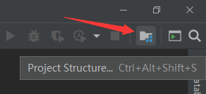
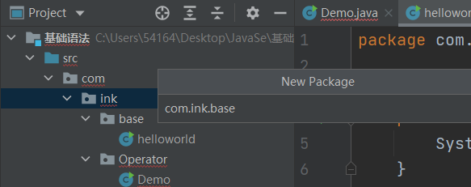

# Dos命令

```bash
#盘符切换	D:
#查看当前目录文件	dir
#切换目录	 cd (change directory), 跨盘符需要加路径/ (cd /d f:\ink)
#返回上一级	cd ..
#退出终端	 exit
#清空窗口	 cls (clear screen)		
#查看ip	   ifconfig
#ping		ping www.baidu.com  可以得到其ip地址
#创建文件夹	 md ink (mkdir-make directory)
#删除文件夹	 rd ink (remove directory)
#创建文件	 cd> ink.txt
#删除文件	 del ink.txt
```

在目录文件路径前输入`cmd`，快速打开命令行


# Java

## 版本

跨平台运行（**JVM**）

- **Java SE** ：标准版	（桌面程序，控制台开发）
- **Java EE** ：企业级开发	（web端，服务器开发）


## JDK	JRE	JVM

- **JDK**：Java Development Kit	开发者工具（jdk包含了jre）

- **JRE**：Java Runtime Environment	运行时环境

- **JVM**：Java Virtual Machine	JAVA虚拟机


## Java开发环境

`JDK`：Java developmen kit	开发工具包

- 卸载JDK
  1. **查找jdk位置**：在环境变量中找到JAVA_HOME。
  2. **删除对应目录下文件**，然后删除JAVA_HOME,最后删除**PATH**中关于java的目录
  3. **验证**：`java -version`
- 安装JDK
  1. **下载**：直接搜索jdk8（可专门设置env文件夹存放）
  2. **配置环境变量**：在path中添加jdk\bin路径即可

> jdk11已经不用配置jre了
>
> bin目录下存放可执行程序exe，如java.exe,javac.exe


## 第一个程序

- **文件名**和**类名**保持**一致**

- **首字母大写**

进入`cmd`运行

```bash
javac HelloWorld.java	#编译	生成.class文件
java HelloWorld			#运行	不带class后缀
```


## 集成开发环境

IDE： `Integrated Development Environment`。一般包括编辑器，编译器，调试器和图形界面

### idea

1. 在**File**中new一个**Empty Project**，再new一个**module**

   

2. 查看项目结构Project Structure（也可以在File中查看）

   

3. 修改SDK（对应的Project Language Level 也要修改）

   

4. 在`src`目录下编写代码中

   

5. 快捷键

   - **psvm**：public static void main(String[] args)
   - **sout**：System.out.println()

   ```java
   public class hello {
       public static void main(String[] args) {
           System.out.println();
       }
   }
   ```

6. 运行

   


# 基础语法

## 注释

`Comments`

- 单行注释：line comment（快捷键`ctrl+/`）

  ```java
  //
  ```

- 多行注释：Block comment（快捷键`ctrl+shift+/`）

  ```java
  /**/
  ```

- 文档注释：**JavaDoc**（快捷键`/**+空格`）

  ```java
  /**
   * 
   */
  ```

> 搜	有趣的代码注释


### 修改注释

- 修改样式

  

- 修改字体颜色

  


## 标识符

Java所有的组成部分都需要起名，如类名，变量名，方法名...这些名字被称为**标识符**，不可以用**关键字**起名字。

> 关键字：public，static，class，void等

标识符

- 首字母只能是**字母**，**$**，**_**

- **大小写敏感**

> 标识符可以用中文（不推荐）
>
> ```java
> String 工作 = "摸鱼";
> ```


## 数据类型

> Java是强类型语言。要求变量的使用严格按照规定（先定义变量类型再使用）指定的数据类型不经过转换就永远是指定的类型
>
> JavaScript是弱类型语言

- 基本类型primitive type
  - **数值类型**
    - **整数**
      - `byte`：1个字节（-128-127）
      - `short`：2个字节（-32768-32767）
      - `int`：4个字节（**-2147483648-2147483647**）
      - `long`：8个字节（数字后 + **L**后缀）
    - **浮点数**
      - `float`：4个字节（数字后 + **F**后缀）
      - `double`：**8个字节**
    - **字符**
      - `char`：2个字节（用**' '**单引号包围）
  - **Boolean类型**（占一位）
    - `true`
    - `false`
- **引用类型**reference type
  - 类
  - 接口
  - 数组

> - 除了基本类型，都是引用类型
> - 位bit：数据存储的最小单位
> - 字节byte：数据处理的基本单位
> - 一个中文字符需要2个字节，所以char也可以写中文


### 拓展

1. **整数**：进制
   - 二进制`0b`
   - 八进制`0`
   - 十六进制`0x`
2. **浮点数**：精度问题（不精确表示，存在舍入误差，**无法比较**）
3. **字符**：**本质还是数字**（char s = 97;）
   
   - 编码：**Unicode**，2字节，0-65526字符
   
     ```java
     char s = '\u0063';
     ```
4. **转义字符**：
   
   - `\t`：制表符
   - `\n`：换行

> BigDecimal 数学工具类
>
> JDK7特性：数字可以用下划线分割
>
> ```java
> int a = 100_000;
> ```


### 类型转换

运算中，不同类型数据先转换为同一类型，再进行运算。 

byte，short，char，int，long，float，double（低—高）

- **强制转换**（高->低）:（类型）变量名
- **自动转换**（低->高）：自动

**注意**：

1. **内存溢出**问题（可能转换之前就已经溢出）
2. **精度**问题（不会四舍五入）
3. 不能对boolean值转换
4. 不能把**对象类型**转换为不相干的类型


## 变量

- 变量作用域
- 变量类型
- 变量名

**声明**：数据类型 变量名 = 值；

> Java变量是程序中最基本的存储单元
>
> 变量声明是一条完整的语句


### 作用域

- **局部**变量：方法中声明的变量（必须初始化）

- **实例**变量：从属于对象的变量

  ```java
  //除了基本类型，默认都是空null
  //boolean默认是false
  ```

- **类**变量：`static`关键字声明的变量，从属于类


### 常量

**Constant**

初始化后值不可再改变，用`final`定义（变量名一般**大写**）

```java
final double PI = 3.14;
```


### 命名规范

1. **类成员**变量：首字母小写，驼峰原则：monthSalary
2. **局部**变量：首字母小写，驼峰原则
3. **常量**：大写字母，下划线：MAX_VALUE
4. **类名**：首字母大写，驼峰原则：Man，GoodMan
5. **方法名**：首字母小写，驼峰原则：run()，runMan()


# 基本运算符

**Operator**

- 算术运算符：

  - 二元运算符：+，-，*，/，%

    ```java
    // +前面是String类型时，后面的数字转换为字符串进行拼接
    // +后面是String类型时，前面的数字正常计算
    public class Demo {
        public static void main(String[] args) {
            int a = 10;
            int b = 20;
            System.out.println(""+a+b); //输出1020
            System.out.println(a+b+""); //输出30
        }
    }
    ```

  - 一元运算符：++，--

- 赋值运算符：=，+=，*=

- 关系运算符：>，>=，==，!=，`instanceof`

- 逻辑运算符：&&，||，!

  > 如果左边可以直接决定结果，那么右边就不会再计算

- 条件运算符：? :

- 位运算符：&，|，^，~（取反），>>，<<（左移）

  > **异或^**：不进位的二进制加法，相同为0，不同为1。一个数和自己异或可以实现清0。

> 别的运算使用**工具类**来实现


# 包

为了更好的组织类，用于**区别类名**的命名空间（类似于文件系统同目录下的重名问题）

## 包名规范

1. 一般使用公司**域名倒置**作为包名

   如blog.ink.com就建立`com.ink.blog`

   > 将Compact勾选掉才会自动分级

   

2. Package修饰，放在最上面（idea自动生成）

   

3. 在com下建立新的包，在com.ink后面输入包名

   

4. `import`导包（使用**其他包**的成员）

   ```java
   //通配符*,导入包下的所有类
   import java.util.*;
   ```

   > import必须再Package下面
   >
   > 不要导入其他包下的同名类

   


# JavaDoc

将**注释**信息生成**API文档**

- 类的注释
- 方法的注释

> JDK帮助文档

参数信息

- `@author`：作者名
- `@version`：版本号
- `@since`：需要最早使用的JDK版本
- `@param`：参数名
- `@return`：返回情况
- `@throws`：异常抛出情况


## 编写文档注释

`/**`+回车

```java
package com.ink.base;

/**
 * @author ink
 * @version 1.0
 * @since 1.5
 */
public class Doc {
    String name;

    /**
     * 
     * @param name
     * @return
     * @throws Exception
     */
    public String test(String name) throws Exception{
        return name;
    }
}
```


## 命令行生成API文档

进入对应目录

1. 在命令行中执行命令生成文档

   ```bash
   javadoc -encoding UTF-8 -charset UTF-8 Doc.java
   ```

   

2. 在对应目录下生成文档，进入index.html

   

3. 查看API文档

   


## IDEA生成JavaDoc文档

1. 打开idea`Tools`中的  `Generate JavaDoc`

2. 生成 JavaDoc 的**源代码对象**一般以模块`Module`为主，必要时可以单独选择Java源代码文件，不推荐以`Project`为JavaDoc生成的源范围。

3. ` Locale`：可选填项，表示生成的JavaDoc的**语言**版本，填写`zh_CN`

   > 根据javadoc.exe的帮助说明，它对应的是javadoc.exe的`-locale`参数。指JavaDoc框架中各种通用的固定显示区域都是中文，注释内容不变。

4. `Other command line arguments`：可选填项，直接向javadoc.exe传递的参数（一些重要的设置只能通过直接参数形式向Javadoc.exe传递）。填写如下参数：

   - `-encoding`：填写 `UTF-8`，表示**源代码**（含有符合 JavaDoc 标准的注释）是基于UTF-8编码的，以免处理过程中出现中文等非英语字符乱码

   - `-charset`：填写 `UTF-8`，表示在处理并生成 JavaDoc 超文本时使用的**字符集**是基于UTF-8编码的（目前所有浏览器都支持UTF-8，这样具有通用性）

   - `-windowtitle`：填写 “文本” ，表示生成的JavaDoc超文本在浏览器中打开时浏览器窗口标题栏显示的文字内容

   - `-link` ：填写[Overview (Java SE 16 & JDK 16) (oracle.com)](https://docs.oracle.com/en/java/javase/16/docs/api/index.html)，表示生成的JavaDoc中涉及到对其他**外部Java类**的引用是使用**全限定名称**还是带有**超链接的短名称**

     > 实质上是告诉javadoc.exe根据提供的外部引用类的JavaDoc**地址**去找一个叫`package-list`的文本文件，其中包含了所有外部引用类的全限定名称，因此生成的新JavaDoc不必使用外部引用类的全限定名，只需要使用短名称，同时自动创建指向其外部引用JavaDoc中的详细文档**超链接**。每个JavaDoc都会在根目录下有一个package-list文件，包括自己生成的JavaDoc
     >
     > 例如创建一个方法 `public void func(String arg)`，这个方法在生成JavaDoc时如果不指定`-link`参数，则JavaDoc中对该方法的表述就会自动变为`public void func(java.lang.String arg)`，因为`String`这个类就是外部引用的类（虽然它是Java 标准库的类）
     >
     > 如果指定了 -link [Overview (Java SE 16 & JDK 16) (oracle.com)](https://docs.oracle.com/en/java/javase/16/docs/api/index.html) 参数，则javadoc.exe在生成JavaDoc时会使用String这个短名称而非全限定名称`java.lang.String`，同时自动为 String短名称生成一个**超链接**，指向官方 JavaSE 标准文档 [Overview (Java SE 16 & JDK 16) (oracle.com)](https://docs.oracle.com/en/java/javase/16/docs/api/index.html) 中对 String 类的详细文档地址。


# 交互Scanner

> `Java.util.Scanner`是Java5的新特性（Java.util包）

通过`Scanner`类获取用户的输入

- 判断是否有输入数据
  - `hasNext()`
  - `hasNextLine()`

- 获取输入数据

  - `next()`：哟i个
  - `nextLine()`

- 关闭

  `scanner.close();`

  

**方法区别**：

`next()`：

要读取到有效字符才可以结束输入，对输入有效字符之前的空格会**自动去掉**，输入有效字符后将其后面的空白作为结束符（得不到带有空格的字符串）

`nextLine()`：

以Enter作为结束符，返回回车前的所有内容（可以获得空白）

> 输入IO流的的类，使用完都要关闭否则会一直占用资源

```java
// idea快速返回生成类对象定义3种方法
// 1. 	ctrl + alt + v
// 2. 	alt + 2次回车
// 3.	.var

import java.util.Scanner;

public class Demo01 {
  public static void main(String[] args) {
    // 创建扫描器对象，接受数据
    Scanner scanner = new Scanner(System.in);
    System.out.println("使用next获取输入");
    // 判断用户是否输入
    if (scanner.hasNext()) {
      String str = scanner.next();
      System.out.println("获取的输入为：" + str);
    }
    // 关闭
    scanner.close();
  }
}
```


**获取具体类型**的方法：

- `nextInt()`
- `nextDouble()`
- `nextBoolean()`
- `nextBigInteger()`

等等......

```java
import java.util.Scanner;

public class Demo02 {
  public static void main(String[] args) {
    System.out.println("请输入整数:");
    int i;
    Scanner scanner = new Scanner(System.in);
    if (scanner.hasNextInt()) {
      i = scanner.nextInt();
      System.out.println("输入的整数是：" + i);
    } else {
      System.out.println("输入的不是整数");
    }
  }
}
```


**查看Scanner源码**

按住**crtl**点击`Scanner`类，点击**Structure**可以看到`Scanner`类种的方法


# 流程控制

## 顺序结构

自上而下顺序执行

## 选择结构

### if选择结构

一个`if`语句可以有多个`else if`语句，但最多有一个`else`语句。一旦其中一个`else if`语句为`true`，后续语句都不会执行。

```java
if (布尔表达式 1){
    表达式1的值为true时执行的语句;
}else if(布尔表达式 2){
    表达式2的值为true时执行的语句;
}else{
    表达式1和2的值都为false时执行的语句;
}
```


### switch选择结构

`switch case`语句是用来**匹配**一个变量和一系列值中的某一个值，其中每一个值都称为`switch`的一个**分支**

- `case`标签必须为**字符串常量**或者**字面量**
- `break`结束判断（否则会**case穿透，**将后面全部输出）
- `default`默认情况

> 也可以不加break，使用case穿透实现一些其他功能

```java
public static void main(String[] args) {
    char grade = 'C';
    switch (grade) {
        case 'A':
            System.out.println("优秀");
            break;
        case 'B':
            System.out.println("良好");
            break;
        case 'C':
            System.out.println("及格");
            break;
        case 'D':
            System.out.println("挂科");
            break;
        default:
            System.out.println("输入错误");
    }
}
```

从JDK 7开始，switch中支持`String`类型

> 字符的本质还是数字

```java
public static void main(String[] args) {
  String name = "平安";
  switch (name) {
    case "平安":
      System.out.println("平安");
      break;
    case "富贵":
      System.out.println("富贵");
      break;
    case "英俊":
      System.out.println("英俊");
      break;
    default:
      System.out.println("其他");
  }
}
```


### 查看反编译文件

Java程序执行是生成了`class`文件

1. 查看编译文件输出路径

   

2. 正常查看编译的`class`文件（乱码）

   

3. 在idea中打开`.java`文件所在的文件夹

   

4. 将`class`文件复制进文件夹

   

5. 在idea中查看`class`文件

   发现字符串匹配其实最后找的还是`case`后面的**哈希值**

   


## 循环结构

- `break`：用于强行退出整个循环，不执行循环中剩下的语句

- `continue`：用于退出某一次循环，跳过本次循环中剩下的语句，然后继续执行下一次循环

### while循环

必须满足条件才能进入循环执行语句（先判断，后执行）

```java
while(布尔表达式){
    布尔表达式值为true时的循环语句;
}
```

特殊事件需要永远执行（**死循环**）

```
while(true){
    等待客户端连接;
    定时检查;
}
```


### do while循环

即使不满足条件也**至少执行一次**语句（先执行，后判断）

```java
do {
    执行语句;
} while (布尔表达式);
```


### for循环

一种支持**迭代**的通用结构（最有限，最灵活），它的循环次数是在执行前就确定的。

1. **初始化**步骤：可以**初始化多个变量**，也可以为空语句`；`
2. 检查**布尔表达式**的值：可以有多个表达式
3. **更新**循环控制变量：可以更新多个变量值

```java
//正常循环
for (初始化; 布尔表达式; 迭代更新) {
  布尔表达式值为true时的循环语句;
}

//死循环
for (; ;) {
  执行语句;
}
```

生成布尔表达式是`i<n`的的for循环快捷键：`n.for`

```java
int n;
for (int i = 0; i < n; i++) {
  //
}
```

### 增强for循环

> JDK5中引入，**主要用于数组**

1. **声明语句**：声明新的**局部变量**
   - 该变量**类型**必须和数组元素的类型相匹配
   - 该变量**作用域**限定在循环语句块中
   - 该变量**值**和数组元素值相等
2. **表达式**：
   - 是要访问的数组名
   - 是返回值为数组的方法

```java
for (声明语句 : 表达式) {
  执行语句;
}
```


# 方法

> 面向对象

Java方法是语句的集合，它们在一起执行一个功能（功能块）

- 方法包含于类或者对象中
- 方法在程序中被创建，在其他地方被**调用**

> 设计方法原则：保持方法的原子性（一个方法只实现一个功能）
>
> 命名规则：首字母小写+驼峰命名


`public static void main(String[] args)`：main方法

`System.out.println()`：调用系统类中的标准输出对象的打印方法

- `System`：类
- `out`：类中的一个对象
- `println()`：类中的一个方法

```java
public class Demo01 {
  public static void main(String[] args) {
    int sum = add(1, 2);
    System.out.println(sum);
  }

  public static int add(int a, int b) {
    return a + b;
  }
}
```

## 方法定义

方法包含一个**方法头**和一个**方法体**

- **修饰符**：可选，可以有多个。定义方法的**访问类型**（告诉编译器如何调用该方法，如`public`，`static`，`final`）
- **返回值类型**：没有返回值的时候是`void`，有返回值时必须`return`返回
- **方法名**：首字母**小写**+**驼峰**命名
- **参数类型**：可选，可以有多个参数，也可以不包含任何参数。方法被调用时传递值给参数，这个值被称为实参或变量，**参数列表**是指方法的参数类型，顺序和参数的个数
  - **形式参数**：调用方法时用于**接收外界**的输入数据（定义作用）
  - **实参**：调用方法时**实际传给方法**的数据
- **方法体**：定义该方法的功能

```java
修饰符 返回值类型 方法名(参数类型 参数名) {
  方法体
  return 返回值;
}
```

