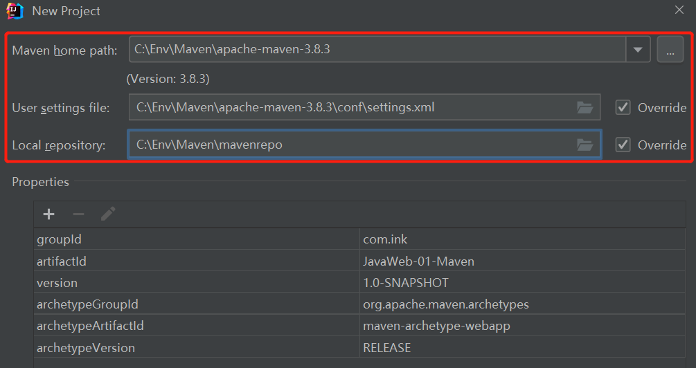
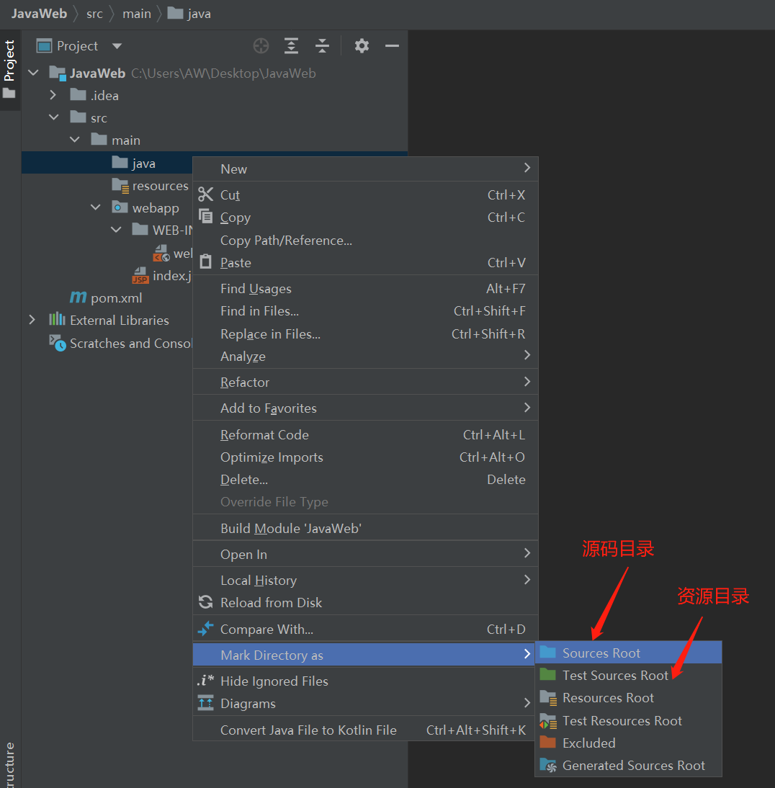
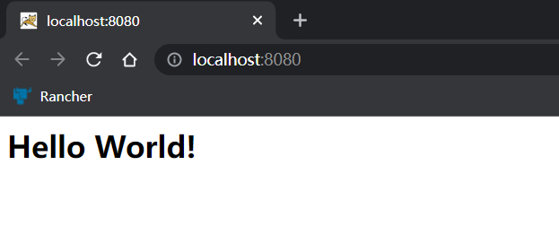
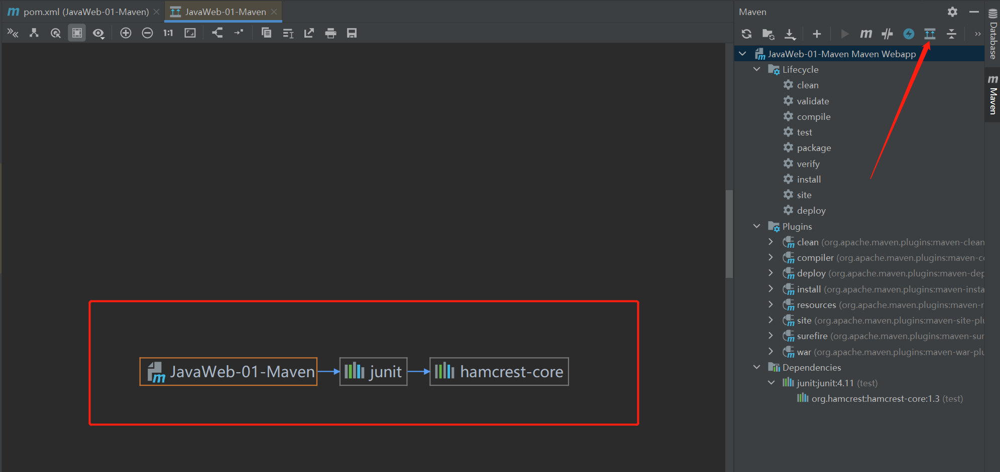

# JavaWeb

- web即网页
- 在Java中，动态web资源开发的技术统称为JavaWeb

## Web开发

- 静态web

  - html,css
  - 提供给用户查看的数据不会发生变化
- 动态web

  - 提供给用户查看的数据会发送变化（如淘宝）
- 技术栈
- Servlet
- JSP
- B/S架构
  - 基于Java语言，本质是Servlet
- 支持高并发，高可用，高性能
- PHP
  - 作为开发速度很快，功能很强大，跨平台
  - 无法承载大访问量的情况

## web应用程序

Web应用程序

- 可以提供浏览器访问的应用程序

web资源

- 如index.html，home.html等web资源，这些web资源可以被外界访问，对外界提供服务

- 我们通过URL访问到的任何一个页面或者资源，都是存在于这个世界的某一个角落的一台计算机上（服务器）
- 这些统一的web资源会被放在服务器的同一个文件夹下，即是一个web应用程序

一个web应用由多部分组成（静态web，动态web)

- html,css,js
- jsp,servlet
- Java程序
- jar包

- 配置文件Properties

Web应用程序编写完成后，要想提供给外界访问，需要一个服务器来统一管理


## 静态web

静态web资源请求


缺点

- Web页面无法动态更新，所有用户看到都是同一个页面
  - JavaScript实现的轮播图和点击特效等都是伪动态
- 无法和数据库交互
  - 数据无法持久化，用户无法交互

## 动态Web

浏览器发送HTTP请求，Tomcat服务器接收请求，Servlet容器从磁盘加载静态资源，Servlet程序处理请求request ，处理结束返回response


缺点

- 服务器的动态Web资源出现错误，需要重新编写后端程序，重新发布


# Tomcat

- 轻量级应用服务器
- 开源的servlet容器
- 支持JSP动态页面，也可以处理html。但是处理html的效率不如Apache，所以想处理html静态网页还是用Apache最合适
- Apache是web服务器，Tomcat是应用服务器，它只是一个servlet容器，是Apache的扩展
- Apache和Tomcat都可以做为独立的web服务器来运行，但是Apache不能解释java程序（jsp，servlet）

B/S

- 使用tomcat作为服务器

- 客户端使用浏览器

> 上面的实现是C/S

## 安装

**下载**

- [Apache Tomcat® - Apache Tomcat 10 Software Downloads](https://tomcat.apache.org/download-10.cgi)

**配置**

分别打开`bin`目录中的`startup.bat`和`shutdown.bat`两个文件

- 在第一行`@echo off`的下面一行加上一行`SET JAVA_HOME=C:\Env\JDK17`

或者在系统的环境变量中添加`JAVA_HOME`，值为`C:\Env\JDK17`

> `.bat`是windows下的执行文件，`.sh`是linux下的执行文件

**启动**

- 进入`bin`目录，启动`startup.bat`文件


> `startup.bat`文件用于打开tomcat，`shutdown.bat`文件用于关闭tomcat


## 配置文件

核心配置文件是`conf`目录下的`server.xml`文件

修改默认启动端口号

- `conf`目录下的`server.xml`文件

- 确保服务器安全组中开放了这个端口，设置完保存然后重启下tomcat即可

```xml
<Connector port="8080" protocol="HTTP/1.1"
           connectionTimeout="20000"
           redirectPort="8443" />
```

点击Manager App的时候，会要求输入用户名和密码

- `conf`目录下的`tomcat-users.xml`

```xml

```

配置主机名称

- 默认的主机名为：`localhost`（即127.0.0.1）
- 默认应用存放的位置为：`webapps`

> 修改host name后需要在主机的`C:\Windows\System32\drivers\etc\hosts`文件中添加对应的映射，否则找不到ip
>
> 修改完后在命令行输入`ipconfig /flushdns`刷新dns缓存

```xml
<Host name="localhost"  appBase="webapps"
      unpackWARs="true" autoDeploy="true">
```

日志配置

- `conf`目录下的`logging.properties`
- 默认是UTF-8，windows需要修改为GBK

```properties
java.util.logging.ConsoleHandler.level = FINE
java.util.logging.ConsoleHandler.formatter = org.apache.juli.OneLineFormatter
java.util.logging.ConsoleHandler.encoding = GBK
```


## 目录结构

- `bin`：存放启动和关闭tomcat脚本 
- `conf`：包含不同的配置文件
  - `server.xml`（tomcat的主要配置文件）和`web.xml` 
- `work`：存放jsp编译后产生的`class`文件 
- `webapp`：存放应用程序（网站）
  - 要部署的应用程序要存放到此目录 
- `logs`：存放日志文件 
- `lib`：主要存放tomcat依赖的jar包

## 部署项目

tomcat的`webapps`目录下的5个默认的应用

 

### Web应用结构

- `http://localhost:8080/`默认访问的是tomcat的`/webapps/ROOT/`目录下的`index.jsp`文件
- 将自己的应用放在tomcat服务器的`webapps`目录下即可
  - 需要有`WEB-INF\web.xml`网站配置文件

- 访问http://localhost:8080/inkapp即可访问到`index.html`

```txt
--webapps  ：tomcat服务器的web目录
	-ROOT
	-inkapp  ：网站的目录名
		- WEB-INF
			-classes  : java程序
			-lib  ：web应用所依赖的jar包
			-web.xml  ：网站配置文件
		- index.html  ：默认首页
		- static 
            -css
            	-style.css
            -js
            -img
         -.....
```

> **访问域名**
>
> 1. 在浏览器输入一个域名，回车
> 2. 查看本机的`C:\Windows\System32\drivers\etc\hosts`配置文件是否有相应域名的映射
>    1. 若有，直接映射到对应的IP地址，进行访问
>    2. 若无，则去DNS服务器上查找对应的IP，找到就返回相应的IP并进行访问，找不到就不返回


# HTTP

超文本传输协议

- 请求响应协议
- 运行在TCP上
- 端口：80

> 超文本：图片，音乐，视频，定位，地图......

## 版本

HTTP/1.0

- 客户端与Web服务器一次连接只能获取一个Web资源，然后就会断开连接
  - 如果某个页面有多个图片资源需要加载，那么需要连接多次，影响服务器和客户端的性能

HTTP/1.1

- 客户端可以与web服务器一次连接后可以获取多个web资源

## HTTP请求

客户端 -> 发送请求（request） -> 服务器

### 请求行

```http
Request URL:https://www.baidu.com/  
Request Method:GET    
Status Code:200 OK    
Remote Address:14.215.177.39:443=
```

- 请求方式：`GET`，`POST`，HEAD，DELETE，PUT，TRACT…
  - `GET`
    - 一次请求能够携带的参数比较少
    - 大小有限制
    - 会在浏览器的URL地址栏显示数据内容，高效，不安全
  - `POST`
    - 一次请求能够携带的参数没有限制
    - 大小没有限制
    - 不会在浏览器的URL地址栏显示数据内容，安全，不高效

### 消息头

- `Accept`：支持的数据类型
- `Accept-Encoding`：支持的编码格式（GBK，UTF-8）
- `Accept-Language`：语言环境
- `Cache-Control`：缓存控制
- `Connection`：请求完成是断开还是保持连接
- `HOST`：主机


## HTTP响应

服务器 -> 响应（response）-> 客户端

### 响应状态码

- `200`：请求响应成功
- `3xx`：请求重定向
- `4xx`：找不到资源
  - `404` 
- `5xx`：服务器错误
  - `500`
  - `502`


# JAR包

`Java Archive File`

- jar包是Java的一种文档格式，是一种与平台无关的文件格式，可将多个文件合成一个文件
- jar包与zip包非常相似，准确地说，它就是一个zip包，它与zip包唯一的区别就是在jar包中包含了一个`META-INF/MANIFEST.MF`文件，该文件是在生成jar文件的时候自动创建的，作为jar里面的**详情单**，包含了该Jar包的版本、创建者和类搜索路径`Class-Path`等信息
  - 如果是可执行jar包，还会包含`Main-Class`属性，表明`main`方法入口
  - 实际上是可以使用zip相关的命令来对jar包进行创建或者解压缩操作
  - JDK也自带了jar命令，通过jar命令可以实现创建，更新jar包的操作
- 因为jar包主要是对class文件进行打包，而java编译生成的class文件是平台无关的，这就意味着jar包也是跨平台的，所以不必关心涉及具体平台的问题


**为什么要打jar包**

- 当我们开发了一个程序以后，程序中有很多的类。如果需要提供给别人使用，发给对方一堆源文件是非常不好的，因此通常需要把这些类以及相关的资源文件打包成一个 jar包，然后把这个jar包提供给别人使用，同时还需要提供给对方相关的文档。这样对方在拿到我们提供的jar包之后，就可以直接调用。

> 因此在平时写代码的时候，注意把自己代码的通用部分抽离出来，积累一些通用的`util`类，将其逐渐模块化，最后打成jar包供自己在别的项目或者模块中使用，同时不断更新jar包里面的内容，将其做得越来越容易理解和通用。这样做的好处是除了会对你的代码重构能力以及模块抽象能力有很好的帮助之外，更是一种从长期解放你的重复工作量，让你有更多的精力去做其他事情的方式


# Maven

项目架构管理工具

- 在JavaWeb开发中需要使用大量的jar包，手动导入太复杂，需要有一个工具自动导入和配置jar包

**核心思想**：约定大于配置

- 有约束不要去违反
- Maven会规定好如何去编写Java代码，必须要按照这个规范


**安装**

- [Maven – Introduction (apache.org)](http://maven.apache.org/what-is-maven.html)

**配置环境变量**

- `C:\Env\Maven\apache-maven-3.8.3\bin`
- `M2_HOME`
  - `C:\Env\Maven\apache-maven-3.8.3\bin`

**验证**

- `mvn -version`

  

## 配置镜像

`conf`目录下的`setting.xml`配置文件

- 配置阿里云镜像

```xml
  <mirrors>
    <!-- mirror
     | Specifies a repository mirror site to use instead of a given repository. The repository that
     | this mirror serves has an ID that matches the mirrorOf element of this mirror. IDs are used
     | for inheritance and direct lookup purposes, and must be unique across the set of mirrors.
     |
    <mirror>
      <id>mirrorId</id>
      <mirrorOf>repositoryId</mirrorOf>
      <name>Human Readable Name for this Mirror.</name>
      <url>http://my.repository.com/repo/path</url>
    </mirror>
     -->
    <mirror>
      <id>maven-default-http-blocker</id>
      <mirrorOf>external:http:*</mirrorOf>
      <name>Pseudo repository to mirror external repositories initially using HTTP.</name>
      <url>http://0.0.0.0/</url>
      <blocked>true</blocked>
    </mirror>
    <mirror> 
      <id>alimaven</id> 
      <mirrorOf>central</mirrorOf> 
      <name>aliyun maven</name> 
      <url>http://maven.aliyun.com/nexus/content/groups/public/</url> 
    </mirror>
  </mirrors>
```

## 配置仓库

### 创建本地仓库

`localRepository`

- 仓库目录：C:\Env\Maven\mavenrepo

```xml
  <!-- localRepository
   | The path to the local repository maven will use to store artifacts.
   |
   | Default: ${user.home}/.m2/repository
  <localRepository>/path/to/local/repo</localRepository>
  -->
  <localRepository>C:\Env\Maven\mavenrepo</localRepository>
```

> `Default: ${user.home}/.m2/repository`
>
> - `${user.home}`：取当前用户目录，即`C:\Users\AW\.m2\repository`
>
> idea中自带的repo也会在`.m2`下

## 在idea中创建maven项目

### 创建普通的Maven项目

1. new project，选择Maven，不选择模板

   

2. 填写GAV

   


### 使用模板创建Maven项目

1. new project，选择Maven

   1. 选择`webapp`模板

   

2. 填写groupid和项目名

   1. `groupId`是公司域名的反写，`artifactId`是项目名或模块名，`version`就是该项目或模块所对应的版本号

   

3. 配置Maven

   1. 选择Maven安装路径

   2. 选择配置文件

   3. 选择本地仓库路径

      > idea会自带maven，能配置的东西少
   
   
   
4. 完成创建，idea开始自动下载相关jar包到本地仓库

5. 显示BUILD SUCCESS，说明项目创建成功

6. 查看Maven配置

   1. 在`Settings-Build,Execution,Deployment-Build Tools`选择Maven
   2. 查看是否使用了正确的Maven home路径

   


### 目录结构

`src`

- `main`
  - `java`：Java源代码
  - `resource`：配置文件
  - `webapp`：web应用才有
    - `WEB-INF`
      - `web.xml`
    - `index.jsp`
- `test`
  - `java`：测试使用

> 约定大于配置

在main目录下创建java目录后，需要将java目录分配为源码目录

- 右键目录选择`mark as`功能

  

- 也可以在项目结构配置`project structure`中修改

  

## 在idea中配置tomcat

1. 点击右上角的配置

     

2. 点击➕，选择`Tomcat Server-Local`

   

3. 配置Tomcat Server

   

4. 最下面会出现warning,点击`fix`,跳转到上面的`Deployment`配置

   > 访问一个网站需要指定一个文件夹名字
   >
   > 这里是缺少项目的打包部署设置。Artifacts用于编译后的Java类，Web资源等的整合，用以测试、部署等工作。某个module有了Artifacts就可以部署到应用服务器中

   1. 点击➕，创建`Artifacts`

   

   2. 选择创建`war`
   > `exploded`在这里可以理解为展开，不压缩的意思。也就是war、jar等产出物没压缩前的目录结构。
   >
   > 建议在开发的时候使用这种模式，便于修改了文件的效果立刻显现出来

   

5. 配置虚拟路径映射

   1. 不写就默认访问路径为`localhost:8080`
   2. 假如写了`ink`则访问路径为`localhost:8080/ink`

   

6. 配置成功后，warning消失，点击应用

   

7. 在右上角可以看到配置的tomcat，右边的按钮用于启动tomcat

     

8. 启动tomcat

     

    对应的就是Maven项目下的`src-main-webapp-index.jsp`文件内容

    

 

## Maven侧边栏结构

 

## 配置文件

`pom.xml`是Maven的核心配置文件

- 在`dependencies`中添加`dependency`，Maven就会自动下载jar包以及这个jar包所依赖的jar包

```xml
<?xml version="1.0" encoding="UTF-8"?>
<!--Maven版本和头文件-->
<project xmlns="http://maven.apache.org/POM/4.0.0" xmlns:xsi="http://www.w3.org/2001/XMLSchema-instance"
  xsi:schemaLocation="http://maven.apache.org/POM/4.0.0 http://maven.apache.org/xsd/maven-4.0.0.xsd">
  <modelVersion>4.0.0</modelVersion>
<!--  GAV-->
  <groupId>com.ink</groupId>
  <artifactId>JavaWeb-01-Maven</artifactId>
  <version>1.0-SNAPSHOT</version>
<!--  项目的打包方式-->
<!--
  jar:java应用
  war:JavaWeb应用
-->
  <packaging>war</packaging>

  <name>JavaWeb-01-Maven Maven Webapp</name>
  <!-- FIXME change it to the project's website -->
  <url>http://www.example.com</url>

<!--  配置-->
  <properties>
<!--    项目的默认构建编码-->
    <project.build.sourceEncoding>UTF-8</project.build.sourceEncoding>
<!--    编码版本-->
    <maven.compiler.source>1.7</maven.compiler.source>
    <maven.compiler.target>1.7</maven.compiler.target>
  </properties>
<!--  项目依赖-->
  <dependencies>
<!--    具体依赖的jar包的配置文件-->
    <dependency>
      <groupId>junit</groupId>
      <artifactId>junit</artifactId>
      <version>4.11</version>
      <scope>test</scope>
    </dependency>
  </dependencies>
<!--  项目构建用的东西-->
  <build>
    <finalName>JavaWeb-01-Maven</finalName>
    <pluginManagement><!-- lock down plugins versions to avoid using Maven defaults (may be moved to parent pom) -->
      <plugins>
        <plugin>
          <artifactId>maven-clean-plugin</artifactId>
          <version>3.1.0</version>
        </plugin>
        <!-- see http://maven.apache.org/ref/current/maven-core/default-bindings.html#Plugin_bindings_for_war_packaging -->
        <plugin>
          <artifactId>maven-resources-plugin</artifactId>
          <version>3.0.2</version>
        </plugin>
        <plugin>
          <artifactId>maven-compiler-plugin</artifactId>
          <version>3.8.0</version>
        </plugin>
        <plugin>
          <artifactId>maven-surefire-plugin</artifactId>
          <version>2.22.1</version>
        </plugin>
        <plugin>
          <artifactId>maven-war-plugin</artifactId>
          <version>3.2.2</version>
        </plugin>
        <plugin>
          <artifactId>maven-install-plugin</artifactId>
          <version>2.5.2</version>
        </plugin>
        <plugin>
          <artifactId>maven-deploy-plugin</artifactId>
          <version>2.8.2</version>
        </plugin>
      </plugins>
    </pluginManagement>
  </build>
</project>

```

### 资源导出问题

- 由于Maven的约定大于配置，之后可能遇到写的配置文件无法被导出或者生效的问题
- 解决方案：在`build`中配置`resources`来防止资源导出失败

```xml
<build>
    <resources>
      <resource>
        <directory>src/main/resources</directory>
        <includes>
          <include>**/*.properties</include>
          <include>**/*.xml</include>
        </includes>
        <filtering>true</filtering>
      </resource>
      <resource>
        <directory>src/main/java</directory>
        <includes>
<!--          在java目录下可以包含properties文件和xml文件-->
          <include>**/*.properties</include>
          <include>**/*.xml</include>
        </includes>
        <filtering>true</filtering>
      </resource>
    </resources>
</build>
```

## 目录树

查看Maven中jar包的联系



## idea查看日志

 

 

## 在idea中全局默认配置Maven

1. 关闭启动idea打开上次的项目

   

2. 重新启动idea，打开全局设置

   

3. 全局配置Maven

   


# Servlet

- `Servlet`是Sun公司开发动态Web应用的一项技术
  - Sun公司在API（Application Programming Interface应用程序接口）中提供一个接口叫做`Servlet`
  - `Serlvet`接口两个默认的实现类
    - `HttpServlet`
    - `GenericServlet`
  
- 如果想开发一个`Servlet`程序，只需要完成两个步骤
  - 编写一个类，实现`Servlet`接口
  - 把开发好的Java类部署到web服务器中

- 把实现了`Servlet`接口的Java程序叫做`Servlet`


## 创建Servlet项目

1. 创建普通的Maven项目作为父项目，然后删除`src`目录

2. 在`pom.xml`中添加`servlet`和`jsp`的相关依赖

   1. > 快捷键：`alt+insert`
      >
      > Tomcat10+版本的导入的依赖为`jakarta.servlet`，否则出现`java.lang.ClassNotFoundException: javax.servlet.http.HttpServlet`

   2. ```xml
          <dependencies>
      <!--        JSP依赖-->
              <dependency>
                  <groupId>jakarta.servlet.jsp</groupId>
                  <artifactId>jakarta.servlet.jsp-api</artifactId>
                  <version>3.0.0</version>
                  <scope>provided</scope>
              </dependency>
      <!--        Servlet依赖-->
              <dependency>
                  <groupId>jakarta.servlet</groupId>
                  <artifactId>jakarta.servlet-api</artifactId>
                  <version>5.0.0</version>
                  <scope>provided</scope>
              </dependency>
          </dependencies>
      
      ```

3. 在父项目下创建Moudle，选择创建webapp模板的Maven项目作为子项目 

   1. Maven父子项目创建后，父项目下的`pom.xml`会有`<module>`依赖

       ```xml
           <modules>
               <module>ServletDemo</module>
           </modules>
       ```

    2. 子项目下的`pom.xml`创建后刚开始会有`<parent>`依赖，加载完之后就没有了，所以需要手动添加

       ```xml
         <parent>
           <groupId>com.ink</groupId>
           <artifactId>JavaWeb</artifactId>
           <version>1.0-SNAPSHOT</version>
         </parent>
       ```

   3. 父项目的jar包子项目可以直接使用，但是子项目的jar包父项目不能使用

   4. > 问题
       >
       > - 创建module时出现问题所以把它删掉了，然后又创建了一个和之前删除的同名的module名称，新创建的module中的`pom.xml`文件出现`Ignored`
       >
       > 解决
       >
       > - `Settings-Build,Execution,Deployment-Build Tools-Maven-Ignored Files`
       > - 将勾选取消，然后刷新Maven
       >
       > 

   

   

4. 在子项目的`src-main`目录下创建`java`和`resource`目录并标记为对应的文件夹

5. 将`src-main-webapp-WEB-INF`目录下的`web.xml`换成最新版本（可以复制tomcat中ROOT下的`web.xml`）

   ```xml
   <!DOCTYPE web-app PUBLIC
    "-//Sun Microsystems, Inc.//DTD Web Application 2.3//EN"
    "http://java.sun.com/dtd/web-app_2_3.dtd" >
   
   <web-app>
     <display-name>Archetype Created Web Application</display-name>
   </web-app>
   ```


## 编写Servlet程序

在子项目的`src-main-java`目录下创建Package：`com.ink.servlet`

 

