# JavaWeb

- Web即网页
- 在Java中，动态web资源开发的技术统称为JavaWeb

## Web开发

- 静态web

  - html,css
  - 提供给用户查看的数据不会发生变化
- 动态web

  - 提供给用户查看的数据会发送变化
    - 淘宝对不同的用户提供不同的推荐
- 技术栈
  - Servlet，JSP
    - B/S架构
    - 基于Java语言
    - 支持高并发，高可用，高性能
  - PHP
    - 作为开发速度很快，功能很强大，跨平台
    - 无法承载大访问量的情况

## web应用程序

Web应用程序

- 可以提供浏览器访问的应用程序

web资源

- 如index.html，home.html等web资源，这些web资源可以被外界访问，对外界提供服务

- 我们通过URL访问到的任何一个页面或者资源，都是存在于这个世界的某一个角落的一台计算机上（服务器）
- 这些统一的web资源会被放在服务器的同一个文件夹下，即是一个web应用程序

一个web应用由多部分组成（静态web，动态web)

- html,css,js
- jsp,servlet
- Java程序
- jar包

- 配置文件Properties

Web应用程序编写完成后，要想提供给外界访问，需要一个服务器来统一管理


## 静态web

静态web资源请求


缺点

- Web页面无法动态更新，所有用户看到都是同一个页面
  - JavaScript实现的轮播图和点击特效等都是伪动态
- 无法和数据库交互
  - 数据无法持久化，用户无法交互

## 动态Web

浏览器发送HTTP请求，Tomcat服务器接收请求，Web容器从磁盘加载静态资源，Servlet程序处理请求request ，处理结束返回response


缺点

- 服务器的动态Web资源出现错误，需要重新编写后端程序，重新发布


# Tomcat

Tomcat是

- 轻量级应用服务器
- 开源的Servlet**容器**

Apache和Tomcat

- Apache是web服务器，Tomcat是应用服务器，它只是一个servlet容器，是Apache的扩展
- Tomcat支持JSP动态页面，也可以处理html。但是处理html的效率不如Apache，所以想处理html静态页面还是用Apache最合适
- Apache和Tomcat都可以做为独立的web服务器来运行，但是Apache不能解释java程序（jsp，servlet）

B/S

- 使用tomcat作为服务器

- 客户端使用浏览器

> 上面的实现是C/S

## 服务器

Tomcat服务器 = Web服务器 + Servlet/JSP容器（Web容器）

**服务器**

- 软件概念的服务器
  - 只要是一台硬件配置正常、装有操作系统、插着电能上网，并且安装特定软件的电脑，都可以称为服务器
- 硬件概念的服务器
  - 服务器本质上就是一台电脑，用来提供服务

**Web服务器**

- 接收客户端的请求，然后给客户端作出响应
- 服务器不止静态资源，所以客户端发起请求后，如果是动态资源，Web服务器不可能直接把它响应回去，因为浏览器只认识静态资源
- 所以对于JavaWeb程序而言，还需要JSP/Servlet容器
  - JSP/Servlet容器的基本功能是把动态资源转换成静态资源

**Servlet容器**

- 里面存放着Servlet对象

## 安装

**下载**

- [Apache Tomcat® - Apache Tomcat 10 Software Downloads](https://tomcat.apache.org/download-10.cgi)

**配置**

分别打开`bin`目录中的`startup.bat`和`shutdown.bat`两个文件

- 在第一行`@echo off`的下面一行加上一行`SET JAVA_HOME=C:\Env\JDK17`

或者在系统的环境变量中添加`JAVA_HOME`，值为`C:\Env\JDK17`

> `.bat`是windows下的执行文件，`.sh`是linux下的执行文件

**启动**

- 进入`bin`目录，启动`startup.bat`文件


> `startup.bat`文件用于打开tomcat，`shutdown.bat`文件用于关闭tomcat


## 配置文件

核心配置文件是`conf`目录下的`server.xml`文件。`server.xml`文件中的配置结构和Tomcat的架构是一一对应的

- 根目录是`<Server>`，代表服务器，`<Server>`下面有个`<Service>`，代表服务
- `<Service>`下有两个`<Connector>`，代表连接（需要的话可以再加）
  - Connector是用来监听端口的，Tomcat默认配置了两个端口，一个是HTTP/1.1协议的，一个是AJP/1.3协议，前者专门处理HTTP请求
  - Connector并不处理实际业务，它负责把请求传送给给`<Engine>`
- Tomcat的引擎`<Engine>`用于处理实际业务
  - `<Engine>`下面有个`<Host>`，代表主机

**配置默认启动端口号**

- `conf`目录下的`server.xml`文件

- 确保服务器安全组中开放了这个端口，设置完保存然后重启下tomcat即可

```xml
<Connector port="8080" protocol="HTTP/1.1"
           connectionTimeout="20000"
           redirectPort="8443" />
```

**配置主机名称**

- 默认的主机名为：`localhost`（即127.0.0.1）
- 默认应用存放的位置为：`webapps`

> 修改host name后需要在主机的`C:\Windows\System32\drivers\etc\hosts`文件中添加对应的映射，否则找不到ip
>
> 修改完后在命令行输入`ipconfig /flushdns`刷新dns缓存

```xml
<Host name="localhost"  appBase="webapps"
      unpackWARs="true" autoDeploy="true">
```

**配置日志编码格式**

- `conf`目录下的`logging.properties`
- 默认是UTF-8，windows需要修改为GBK

```properties
java.util.logging.ConsoleHandler.level = FINE
java.util.logging.ConsoleHandler.formatter = org.apache.juli.OneLineFormatter
java.util.logging.ConsoleHandler.encoding = GBK
```

## 目录结构

- `bin`：存放启动和关闭tomcat脚本 
- `conf`：包含不同的配置文件
  - `server.xml`（tomcat的主要配置文件）和`web.xml` 
- `work`：存放jsp编译后产生的`class`文件 
- `webapp`：存放应用程序（网站）
  - 要部署的应用程序要存放到此目录 
- `logs`：存放日志文件 
- `lib`：主要存放tomcat依赖的jar包

## 部署项目

tomcat的`webapps`目录下的5个默认的应用

 

### Web应用结构

- `http://localhost:8080/`默认访问的是tomcat的`/webapps/ROOT/`目录下的`index.jsp`文件
- 将自己的应用放在tomcat服务器的`webapps`目录下即可
  - 需要有`WEB-INF\web.xml`网站配置文件

- 访问http://localhost:8080/inkapp即可访问到`index.html`

```txt
--webapps  ：tomcat服务器的web目录
	-ROOT
	-inkapp  ：网站的目录名
		- WEB-INF
			-classes  : java程序
			-lib  ：web应用所依赖的jar包
			-web.xml  ：网站配置文件
		- index.html  ：默认首页
		- static 
            -css
            	-style.css
            -js
            -img
         -.....
```

> **访问域名**
>
> 1. 在浏览器输入一个域名，回车
> 2. 查看本机的`C:\Windows\System32\drivers\etc\hosts`配置文件是否有相应域名的映射
>    1. 若有，直接映射到对应的IP地址，进行访问
>    2. 若无，则去DNS服务器上查找对应的IP，找到就返回相应的IP并进行访问，找不到就不返回


# HTTP

超文本传输协议

- 请求响应协议
- 运行在TCP上
- 端口：80
- 无状态（stateless）协议
  - 对于请求和响应都不做持久化处理
- 

> 超文本：图片，音乐，视频，定位，地图......

## 版本

HTTP初始版本

- 客户端与Web服务器每进行一次HTTP通信就要断开一次，一次连接只能获取一个Web资源，如果某个页面有多个图片资源需要加载，那么需要TCP连接和断开多次，影响服务器和客户端的性能

HTTP/1.1和部分HTTP/1.0

- 持久化连接
  - 只要任意一端没有明确提出断开连接，就保持TCP连接状态
  - 客户端可以与web服务器一次连接后可以获取多个web资源
  - 管线化（pipelining）
    - 不用等待连接即可直接发送下一个请求

## HTTP请求

客户端 -> 发送请求（request） -> 服务器

HTTP请求报文

- 报文首部
  - 请求行
    - 请求方法
    - 请求url
    - HTTP版本
  - 请求首部字段
  - 通用首部字段
  - 实体首部字段
- 空行CRLF
- 报文主体

请求方式：`GET`，`POST`，HEAD，DELETE，PUT，TRACT…
- `GET`
  - 一次请求能够携带的参数比较少
  - 大小有限制
  - 会在浏览器的URL地址栏显示数据内容，高效，不安全
- `POST`
  - 一次请求能够携带的参数没有限制
  - 大小没有限制
  - 不会在浏览器的URL地址栏显示数据内容，安全，不高效

首部字段

- `Accept`：支持的数据类型
- `Accept-Encoding`：支持的编码格式（GBK，UTF-8）
- `Accept-Language`：语言环境
- `Cache-Control`：缓存控制
- `Connection`：请求完成是断开还是保持连接
- `HOST`：主机

## HTTP响应

服务器 -> 响应（response）-> 客户端

HTTP响应报文

- 报文首部
  - 状态行
    - 响应结果状态码
    - 原因短语
    - HTTP版本
  - 响应首部字段
  - 通用首部字段
  - 实体首部字段
- 空行CRLF
- 报文主体

响应状态码

- `200`：请求响应成功
- `3xx`：请求重定向
- `4xx`：客户端错误
  - `400`：请求报文错误
  - `404`：服务器上找不到资源
- `5xx`：服务器错误
  - `500`
  - `502`


# Jar包和War包

## jar包

`Java Archive File`

- jar包是Java的一种文档格式
  - 是一种与平台无关的文件格式
    - 因为jar包主要是对`class`文件进行打包，而java编译生成的`class`文件是平台无关的，这就意味着jar包也是跨平台的，所以不必关心涉及具体平台的问题
  - 可将多个文件合成一个文件
- jar包与zip包非常相似，准确地说，它就是一个zip包，它与zip包唯一的区别就是在jar包中包含了一个`META-INF/MANIFEST.MF`文件
  - 该文件是在生成jar文件的时候自动创建的，作为jar里面的**详情单**，包含了该Jar包的版本、创建者和类搜索路径`classPath`等信息
  - 如果是可执行jar包，还会包含`Main-Class`属性，表明`main`方法入口
    - 一个jar包里面可能存在多个`.class`文件都有`main()`函数，通过`MANIFEST.MF`里面的`Main-Class`属性，会指定具体的`main()`函数作为入口
- 实际上可以使用zip相关的命令来对jar包进行创建或者解压缩操作，JDK也自带了jar命令，通过jar命令可以实现创建，更新jar包的操作

> jar也能打包静态资源文件如`.html`，`.css`以及`.js`等项目所需的一切，也就意味着能将整个项目打成jar包，不管是Web应用还是底层框架


**为什么要打jar包**

- 当我们开发了一个程序以后，程序中有很多的类。如果需要提供给别人使用，发给对方一堆源文件是非常不好的，因此通常需要把这些类以及相关的资源文件打包成一个 jar包，然后把这个jar包提供给别人使用
- 同时还需要提供给对方相关的文档。这样对方在拿到我们提供的jar包之后，就可以直接调用

> 因此在平时写代码的时候，注意把自己代码的通用部分抽离出来，积累一些通用的`util`类，将其逐渐模块化，最后打成jar包供自己在别的项目或者模块中使用，同时不断更新jar包里面的内容，将其做得越来越容易理解和通用。这样做的好处是除了会对你的代码重构能力以及模块抽象能力有很好的帮助之外，更是一种从长期解放你的重复工作量，让你有更多的精力去做其他事情的方式

## war包

- war包是Sun公司提出的一种web应用程序格式，与jar包类似，是很多文件的压缩包

- war包中的文件按照一定目录结构来组织
  - 根目录下包含有`html`和`jsp`文件，或者包含有这两种文件的目录
  - `WEB-INF`目录
    - 通常在`WEB-INF`目录下含有一个`web.xml`文件和一个`classes`目录
    - `web.xml`是这个应用的配置文件
    - `classes`目录下则包含编译好的`servlet`类和`jsp`，或者servlet所依赖的其他类（如JavaBean）
    - 这些所依赖的类也可以打成jar包放在`WEB-INF-lib`目录下
- war包能打包的内容jar包也都可以，现在的应用主流都是用jar包来替代war包了
- 因为war包仅服务于Web应用，而jar包的涵盖范围更广。目前war包相较于jar包的唯一优势在于，以Tomcat为例，当Tomcat的进程启动之后，将符合规范的war包放在Tomcat的webapps目录下的时候，Tomcat会自动将war包解压并对外提供web服务，而jar包则不行


# Maven

项目架构管理工具

- 在JavaWeb开发中需要使用大量的jar包，手动导入太复杂，需要有一个工具自动导入和配置jar包

**核心思想**：约定大于配置

- 有约束不要去违反
- Maven会规定好如何去编写Java代码，必须要按照这个规范


**安装**

- [Maven – Introduction (apache.org)](http://maven.apache.org/what-is-maven.html)

**配置环境变量**

- `C:\Env\Maven\apache-maven-3.8.3\bin`
- `M2_HOME`
  - `C:\Env\Maven\apache-maven-3.8.3\bin`

**验证**

- `mvn -version`

  

## 配置镜像

`conf`目录下的`setting.xml`配置文件

- 配置阿里云镜像

```xml
  <mirrors>
    <!-- mirror
     | Specifies a repository mirror site to use instead of a given repository. The repository that
     | this mirror serves has an ID that matches the mirrorOf element of this mirror. IDs are used
     | for inheritance and direct lookup purposes, and must be unique across the set of mirrors.
     |
    <mirror>
      <id>mirrorId</id>
      <mirrorOf>repositoryId</mirrorOf>
      <name>Human Readable Name for this Mirror.</name>
      <url>http://my.repository.com/repo/path</url>
    </mirror>
     -->
    <mirror>
      <id>maven-default-http-blocker</id>
      <mirrorOf>external:http:*</mirrorOf>
      <name>Pseudo repository to mirror external repositories initially using HTTP.</name>
      <url>http://0.0.0.0/</url>
      <blocked>true</blocked>
    </mirror>
    <mirror> 
      <id>alimaven</id> 
      <mirrorOf>central</mirrorOf> 
      <name>aliyun maven</name> 
      <url>http://maven.aliyun.com/nexus/content/groups/public/</url> 
    </mirror>
  </mirrors>
```

## 配置仓库

### 创建本地仓库

`localRepository`

- 仓库目录：C:\Env\Maven\mavenrepo

```xml
  <!-- localRepository
   | The path to the local repository maven will use to store artifacts.
   |
   | Default: ${user.home}/.m2/repository
  <localRepository>/path/to/local/repo</localRepository>
  -->
  <localRepository>C:\Env\Maven\mavenrepo</localRepository>
```

> `Default: ${user.home}/.m2/repository`
>
> - `${user.home}`：取当前用户目录，即`C:\Users\AW\.m2\repository`
>
> idea中自带的repo也会在`.m2`下

## 在idea中创建maven项目

### 创建普通的Maven项目

1. new project，选择Maven，不选择模板

   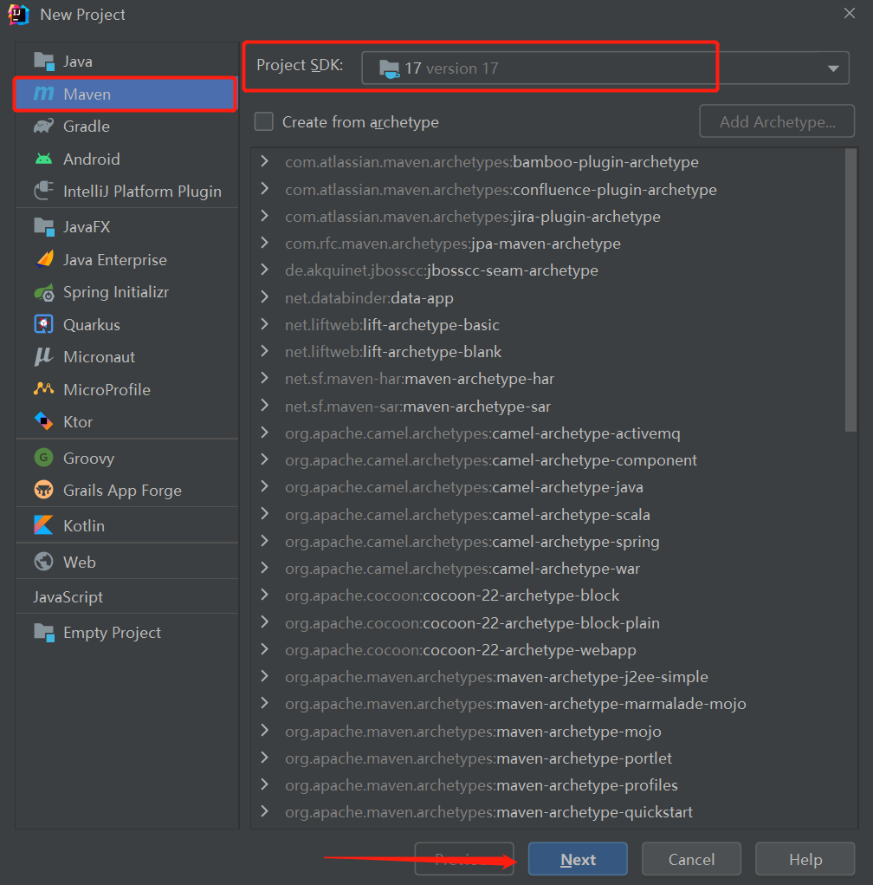

2. 填写GAV

   


### 使用模板创建Maven项目

1. new project，选择Maven

   1. 选择`webapp`模板

   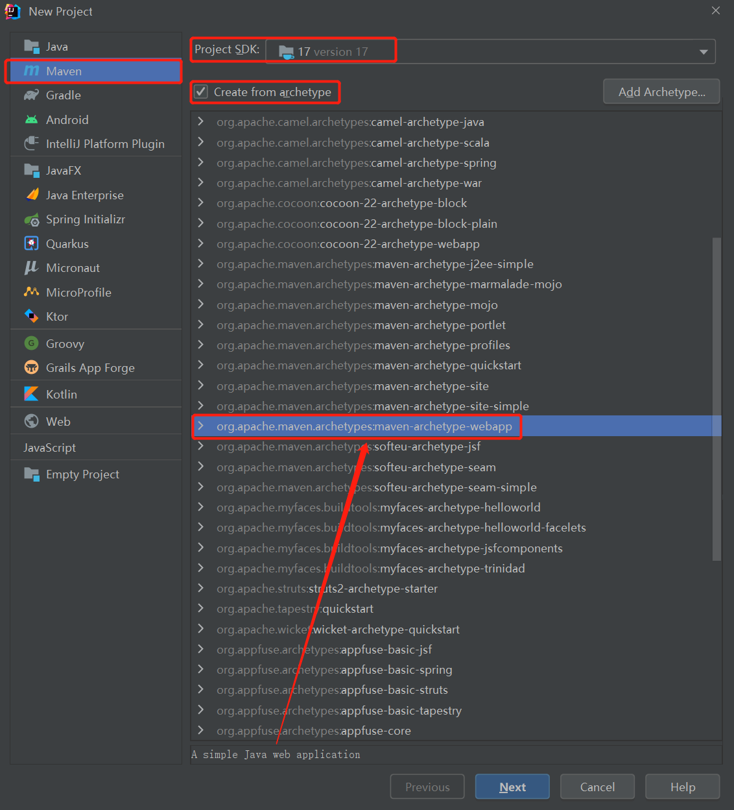

2. 填写groupid和项目名

   1. `groupId`是公司域名的反写，`artifactId`是项目名或模块名，`version`就是该项目或模块所对应的版本号

   

3. 配置Maven

   1. 选择Maven安装路径

   2. 选择配置文件

   3. 选择本地仓库路径

      > idea会自带maven，能配置的东西少
   
   
   
4. 完成创建，idea开始自动下载相关jar包到本地仓库

5. 显示BUILD SUCCESS，说明项目创建成功

6. 查看Maven配置

   1. 在`Settings-Build,Execution,Deployment-Build Tools`选择Maven
   2. 查看是否使用了正确的Maven home路径

   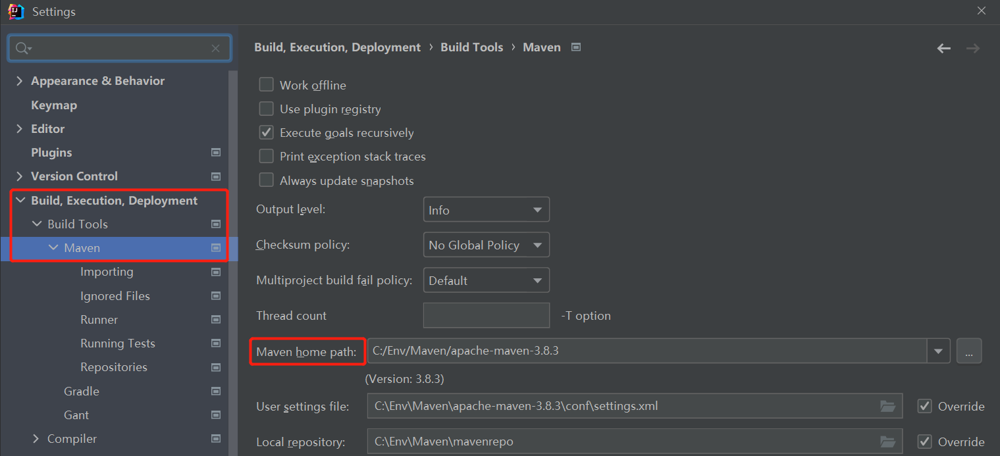


### 目录结构

`src`

- `main`
  - `java`：Java源代码
  - `resource`：配置文件
  - `webapp`：web应用才有
    - `WEB-INF`
      - `web.xml`
    - `index.jsp`
- `test`
  - `java`：测试使用

> 约定大于配置

在main目录下创建java目录后，需要将java目录分配为源码目录

- 右键目录选择`mark as`功能

  

- 也可以在项目结构配置`project structure`中修改

  

## 在idea中配置tomcat

1. 点击右上角的配置

     

2. 点击➕，选择`Tomcat Server-Local`

   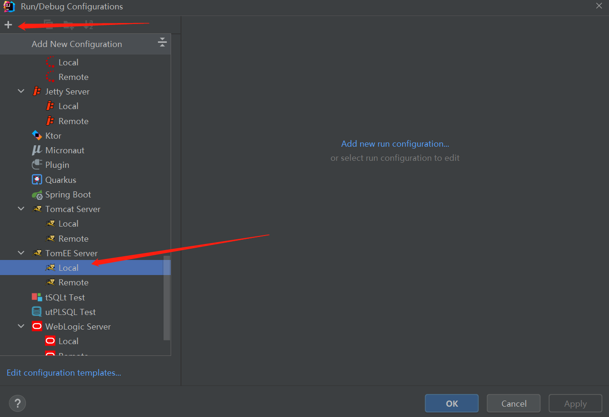

3. 配置Tomcat Server

   

4. 最下面会出现warning,点击`fix`,跳转到上面的`Deployment`配置

   > 访问一个网站需要指定一个文件夹名字
   >
   > 这里是缺少项目的打包部署设置。Artifacts用于编译后的Java类，Web资源等的整合，用以测试、部署等工作。某个module有了Artifacts就可以部署到应用服务器中

   1. 点击➕，创建`Artifacts`

   

   2. 选择创建`war`
   > `exploded`在这里可以理解为展开，不压缩的意思。也就是war、jar等产出物没压缩前的目录结构。
   >
   > 建议在开发的时候使用这种模式，便于修改了文件的效果立刻显现出来

   

5. 配置虚拟路径映射

   1. 不写就默认访问路径为`localhost:8080`
   2. 假如写了`ink`则访问路径为`localhost:8080/ink`

   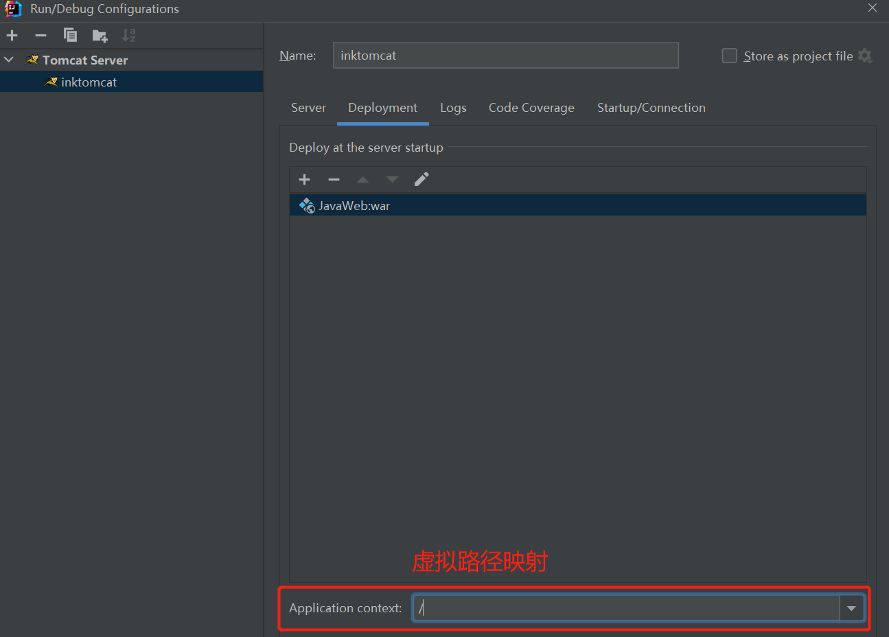

6. 配置成功后，warning消失，点击应用

   

7. 在右上角可以看到配置的tomcat，右边的按钮用于启动tomcat

     

8. 启动tomcat

     

    对应的就是Maven项目下的`src-main-webapp-index.jsp`文件内容

    

 

## Maven侧边栏结构

 

## 配置文件

`pom.xml`是Maven的核心配置文件

- 在`dependencies`中添加`dependency`，Maven就会自动下载jar包以及这个jar包所依赖的jar包

```xml
<?xml version="1.0" encoding="UTF-8"?>
<!--Maven版本和头文件-->
<project xmlns="http://maven.apache.org/POM/4.0.0" xmlns:xsi="http://www.w3.org/2001/XMLSchema-instance"
  xsi:schemaLocation="http://maven.apache.org/POM/4.0.0 http://maven.apache.org/xsd/maven-4.0.0.xsd">
  <modelVersion>4.0.0</modelVersion>
<!--  GAV-->
  <groupId>com.ink</groupId>
  <artifactId>JavaWeb-01-Maven</artifactId>
  <version>1.0-SNAPSHOT</version>
<!--  项目的打包方式-->
<!--
  jar:java应用
  war:JavaWeb应用
-->
  <packaging>war</packaging>

  <name>JavaWeb-01-Maven Maven Webapp</name>
  <!-- FIXME change it to the project's website -->
  <url>http://www.example.com</url>

<!--  配置-->
  <properties>
<!--    项目的默认构建编码-->
    <project.build.sourceEncoding>UTF-8</project.build.sourceEncoding>
<!--    编码版本-->
    <maven.compiler.source>1.7</maven.compiler.source>
    <maven.compiler.target>1.7</maven.compiler.target>
  </properties>
<!--  项目依赖-->
  <dependencies>
<!--    具体依赖的jar包的配置文件-->
    <dependency>
      <groupId>junit</groupId>
      <artifactId>junit</artifactId>
      <version>4.11</version>
      <scope>test</scope>
    </dependency>
  </dependencies>
<!--  项目构建用的东西-->
  <build>
    <finalName>JavaWeb-01-Maven</finalName>
    <pluginManagement><!-- lock down plugins versions to avoid using Maven defaults (may be moved to parent pom) -->
      <plugins>
        <plugin>
          <artifactId>maven-clean-plugin</artifactId>
          <version>3.1.0</version>
        </plugin>
        <!-- see http://maven.apache.org/ref/current/maven-core/default-bindings.html#Plugin_bindings_for_war_packaging -->
        <plugin>
          <artifactId>maven-resources-plugin</artifactId>
          <version>3.0.2</version>
        </plugin>
        <plugin>
          <artifactId>maven-compiler-plugin</artifactId>
          <version>3.8.0</version>
        </plugin>
        <plugin>
          <artifactId>maven-surefire-plugin</artifactId>
          <version>2.22.1</version>
        </plugin>
        <plugin>
          <artifactId>maven-war-plugin</artifactId>
          <version>3.2.2</version>
        </plugin>
        <plugin>
          <artifactId>maven-install-plugin</artifactId>
          <version>2.5.2</version>
        </plugin>
        <plugin>
          <artifactId>maven-deploy-plugin</artifactId>
          <version>2.8.2</version>
        </plugin>
      </plugins>
    </pluginManagement>
  </build>
</project>

```

### 资源导出问题

- 标准的Maven项目都会有一个`resources`目录来存放所有的资源配置文件，但是在项目中也会将资源配置文件放在其他位置，那么默认的Maven项目构建编译时就不会把其他目录下的资源配置文件导出到`target-class`目录中，就会导致资源配置文件读取失败，从而导致项目报错出现异常。
- 比如说在使用MyBatis框架时，`Mapper.xml`配置文件都会放在`dao`包中和`dao`接口类放在一起的，那么执行程序的时候，配置文件就一定会读取失败，不会生成到Maven的`target-class`目录中，所以要在项目的`pom.xml`文件中进行设置

- 解决方案
  - 在`pom.xml`文件的`<build>`中配置`<resources>`来防止导出失败

```xml
<build>
    <resources>
      <resource>
        <directory>src/main/java</directory>
        <includes>
<!--          在java目录下可以包含properties文件和xml文件-->
          <include>**/*.properties</include>
          <include>**/*.xml</include>
        </includes>
        <filtering>false</filtering>
      </resource>
    </resources>
</build>
```

## 目录树

查看Maven中jar包的联系


## idea查看日志

 

 

## 在idea中全局默认配置Maven

1. 关闭启动idea打开上次的项目

   

2. 重新启动idea，打开全局设置

   

3. 全局配置Maven

   


# Servlet

- `Servlet`是Sun公司在API（Application Programming Interface应用程序接口）中提供的一个接口
  - `Servlet`接口定义的是一套处理网络请求的**规范**，所有实现`servlet`的类，都需要实现它的五个方法，其中最主要的是两个生命周期方法`init()`和`destroy()`，还有一个处理请求的`service()`方法
- `Serlvet`接口的两个默认的实现类
  - `HttpServlet`
  - `GenericServlet`
- 如果想开发一个`Servlet`程序，只需要完成两个步骤
  - 编写一个类，实现`Servlet`接口
  - 把开发好的Java类部署到web服务器中

## 创建Servlet项目

1. 创建普通的Maven项目作为父项目，然后删除`src`目录

2. 在`pom.xml`中添加`servlet`和`jsp`的相关依赖

   1. > 快捷键：`alt+insert`
      >
      > Tomcat10+版本的导入的依赖为`jakarta.servlet`，否则出现`java.lang.ClassNotFoundException: javax.servlet.http.HttpServlet`
      >
      > 去掉`<scope>`
      
   2. ```xml
          <dependencies>
      <!--        JSP依赖-->
              <dependency>
                  <groupId>jakarta.servlet.jsp</groupId>
                  <artifactId>jakarta.servlet.jsp-api</artifactId>
                  <version>3.0.0</version>
                  <scope>provided</scope>
              </dependency>
      <!--        Servlet依赖-->
              <dependency>
                  <groupId>jakarta.servlet</groupId>
                  <artifactId>jakarta.servlet-api</artifactId>
                  <version>5.0.0</version>
                  <scope>provided</scope>
              </dependency>
          </dependencies>
      
      ```

3. 在父项目下创建Moudle，选择创建webapp模板的Maven项目作为子项目 

   1. Maven父子项目创建后，父项目下的`pom.xml`会有`<module>`依赖

       ```xml
           <modules>
               <module>ServletDemo</module>
           </modules>
       ```

    2. 子项目下的`pom.xml`创建后刚开始会有`<parent>`依赖，加载完之后就没有了，所以需要手动添加

       ```xml
         <parent>
           <groupId>com.ink</groupId>
           <artifactId>JavaWeb</artifactId>
           <version>1.0-SNAPSHOT</version>
         </parent>
       ```

   3. 父项目的jar包子项目可以直接使用，但是子项目的jar包父项目不能使用

   4. > 问题
       >
       > - 创建module时出现问题所以把它删掉了，然后又创建了一个和之前删除的同名的module名称，新创建的module中的`pom.xml`文件出现`Ignored`
       >
       > 解决
       >
       > - `Settings-Build,Execution,Deployment-Build Tools-Maven-Ignored Files`
       > - 将勾选取消，然后刷新Maven
       >
       > 

   

   

4. 在子项目的`src-main`目录下创建`java`和`resource`目录并标记为对应的文件夹

5. 将`src-main-webapp-WEB-INF`目录下的`web.xml`换成最新版本

   ```xml
   <?xml version="1.0" encoding="UTF-8"?>
   <web-app version="3.0" xmlns="http://java.sun.com/xml/ns/javaee"
            xmlns:xsi="http://www.w3.org/2001/XMLSchema-instance"
            xsi:schemaLocation="http://java.sun.com/xml/ns/javaee
   	http://java.sun.com/xml/ns/javaee/web-app_3_0.xsd">
     <display-name>Archetype Created Web Application</display-name>
    
   </web-app>  
   ```


## 编写Servlet程序

1. 在子项目的`src-main-java`目录下创建Package

   1. `com.ink.servlet`

2. 创建`ServletTest`类继承`HttpServlet`接口

   1. `HttpServlet`类继承了`GenericServlet`类
   2. `GenericServlet`类继承了`Servlet`接口

   ```java
   public abstract class HttpServlet extends GenericServlet {
       
   }
   
   public abstract class GenericServlet implements Servlet, ServletConfig, Serializable {
       
   }
   ```

3. 查看Servlet源码

   主要是`service()`方法

   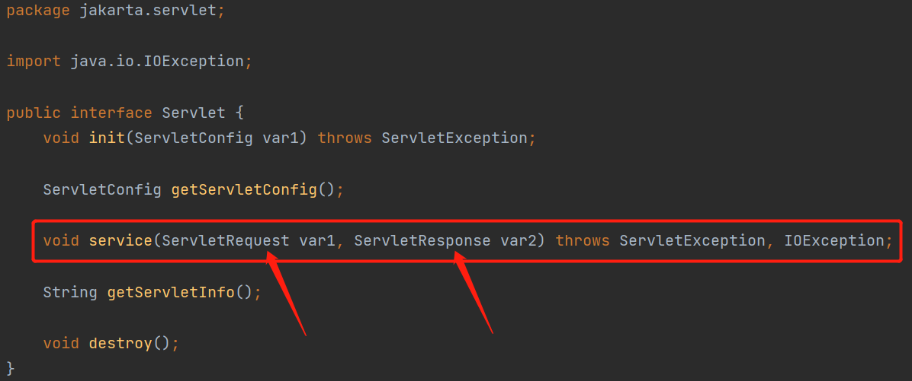

4. 查看`GenericServlet`类，没有实现`service()`方法

   ```java
   public abstract void service(ServletRequest var1, ServletResponse var2) throws ServletException, IOException;
   ```

5. 查看HttpServlet类，实现了`service()`方法

   ```java
   protected void service(HttpServletRequest req, HttpServletResponse resp) throws ServletException, IOException {
       String method = req.getMethod();
       long lastModified;
       if (method.equals("GET")) {
           lastModified = this.getLastModified(req);
           if (lastModified == -1L) {
               this.doGet(req, resp);
           } else {
               long ifModifiedSince = req.getDateHeader("If-Modified-Since");
               if (ifModifiedSince < lastModified) {
                   this.maybeSetLastModified(resp, lastModified);
                   this.doGet(req, resp);
               } else {
                   resp.setStatus(304);
               }
           }
       } else if (method.equals("HEAD")) {
           lastModified = this.getLastModified(req);
           this.maybeSetLastModified(resp, lastModified);
           this.doHead(req, resp);
       } else if (method.equals("POST")) {
           this.doPost(req, resp);
       } else if (method.equals("PUT")) {
           this.doPut(req, resp);
       } else if (method.equals("DELETE")) {
           this.doDelete(req, resp);
       } else if (method.equals("OPTIONS")) {
           this.doOptions(req, resp);
       } else if (method.equals("TRACE")) {
           this.doTrace(req, resp);
       } else {
           String errMsg = lStrings.getString("http.method_not_implemented");
           Object[] errArgs = new Object[]{method};
           errMsg = MessageFormat.format(errMsg, errArgs);
           resp.sendError(501, errMsg);
       }
   
   }
   ```

6. 所以继承`HttpServlet`的`ServletTest`子类需要至少重写一个方法（`doGet()`,`doPost()`,`doPut()`,`doDelete()`）

   > 快捷键：`ctrl+o`
   >
   > 由于get和post只是请求方式不一样，业务逻辑一样，所以可以相互调用


### 重写方法

`ServletTest.java`

```java
package com.ink.servlet;

import jakarta.servlet.ServletException;
import jakarta.servlet.ServletOutputStream;
import jakarta.servlet.http.HttpServlet;
import jakarta.servlet.http.HttpServletRequest;
import jakarta.servlet.http.HttpServletResponse;

import java.io.IOException;
import java.io.PrintWriter;

public class ServletTest extends HttpServlet {
    @Override
    protected void doGet(HttpServletRequest req, HttpServletResponse resp) throws ServletException, IOException {
//        super.doGet(req, resp);
//        ServletOutputStream outputStream = resp.getOutputStream();
        System.out.println("进入了doGet方法");
//        响应流
        PrintWriter writer = resp.getWriter();
        writer.println("Hello Servlet");
    }


    @Override
    protected void doPost(HttpServletRequest req, HttpServletResponse resp) throws ServletException, IOException {
//        super.doPost(req, resp);
        doGet(req,resp);
    }
}

```

### 创建映射

写的是Java程序，但是要通过浏览器访问，浏览器需要连接Web服务器，所以需要在Web服务中注册写的 Servlet，还要给一个浏览器能够访问的路径

- 在`webapp/WEB-INF`目录的`web.xml`中配置`<servlet>`和`<servlet-mapping>`
- `<servlet-name>`要相同
- `<url-pattern>`最前面要有`/`

```xml
<!DOCTYPE web-app PUBLIC
 "-//Sun Microsystems, Inc.//DTD Web Application 2.3//EN"
 "http://java.sun.com/dtd/web-app_2_3.dtd" >

<web-app>
  <display-name>Archetype Created Web Application</display-name>

<!--  注册Servlet-->
  <servlet>
    <servlet-name>Hello</servlet-name>
    <servlet-class>com.ink.servlet.ServletTest</servlet-class>
  </servlet>

<!--  Servlet的请求路径-->
  <servlet-mapping>
    <servlet-name>Hello</servlet-name>
    <url-pattern>/Hello</url-pattern>
  </servlet-mapping>
</web-app>
```

### 配置Tomcat

[配置Tomcat](# 在idea中配置tomcat)

启动后会生成`target`文件目录

 


### 测试访问

- 输入映射的路径

  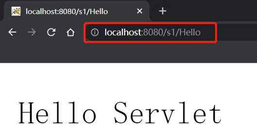

- 对应的控制台打印输出

  


## Servlet原理

- **Servlet不会直接和客户端打交道**
- **Tomcat才是和客户端直接打交道的工具**，它监听了端口，请求过来后，根据url等信息，确定要将请求`request`对象交给哪个Servlet去处理，然后调用那个Servlet的`service()`方法，`service()`方法返回一个`response`对象，Tomcat再把这个`response`对象返回给客户端浏览器

> 通过Web服务器映射的URL访问资源，主要3个步骤
>
> 1. 接收请求
> 2. 处理请求
> 3. 响应请求
>
> 任何一个应用程序都包含这三个步骤
>
> - 其中接收请求和响应请求是共性功能，且没有差异性，所以就把接收和响应两个步骤抽取成Web服务器
> - **处理请求的逻辑**是不同的，抽取出来做成`Servlet`，交给程序员自己编写
>
> 随着互联网的发展，出现了三层架构，所以一些逻辑就从`Servlet`抽取出来，分担到`Service`和`Dao`

`Servlet`接口中的五个方法，难点在于`request`对象和`response`对象

- Tomcat会事先把`request`对象和`response`对象封装好传进来
- 不需要写TCP连接数据库，也不需要解析HTTP请求，更不需要把结果转成HTTP响应
- `request`对象和`response`对象自动解决了


`request`对象和`response`对象

- HTTP请求到达Tomcat后，Tomcat通过字符串解析，把各个请求头（Header），请求地址（URL），请求参数（QueryString）都封装进了`request`对象
- Tomcat最开始传递给Servlet的`response`对象是一个空的对象。Servlet逻辑处理后得到结果，通过`response.write()`方法，将结果写入`response`对象内部的缓冲区。Tomcat会在servlet处理结束后拿到`response`对象，将其组装成HTTP响应发给客户端

## Mapping映射

- 一个Servlet可以指定一个映射路径

  ```xml
    <servlet-mapping>
      <servlet-name>Hello</servlet-name>
      <url-pattern>/Hello</url-pattern>
    </servlet-mapping>
  ```

- 一个Servlet可以指定多个映射路径

  ```xml
    <servlet-mapping>
      <servlet-name>Hello</servlet-name>
      <url-pattern>/Hello</url-pattern>
    </servlet-mapping>
    <servlet-mapping>
      <servlet-name>Hello</servlet-name>
      <url-pattern>/Hello1</url-pattern>
    </servlet-mapping>
    <servlet-mapping>
      <servlet-name>Hello</servlet-name>
      <url-pattern>/Hello2</url-pattern>
    </servlet-mapping>
  ```

- 一个Servlet可以指定通用映射路径

  - 通配符`*`

  ```xml
    <servlet-mapping>
      <servlet-name>Hello</servlet-name>
      <url-pattern>/Hello/*</url-pattern>
    </servlet-mapping>
  ```

- 默认请求路径

  ```xml
    <servlet-mapping>
      <servlet-name>Hello</servlet-name>
      <url-pattern>/*</url-pattern>
    </servlet-mapping>
  ```

- 指定路径后缀

  - `*`前面不能加`/`

  ```xml
    <servlet-mapping>
      <servlet-name>Hello</servlet-name>
      <url-pattern>*.ink</url-pattern>
    </servlet-mapping>
  ```


**映射路径优先级**

- 指定了固定的映射路径优先级最高，如果找不到才会走默认的映射路径

   

## ServletContext

Web容器在启动的时候，它会为每个Web程序都创建一个对应的`ServletContext`对象，它代表了当前的Web应用

- **共享数据**

  - 在一个servlet中保存的数据，可以在另一个servlet中拿到

- **获取初始化参数**

- **请求转发**

  - `getRequestDispatcher("/gp").forward(req,resp)`
  - 页面跳转，但路径url不会发生变化（区别于重定向）

- **读取资源文件**

  - `Properties`类
  - `properties`文件都会被打包到了同一个路径`WEB-INF-classes`下，这个路径称为`classpath`

  > - 在`resources`目录下创建`db.properties`，需要获取`properties`文件在web应用的位置
  >   - 关闭Tomcat，然后再Maven中执行clean操作，再启动Tomcat查看`properties`文件在生成的`target`目录中的位置
  > - [资源导出问题](# 资源导出问题)
  >   - `java`目录下的`properties`文件不经过配置无法显示在`target-class`目录下

```java
package com.ink.servletcontext;

import jakarta.servlet.Servlet;
import jakarta.servlet.ServletContext;
import jakarta.servlet.ServletException;
import jakarta.servlet.http.HttpServlet;
import jakarta.servlet.http.HttpServletRequest;
import jakarta.servlet.http.HttpServletResponse;

import java.io.IOException;

public class ServletContextTest extends HttpServlet {
    @Override
    protected void doGet(HttpServletRequest req, HttpServletResponse resp) throws ServletException, IOException {
//        Servlet初始化参数
//        this.getInitParameter()
//        Servlet配置
//        this.getServletConfig()
//        Servlet上下文
        ServletContext servletContext = this.getServletContext();
        String username = "ink";
//        将一个数据保存在了ServletContext中
        servletContext.setAttribute("username",username);
        System.out.println("hello");

    }

    @Override
    protected void doPost(HttpServletRequest req, HttpServletResponse resp) throws ServletException, IOException {
        doGet(req, resp);
    }
}

```

```java
package com.ink.servletcontext;

import jakarta.servlet.ServletContext;
import jakarta.servlet.ServletException;
import jakarta.servlet.http.HttpServlet;
import jakarta.servlet.http.HttpServletRequest;
import jakarta.servlet.http.HttpServletResponse;

import java.io.IOException;
import java.io.PrintWriter;

public class GetServletTest extends HttpServlet {
    @Override
    protected void doGet(HttpServletRequest req, HttpServletResponse resp) throws ServletException, IOException {
        ServletContext servletContext = this.getServletContext();
        String username = (String) servletContext.getAttribute("username");

        resp.setContentType("text/html");
        resp.setCharacterEncoding("utf-8");
//        共享数据
        PrintWriter writer = resp.getWriter();
        writer.println("姓名"+username);
//        获取初始化参数
        String url = servletContext.getInitParameter("url");
        resp.getWriter().println(url);
    }

    @Override
    protected void doPost(HttpServletRequest req, HttpServletResponse resp) throws ServletException, IOException {
        doGet(req, resp);
    }
}

```

```java
package com.ink.servletcontext;

import jakarta.servlet.RequestDispatcher;
import jakarta.servlet.ServletContext;
import jakarta.servlet.ServletException;
import jakarta.servlet.http.HttpServlet;
import jakarta.servlet.http.HttpServletRequest;
import jakarta.servlet.http.HttpServletResponse;

import java.io.IOException;
import java.io.PrintWriter;

public class ServletForwardTest extends HttpServlet {
    @Override
    protected void doGet(HttpServletRequest req, HttpServletResponse resp) throws ServletException, IOException {
        ServletContext servletContext = this.getServletContext();

        System.out.println("进入了ServletForwardTest");
//        转发的请求路径
        RequestDispatcher requestDispatcher = servletContext.getRequestDispatcher("/getcontext");
//        调用forward实现请求转发
        requestDispatcher.forward(req,resp);
//        servletContext.getRequestDispatcher("/getcontext").forward(req,resp);
    }

    @Override
    protected void doPost(HttpServletRequest req, HttpServletResponse resp) throws ServletException, IOException {
        doGet(req, resp);
    }
}
```

```java
package com.ink.servletcontext;

import jakarta.servlet.ServletException;
import jakarta.servlet.http.HttpServlet;
import jakarta.servlet.http.HttpServletRequest;
import jakarta.servlet.http.HttpServletResponse;

import java.io.IOException;
import java.io.InputStream;
import java.util.Properties;

public class ServletPropTest extends HttpServlet {
    @Override
    protected void doGet(HttpServletRequest req, HttpServletResponse resp) throws ServletException, IOException {
        System.out.println("进入prop");
//        第一个/代表当前项目，不可省略，获取target目录下的文件
        InputStream is = this.getServletContext().getResourceAsStream("/WEB-INF/classes/com/ink/servletcontext/ac.properties");
        Properties prop = new Properties();
        prop.load(is);
        String user = prop.getProperty("username");
        String pwd = prop.getProperty("password");
        resp.getWriter().print(user+":"+pwd);
        is.close();
    }

    @Override
    protected void doPost(HttpServletRequest req, HttpServletResponse resp) throws ServletException, IOException {
        doGet(req, resp);
    }
}

```

```xml
<?xml version="1.0" encoding="UTF-8"?>
<web-app version="3.0" xmlns="http://java.sun.com/xml/ns/javaee"
         xmlns:xsi="http://www.w3.org/2001/XMLSchema-instance"
         xsi:schemaLocation="http://java.sun.com/xml/ns/javaee
	http://java.sun.com/xml/ns/javaee/web-app_3_0.xsd">
  <display-name>Archetype Created Web Application</display-name>

  <!--配置一些web应用初始化参数-->
  <context-param>
    <param-name>url</param-name>
    <param-value>jdbc:mysql://localhost:3306/mybatis</param-value>
  </context-param>

  <servlet>
    <servlet-name>hello</servlet-name>
    <servlet-class>com.ink.servletcontext.ServletContextTest</servlet-class>
  </servlet>

  <servlet-mapping>
    <servlet-name>hello</servlet-name>
    <url-pattern>/hello</url-pattern>
  </servlet-mapping>

  <servlet>
    <servlet-name>getcontext</servlet-name>
    <servlet-class>com.ink.servletcontext.GetServletTest</servlet-class>
  </servlet>

  <servlet-mapping>
    <servlet-name>getcontext</servlet-name>
    <url-pattern>/getcontext</url-pattern>
  </servlet-mapping>

  <servlet>
    <servlet-name>forward</servlet-name>
    <servlet-class>com.ink.servletcontext.ServletForwardTest</servlet-class>
  </servlet>

  <servlet-mapping>
    <servlet-name>forward</servlet-name>
    <url-pattern>/forward</url-pattern>
  </servlet-mapping>

  <servlet>
    <servlet-name>prop</servlet-name>
    <servlet-class>com.ink.servletcontext.ServletPropTest</servlet-class>
  </servlet>

  <servlet-mapping>
    <servlet-name>prop</servlet-name>
    <url-pattern>/prop</url-pattern>
  </servlet-mapping>
</web-app>
```
需要重新配置tomcat

- 在Deployment中删除之前的war，选择新的module对应的war


> 问题
>
> - 在`web.xml`中配置多个`<servlet>`和`<servlet-mapping>`的时候，在`web.xml`的开头位置`<web-app>`报错不匹配
>
> 原因
>
> - `<web-app>`内的元素使用与`web.xml`开头指定的DTD文档中定义的不一致
>
> - 为了限制xml文档编辑时的结构，早期通常是使用DTD文档定义xml文档中可以使用的元素，但是DTD本身并不是xml格式的，后来为了统一就发明了XMLSchema（即`.xsd）`，xsd文件本身也是符合xml格式规范的，使用xsd对xml文档的结构进行定义更加的清晰
>
> - 因此最新的xml结构定义基本上都是基于xsd格式的。随着新技术和配置的应用在`web.xml`中的各种配置大部分已经不符合早期的DTD的定义了，因此只要把DTD换成就XMLSchema可以了。
>
>   ```xml
>   <!--<web-app>-->
>   <!--  <display-name>Archetype Created Web Application</display-name>-->
>                                                                     
>   <?xml version="1.0" encoding="UTF-8"?>
>   <web-app version="3.0" xmlns="http://java.sun.com/xml/ns/javaee"
>            xmlns:xsi="http://www.w3.org/2001/XMLSchema-instance"
>            xsi:schemaLocation="http://java.sun.com/xml/ns/javaee
>   	http://java.sun.com/xml/ns/javaee/web-app_3_0.xsd">
>     <display-name>Archetype Created Web Application</display-name>
>   ```


## HTTP响应

`HttpServletResponse`

Web服务器接收到客户端浏览器的HTTP请求后，会针对这个请求分别创建一个代表请求的`HttpServletRequest`对象，一个代表响应的`HttpServletResponse`对象

- 在`HttpServletRequest`对象中获取客户端请求的参数

- 在`HttpServletResponse`对象中存放返回给客户端响应的信息 

### 方法

- 向浏览器发送数据

  - ```java
    // ServletResponse接口
    ServletOutputStream getOutputStream() throws IOException;
    
    PrintWriter getWriter() throws IOException;
    ```

- 向浏览器发送响应头

  - ```java
    // ServletResponse接口
    void setCharacterEncoding(String var1);
    
    void setContentLength(int var1);
    
    void setContentLengthLong(long var1);
    
    void setContentType(String var1);
    
    // HttpServletResponse类
    void setDateHeader(String var1, long var2);
    
    void addDateHeader(String var1, long var2);
    
    void setHeader(String var1, String var2);
    
    void addHeader(String var1, String var2);
    
    void setIntHeader(String var1, int var2);
    
    void addIntHeader(String var1, int var2);
    
    ```

- 响应的状态码

  - ```java
    int SC_OK = 200;
    
    int SC_MOVED_PERMANENTLY = 301;
    int SC_MOVED_TEMPORARILY = 302;
    int SC_FOUND = 302;
    int SC_TEMPORARY_REDIRECT = 307;
    
    int SC_BAD_REQUEST = 400;
    int SC_FORBIDDEN = 403;
    int SC_NOT_FOUND = 404;
    int SC_METHOD_NOT_ALLOWED = 405;
    
    int SC_INTERNAL_SERVER_ERROR = 500;
    int SC_BAD_GATEWAY = 502;
    ```

### 应用

#### **下载文件**

1. 获取下载的文件的路径url
   1. 相对于`target`目录
2. 获取下载文件名fileName
3. 设置响应头的信息使得浏览器能下载文件
4. 获取下载的文件的输入流
5. 创建buffer缓冲区
6. 获取`OutputStream`对象
7. 将`FileInputStream`写入`buffer`缓冲区
8. 使用`OutputStream`将`buffer`缓冲区中的数据返回到客户端

> `resp.setHeader()`

```java
package com.ink.servlet;

import jakarta.servlet.ServletException;
import jakarta.servlet.ServletOutputStream;
import jakarta.servlet.http.HttpServlet;
import jakarta.servlet.http.HttpServletRequest;
import jakarta.servlet.http.HttpServletResponse;

import java.awt.*;
import java.io.FileInputStream;
import java.io.IOException;
import java.net.URLEncoder;

public class FileServletTest extends HttpServlet {
    @Override
    protected void doGet(HttpServletRequest req, HttpServletResponse resp) throws ServletException, IOException {
//        获取下载文件的路径
        String realPath = "C:\\Users\\AW\\Desktop\\JavaWeb\\ResponseDemo\\target\\classes\\1.png";
        System.out.println("下载文件的路径："+realPath);

//        获取下载文件的文件名，需要转义（从最后一个\\开始）
        String fileName = realPath.substring(realPath.lastIndexOf("\\") + 1);

//        设置响应头，使得浏览器能够支持下载文件，Content-Disposition指明响应的配置信息，attachment指明包含附件
        resp.setHeader("Content-Disposition","attachment; filename="+fileName);
//        文件名有中文则要使用URLEncoder.encode编码，否则有可能乱码
//        resp.setHeader("Content-Disposition","attachment;filename="+ URLEncoder.encode(fileName,"UTF-8"));

//        获取下载文件的输入流（将文件变成流）
        FileInputStream in = new FileInputStream(realPath);
//        获取outputStream对象，用于输出字符流数据或者二进制的字节流数据
        ServletOutputStream out = resp.getOutputStream();
//        创建缓冲区
        byte[] buffer = new byte[1024];
        int len = 0;
//        将FileInputStream流写入到buffer缓冲区,使用OutputStream将缓冲区中的数据输出到客户端
        while((len = in.read(buffer)) != -1){
            out.write(buffer,0,len);
        }
        in.close();
        out.close();
    }

    @Override
    protected void doPost(HttpServletRequest req, HttpServletResponse resp) throws ServletException, IOException {
        doGet(req, resp);
    }
}
```

 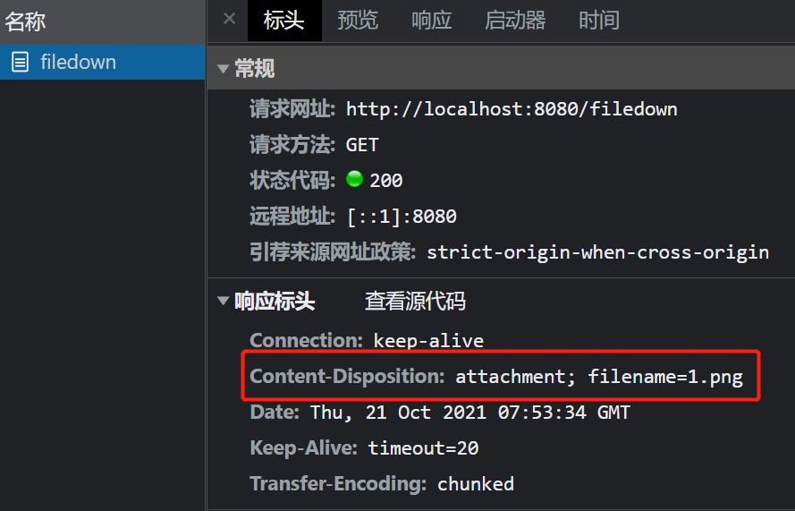


#### 验证码

- 生成数字验证码图片

```java
package com.ink.servlet;

import jakarta.servlet.ServletException;
import jakarta.servlet.http.HttpServlet;
import jakarta.servlet.http.HttpServletRequest;
import jakarta.servlet.http.HttpServletResponse;

import javax.imageio.ImageIO;
import java.awt.*;
import java.awt.image.BufferedImage;
import java.io.IOException;
import java.util.Random;

public class ImageServletTest extends HttpServlet {
    @Override
    protected void doGet(HttpServletRequest req, HttpServletResponse resp) throws ServletException, IOException {
//        让浏览器3秒自动刷新一次;
        resp.setHeader("refresh","3");

//        使用图片类在内存中创建一个图片
        BufferedImage image = new BufferedImage(80,40,BufferedImage.TYPE_INT_RGB);
//        创建一个笔
        Graphics2D g = (Graphics2D) image.getGraphics();
//        用笔设置图片的背景颜色
        g.setColor(Color.white);
        g.fillRect(0,0,80,20);
//        用笔给图片写数据
        g.setColor(Color.BLUE);
        g.setFont(new Font(null,Font.BOLD,20));
        g.drawString(makeNum(),0,20);

//        告诉浏览器，这个响应以图片的方式打开
        resp.setContentType("image/png");
//        不让浏览器缓存
        resp.setDateHeader("expires",-1);
        resp.setHeader("Cache-Control","no-cache");
        resp.setHeader("Pragma","no-cache");

//        将图片响应给浏览器
        ImageIO.write(image,"png", resp.getOutputStream());
    }

//    生成随机数
    private String makeNum(){
        Random random = new Random();
//        生成7位的随机数
        String num = random.nextInt(9999999) + "";
        StringBuffer sb = new StringBuffer();
//        如果不足7位，用0填充
        for (int i = 0; i < 7-num.length() ; i++) {
            sb.append("0");
        }
        num = sb.toString() + num;
        return num;
    }

    @Override
    protected void doPost(HttpServletRequest req, HttpServletResponse resp) throws ServletException, IOException {
        doGet(req, resp);
    }
}
```

 

#### 重定向

```java
package com.ink.servlet;

import jakarta.servlet.ServletException;
import jakarta.servlet.http.HttpServlet;
import jakarta.servlet.http.HttpServletRequest;
import jakarta.servlet.http.HttpServletResponse;

import java.io.IOException;

public class RedirectServletTest extends HttpServlet {
    @Override
    protected void doGet(HttpServletRequest req, HttpServletResponse resp) throws ServletException, IOException {
//        重定向地址需要包含完整的项目路径url
        resp.sendRedirect("/image");
    }

    @Override
    protected void doPost(HttpServletRequest req, HttpServletResponse resp) throws ServletException, IOException {
        doGet(req, resp);
    }
}
```

 

重定向就是设置响应头的`Status`和`Location`

 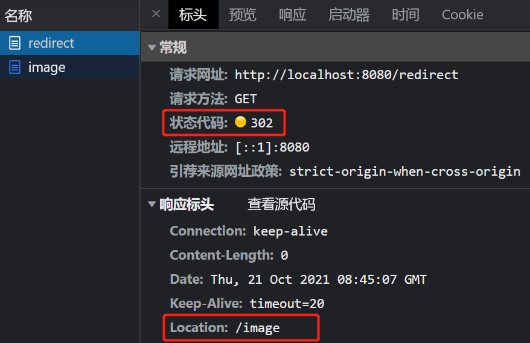


## HTTP请求

`HttpServletRequest`

用户通过HTTP协议访问服务器，Web服务器会将HTTP请求中的所有信息封装到`HttpServletRequest`对象中

### 方法

```java
// ServletRequest接口
String getParameter(String var1);

String[] getParameterValues(String var1);

// HttpServletRequest类
String getAuthType();

Cookie[] getCookies();

long getDateHeader(String var1);

String getHeader(String var1);

String getMethod();

String getPathInfo();

String getPathTranslated();

String getContextPath();

String getQueryString();

String getRemoteUser();

HttpSession getSession();
```

### 应用

#### 获取请求参数和请求转发

1. 删除自带的`index.jsp`，重新创建`index.jsp`作为登录页面

    ```jsp
    <%@ page contentType="text/html;charset=UTF-8" language="java" %>
    <html>
    <head>
        <title>Title</title>
    </head>
    <body>
    <%--    获取项目路径--%>
    <%--    以post的方式提交表单--%>
        <form action="${pageContext.request.contextPath}/login" method="post">
            username <input name="username" type="text"> <br>
            password: <input name="password" type="password"> <br>
            hobbies:
            <input name="hobbies" type="checkbox" value="女孩">女孩
            <input name="hobbies" type="checkbox" value="代码">代码
            <input name="hobbies" type="checkbox" value="电影">电影
            <input name="hobbies" type="checkbox" value="爬山">爬山
            <input type="submit">
        </form>
    </body>
    </html>
    ```
    
2. 创建`success.jsp`作为登录成功后的跳转页面

    ```jsp
    <%@ page contentType="text/html;charset=UTF-8" language="java" %>
    <html>
    <head>
        <h1>登陆成功</h1>
    </head>
    <body>
    
    </body>
    </html>
    ```

3. 在后端获取请求参数

    > 内部转发是服务器内部操作，不需要加上项目路径

    ```java
    package com.ink.servlet;
    
    import jakarta.servlet.ServletException;
    import jakarta.servlet.http.HttpServlet;
    import jakarta.servlet.http.HttpServletRequest;
    import jakarta.servlet.http.HttpServletResponse;
    
    import java.io.IOException;
    import java.util.Arrays;
    
    public class RequestTest extends HttpServlet {
        @Override
        protected void doGet(HttpServletRequest req, HttpServletResponse resp) throws ServletException, IOException {
    //        后台接收中文乱码问题，设置编码
            req.setCharacterEncoding("utf-8");
            resp.setCharacterEncoding("utf-8");
    //        获取单个请求参数
            String username = req.getParameter("username");
            String password = req.getParameter("password");
    //        获取多个请求参数
            String[] hobbies = req.getParameterValues("hobbies");
            System.out.println("=============================");
            System.out.println(username);
            System.out.println(password);
            System.out.println(Arrays.toString(hobbies));
            System.out.println("=============================");
    
            System.out.println(req.getContextPath());
    //        通过请求转发
    //        /代表当前的web应用，不加/也可以
            req.getRequestDispatcher("/success.jsp").forward(req,resp);
        }
    
        @Override
        protected void doPost(HttpServletRequest req, HttpServletResponse resp) throws ServletException, IOException {
            doGet(req, resp);
        }
    }
    ```

 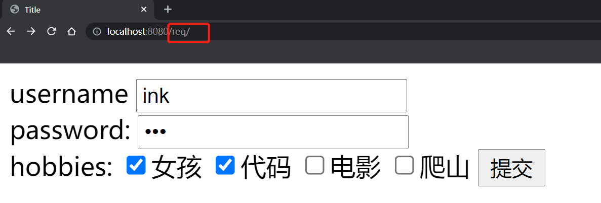

 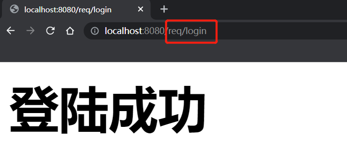

 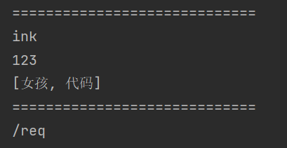


# Cookieh和Session

> Cookie：饼干
>
> Session：会话

- HTTP是无状态协议，之前已经认证成功的用户状态无法通过协议层保留下来，即无法实现状态管理
- 一般使用Cookie来管理Session
- Cookie的工作机制是用户识别和状态管理，Web网站为了管理用户状态，会通过浏览器把一些数据写入用户的主机。当用户访问Web网站时，可以通过通信的方式取回之前存放的Cookie

## 状态管理步骤

1. 客户端将ID和密码等登录信息放在请求报文的实体部分，以POST方式发送给服务器
2. 服务器发放用于识别用户的Session ID，通过验证请求报文中的登录信息进行身份验证，然后把用户的认证状态和Session ID绑定，然后记录在服务器端
3. 服务器在向客户端返回响应时，会在响应报文的首部的Set-Cookie字段内写入Session ID
4. 客户端收到响应报文后，将Session ID作为Cookie保存在本地。下次再向服务器发送请求时，浏览器会自动发送Cookie，即发送了Session ID。
5. 服务器就可以通过Session ID来识别用户即认证状态

 

## Cookie

`jakarta.servlet.http.Cookie`

- cookie一般会保存在本地的用户目录下
  - `C:\Users\AW\AppData\Local\Microsoft\Windows\INetCookies\deprecated.cookie`

- 浏览器对cookie数量和大小有限制的，如果超过了这个限制，会丢失信息
- 浏览器一般只允许存放300个cookie, 每个Web站点最多存放20个cookie
- cookie大小有限制：一般是4kb

> Cookie的格式实际上是一段纯文本信息, 由服务器发送到客户端, 并保存在客户端硬盘中指定的目录
>
> 服务器读取Cookie的时候只能够读取到这个服务器相关的信息

### 方法

```java
// 获得Cookie
Cookie[] cookies = req.getCookies();
// 获得cookie中的key
cookie.getName(); 
// 获得cookie中的vlaue
cookie.getValue(); 
// 新建一个cookie
new Cookie("lastLoginTime", System.currentTimeMillis()+""); 
// 设置cookie的有效期
cookie.setMaxAge(24*60*60); 
// 响应给客户端一个cookie
resp.addCookie(cookie); 
```

 

```java
package com.ink.servlet;

import jakarta.servlet.ServletException;
import jakarta.servlet.http.Cookie;
import jakarta.servlet.http.HttpServlet;
import jakarta.servlet.http.HttpServletRequest;
import jakarta.servlet.http.HttpServletResponse;

import java.io.IOException;
import java.io.PrintWriter;
import java.text.SimpleDateFormat;
import java.util.Date;

public class CookieDemo extends HttpServlet {
    @Override
    protected void doGet(HttpServletRequest req, HttpServletResponse resp) throws ServletException, IOException {
//        中文乱码问题，设置编码
        req.setCharacterEncoding("utf-8");
        resp.setCharacterEncoding("gbk");
        resp.setHeader("content-type", "text/html; charset=UTF-8");
//        获取请求中携带的cookie
        Cookie[] cookies = req.getCookies();
        if(cookies == null){
            resp.getWriter().write("这是第一次访问！");
        }
        else{
            PrintWriter writer = resp.getWriter();
            for (int i = 0; i < cookies.length; i++) {
                if("lastTime".equals(cookies[i].getName())){
                    String value = cookies[i].getValue();
//                格式化时间
                    long timevalue = Long.parseLong(value);
                    Date date = new Date(timevalue);
                    SimpleDateFormat simpleDateFormat = new SimpleDateFormat();
                    String format = simpleDateFormat.format(date);
                    writer.println("上次登录时间为："+format);
                }
            }
        }

//        服务器响应给客户端一个cookie
        Cookie cookie = new Cookie("lastTime",System.currentTimeMillis()+"");
        resp.addCookie(cookie);

    }

    @Override
    protected void doPost(HttpServletRequest req, HttpServletResponse resp) throws ServletException, IOException {
        doGet(req, resp);
    }
}
```

```xml
<!DOCTYPE web-app PUBLIC
 "-//Sun Microsystems, Inc.//DTD Web Application 2.3//EN"
 "http://java.sun.com/dtd/web-app_2_3.dtd" >

<web-app version="3.0" xmlns="http://java.sun.com/xml/ns/javaee"
         xmlns:xsi="http://www.w3.org/2001/XMLSchema-instance"
         xsi:schemaLocation="http://java.sun.com/xml/ns/javaee
   http://java.sun.com/xml/ns/javaee/web-app_3_0.xsd">
  <display-name>Archetype Created Web Application</display-name>


  <servlet>
    <servlet-name>cookie</servlet-name>
    <servlet-class>com.ink.servlet.CookieDemo</servlet-class>
  </servlet>

  <servlet-mapping>
    <servlet-name>cookie</servlet-name>
    <url-pattern>/cookie</url-pattern>
  </servlet-mapping>
</web-app>
```

1. 第一次访问，此时浏览器没有服务器的cookie，所以请求中也没有cookie

   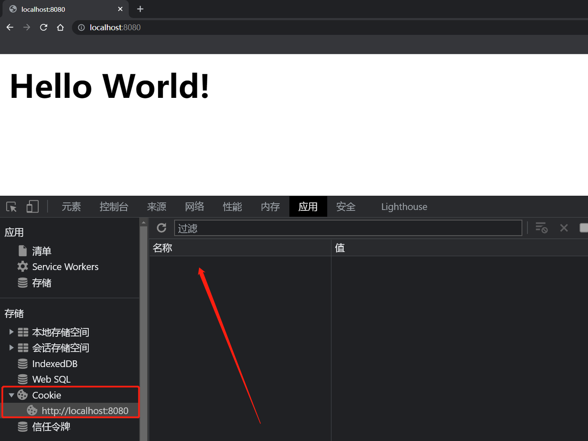

2. 服务器第一次收到请求后会为当前用户设置一个cookie，在响应报文中返回给客户端，客户端浏览器会保存这个cookie

   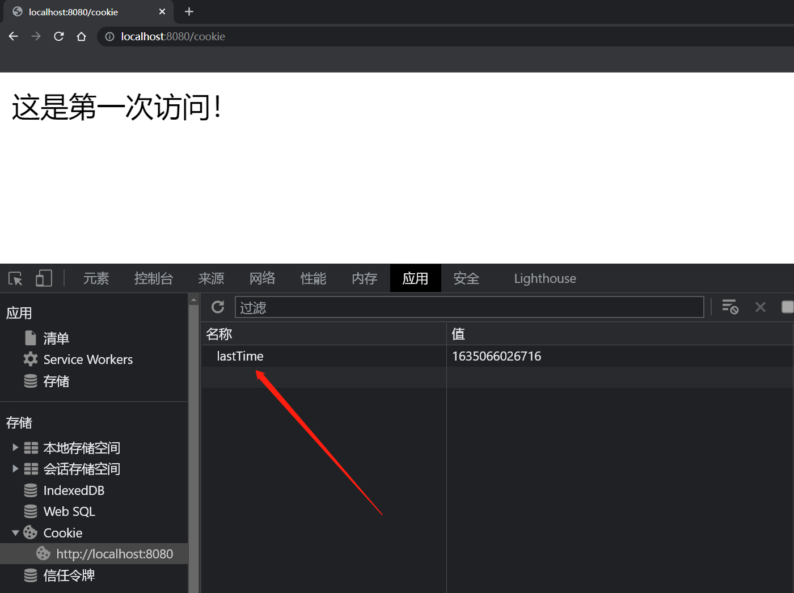

3. 下次客户端再次请求时，就会在请求报文中带上cookie

   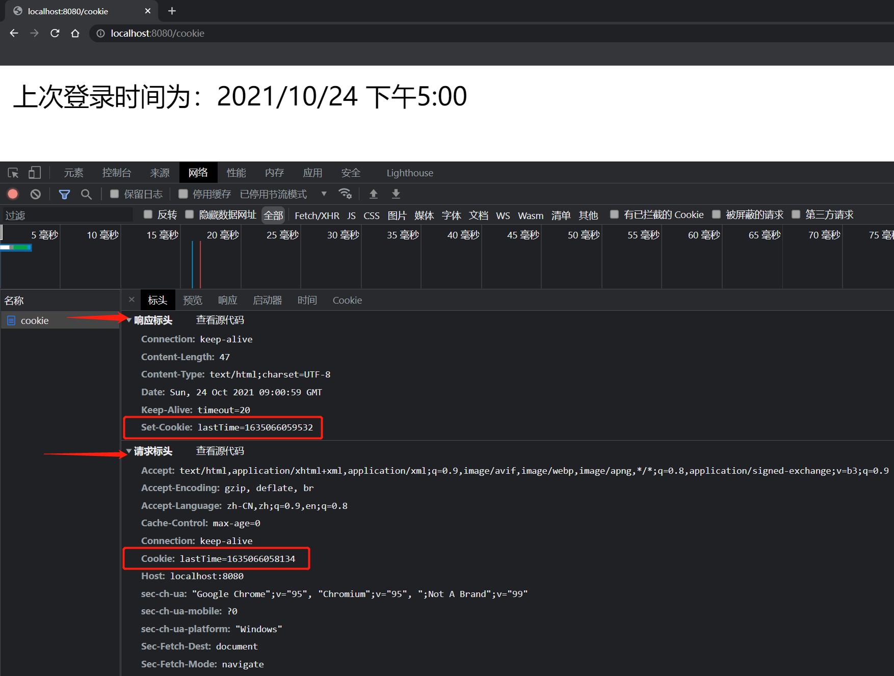

   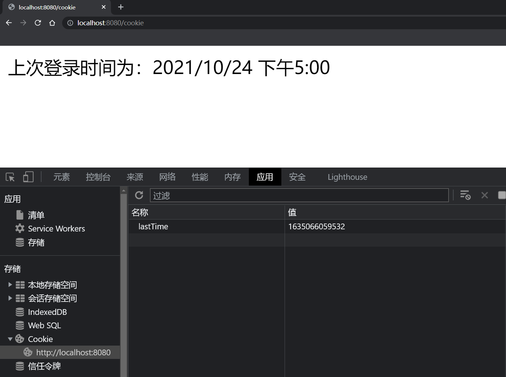

4. 如果关闭浏览器，则相当于本次会话结束。重新打开浏览器访问服务器，请求中就没有cookie，需要重新获取和设置cookie

   > `cookie.getMaxAge() = -1`：设置当浏览器关闭时cookie过期
   >
   > 将cookie的有效期设置为0，即可实现删除cookie的功能

   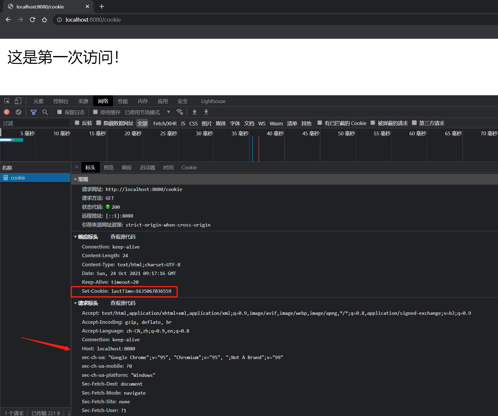


## Session

服务器会给每个浏览器创建一个Session对象

只要浏览器没有关闭，Session对象就一直存在

### Session和cookie的区别

- Cookie将用户的数据写给用户的浏览器，由浏览器（或本地）保存 
- Session将用户的数据写到用户独占的Session中，由服务器保存
- cookie数据存放在客户端本地，session数据是存放在服务器的，但是服务端的session的实现对客户端的cookie有依赖关系的
- cookie不安全，外人可以分析存放在本地的cookie并进行cookie欺骗
  - 考虑安全应该使用session
- session会在一段时间内存放在服务器上，如果session过多会导致服务器压力过大，性能降低
  - 考虑服务器性能方面应该使用cookie
- 一个用户在一个Web站点上可以有多个cookie，但是只有一个session


### 方法

```java
// 获取客户端的Session
req.getSession();
// 获取SessionID
session.getId();
// 判断是否是新的Session
session.isNew()
```

 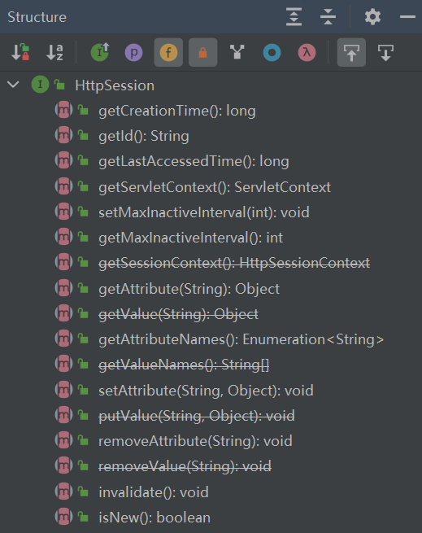

```java
package com.ink.servlet;

import jakarta.servlet.ServletException;
import jakarta.servlet.http.HttpServlet;
import jakarta.servlet.http.HttpServletRequest;
import jakarta.servlet.http.HttpServletResponse;
import jakarta.servlet.http.HttpSession;

import java.io.IOException;

public class SessionTest extends HttpServlet {
    @Override
    protected void doGet(HttpServletRequest req, HttpServletResponse resp) throws ServletException, IOException {
        req.setCharacterEncoding("utf-8");
        resp.setCharacterEncoding("utf-8");
        resp.setHeader("content-type", "text/html; charset=UTF-8");
//        获取Session
        HttpSession session = req.getSession();
//        在Session中存储信息
        session.setAttribute("name","郑吒");
//        获取Session ID
        String id = session.getId();
        if(session.isNew()){
            resp.getWriter().write("Session创建成功 "+ id);
        }
        else{
            resp.getWriter().write("Session已经存在 "+ id);
        }
    }

    @Override
    protected void doPost(HttpServletRequest req, HttpServletResponse resp) throws ServletException, IOException {
        doGet(req, resp);
    }
}
```

```java
package com.ink.servlet;

import jakarta.servlet.ServletException;
import jakarta.servlet.http.HttpServlet;
import jakarta.servlet.http.HttpServletRequest;
import jakarta.servlet.http.HttpServletResponse;
import jakarta.servlet.http.HttpSession;

import java.io.IOException;

public class SessionGetTest extends HttpServlet {
    @Override
    protected void doGet(HttpServletRequest req, HttpServletResponse resp) throws ServletException, IOException {
        req.setCharacterEncoding("utf-8");
        resp.setCharacterEncoding("utf-8");
        resp.setHeader("content-type", "text/html; charset=UTF-8");
//        获取Session
        HttpSession session = req.getSession();
        String name = (String)session.getAttribute("name");
        System.out.println(name);
    }

    @Override
    protected void doPost(HttpServletRequest req, HttpServletResponse resp) throws ServletException, IOException {
        doGet(req, resp);
    }
}
```

```xml
<!DOCTYPE web-app PUBLIC
 "-//Sun Microsystems, Inc.//DTD Web Application 2.3//EN"
 "http://java.sun.com/dtd/web-app_2_3.dtd" >

<web-app version="3.0" xmlns="http://java.sun.com/xml/ns/javaee"
         xmlns:xsi="http://www.w3.org/2001/XMLSchema-instance"
         xsi:schemaLocation="http://java.sun.com/xml/ns/javaee
	http://java.sun.com/xml/ns/javaee/web-app_3_0.xsd">
  <display-name>Archetype Created Web Application</display-name>


  <servlet>
    <servlet-name>cookie</servlet-name>
    <servlet-class>com.ink.servlet.CookieTest</servlet-class>
  </servlet>

  <servlet-mapping>
    <servlet-name>cookie</servlet-name>
    <url-pattern>/cookie</url-pattern>
  </servlet-mapping>

  <servlet>
    <servlet-name>session</servlet-name>
    <servlet-class>com.ink.servlet.SessionTest</servlet-class>
  </servlet>

  <servlet-mapping>
    <servlet-name>session</servlet-name>
    <url-pattern>/session</url-pattern>
  </servlet-mapping>

  <servlet>
    <servlet-name>name</servlet-name>
    <servlet-class>com.ink.servlet.SessionGetTest</servlet-class>
  </servlet>

  <servlet-mapping>
    <servlet-name>name</servlet-name>
    <url-pattern>/name</url-pattern>
  </servlet-mapping>

</web-app>

```

步骤

1. 服务器从`request`对象获取客户端的session对象

2. 如果没有，服务器创建一个session对象，将相关数据保存到session中

3. 服务器将SessionID以cookie的形式发送给客户端

   ```java
   // Session创建
   Cookie cookie = new Cookie("JSESSIONID",sessionId);
   resp.addCookie(cookie);
   ```

4. 客户端下次发送请求时会附加包含SessionID的cookie，服务器可以通过该cookie的SessionID获取session，再通过session获取数据

5. 如果将该cookie在客户端被移除，那么服务器就拿不到对应的session，所以服务器的session对客户端的cookie是有依赖关系的


### 注销Session

- 手动注销

  ```java
  // 获取Session
  HttpSession session = req.getSession();
  // 注销Session
  session.invalidate();
  ```

- 通过`web.xml`配置Session失效时间

  > 以分钟为单位

  ```xml
  <session-config>
      <session-timeout>1</session-timeout>
  </session-config>
  ```


# JavaVBean

> Java：咖啡
>
> Bean：豆子

**实体类**

JavaBean的特定写法

- 必须有一个无参构造器
- 属性必须私有化
- 必须有对应的`get()`和`set()`方法

**用途**

- 和数据库的字段做映射

## ORM

对象关系映射

- 数据库中的一张表对应Java中的一个类
- 表中的字段对应类中的属性
- 表中的行记录对应类的对象

`People`表

| id   | name | age  | address |
| ---- | ---- | ---- | ------- |
| 1    | ink1 | 20   | 北京    |
| 2    | ink2 | 22   | 安徽    |
| 3    | ink3 | 25   | 青岛    |

`People`类

> pojp、entity

```java
package com.ink.pojo;

public class People {
    private int id;
    private String name;
    private int age;
    private String address;

    public People() {
    }

    public People(int id, String name, int age, String address) {
        this.id = id;
        this.name = name;
        this.age = age;
        this.address = address;
    }

    public int getId() {
        return id;
    }

    public void setId(int id) {
        this.id = id;
    }

    public String getName() {
        return name;
    }

    public void setName(String name) {
        this.name = name;
    }

    public int getAge() {
        return age;
    }

    public void setAge(int age) {
        this.age = age;
    }

    public String getAddress() {
        return address;
    }

    public void setAddress(String address) {
        this.address = address;
    }

    @Override
    public String toString() {
        return "People{" +
                "id=" + id +
                ", name='" + name + '\'' +
                ", age=" + age +
                ", address='" + address + '\'' +
                '}';
    }
}

```

数据库表记录对应类对象

```java
class A{
    new People(1,"ink1",20,"北京")；
    new People(2,"ink2",22,"安徽")；
    new People(3,"ink3",25,"青岛")；
}
```


# MVC三层架构

以前

- 用户直接访问控制器层，控制器层可以直接操作数据库
- servlet的代码中包含了
  - 处理请求、响应、视图跳转
  - 处理JDBC
  - 处理业务代码
  - 处理逻辑代码
- servlet->crud->database

缺点

- 太臃肿，不利于维护

解决方法

- 在架构的思想中，加一层
  - JDBC其实就是在用户和数据库中间加了一层
- 抽取出视图层专门负责展示数据，提供用户操作
- 抽取出业务层专业负责响应请求

## MVC

- Model：模型层
- View：视图层
- Controller：控制器层

**Model**

- 业务处理：业务逻辑**（Service）**
- 数据持久层：负责数据库CRUD**（DAO）**

**View**

- 展示数据
- 提供链接发起Servlet请求
  - `a`，`form`，`img`

**Controller**

- 接收用户的请求
  - `req`请求参数，Session
- 交给业务处理层处理
  - 响应给客户端
- 控制视图跳转
  - 重定向，内部转发

> 过程
>
> 1. 用户登录，服务器接收用户的登录请求
> 2. 处理用户请求
>    1. 获取用户登录的参数：username，password...
> 3. Controller层交给Service层处理登录业务
>    1. 判断用户名密码是否正确：事务
> 4. Dao层通过数据库查询用户名和密码是否正确

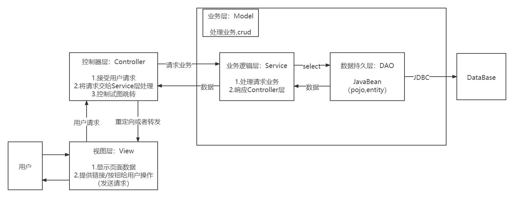

# 过滤器Filter

`Filter`

- 用于过滤网站的数据

  - 垃圾请求
  - 登录验证
  - 乱码问题
  
> 本质也是一个处理的Servlet

## 乱码问题

1. 创建普通Maven项目

2. 右键项目，`Add Framework`

   

3. 选择`Web Application`

   

4. 在`pom.xml`中导入依赖

   ```xml
       <dependencies>
   <!--        JSP依赖-->
           <dependency>
               <groupId>jakarta.servlet.jsp</groupId>
               <artifactId>jakarta.servlet.jsp-api</artifactId>
               <version>3.0.0</version>
           </dependency>
   <!--        Servlet依赖-->
           <dependency>
               <groupId>jakarta.servlet</groupId>
               <artifactId>jakarta.servlet-api</artifactId>
               <version>5.0.0</version>
           </dependency>
   <!--        连接数据库-->
           <dependency>
               <groupId>mysql</groupId>
               <artifactId>mysql-connector-java</artifactId>
               <version>5.1.47</version>
           </dependency>
       </dependencies>
   ```
   
5. 正常解决乱码的方法

   1. 如果有多个servlet，就需要多次重复设置

    ```java
    package com.ink.servlet;
   
    import jakarta.servlet.ServletException;
    import jakarta.servlet.http.HttpServlet;
    import jakarta.servlet.http.HttpServletRequest;
    import jakarta.servlet.http.HttpServletResponse;
   
    import java.io.IOException;
   
    public class ShowServletTest extends HttpServlet {
   
        @Override
        protected void doGet(HttpServletRequest req, HttpServletResponse resp) throws ServletException, IOException {
    //        让servlet用uft-8转码，而不是用默认的ISO8859
    //        resp.setCharacterEncoding("utf-8");
    //        让浏览器用utf-8来解析返回的数据
            resp.setHeader("Content-type", "text/html;charset=UTF-8");
            resp.getWriter().write("中文直接展示，会乱码");
        }
   
        @Override
        protected void doPost(HttpServletRequest req, HttpServletResponse resp) throws ServletException, IOException {
            doGet(req, resp);
        }
    }
    ```

    > 1. response响应返回有两种
    >    1. 字节流`outputstream`
    >       1. 要输出中文，给输出流的必须是转换为utf-8的中文
    >       2. 告诉浏览器用utf8来解析数据
    >    2. 字符流`printwrite`
    >       1. 要输出中文，要设置`resp.setCharacterEncoding("UTF-8");`
    > 2. 如果中文出现`？`字符，应该是没有加`resp.setCharacterEncoding("UTF-8");`
    > 3. 如果中文是`烇湫锛屼細涔辩爜`乱码，说明是浏览器的解析问题，应该是否没有加`resp.setHeader("Content-type", "text/html;charset=UTF-8");`这句话。

8. 创建`Filter`实现类，实现`jakarta.servlet.Filter`接口（还有别的`Filter`接口，不能实现错了）

6. 重写方法

   1. `Chain`：链
   2. 有可能有多个不同功能的过滤器
   3. `Filter`中的所有代码，在过滤特定请求的时候都会执行
   4. 在过滤器中处理代码后要执行`filterChain.doFilter(servletRequest,servletResponse);`把请求转交下去 
   
   ```java
   package com.ink.filter;
   
   import jakarta.servlet.*;
   
   import java.io.IOException;
   
   public class CharacterEncodingFilterTest implements Filter {
   //    初始化
       @Override
       public void init(FilterConfig filterConfig) throws ServletException {
           System.out.println("filter初始化");
       }
   
       @Override
       public void doFilter(ServletRequest servletRequest, ServletResponse servletResponse, FilterChain filterChain) throws IOException, ServletException {
           servletRequest.setCharacterEncoding("utf-8");
           servletResponse.setCharacterEncoding("utf-8");
           servletResponse.setContentType("text/html;charset=UTF-8");
           System.out.println("CharacterEncodingFilterTest执行前");
   //        Chain：链
   //        执行doFilter让请求继续走，否则请求就会停在filter这里
           filterChain.doFilter(servletRequest,servletResponse);
           System.out.println("CharacterEncodingFilterTest执行后");
       }
   
   
   //    销毁
       @Override
       public void destroy() {
           System.out.println("filter销毁");
       }
   }
   
   ```
   
8. 配置

   1. 走`/servlet/show`的请求会经过过滤器，处理乱码问题
   2. 走`/show`的请求不会

   ```xml
   <?xml version="1.0" encoding="UTF-8"?>
   <web-app xmlns="https://jakarta.ee/xml/ns/jakartaee"
            xmlns:xsi="http://www.w3.org/2001/XMLSchema-instance"
            xsi:schemaLocation="https://jakarta.ee/xml/ns/jakartaee https://jakarta.ee/xml/ns/jakartaee/web-app_5_0.xsd"
            version="5.0">
   
       <servlet>
           <servlet-name>show</servlet-name>
           <servlet-class>com.ink.servlet.ShowServletTest</servlet-class>
       </servlet>
   <!--    配置两个路径-->
       <servlet-mapping>
           <servlet-name>show</servlet-name>
           <url-pattern>/servlet/show</url-pattern>
       </servlet-mapping>
       <servlet-mapping>
           <servlet-name>show</servlet-name>
           <url-pattern>/show</url-pattern>
       </servlet-mapping>
   
       <filter>
           <filter-name>CharacterEncodingFilter</filter-name>
           <filter-class>com.ink.filter.CharacterEncodingFilterTest</filter-class>
       </filter>
       <filter-mapping>
           <filter-name>CharacterEncodingFilter</filter-name>
   <!--        只要是 /servlet的任何请求，会经过这个过滤器-->
           <url-pattern>/servlet/*</url-pattern>
   <!--        整个网站都会经过过滤器-->
           <!--<url-pattern>/*</url-pattern>-->
       </filter-mapping>
   
   </web-app>
   ```


## Filter生命周期

- `Filter`初始化
  - web服务器启动时初始化过滤器，等待过滤请求出现

- `Filter`销毁
  - web服务器关闭的时候，销毁过滤器


## 权限拦截

用户登录后才能进入主页，用户注销后不能进入主页

1. 用户登录之后，在Session中放入用户信息
2. 进入主页的时候要判断用户是否已经登录
   1. 过滤器中实现
3. 用户注销后，删除Session中用于判断的用户信息
   1. 不要销毁Session

**实现**

1. 在`webapp`目录下创建`login.jsp`登陆页面

    ```jsp
    <%@ page contentType="text/html;charset=UTF-8" language="java" %>
    <html>
    <head>
        <title>Login</title>
    </head>
    <body>
    <h1>登录</h1>
    <form action="/login" method="post">
        <input type="text" name="username">
        <input type="submit">
    </form>
    </body>
    </html>
    ```
    
2. 实现`/login`对应的Servlet并在`web.xml`中配置

    ```java
    package com.ink.filter;
    
    import jakarta.servlet.ServletException;
    import jakarta.servlet.http.HttpServlet;
    import jakarta.servlet.http.HttpServletRequest;
    import jakarta.servlet.http.HttpServletResponse;
    
    import java.io.IOException;
    
    public class LoginTest extends HttpServlet {
        @Override
        protected void doGet(HttpServletRequest req, HttpServletResponse resp) throws ServletException, IOException {
    //        获取参数
            String username = req.getParameter("username");
            if("admin".equals(username)){
    //            登陆成功，存入用户信息到session，用于判断
                req.getSession().setAttribute("USER_SESSION", req.getSession().getId());
    //            重定向到主页
                resp.sendRedirect("/sys/success.jsp");
            }
            else{
    //            登陆失败
                resp.sendRedirect("/error.jsp");
            }
        }
    
        @Override
        protected void doPost(HttpServletRequest req, HttpServletResponse resp) throws ServletException, IOException {
            doGet(req, resp);
        }
    }
    ```

    ```xml
    <servlet>
      <servlet-name>login</servlet-name>
      <servlet-class>com.ink.filter.LoginTest</servlet-class>
    </servlet>
    <servlet-mapping>
      <servlet-name>login</servlet-name>
      <url-pattern>/login</url-pattern>
    </servlet-mapping>
    ```

3. 在`webapp`目录下创建`sys`目录，创建`success.jsp`作为登录成功进入的页面

    ```jsp
    <%@ page contentType="text/html;charset=UTF-8" language="java" %>
    <html>
    <head>
        <title>success</title>
    </head>
    <body>
    <h1>登录成功，进入主页</h1>
    <a href="/loginout">注销</a>
    </body>
    </html>
    ```
    
4. 在`webapp`目录下创建`error.jsp`作为登录失败进入的错误页面

    ```jsp
    <%@ page contentType="text/html;charset=UTF-8" language="java" %>
    <html>
    <head>
    <title>error</title>
    </head>
    <body>
    <h1>错误</h1>
    <h2>用户名错误</h2>
    <a href="/loginout">返回登录页面</a>
    </body>
    </html>
    ```

5. 实现`/loginout`对应的注销功能的Servlet并在`web.xml`中配置

    > 不要去销毁Session，将Session中的用户信息删除即可

    ```java
    package com.ink.filter;
    
    import jakarta.servlet.ServletException;
    import jakarta.servlet.http.HttpServlet;
    import jakarta.servlet.http.HttpServletRequest;
    import jakarta.servlet.http.HttpServletResponse;
    
    import java.io.IOException;
    
    public class LoginOutTest extends HttpServlet {
        @Override
        protected void doGet(HttpServletRequest req, HttpServletResponse resp) throws ServletException, IOException {
            req.getSession().removeAttribute("USER_SESSION");
            resp.sendRedirect("/login.jsp");
        }
    
        @Override
        protected void doPost(HttpServletRequest req, HttpServletResponse resp) throws ServletException, IOException {
            doGet(req, resp);
        }
    }
    ```

    ```xml
    <servlet>
      <servlet-name>loginout</servlet-name>
      <servlet-class>com.ink.filter.LoginOutTest</servlet-class>
    </servlet>
    <servlet-mapping>
      <servlet-name>loginout</servlet-name>
      <url-pattern>/loginout</url-pattern>
    </servlet-mapping>
    ```


**存在问题**

- 不登陆，直接访问http://localhost:8080/sys/success.jsp也可以进入
- 需要设置权限

**解决方法**

1. 在`success.jsp`中添加判断

   如果Session中没有对应的用户信息，就会自动跳转到`login.jsp`登录页面

   ```jsp
   <%@ page contentType="text/html;charset=UTF-8" language="java" %>
   <html>
   <head>
       <title>success</title>
   </head>
   <body>
   
   <%
   
       Object userSession = request.getSession().getAttribute("USER_SESSION");
       if(userSession == null){
           response.sendRedirect("/login.jsp");
       }
   
   %>
   <h1>登录成功，进入主页</h1>
   <a href="/loginout">注销</a>
   </body>
   </html>
   ```

2. 由过滤器Filter判断

   ```java
   package com.ink.filter;
   
   import jakarta.servlet.*;
   import jakarta.servlet.http.HttpServletRequest;
   import jakarta.servlet.http.HttpServletResponse;
   
   import java.io.IOException;
   
   public class SysFilterTest implements Filter {
       @Override
       public void init(FilterConfig filterConfig) throws ServletException {
       }
   
       @Override
       public void doFilter(ServletRequest servletRequest, ServletResponse servletResponse, FilterChain filterChain) throws IOException, ServletException {
   
   //        servletRequest不是HttpServletRequest，没有getSession()方法，需要转换
           HttpServletRequest req = (HttpServletRequest) servletRequest;
           HttpServletResponse resp = (HttpServletResponse) servletResponse;
           Object userSession = req.getSession().getAttribute("USER_SESSION");
           if(userSession == null){
               resp.sendRedirect("/error.jsp");
           }
   
   //        继续转发请求
           filterChain.doFilter(servletRequest,servletResponse);
       }
   
       @Override
       public void destroy() {
       }
   }
   ```

3. 在web.xml中配置filter

   > 过滤`/sys`下的所有请求

   ```xml
   <filter>
     <filter-name>sysfilter</filter-name>
     <filter-class>com.ink.filter.SysFilterTest</filter-class>
   </filter>
   <filter-mapping>
     <filter-name>sysfilter</filter-name>
     <url-pattern>/sys/*</url-pattern>
   </filter-mapping>
   ```


# 监听器Listener

## 统计Session

1. 实现监听器的接口，监听Session

   > Session销毁
   >
   > - 手动销毁  
   >   - `getSession().invalidate();`  
   > - 自动销毁 
   >   - `web.xml`中配置

   ```java
   package com.ink.listener;
   
   import jakarta.servlet.ServletContext;
   import jakarta.servlet.http.HttpSessionEvent;
   import jakarta.servlet.http.HttpSessionListener;
   
   public class ListenerTest implements HttpSessionListener {
   //    一旦创建Session就会触发一次这个事件
       @Override
       public void sessionCreated(HttpSessionEvent se) {
   //        获取ServletContex
           ServletContext ctx = se.getSession().getServletContext();
           System.out.println(se.getSession().getId());
           Integer onlineCount = (Integer) ctx.getAttribute("OnlineCount");
   
           if(onlineCount == null){
               onlineCount = 1;
           }
           else{
               onlineCount++;
           }
           ctx.setAttribute("OnlineCount",onlineCount);
       }
   
   //    一旦销毁Session就会触发一次这个事件
       @Override
       public void sessionDestroyed(HttpSessionEvent se) {
           ServletContext ctx = se.getSession().getServletContext();
           Integer onlineCount = (Integer) ctx.getAttribute("OnlineCount");
           if(onlineCount==null){
               onlineCount = 0;
           }
           else{
               onlineCount--;
           }
           ctx.setAttribute("OnlineCount",onlineCount);
       }
   }
   
   ```

2. 注册监听器

   ```xml
   <!--  注册监听器-->
     <listener>
       <listener-class>com.ink.listener.ListenerTest</listener-class>
     </listener>
   ```

3. 在index.jsp中展示

   ```jsp
   <%@ page contentType="text/html;charset=utf-8" language="java" %>
   <html>
   <body>
       <h1>当前有<span><%=request.getServletContext().getAttribute("OnlineCount")%></span>人在线</h1>
   </body>
   </html>
   ```


# JDBC

Java Data Base Connectivity：Java连接数据库

- Java编程语言和广泛的数据库之间**独立于数据库的连接标准**的Java API
- JDBC是一种规范，它提供一套完整的的接口，允许便捷式访问底层数据库
- 用Java写的不同类型的可执行文件都能通过JDBC访问数据库，又兼备存储的优势
- Java与数据库的连接的桥梁，用Java代码就能操作数据库的增删改查、存储过程、事务等

> 数据库是由不同生产产商决定的（如Mysql、Oracle、SQL Server），Java具备天生跨平台的优势，它提供了JDBC的接口API，具体的实现由不同的生产产商决定。数据库产商都根据Java API去实现各自的应用驱动


## 配置环境

### 数据库依赖

jar包

- mysql-conneter-java连接驱动（必须要导入）

`pom.xml`

```xml
    <dependencies>
<!--        mysql驱动-->
        <dependency>
            <groupId>mysql</groupId>
            <artifactId>mysql-connector-java</artifactId>
            <version>5.1.47</version>
        </dependency>
    </dependencies>
```


### 创建数据库

- varchar数据和date数据都需要加`' '`

```sql
CREATE TABLE users(
    id INT PRIMARY KEY,
    `name` VARCHAR(40),
    `password` VARCHAR(40),
    email VARCHAR(60),
    birthday DATE
);

INSERT INTO users(id,`name`,`password`,email,birthday)
VALUES(1,'张三','123456','zs@qq.com','2000-01-01');

INSERT INTO users(id,`name`,`password`,email,birthday)
VALUES(2,'李四','123456','ls@qq.com','2000-01-01');

INSERT INTO users(id,`name`,`password`,email,birthday)
VALUES(3,'王五','123456','ww@qq.com','2000-01-01');
```


### 使用idea连接数据库


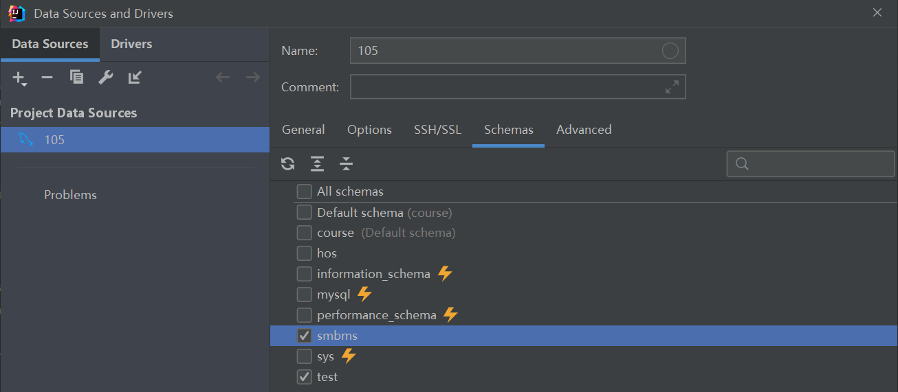


## jdbc url

协议名 + 子协议名 + 数据源名

- 协议名：`jdbc`	
- 子协议名：数据库类型协议
  - oracle
  - mysql

- 数据源名：数据库名，用户等信息

> `url：jdbc:mysql://10.2.14.105:3305`
>
> `jdbc:mysql://[host:port],[host:port].../[database][?key1][=value1][&key2][=value2]...`
>
> MySQL8.0+版本需要设置时区

##  jdbc连接数据库

**步骤**

1. 加载驱动
   1. 在右侧`External Libraries`中的`mysql`包中`com.mysql.jdbc`中的`Driver.class`
2. 连接数据库，获取数据库对象
   1. `connection`代表数据库
3. 向数据库发送SQL的对象
   1. `statement`不安全，可能会发生sql注入
   2. `prepareStatement`是安全的对象
4. 编写SQL
   1. `statement.executeQuery(sql)`用于查
      1. 返回ResultSet结果集
   2. `statement.executeUpdate()`用于增删改
      1. 返回int，是表中受影响的行数
5. 执行SQL
6. 关闭连接

> 前2个都是默认统一的步骤，可以被抽取出来

`statement`

```java
package com.ink.jdbc;

import java.sql.*;

public class JdbcTest {
    public static void main(String[] args) throws ClassNotFoundException, SQLException {
//        配置信息
//        解决乱码问题
        String url = "jdbc:mysql://10.2.14.105:3305/test?useUnicode=true&characterEncoding=utf-8&useSSL=false";
        String username = "root";
        String password = "1";

//        加载驱动
//        驱动通过反射获取
        Class.forName("com.mysql.jdbc.Driver");
//        连接数据库，connection就代表数据库
        Connection connection = DriverManager.getConnection(url, username, password);
//       statement是向数据库发送sql的对象，用于crud
//       不安全，可能会发生sql注入
        Statement statement = connection.createStatement();
//        编写sql
        String sql = "select * from users;";
//        执行sql，返回结果集
        ResultSet rs = statement.executeQuery(sql);
        while(rs.next()){
            System.out.println("id=" + rs.getObject("id"));
            System.out.println("name=" + rs.getObject("name"));
            System.out.println("password=" + rs.getObject("password"));
            System.out.println("email=" + rs.getObject("email"));
            System.out.println("birthday=" + rs.getObject("birthday"));
        }
//        关闭连接，先开的后关
        rs.close();
        statement.close();
        connection.close();
    }
}
```

 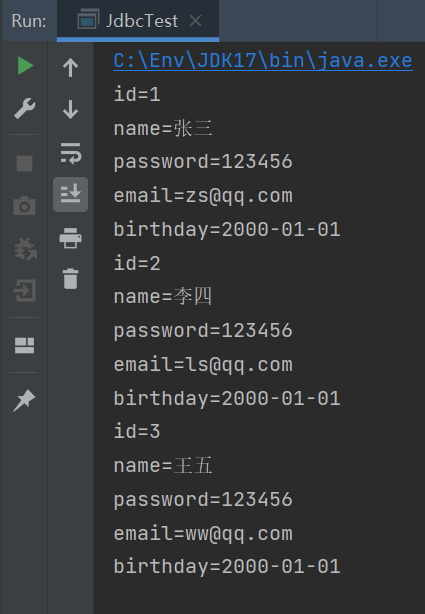

> 出现问题
>
> - `Thu Oct 28 20:52:04 CST 2021 WARN: Establishing SSL connection without server's identity verification is not recommended. According to MySQL 5.5.45+, 5.6.26+ and 5.7.6+ requirements SSL connection must be established by default if explicit option isn't set. For compliance with existing applications not using SSL the verifyServerCertificate property is set to 'false'. You need either to explicitly disable SSL by setting useSSL=false, or set useSSL=true and provide truststore for server certificate verification.`
>   `Exception in thread "main" com.mysql.jdbc.exceptions.jdbc4.CommunicationsException: Communications link failure`
>
> 解决方法
>
> - 在url后加上`&useSSL=false`

`prepareStatement`

```java
package com.ink.jdbc;

import java.sql.*;

public class PrepareTest {
    public static void main(String[] args) throws ClassNotFoundException, SQLException {
//        配置信息
//        解决乱码问题
        String url = "jdbc:mysql://10.2.14.105:3305/test?useUnicode=true&characterEncoding=utf-8&useSSL=false";
        String username = "root";
        String password = "1";

//        加载驱动
//        驱动通过反射获取
        Class.forName("com.mysql.jdbc.Driver");
//        连接数据库，connection就代表数据库
        Connection connection = DriverManager.getConnection(url, username, password);
//        先编写sql
        String sql = "insert into users (id,name,password,email,birthday) values (?,?,?,?,?);";
//        预编译sql
        PreparedStatement preparedStatement = connection.prepareStatement(sql);
//        编译完后对具体字段赋值
//        第一个占位符
        preparedStatement.setInt(1,5);
//        第二个占位符
        preparedStatement.setString(2,"赵信");
        preparedStatement.setString(3,"123456");
        preparedStatement.setString(4,"111@qq.com");
//        外面的Date是sql包下的,里面的Date是util包下的
        preparedStatement.setDate(5,new Date(new java.util.Date().getTime()));

//        执行sql，返回表中被影响的行数
        int i = preparedStatement.executeUpdate();
        System.out.println(i);
        if(i > 0){
            System.out.println("插入成功");
        }
//        关闭连接
        preparedStatement.close();
        connection.close();
    }
}
```

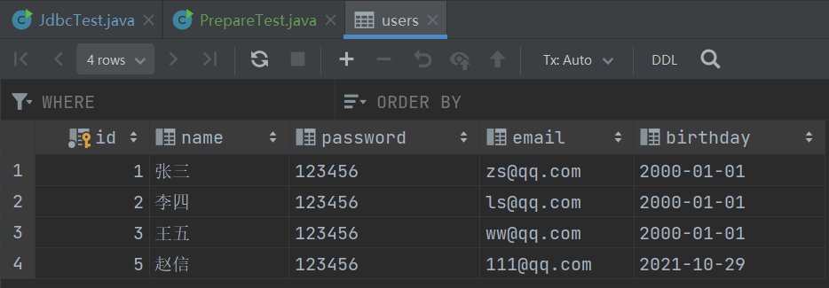


## 事务

> 没commit前可以使用rollback回滚，commit提交后则无法回滚

```sql
# 开启事务
start transaction;

update account set money=money-100 where name = 'A';
update account set money=money+100 where name = 'B';

commit;
```

### 添加junit依赖

```xml
<dependency>
    <groupId>junit</groupId>
    <artifactId>junit</artifactId>
    <version>4.12</version>
</dependency>
```

存在错误时

```java
package com.ink.jdbc;

import org.junit.Test;

import java.sql.*;

public class TransactionTest {
    @Test
    public void test(){
        String url = "jdbc:mysql://10.2.14.105:3305/test?useUnicode=true&characterEncoding=utf-8&useSSL=false";
        String username = "root";
        String password = "1";

        Connection connection = null;
        try {
            Class.forName("com.mysql.jdbc.Driver");
            connection = DriverManager.getConnection(url, username, password);

//            通知数据库,开启事务,false是开启,true是关闭
            connection.setAutoCommit(false);

            String sql1 = "update account set money=money-100 where name = 'A';";
            connection.prepareStatement(sql1).executeUpdate();

//            制造错误,让后续不能执行
            int i = 1/0;

            String sql2 = "update account set money=money+100 where name = 'B';";
            connection.prepareStatement(sql2).executeUpdate();

//            两条sql都执行成功就提交事务
            connection.commit();
            System.out.println("提交成功");
        } catch (Exception e) {
//            如果有异常,通知数据库回滚
            try {
                connection.rollback();
            } catch (SQLException ex) {
                ex.printStackTrace();
            }
        } finally {
            try {
                connection.close();
            } catch (SQLException e) {
                e.printStackTrace();
            }
        }
    }
}
```

正确执行

```java
package com.ink.jdbc;

import org.junit.Test;

import java.sql.*;

public class TransactionTest {
    @Test
    public void test(){
        String url = "jdbc:mysql://10.2.14.105:3305/test?useUnicode=true&characterEncoding=utf-8&useSSL=false";
        String username = "root";
        String password = "1";

        Connection connection = null;
        try {
            Class.forName("com.mysql.jdbc.Driver");
            connection = DriverManager.getConnection(url, username, password);

//            通知数据库,开启事务,false是开启,true是关闭
            connection.setAutoCommit(false);

            String sql1 = "update account set money=money-100 where name = 'A';";
            connection.prepareStatement(sql1).executeUpdate();


            String sql2 = "update account set money=money+100 where name = 'B';";
            connection.prepareStatement(sql2).executeUpdate();

//            两条sql都执行成功就提交事务
            connection.commit();
            System.out.println("提交成功");
        } catch (Exception e) {
//            如果有异常,通知数据库回滚
            try {
                connection.rollback();
            } catch (SQLException ex) {
                ex.printStackTrace();
            }
        } finally {
            try {
                connection.close();
            } catch (SQLException e) {
                e.printStackTrace();
            }
        }
    }
}
```


# SMBMS

## 搭建项目

1. 创建Maven模板项目

2. 删除`pom.xml`无用信息，只保留gav和打包方式

   ```xml
   <?xml version="1.0" encoding="UTF-8"?>
   
   <project xmlns="http://maven.apache.org/POM/4.0.0" xmlns:xsi="http://www.w3.org/2001/XMLSchema-instance"
     xsi:schemaLocation="http://maven.apache.org/POM/4.0.0 http://maven.apache.org/xsd/maven-4.0.0.xsd">
     <modelVersion>4.0.0</modelVersion>
   
     <groupId>com.ink</groupId>
     <artifactId>smbms</artifactId>
     <version>1.0-SNAPSHOT</version>
     <packaging>war</packaging>
   </project>
   ```

3. 修改`web.xml`

   ```xml
   <?xml version="1.0" encoding="UTF-8"?>
   <web-app xmlns="https://jakarta.ee/xml/ns/jakartaee"
            xmlns:xsi="http://www.w3.org/2001/XMLSchema-instance"
            xsi:schemaLocation="https://jakarta.ee/xml/ns/jakartaee https://jakarta.ee/xml/ns/jakartaee/web-app_5_0.xsd"
            version="5.0">
   
   </web-app>
   ```

4. 创建`java`目录和`resource`目录并标记为对应文件夹

5. 配置tomcat，路径设置为`/smbms`

6. 测试是否正常运行

7. 导入项目中需要的jar包

   1. jsp
   2. Servlet
   3. mysql驱动

   ```xml
   <dependencies>
     <dependency>
       <groupId>jakarta.servlet.jsp</groupId>
       <artifactId>jakarta.servlet.jsp-api</artifactId>
       <version>3.0.0</version>
       <scope>provided</scope>
     </dependency>
     <dependency>
       <groupId>jakarta.servlet</groupId>
       <artifactId>jakarta.servlet-api</artifactId>
       <version>5.0.0</version>
       <scope>provided</scope>
     </dependency>
     <dependency>
       <groupId>mysql</groupId>
       <artifactId>mysql-connector-java</artifactId>
       <version>5.1.47</version>
     </dependency>
   </dependencies>
   ```

## 创建项目结构

创建package：`com.ink`

1. 创建实体类层：`com.ink.pojo`
2. 创建DAO层：`com.ink.dao`
3. 创建Service层：`com.ink.service`
4. 创建Servlet层：`com.ink.servlet`
5. 创建过滤器层：`com.ink.filter`
6. 创建工具类层：`com.ink.util`


## 连接数据库

在`pojo`目录下创建对应数据库表的实体类

使用idea一键生成

1. `File-Project Structure-Modules`，点击加号，选择JPA

   

2. `View-Tool Windows`，点击`Persistence`

   

3. 选择`Generate Persistence Mapping-By Database Schema`

   

4. 选择数据库，选择实体类生成的项目路径（包），勾选要生成实体的表和字段

   

