# 多线程

# 常用类

## String类

**不可变的字符序列**

Java程序中所有的**字符串**的字面值都是`String`类的一个实例

- `String`是一个`final`类，它无法被继承
- `String`对象的字符内容存储在一个字符数组`value[]`中（`private final`类型的数组）
- `String`实现了`Serializable`接口，表示字符串是可以序列化的（IO流）
- `String`实现了`Comparable`接口，表示字符串是可以比较大小
- 字符串是**常量**，创建后**不能更改**
  - 当对字符串重新**赋值**时，需要重新指定内存区域
  - 当对字符串进行**拼接**时，需要重新指定内存区域
  - 当对字符串进行**替换**时，需要重新指定内存区域

> 方法区中包含字符串常量池，常量池不会存储相同内容的字符串

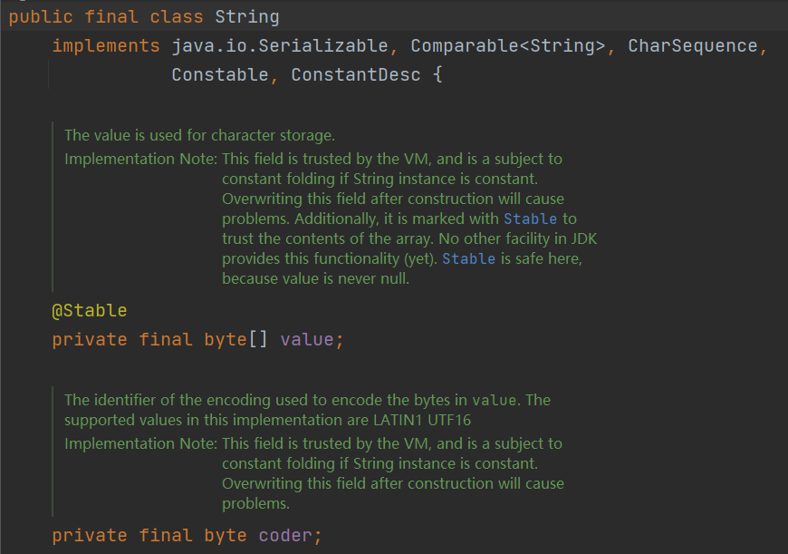


### 字符串修改

**值传递**：引用数据类型传递的是地址值

- `str`将自己指向的地址传递给了`change`方法。`str`有不可变性，所以`str`不会变
- `ch`指向堆中的一片区域，可以在方法中改变

```java
package com.ink.String;

public class Test {
    String str = new String("good");
    char[] ch = {'t','e','s','t'};
    public void change(String str,char[] ch){
        str = "ok";
        ch[0] = 'b';
    }
    public static void main(String[] args) {
        Test ex = new Test();
        ex.change(ex.str,ex.ch);
        System.out.println(ex.str + "and" + ex.ch);
    }
}
```

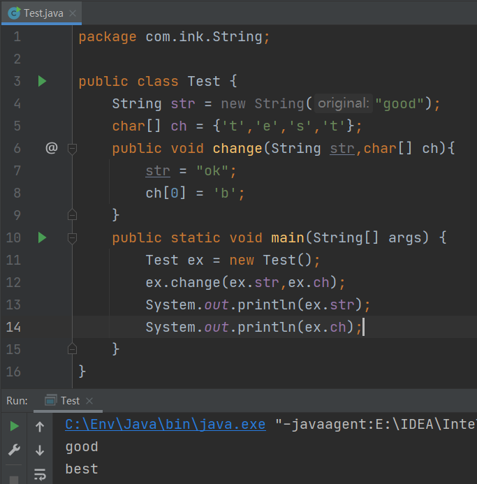

> 如果将 `str = "ok";`改为`this. str = "ok";`就会一起改变！


### 字符串实例化方法

- **字面量定义**

  - 字符串常量**存储在常量池**中共享

- **`new`+构造器**

  - 字符串**非常量对象存储在堆中**，保存堆空间地址，由**堆中的对象指向常量池**

    > 相当于创建了两个对象，一个是堆中的`new`结构，一个是`char[]`对应的常量池中的数据

```java
package com.ink.String;

import java.util.Arrays;

public class Astring {
    // 常量池声明
    String str = "abc";
    
    //  this.value = new char[0];
    String s1 = new String();
    
    // this.value = original.value;
    String s2 = new String(String original);
    
    // this.value = ArrayscopyOf(value,value.length);
    String s3 = new String(char[] s);
    
    String s4 = new String(char[] s, int startIndex, int count);

}
```


### 字符串比较

- `==`：比较字符串的**地址值**
- `equals`：比较字符串的**内容**，`String`类重写了`equals`方法


### 字符串拼接

- **字面量**值拼接

  常量和常量的拼接结果在常量池中

- 存在**变量**参与拼接

  只要存在一个变量，结果就在堆中

  > `final`定义的变量是常量！拼接结果在常量池中

```java
package com.ink.String;

public class Astring {
    public static void main(String[] args) {
        String s1 = "abc";
        String s2 = "def";
        String s3 = "abcdef";
        String s4 = s1 + "def";
        String s5 = "abc" + s2;
        String s6 = "abc" + "def";
        System.out.println(s3 == s4);
        System.out.println(s3 == s5);
        System.out.println(s3 == s6);
        System.out.println(s4 == s6);
        String s7 = s5.intern();
        System.out.println(s3 == s7);
    }
}
```


如果拼接结果调用`intern()`方法，**返回值在常量池中**

```java
// true
String s7 = s5.intern();
System.out.println(s3 == s7);
```


### 常用方法

- `int length()`：返回字符串长度
- `char charAt(int index)`：返回索引处的字符
- `boolean isEmpty()`：判断字符串是否为空
- `String toLowerCase()`：将字符串中所有字符转换为小写
- `String toUpperCase()`：将字符串中所有字符转换为大写
- `String trim()`：返回字符串的副本，忽略**所有前导空格和尾部空格**（中间的空格不变）
- `boolean equals(Object obj)`：比较字符串内容是否相同
- `boolean equalsIgnoreCase(Object obj)`：忽略大小写，比较字符串内容是否相同
- `String concat(String str)`：将字符串连接到此字符串的尾部，**等价于"+"**
- `int compareTo(String anotherString)`：比较两个字符串的大小（`Comparable`接口中的抽象方法）
- `String substring(int beginIndex)`：从此字符串的beginIndex开始，返回一个新字符串
- `String substring(int beginIndex,int endIndex)`：从此字符串的beginIndex开始，endIndex结束，返回一个新字符串
- `boolean contains(CharSequence s)`：当且仅当此字符串包含指定的char值序列时，返回true
- `String replace(char oldChar,char newChar)`：用新的字符替换字符串中**所有的旧字符**，返回新的字符串
- `String replace(CharSequence target,CharSequence replacement)`：用指定的字面值替换字符串中所有匹配字面值的子字符串，返回新的字符串
- `String split(String regex)`：根据给定的**正则表达式**的匹配拆分字符串


### 类型转换

String类和**其他结构**之间的转换

> 只有子父类**继承关系**的类型才可以强制类型转换


**String转换为基本数据类型（包装类）**

调用包装类的**静态方法**：`Integer.parseInt(str)`


**基本数据类型（包装类）转换为String**

调用String重载的`valueOf()`方法：`String.valueOf(num)`

也可以直接**拼接**：`num + ""`

> 拼接的字符串在堆中（有变量），不在常量池中


**String转换为字符数组（char[]）**

> String的底层就是一个char[]

调用String的`toCharArray()`方法


**字符数组（char[]）转换为String**

调用String的**构造器**即可：`new String(char[])`


**String转换为字节数组（byte[]）**

调用String的`getBytes()`方法（默认的字符编码集）

`getBytes(charsetName)`：指定字符编码集

> UTF-8下，一个汉字三个字节
>
> GBK下，一个汉字两个字节


**字节数组（byte[]）转换为String**

调用String的**构造器**即可：`new String(byte[])`


## StringBuffer类

- **可变的字符序列**
- **线程安全的**
- **效率低**

`StringBuffer`对象的字符内容存储在一个字符数组`value[]`中（没有`final`修饰，可变）


### StringBuffer源码

1. **无参构造**

   无参的构造器会初始化**长度为16**的char数组

   

2. **有参构造**

   有参的构造器会初始化**长度为参数长度+16**的char数组

   

3. **字符串长度**

   `.length()`方法还是返回**实际长度**（`.append()`就+1），而不是`value.length`

   

4. **数组扩容**

   1. 调用的是超类的`append()`方法

      .png)

   2. 超类的`append()`方法

      判断已有长度和添加的长度和是否超过数组长度

      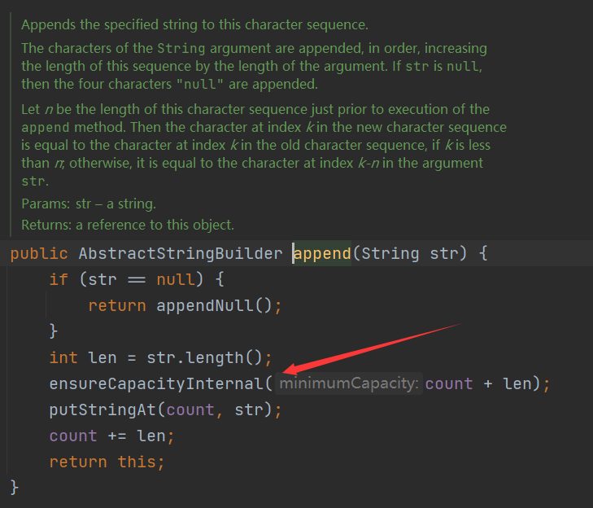

   3. 如果超过数组长度，调用`copyOf()`方法**复制数据**

      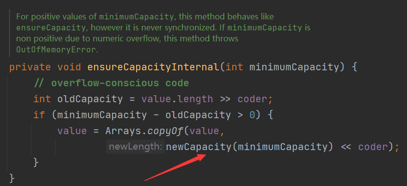

   4. 在创建新的数组时候扩容

      默认情况是`(old.length << 1)+2`

      > 会有**特殊情况**，比如扩容后还是不够，或者超过最大长度...

      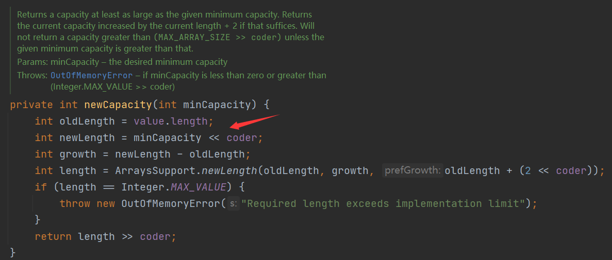

   

   

   

### StringBuffer方法

查看StringBuffer的所有方法

**快捷键**：ctrl+F12


- `StringBuidler append(obj)`：字符串拼接
- `StringBuffer delete(int start,int end)`：删除指定位置内容
- `StringBuffer replace(int start,int end,String str)`：把**[start,end)**位置的内容替换为str
- `StringBuffer insert(int offset,obj)`：字符插入
- `StringBuffer reverse()`：反转字符串

调用`append()`和`insert()`时，如果原来的数组长度不够，可以扩容

> `append(null)`会将null转换为**"null"字符串**添加进去
>
> 如果将null作为构造器参数，则会抛**空指针异常**


**这些方法支持方法链操作**

**方法链**

可以...一直调用（**返回this**）

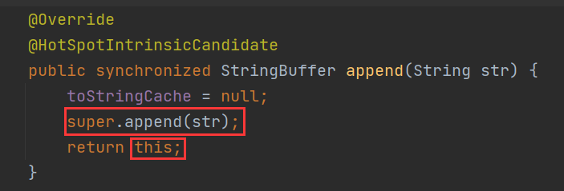


## StringBuidler类

- **可变的字符序列**
- **线程不安全的，效率高**

> JDK5.0新增
>
> 不涉及线程的时候（不考虑线程安全时），优先使用

`StringBuidler`对象的字符内容存储在一个字符数组`value[]`中（没有`final`修饰，可变）


**效率**：**StringBuidler > StringBuidler > String**


## System类

`java.lang.System`

> JDK8之前日期和时间的API

日期方法：返回**时间戳**

`public static long currentTimeMillis()`

返回**当前时间**和1970年1月1日0时0分0秒之间的时间差（以**毫秒**为单位）


## Date类

`java.util.Date`

> JDK8之前的日期时间API
>
> 还有一个`java.sql.Date`类，对应**数据库**中的日期类型变量


### Date构造器

- `Date()`：无参构造器创建一个对应**当前时间**的Date对象

- `Date(long date)`：有参构造器创建一个对应**指定时间**（毫秒数）的Date对象

  > `@Deprecated` ：注解，过时，但还能用

```java
package com.ink.Date;

import java.util.Date;

public class DateTest {
    public static void main(String[] args) {
        Date date1 = new Date();
        System.out.println(date1);
        System.out.println(date1.getTime());
        Date date2 = new Date(1618391227838l);
        System.out.println(date2);
    }
}
```

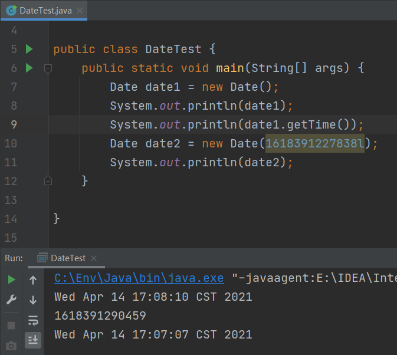


### Date方法

- `getTime()`：返回**当前时间**和1970年1月1日0时0分0秒之间的时间差（以**毫秒**为单位）

- `toString()`

  把Date对象转换为dow month day hour:minute:second zzz year格式

  - dow：day of week
  - zzz：时间标准

  > `Date`类重写了`toString()`方法


## SimpleDateFormat类

`java.text.SimpleDateFormat`

> JDK8之前的日期时间API
>
> Date类的API不易于国际化，大部分都废弃不用了，

`SimpleDateFormat`类是一个用**和语言环境无关的方式**来**格式化和解析**日期的类（对`java.util.Date`类进行操作）

- 无参构造
- 有参构造：`pattern`规定生成日期格式

 

### 日期格式化

**日期 -> 文本（字符串）**

`format()`方法

```java
package com.ink.Date;

import java.text.SimpleDateFormat;
import java.util.Date;
import java.util.SimpleTimeZone;

public class DateTest {
    public static void main(String[] args) {
        Date date1 = new Date();
        System.out.println(date1);
        // 默认构造器
        SimpleDateFormat simpleDateFormat = new SimpleDateFormat();
        String format = simpleDateFormat.format(date1);
        System.out.println(format);
    }
}
```


### 日期解析

**文本（字符串） -> 日期**

> 字符串要求：年-月-日 a/pm hour:minute
>
> 格式化输出的字符串就是默认的形式

`parse()`方法

```java
// 输出Wed Apr 14 17:33:00 CST 2021
String str = "2021/4/14 下午5:33";
try {
    Date parse = simpleDateFormat.parse(str);
    System.out.println(parse);
}catch (ParseException e){
    System.out.println("exception");
}
```


## Calendar类

`Calendar`（日历类）是一个**抽象类**，主要用于完成日期字段之间相互操作的功能。 

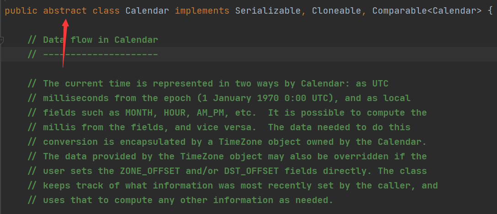

**抽象类不可以实例化**

- 调用它的**子类**：`GregorianCalendar`

- 调用它的**静态方法**：`Calendar.getInstance()`

  调用静态方法返回子类`GregorianCalendar`对象

  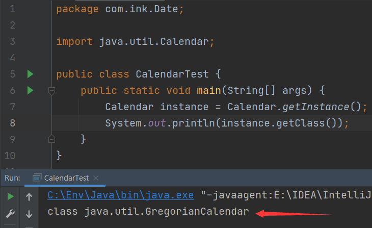


### Calendar方法

一个`Calendar`的实例是系统时间的抽象表示，通过get(int field)方法来取得想要的时间信息，比如YEAR，MONTH，DAT_OF_WEEK，HOUR_OF_DAY，MINUTE，SECOND

> 查看API文档，`Calendar`类中定义了很多常量属性


**对Calendar对象操作**

- `get()`：获得对象本身属性
  - 月份从0开始
  - 星期从周日开始（为1）
- `set()`：void方法，直接修改对象本身属性
- `add()`：void方法，直接修改对象本身属性（减就是加负数）

```java
package com.ink.Date;

import java.util.Calendar;

public class CalendarTest {
    public static void main(String[] args) {
        Calendar instance = Calendar.getInstance();
        System.out.println(instance.getClass());
        int days = instance.get(Calendar.DAY_OF_YEAR);
        System.out.println(days);
        System.out.println(instance.get(Calendar.DAY_OF_YEAR));
        instance.set(Calendar.DAY_OF_YEAR,22);
        System.out.println(instance.get(Calendar.DAY_OF_YEAR));
        instance.add(Calendar.DAY_OF_YEAR,3);
        System.out.println(instance.get(Calendar.DAY_OF_YEAR));
    }
}
```

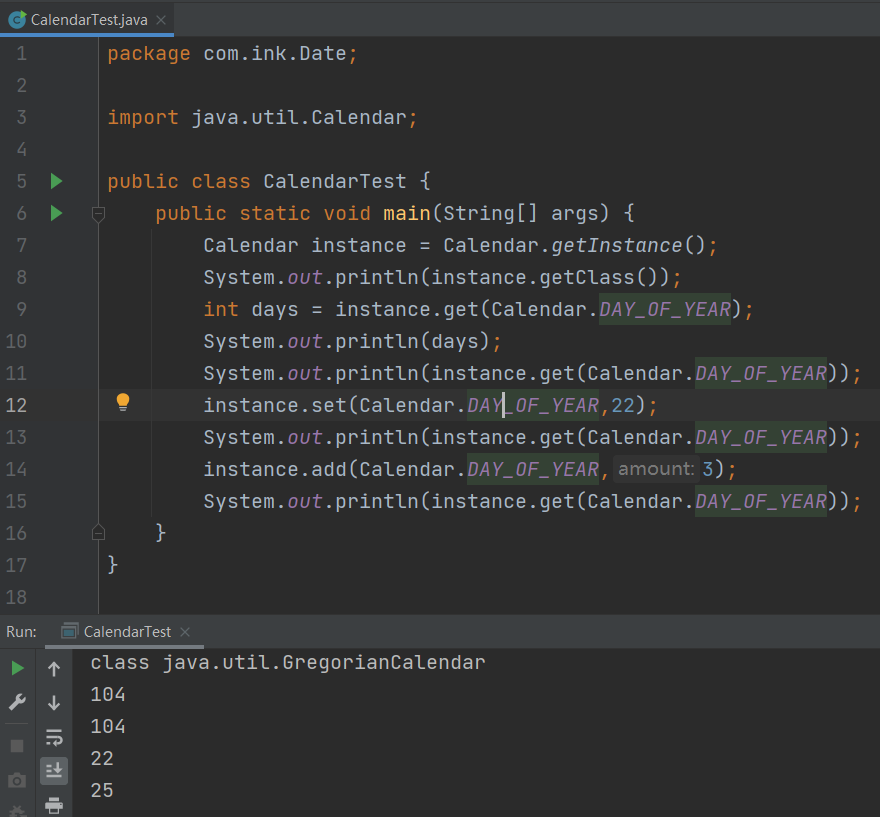


**Calendar和Date转换操作**

- `getTime()`：由`Calendar`类返回`Date`对象
- `setTime()`：由`Date`类返回`Calendar`子类对象

```java
package com.ink.Date;

import java.util.Calendar;
import java.util.Date;

public class CalendarTest {
    public static void main(String[] args) {
        Calendar instance = Calendar.getInstance();
        Date time = instance.getTime();
        System.out.println(time);
        Date date = new Date();
        instance.setTime(date);
        int days = instance.get(Calendar.DAY_OF_YEAR);
        System.out.println(days);
    }
}
```

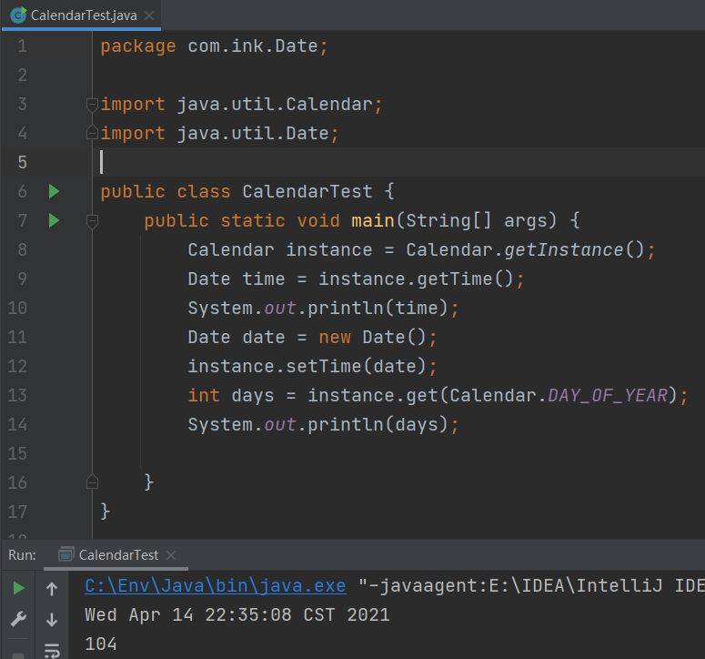


## java.time

`Calendar`类和`Date`类缺点：

- **可变性**：日期应该是不可变的
- **偏移性**：`Date`的年份从1900年开始，月份从0开始（正常表示需要**减去偏移量**）
- **格式化**：格式化只对`Date`有用（`SimpleDateFormat`），对`Calendar`无用
- **线程不安全**
- **无法处理闰秒**

> 对日期和时间的操作一直比较复杂


 JDK8吸收了Joda-Time（jar包），创建了新的API——`java.time`

包含常用包：

- `java.time.format`
- `java.time.temporal`
- `java.time.zone`
- `java.time.chrono`

包含常用类：

- `LocalDate`
- `LocalTime`
- `LocalDateTime`
- `ZonedDateTime`
- `Duration`

```java
package com.ink.Date;


import java.time.LocalDate;
import java.time.LocalDateTime;
import java.time.LocalTime;

public class Time {
    public static void main(String[] args) {
        LocalDate now = LocalDate.now();
        LocalTime now1  = LocalTime.now();
        LocalDateTime now2 = LocalDateTime.now();
        System.out.println(now);
        System.out.println(now1);
        System.out.println(now2);
    }
}
```


## Instant类

时间线上的一个**瞬间时间点**，可能被用来记录程序中的事件事件戳（面向机器）

返回**当前时间**和1970年1月1日0时0分0秒之间的时间差（以**毫秒**为单位）

> 精度可以达到纳秒


## DateTimeFormatter类

`java.time.format.DateTimeFormatter`类，提供三种格式化方法

- **预定义的标准格式**

  > ISO_LOCAL_DATE，ISO_LOCAL_TIME等

- **本地化相关格式**

- **自定义格式**

  `ofPattern()`方法


# 比较器

比较**对象**，实际是比较**对象的属性**

**对象排序**的两种方式（**接口**）

- 自然排序：`java.lang.Comparable`
- 定制排序：`java.util.Comparator`

**对比**：

`Comparable`方式是让对象所属的类去实现接口（作为实现类），对象在任何位置都可以比较大小

`Comparator`方式是临时创建实现类去比较，


## Comparable接口

`java.lang.Comparable`

**`String`，包装类排序**

已经实现了`Comparable`接口，重写了`compareTo(obj)`方法（从小到大排序）


重写`compareTo(obj)`方法规则：

- 当前对象this大于形参obj，返回正整数
- 当前对象this小于形参obj，返回负整数
- 当前对象this等于形参obj，返回0


**自定义类排序**

让它实现`Comparable`接口，重写了`compareTo(obj)`方法，指明排序规则

```java
package com.ink.Compare;

public class Goods implements Comparable{
    private String name;
    private double price;

    public Goods() {
    }

    public Goods(String name, double price) {
        this.name = name;
        this.price = price;
    }

    public String getName() {
        return name;
    }

    public void setName(String name) {
        this.name = name;
    }

    public double getPrice() {
        return price;
    }

    public void setPrice(double price) {
        this.price = price;
    }

    @Override
    public String toString() {
        return "name='" + name + '\'' +
                ", price=" + price + '\n';
    }

    // 按照商品价格从低到高排序
    @Override
    public int compareTo(Object o) {
        if(o instanceof Goods){
            Goods goods = (Goods) o;
            if(this.price > goods.price){
                return 1;
            }else if(this.price < goods.price){
                return -1;
            }else{
                // name是String,已经重写了compareTo()方法
                return this.name.compareTo(goods.name);
            }
        }
        // return Double.compare(this.price,goods.price)
        throw new RuntimeException("传入的数据类型不一致");
    }
}
```

```java
package com.ink.Compare;

import java.util.Arrays;

public class Compare {
    public static void main(String[] args) {
        Goods[] arr = new Goods[6];
        arr[0] = new Goods("12",62);
        arr[1] = new Goods("232",24);
        arr[2] = new Goods("1100",24);
        arr[3] = new Goods("230923",37);
        arr[4] = new Goods("12983138930",37);
        arr[5] = new Goods("92",37);
        Arrays.sort(arr);
        System.out.println(Arrays.toString(arr));
    }
}
```


如果想要利用`String`重写的`compareTo()`方法，但是要从高到低排序

```java
return -this.name.compareTo(goods.name);
```


## Comparator接口

`java.util.Comparator`

- 元素的类型没有实现`java.lang.Comparable`接口且不方便修改代码
- 元素的类型实现了`java.lang.Comparable`接口的排序规则，但是不适合当前操作

可以使用`Comparator`的对象来排序，重写接口中的`compare()`抽象方法

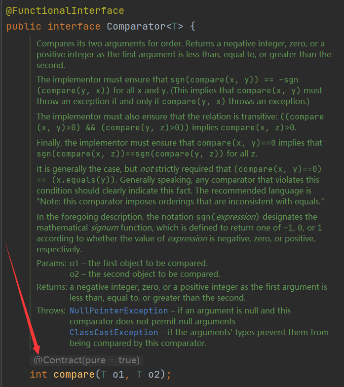

> `<T>`：泛型


重写`compare(Object o1,Object o2)`方法规则

- o1大于o2，返回正整数
- o1小于o2，返回负整数
- o1等于o2，返回0

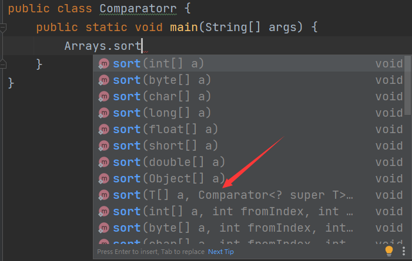

使用**匿名内部类**直接在`Arrays.sort()`中重写

> 看上去`new`一个接口，实际上是匿名实现类

```java
package com.ink.Compare;

import java.util.Arrays;
import java.util.Comparator;

public class Compare {
    public static void main(String[] args) {
        String[] arr = new String[]{"A","B","C","D","E"};
        Arrays.sort(arr, new Comparator<String>() {
            @Override
            public int compare(String o1, String o2) {
                return -o1.compareTo(o2);
            }
        });
        // 输出E,D,C,B,A
        System.out.println(Arrays.toString(arr));
    }
}
```


# 枚举类

类的对象只有**有限个，确定的**（星期，性别，季节）。当需要定义**一组常量**时，建议使用枚举类

如果枚举类中**只有一个对象**，可以作为**单例模式**的实现方式

> 单例模式


## 自定义枚举类

> JDK5.0之前

1. 类的对象的属性都设置为`private final`，final常量需要赋值
   - 显式赋值
   - **构造器赋值**
   - 代码块赋值
2. 私有化类的构造器（否则被外部调用无法确定对象个数）
3. 提供当前枚举类的对象，声明为`public static final`
4. 获取枚举类对象的属性（`get()`方法）
5. 重写`toString()`方法

```java
package com.ink.Enumm;

import javax.swing.*;

public class SeasonTest {
    public static void main(String[] args) {
        Season spring = Season.SPRING;
        // 输出: Season{seasonName='春天', seasonDesc='1'}
        System.out.println(spring);
    }
}
// 自定义枚举类
class Season{
    private final String seasonName;
    private final String seasonDesc;
    private Season(String seasonName,String seasonDesc){
        this.seasonName = seasonName;
        this.seasonDesc = seasonDesc;
    }
    public static final Season SPRING = new Season("春天","1");
    public static final Season SUMMER = new Season("夏天","2");
    public static final Season AUTUMN = new Season("秋天","3");
    public static final Season WINTER = new Season("冬天","4");

    public String getSeasonName() {
        return seasonName;
    }

    public String getSeasonDesc() {
        return seasonDesc;
    }

    @Override
    public String toString() {
        return "Season{" +
                "seasonName='" + seasonName + '\'' +
                ", seasonDesc='" + seasonDesc + '\'' +
                '}';
    }
}
```


## enum关键字

> JDK5.0引入

使用`enum`关键字（不再是`class`）**定义枚举类**（不再需要复杂的声明）

定义的枚举类默认继承`java.lang.Enum`类，默认使用`Enum`类中的`toString()`方法


1. 先写枚举类对象，多个对象用**逗号**隔开，最后一个用分号
2. 私有化类的构造器（否则被外部调用无法确定对象个数）
3. 获取枚举类对象的属性（`get()`方法）

```java
package com.ink.Enumm;

public class EnumTest {
    public static void main(String[] args) {
        Season summer = Season.SUMMER;
        System.out.println(summer);
        System.out.println(Season.class.getSuperclass());
    }
}

enum Season{
    SPRING("春天","1"),
    SUMMER("夏天","2"),
    AUTUMN("秋天","3"),
    WINTER("冬天","4");

    private final String seasonName;
    private final String seasonDesc;

    private Season(String seasonName,String seasonDesc){
        this.seasonName = seasonName;
        this.seasonDesc = seasonDesc;
    }

    public String getSeasonName() {
        return seasonName;
    }

    public String getSeasonDesc() {
        return seasonDesc;
    }
}
```

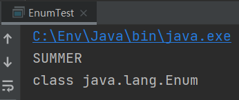


**enum枚举类实现接口**

**每一个枚举类对象都可以实现接口**

```java
package com.ink.Enumm;

public class EnumTest {
    public static void main(String[] args) {
        Season spring = Season.SPRING;
        spring.show();
        Season summer = Season.SUMMER;
        summer.show();
    }
}
interface Info{
    void show();
}
enum Season implements Info{

    SPRING("春天","1"){
        @Override
        public void show() {
            System.out.println("这是春天");
        }
    },
    SUMMER("夏天","2"){
        @Override
        public void show() {
            System.out.println("这是夏天");
        }
    },
    AUTUMN("秋天","3"){
        @Override
        public void show() {
            System.out.println("这是秋天");
        }
    },
    WINTER("冬天","4"){
        @Override
        public void show() {
            System.out.println("这是冬天");
        }
    };

    private final String seasonName;
    private final String seasonDesc;

    private Season(String seasonName,String seasonDesc){
        this.seasonName = seasonName;
        this.seasonDesc = seasonDesc;
    }

    public String getSeasonName() {
        return seasonName;
    }

    public String getSeasonDesc() {
        return seasonDesc;
    }
}
```


## Enum类常用方法

- `values()`：返回枚举类型的**对象数组**

  

- `valueOf(String str)`：将字符串转换为对应的枚举类对象，**要求字符串必须是枚举类对象的"名字"**

  > 如果找不到枚举类对象，会抛异常

  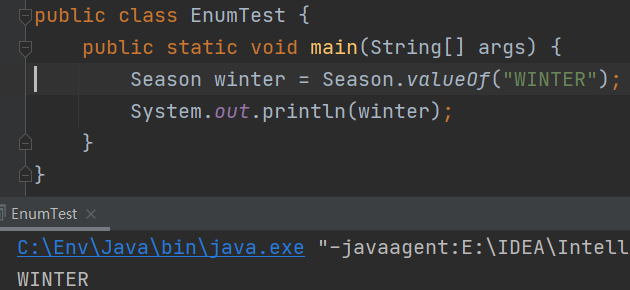

- `toString()`：返回当前枚举类对象**常量的名字**


# 注解

> JDK5.0开始 Java增加了对**元数据**（MetaData）的支持，也就是**注解**（Annotation）
>
> JavaSE的注解使用比较简单，而在JavaEE中注解很重要，比如用来配置应用程序的切面，XML配置等
>
> **框架 = 注解+反射+设计模式**

`Annotation`是代码中的特殊标记，这些标记可以在编译，加载，运行时**被读取并执行**相应处理。

`Annotation`可以像修饰符一样被修饰**包，类，构造器，方法，成员变量，参数，局部变量**。这些信息保存在`Annotation`的`"name = value"`对中

## 常用注解

**生成文档**

- `@author`：多个作者之间使用,分割
- `@version`：标明该类模块的版本
- `@see`：参考转向
- `@since`：从哪个版本开始增加的
- `@param`：对方法中某参数的说明，如果没有参数就不能写
- `@return`：对方法返回值的说明，如果方法的返回值类型是void就不能写
- `@exception`：对方法可能抛出的异常进行说明，如果方法没有用throws显式抛出的异常就不能写

> `@param`，`@return`和`@exception`这三个标记都是只用于方法的。


**在编译时进行格式检查**

> JDK内置的三个基本注解

`@Override`：表明重写父类或接口的方法, 该注解只能用于方法（编译时**校验**是否重写）

`@Deprecated`：表示所修饰的元素(类, 方法等)已过时（过时还是可以用的）

`@SuppressWarnings`：抑制编译器**警告**（含有成员）


**跟踪代码依赖性，实现替代配置文件功能**

Servlet3.0提供了注解(annotation)，使得不再需要在web.xml文件中进行Servlet的部署


**spring框架中关于事务的管理**


## 自定义注解

`@interface`

- 使用`@interface`关键字自定义Annotation类型（加上`@`）

- 自定义注解自动继承了`java.lang.annotation.Annotation`接口

- Annotation的**成员变量**以**无参数方法**的形式来声明，其方法名和返回值定义了该成员的名字和类型，称为**配置参数**
- 成员变量的类型只能是八种基本数据类型、String类型、Class类型、enum类型、Annotation类型和以上所有类型的数组。
- 可以在定义成员变量时使用`default`关键字**指定初始值**
- 如果只有一个参数成员，建议使用参数名为`value`（`String value()`）
- 如果定义的注解含有配置参数，那么**使用时必须指定参数值**（除非它有默认值）。格式是`value=参数值`，如果只有一个参数成员，且名称为value，可以省略`value=`
- **没有成员变量**的Annotation称为**标记**（如`@Override`），**包含成员变量**的Annotation称为**元数据**Annotation

> 自定义注解必须配上注解的**信息处理流程**才有意义
>
> 自定义注解通常会指明两个元注解`@Retention`和`@Target`


**自定义注解**

`New`-`Java Class`选择Annotation

```java
package com.ink.annotationtest;

public @interface myannotation {
    // 默认值hello
    String value() default "hello";
}

```

**使用注解**

```java
package com.ink.annotationtest;

public class annotationtest {
    public static void main(String[] args) {

    }
}
// 自定义注解使用
@myannotation(value = "hi")
class test{
    private String name;
    private int age;
	@myannotation
    public test(String name, int age) {
        this.name = name;
        this.age = age;
    }
}
```


## 元注解

`meta-annotation`

JDK 的元注解用于修饰其他注解

JDK5.0提供了4个标准的元注解类型

- `@Retention`
- `@Target`
- `@Documented`
- `@Inherited`


> 元数据
>
> `String name = "ink";`，`String` 和`name` 用来修饰`ink`


**@Retention**

用于修饰一个注解, 指定被修饰的注解的**生命周期**

`@Rentention`包含一个成员变量`RetentionPolicy`（枚举类），使用`@Rentention`时必须为该成员变量指定值

- `SOURCE`：在源文件中保留），编译器会丢弃这种注解，编译后的`.class`文件不会保留这个注解（反编译看不到）
- `CLASS`：在`.class`文件中保留，当运行Java 程序时, JVM会丢弃注解（**默认值**）
- `RUNTIME`：在运行时保留，当运行Java 程序时, JVM 会保留注解在内存中，程序可以通过**反射**读取该注解

**@Target**

用于修饰一个注解，指定被修饰的注解能**修饰哪些元素**

`@Target` 也包含一个成员变量`ElementType`（枚举类）

- `CONSTRUCTOR`：用于描述是否能修饰构造器
- `FIELD`：用于描述域
- `TYPE`：用于描述类，接口（包括注解类型），或enum声明
- `METHOD`：用于描述方法
- `PACKAGE`：用于描述包

**@Documented**

用于修饰一个注解，指定被修饰的注解将被javadoc工具**保留提取成文档**

被`@Documented`修饰的注解必须设置`@Retention`值为`RUNTIME`

> 默认情况下，javadoc是不包括注解的

**@Inherited**

用于修饰一个注解，指定被修饰的注解将具有继承性。如果某个类使用了被`@Inherited`修饰的注解，则其子类将自动具有该注解


## 可重复注解

> JDK8新特性

JDK8前：是声明一个**注解数组**

JDK8后：使用`@Repeatable`修饰重复使用的注解。`@Repeatable`中成员值为**注解数组**，保持两者的`@Retention`，`@Target`和`@Inherited`相同：


## 类型注解

> JDK8新特性

JDK8前：注解只能是在**声明**的地方所使用

JDK8后：注解可以应用在**任何地方**

在`@Target`中的`ElementType`表明可以修饰的元素

- `TYPE_PARAMETER`：表示该注解能写在**类型变量的声明语句**中（如：泛型声明）
- `TYPE_USE`：表示该注解能写在使用类型的**任何语句**中


# 集合

为了方便对多个对象的操作，就要使用**容器**对对象进行**存储**（**内存**层面）。集合可以**动态**地把多个**对象的引用**放入容器中

数组在存储方面的**弊端**

- 初始化以后长度不可变，不便于扩展
- 提供的属性和方法少，不便于进行增删改等操作，且效率不高（也可以用`Object`类的方法）
- 无法直接获取实际存储元素的个数
- 存储的数据是有序的、可重复的


**Java集合类**可以用于存储数量不等的多个对象，还可用于保存具有**映射关系**的关联数组

Java集合分为`Collection`和`Map`两种体系（接口）

- `Collection`接口：**单列集合**，存储一个个对象
  - `List`接口：元素**有序**、**可重复**的集合（动态数组）
    - `Vector`
    - `Arraylist`
    - `LinkedList`
  - `Set`接口：元素**无序**、**不可重复**的集合
    - `HashSet`
    - `LinkedHashSet`
    - `TreeSet`
- `Map`接口：**双列集合**，存储具有**映射**关系key-value对
  - `HashMap`
  - `LinkedHashMap`


## Collection接口

- `Collection`接口是`List`、`Set` 和`Queue`接口的**父接口**，该接口里定义的方法既可用于操作`Set`集合，也可用于操作`List`和`Queue`集合
- JDK不提供`Collection`接口的任何**直接实现**，而是提供更具体的子接口实现（`Set`和`List`）
- JDK5之前Java集合会丢失容器中对象的**数据类型**，把所有对象都当成Object类型处理
- JDK5增加了**泛型**以后Java集合可以记住容器中对象的数据类型

**Abstract Methods**

- **向集合中添加元素**
  - `add(Object obj)`
  - `addAll(Collection c)`
- **获取集合中有效元素的个数**
  - `int size()`
- **清空集合**
  - `void clear()`
- **判断集合是否为空**
  - `boolean isEmpty()`
- **判断集合是否包含某个元素**
  - `boolean contains(Object obj)`：调用对象所在类的`equals`方法来判断集合中每一个元素是否是目标元素（**obj对象需要重写`equals`方法**）
  - `boolean containsAll(Collection c)`：调用对象所在类的`equals`方法来比较集合的每一个元素是否被包含
- **删除**
  - `boolean remove(Object obj)` ：调用对象所在类的`equals`方法判断是否是要删除的那个元素，只会删除匹配的第一个元素（**obj对象需要重写`equals`方法**）
  - `boolean removeAll(Collection c)`：删除当前集合内两个集合的交集（取当前两个集合的差集）
- **取两个集合的交集**
  - `boolean retainAll(Collection c)`：把交集的结果存在当前集合中，不影响c
- **判断集合是否相等**
  - `boolean equals(Collection c)`：比较两个集合中的每一个元素（当使用`Arraylist`时需要按顺序比较）
- **集合转成对象（Object）数组**
  - `Object[] toArray()`
- **数组转换为集合**
  
  - `Arrays.asList()`：调用`Arrays`类的静态方法（）
  
    > Arrays.asList方法返回的是一个固定长度的List集合（既不是ArrayList实例也不是Vector实例）
- **获取集合对象的哈希值**
  - `hashCode()`
- **遍历**
  - `iterator()`：返回迭代器对象（Iterator接口实例），用于遍历集合元素

```java
package com.ink.collection;

import org.junit.Test;

import java.util.ArrayList;
import java.util.Arrays;
import java.util.Collection;
import java.util.Date;

public class CollectionTest {

    @Test
    public void test1(){
        Collection coll = new ArrayList();
        coll.add("A");
        coll.add("b");
        // 自动装箱
        coll.add(123);
        coll.add(new Date());
        // 4
        System.out.println(coll.size());
        Collection coll1 = new ArrayList();
        coll1.add("C");
        coll1.add("D");
        coll1.add("456");
        coll.addAll(coll1);
        // [A, b, 123, Tue May 18 22:38:09 CST 2021, C, D, 456]
        System.out.println(coll);
        // false
        System.out.println(coll.isEmpty());
        coll.clear();
        // true
        System.out.println(coll.isEmpty());
    }
    @Test
    public void test2(){
        Collection coll = new ArrayList();
        coll.add("A");
        coll.add("b");
        coll.add(new String("ink"));
        coll.add(123);
        coll.add(false);
        coll.add(new Person("ink",20));
        boolean contains = coll.contains(123);
        // true
        System.out.println(contains);
        // contains判断的是内容,true
        System.out.println(coll.contains(new String("ink")));
        // 调用equals方法
        // 当Person类没有重写equals方法时默认调用Object类的equals方法，就是==，为false
        // 重写equals方法时后为true
        System.out.println(coll.contains(new Person("ink",20)));
        Collection coll1 = Arrays.asList("A","b");
        // true
        System.out.println(coll.containsAll(coll1));
        Collection coll2 = Arrays.asList("A","c");
        // false
        System.out.println(coll.containsAll(coll2));
    }
    @Test
    public void test3(){
        Collection coll = new ArrayList();
        coll.add("A");
        coll.add("b");
        coll.add(new String("ink"));
        coll.add(123);
        coll.add(false);
        coll.add(new Person("ink",20));
        Collection coll1 = Arrays.asList("A","b");
        // [A, b, ink, 123, false, Person{name='ink', age=20}]
        System.out.println(coll);
        coll.remove(new Person("ink",20));
        // A, b, ink, 123, false]
        System.out.println(coll);
        coll.removeAll(coll1);
        // [ink, 123, false]
        System.out.println(coll);
    }
    @Test
    public void test4(){
        Collection coll = new ArrayList();
        coll.add("A");
        coll.add("b");
        coll.add(123);
        coll.add(false);
        Collection coll1 = new ArrayList();
        coll1.add("A");
        coll1.add("b");
        coll1.add(123);
        coll1.add(false);
        // true
        System.out.println(coll.equals(coll1));
        Collection coll2 = new ArrayList();
        coll2.add("b");
        coll2.add("A");
        coll2.add(123);
        coll2.add(false);
        // false
        System.out.println(coll.equals(coll2));
    }
    @Test
    public void test5(){
        Collection coll = new ArrayList();
        coll.add("A");
        coll.add("b");
        coll.add(123);
        coll.add(false);
        coll.add(new Person("ink",20));
        Object[] array = coll.toArray();
        // A b 123 false Person{name='ink', age=20}
        for (int i = 0; i < array.length; i++) {
            System.out.print(array[i]+" ");
        }
        List<String> list = Arrays.asList(new String[]{"ink", "java"});
        // [ink, java]
        System.out.println(list);
        List<int[]> list1 = Arrays.asList(new int[]{123, 456});
        // [[I@56cbfb61],int[]会被认为整体是一个元素
        System.out.println(list1);
        List<Integer> list2 = Arrays.asList(new Integer[]{123, 456});
        // [123, 456],包装类可以被识别为两个元素
        System.out.println(list2);
    }
}
```

### 迭代器Iterator

使用迭代器`iterator`接口**遍历集合元素**

- `iterator`对象称为**迭代器**（设计模式的一种），主要用于遍历`Collection`集合中的元素。
- **GOF**给**迭代器模式**的定义为：**提供一种方法访问一个容器(container)对象中各个元素，而又不需暴露该对象的内部细节**（迭代器模式就是为容器而生）
- `Collection`接口继承了`java.lang.Iterable`接口，该接口有一个`iterator()`方法。所有实现了`Collection`接口的集合类都有一个`iterator()`方法，用以返回一个实现了`Iterator`接口的对象

**methods**

- `next()`：返回集合的下一个元素
- `hasnext()`：判断集合是否存在元素
- `remove()`：移除集合中的元素

> 调用`next()`方法之前要使用`hasnext()`方法判断，否则可能会抛出异常
>
> Iterator删除集合的元素是遍历过程中通过**迭代器对象**的`remove()`方法，而不是集合对象的`remove()`方法
>
> 如果还未调用`next()`或者在调用`next()`后已经调用了`remove()`方法，再调用`remove()`就会报异常`IllegalStateException`（指针还未指向集合元素）

```java
package com.ink.collection;

import org.junit.Test;

import java.util.ArrayList;
import java.util.Collection;
import java.util.Iterator;

public class IteratorTest {
    @Test
    public void test1(){
        Collection coll = new ArrayList();
        coll.add("A");
        coll.add("b");
        coll.add(new String("ink"));
        coll.add(123);
        coll.add(false);
        coll.add(new Person("ink",20));
        // 方法一,不推荐
        // 依次遍历集合的6个元素
        Iterator iterator = coll.iterator();
        System.out.println(iterator.next());
        System.out.println(iterator.next());
        System.out.println(iterator.next());
        System.out.println(iterator.next());
        System.out.println(iterator.next());
        System.out.println(iterator.next());
        // 报异常java.util.NoSuchElementException
        System.out.println(iterator.next());
        // 方法二,不推荐
        for (int i = 0; i < coll.size(); i++) {
            System.out.println(iterator.next());
        }
        // 方法三,推荐
        while(iterator.hasNext()){
            System.out.println(iterator.next());
        }
    }
    @Test
    public void test2(){
        Collection coll = new ArrayList();
        coll.add("A");
        coll.add("b");
        coll.add(new String("ink"));
        coll.add(123);
        coll.add(false);
        Iterator iterator = coll.iterator();
        while(iterator.hasNext()){
            Object obj = iterator.next();
            if("ink".equals(obj)){
                // 迭代器对象的方法
                iterator.remove();
                System.out.println("remove ink");
            }
        }
        Iterator iterator1 = coll.iterator();
        while(iterator1.hasNext()){
            System.out.println(iterator1.next());
        }
    }
}
```

**迭代器执行原理**

`Iterator iterator = coll.iterator();`

- `iterator`**仅用于遍历集合**，`iterator`本身并不提供承存储对象的能力（并不是容器）。创建`Iterator`对象**必须有一个被迭代的集合**
- 集合对象每次调用`iterator()`方法都得到**一个全新的迭代器对象**，**默认游标都在集合的第一个元素之前**（`next()`先下移，再返回元素）

```java
package com.ink.collection;

import org.junit.Test;

import java.util.ArrayList;
import java.util.Collection;
import java.util.Iterator;

/**
 * @author ink
 * @date 2021年05月18日23:29
 */
public class IteratorTest {
    @Test
    public void test(){
        Collection coll = new ArrayList();
        coll.add("A");
        coll.add("b");
        coll.add(123);
        coll.add(false);
        coll.add(new Person("ink",20));
        // 错误:死循环
        while(coll.iterator().hasNext()){
           System.out.println(coll.iterator().next());
        }
    }
}
```

### 增强for循环

> JDK5新特性

`for each`循环用于遍历集合和数组

- 遍历操作不需获取Collection或数组的长度，无需使用索引访问元素
- 遍历集合的**底层**还是调用**迭代器**`iterator`完成操作

`for(集合元素类型 局部变量 : 集合对象)`

```java
package com.ink.collection;

import org.junit.Test;

import java.util.ArrayList;
import java.util.Collection;

public class ForTest {
    @Test
    public void test1() {
        Collection coll = new ArrayList();
        coll.add("A");
        coll.add("b");
        coll.add(123);
        coll.add(false);
        coll.add(new Person("ink", 20));
        for(Object obj : coll){
            System.out.println(obj);
        }
    }
}
```

### List接口

Collection的子接口

List容器中的元素有序、可重复

List容器中的元素都对应一个整数型的索引，可以根据索引存取容器中的元素

`List`集合除了从`Collection`集合继承的方法外，还添加了一些**根据索引来操作集合元素**的方法

> List有索引所以使用普通的for循环遍历（`list.size()`）

List接口的常用**实现类**

- `ArrayList`：

  - List接口的主要（典型）实现类

  - **线程不安全的，效率高**

  - 底层使用`Object[] elementData`存储

    

- `LinkedList`：

  - 底层使用**双向链表**存储
  - **线程不安全的，效率高**
  - 对于频繁的插入，删除操作效率比`ArrayList`高

- `Vector`：

  - List接口的古老实现类
  - **线程安全的，效率低**
  - 底层使用`Object[] elementData`存储（扩容是2倍）

#### ArrayList 

- `ArrayList`是一个采用类型参数的**泛型类**
- 底层使用`Object[] elementData`存储

> 建议使用带参构造器


**源码分析**

- 搜索类快捷键：`ctrl+n`
- 搜索类中方法快捷键：`ctrl+F12`

JDK7：饿汉式

**直接创建一个初始容量为10的数组**

````java
// 空参构造器的底层创建一个初始容量为10的Object数组elementData
ArrayList list = new Arraylist();

// elementData[0] = new Integer(123)
list.add(123);

// 当添加导致容量不够时,默认扩容为原来容量的1.5倍,再将原数组数据复制到新数组中
````


JDK8：懒汉式

**一开始创建一个长度为0的数组，当添加第一个元素时再创建一个始容量为10的数组**（延迟数组的创建时间，节省内存）

```java
// 空参构造器的底层创建一个空的Object[] elementData
// 并没有创建一个长度为10的Object[] elementData
ArrayList list = new Arraylist();

// 创建一个长度为10的Object[] elementData
// elementData[0] = new Integer(123)
list.add(123);

// 当添加导致容量不够时,默认扩容为原来容量的1.5倍,再将原数组数据复制到新数组中
```


#### LinkedList

底层使用**双向链表**存储

```java
// 内部声明了Node(双向链表)类型的first和last属性,默认为NULL
LinkedList list = new LinkedList();

// 将123封装到Node中(相当于创建了Node对象)
list.add(123);
```


**List常用方法**

- `void add(int index, Object ele)`：在index位置添加元素ele
- `boolean addAll(int index, Collection e)`：从index位置开始将e中的**所有元素**添加进来
- `Object get(int index)`：获取指定index位置的元素
- `int indexOf(Object obj)`：返回obj在集合中**第一次**出现的位置（没有则返回-1）
- `int last IndexOf(Object obj)`：返回obj在当前集合中**最后一次**出现的位置（没有则返回-1）
- `Object remove(int index)`：移除指定index位置的元素，**并返回此元素**（重载）
- `Object set(int index, Object ele)`：设置指定index位置的元素为ele
- `List subList(int fromIndex, int toIndex)`：返回从fromIndex到toIndex位置的**子集合**

> List中的`remove()`方法重载了Collection的方法，一个根据索引删除，一个根据元素删除。
>
> 因为Collection集合添加int类型的元素也会自动装箱为Integer，所以当参数是int类型时默认是索引。
>
> 如果想删除元素，则需调用`new Integer()`


### set接口

- Collection的子接口
- Set容器中的**无序**、**不可重复**
- Set接口没有提供额外的方法
- Set判断两个对象是否相同是根据`equals()`方法，而不是使用`==`运算符
- 存放在Set容器中的对象所在类一定要重写`equals()`和`hashCode()`方法，以实现对象相等规则

> 无序性：不是随机性。只是存储的数据在底层并非按照数组索引顺序添加
>
> 不可重复性：相同元素只能添加一个（调用`equals()`方法判断）
>
> 对象相等规则：相等的对象必须具有相等的散列码


- Set的**实现类**
  - `HashSet`
    - Set接口的主要（典型）实现类
    - **线程不安全的，效率高**
    - 底层用**数组储存**
    - 不能保证元素的排列顺序
    - 可以存储`null`值
    - 通过`hashCode()`方法比较相等
  - `LinkedHashSet`
    - `HashSet`的一个子类
    - **可以按照添加的顺序遍历内部数据**
  - `TreeSet`
    - 可以按照添加的对象的指定属性进行**排序**

#### HashSet

**底层原理**

1. **HashMap**
2. **数组+链表**：初始容量为16，当使用率超过75%就会扩大为原来的2倍


**添加对象过程**（数组+链表）

**hashcode()找位置，equals()判断**

1. `HashSet`调用要添加对象**所在类**的`hashCode()`方法来得到该对象的hashCode值
2. 散列函数根据hashCode值决定该对象在`HashSet`底层数组中的**存储位置**（散列函数会利用**底层数组的长度**计算得到对象在数组中的下标，**散列函数计算会尽可能保证能均匀存储**。越是散列分布，该散列函数设计的越好）
3. 如果该存储位置上**没有其他对象，则添加该对象**
4. 如果该存储位置上有其他对象，则需要比较两个对象的hashCode值
   1. 如果两个对象的**hashCode值不相等，则通过链表的方式添加该对象**
   2. 如果两个对象的hashCode值相等，HashSet再调用`equals()`方法
      1. 如果`equals()`方法结果为true，则添加失败
      2. 如果`equals()`方法结果为false，则添加该对象。但是由于该位置已经有元素了（可能已经链接了多个元素），就会**通过链表的方式添加该对象**


**hashCode**

重写`hashCode()`方法

- 同一个对象多次调用`hashCode()`方法应该返回相同的值
- 当两个对象的`equals()`方法比较返回true 时，两个对象的`hashCode()`方法的返回值也应相等
- 对象中用作`equals()`方法比较的属性，都应该用来计算hashCode值

> IDEA中在自定义类调用工具自动重写`equals()`和`hashCode()`方法时默认使用31
>
> - 31只占用5bits，相乘造成数据溢出的概率较小
> - 31可以由i*31== (i<<5)-1来表示，现在很多虚拟机里面都有做相关优化（提高算法效率）
> - 31是一个素数，一个数字乘以素数的最终结果只能被素数本身和被乘数还有1来整除（减少冲突）
> - 选择系数的时候要选择尽量大的系数，因为计算出来的hash地址越大，冲突就越少，查找起来效率也会提高


#### LinkedHashSet

- `LinkedHashSet`根据对象的hashCode值来决定对象的存储位置，但它同时使用**双向链表维护元素的次序**，这使得元素看起来是以插入顺序保存的
- `LinkedHashSet`插入性能略低于`HashSet`，但在迭代访问`Set`里的全部元素时有很好的性能


#### TreeSet

- `TreeSet`是`SortedSet`接口的实现类，可以确保集合中元素处于排序状态
- `TreeSet`底层**使用红黑树结构存储数据**
- `TreeSet`可以按照添加的对象的指定属性进行**排序**，所以要求添加的都是相同类的对象（有相同属性）
- `TreeSet`有自然排序和定制排序两种排序方法，默认情况下采用自然排序

**自然排序**

- `TreeSet`会调用对象所在类的`compareTo()` 方法来比较对象之间的大小关系，然后将对象按升序（默认情况）排列
- 要想将一个对象添加到`TreeSet`中，该对象所在类必须实现`Comparable`接口（必须实现`compareTo()`方法）
- 比较两个对象是否相同通过`compareTo()`方法（返回0），不再是`equals()`方法
- 向TreeSet中添加元素时，只有第一个元素**无须比较**`compareTo()`方法，后面添加的所有元素都会调用`compareTo()`方法进行比较

**定制排序**

- 通过`Comparator`接口来实现，需要重写`compare()`方法
- 比较两个对象是否相同通过`Comparator`（返回0），不再是`equals()`方法

## Map接口

- `Map`用于存储**具有映射关系的双列数据**：`key:value`键值对
- `Map`中的`key`和`value`可以是**任何引用类型的数据**
- `Map`中的`key`使用`Set`存储（无序，不可重复），所以`key`所在类必须重写`hashCode()`和`equals()`方法
- `Map`中的的`value`使用`Collection`存储（无序、可重复），所以`value`所在类要重写`equals()`方法
- `key`和`value`之间存在**单向一对一**关系，通过指定的`key`总能找到**唯一确定**的`value`
- 一个`key:value`构成一个`Entry`对象，`Entry`使用`Set`存储（无序、不可重复）

> `Entry`对象中有两个属性：`key`和`value`


**接口继承树**（常用实现类）

- `HashMap`
  - `LinkedHashMap`
- `Hashtable`
  - `Properties`
- `SortedMap`接口
  - `TreeMap`

> `Properties`：常用来处理配置文件，`key`和`value`都是String类型


**Abstract Methods**

- `Object put(Object key,Object value)`：将指定`key:value`添加到（或修改）当前map对象中

- `void putAll(Map m)`：将m中的所有`key:value`对存放到当前map中
- `Object remove(Object key)`：移除指定`key`的`key:value`对并返回对应的`value`
- `void clear()`：清空map中的所有数据（并不是将map赋值为`null`）
- `Object get(Object key)`：获取指定`key`对应的`value`（没有返回`null`）
- `boolean containsKey(Object key)`：查询是否包含指定的`key`
- `boolean containsValue(Object value)`：查询是否包含指定的`value`

- `int size()`：返回map中`key:value`对的个数

- `boolean isEmpty()`：判断当前map是否为空

- `boolean equals(Object obj)`：判断当前map和参数对象obj是否相等

- `Set keySet()`：返回所有`key`构成的Set集合

- `Collection values()`：返回所有`value`构成的Collection集合

- `Set entrySet()`：返回所有`key:value`对构成的Set集合

> 迭代器是用来遍历collection集合的，遍历map集合一般是操作`key`或者`value`，再使用迭代器
>
> `Map.Entry`：内部接口`interface Entry<K,V>`

```java
package com.ink.collection;

import org.junit.Test;

import java.util.HashMap;
import java.util.Map;

public class MapTest {
    @Test
    public void test1(){
        // {A=87, b=898, 45=23}
        // {GG=87, A=87, 23=898, b=898, 45=23}
        // {GG=87, 23=898, b=898, 45=23}
        // 0
        // 23
        // null
        // true
        // false
        // 4
        // [GG, 23, b, 45]
        // [87, 898, 898, 23]
        // [GG=87, 23=898, b=898, 45=23]
        // A:87
		// b:898
		// 45:23
        Map map = new HashMap();
        map.put("A",87);
        map.put("b",898);
        map.put(45,23);
        System.out.println(map);
        Map map1 = new HashMap();
        map1.put("GG",87);
        map1.put("23",898);
        map1.put(45,23);
        map.putAll(map1);
        System.out.println(map);
        Object value = map.remove("A");
        System.out.println(map);
        map1.clear();
        System.out.println(map1.size());
        System.out.println(map.get(45));
        System.out.println(map.get("45"));
        System.out.println(map.containsKey(45));
        System.out.println(map.containsKey("45"));
        System.out.println(map.size());
        System.out.println(map.keySet());
        System.out.println(map.values());
        System.out.println(map.entrySet());
        Set set = map.entrySet();
        Iterator iterator = set.iterator();
        while(iterator.hasNext()){
            Object obj = iterator.next();
			// 内部接口Entry
            Map.Entry entry = (Map.Entry)obj;
            System.out.println(entry.getKey() + ":" + entry.getValue());
        }
    }
}
```

### HashMap

- `Map`的主要实现类
- **线程不安全的 ，效率高**
- 可以存储`null`值的`key`或者`value`
- 与`HashSet`一样，不保证映射的顺序


**底层原理**

**JDK7**

1. 底层数组是`Entry[]`
2. 底层结构：**数组+链表**
3. 实例化对象后，底层创建了**长度为16**的一维数组`Entry[]`


**JDK8**

1. 底层数组是`Node[]`（`Node<K,V>[] table`）
2. 底层结构：**数组+链表+红黑树**
3. 当数组的某个位置上以链表形式存在的**数据个数>8**且当前**数组长度>64**时，此位置上所有的**数据改为使用红黑树存储**（方便查找）
4. 实例化对象后，底层**并不直接创建**了长度为16的一维数组
5. 调用`put()`方法后，底层才创建**长度为16**的一维数组`Node[]`
6. 调用`key`所在类的`hascode()`方法计算`key`的hashcode值，通过**散列函数**找到`key`在`Entry`数组中的存放位置
   - 如果此位置没有数据，则添加`key:value`
   - 如果此位置有数据（一个或多个数据（链表形式）），逐一比较`key`和已经存在数据的hashcode值
     - 如果`key`和已经存在数据的hashcode值都不同，则**以链表的方式**添加存储`key:value`
     - 如果`key`和已经存在的某个数据的hashcode值相同，则调用equals()方法比较
       - 如果返回false，则**以链表的方式**添加存储`key:value`
       - 如果返回true，将要添加的`value`**替换已经存在的相同数据**的`value`值（覆盖）


**源码中重要常量**

- `DEFAULT_INITIAL_CAPACITY`：HashMap的默认容量（16）
- `MAXIMUM_CAPACITY`：HashMap支持的最大容量（2<sup>30</sup>）
- `DEFAULT_LOAD_FACTOR`：HashMap的默认负载因子（0.75）
- `TREEIFY_THRESHOLD`：Bucket中存储的Node个数大于该默认值时转化为红黑树（8）
- `UNTREEIFY_THRESHOLD`：Bucket中红黑树存储的Node个数小于该默认值时转化为链表（6）
- `MIN_TREEIFY_CAPACITY`：Bucket中的Node被树化时最小的hash表容量（64）
- `entrySet`：HashMap存储具体元素的集合
- `size`：HashMap存储的键值对的数量
- `modCount`：HashMap扩容和结构改变的次数
- `loadFactor`：填充因子`DEFAULT_LOAD_FACTOR`
- `threshold`：HashMap扩容的临界值（**容量*负载因子** 16*0.75 = 12）

**负载因子**

- 负载因子的大小决定了HashMap的数据密度
- 负载因子越大，密度越大，发生碰撞的几率越高，数组中的链表越容易长，造成查询或插入时的比较次数增多，性能会下降
- 负载因子越小，就越容易触发扩容，数据密度也越小，意味着发生碰撞的几率越小，数组中的链表也就越短，查询和插入时比较的次数也越小，性能会更高。但是会浪费一定的内容空间。而且经常扩容也会影响性能，建议初始化预设大一点的空间
- 按照其他语言的参考及研究经验，会考虑将负载因子设置为0.7~0.75，此时平均检索长度接近于常数

> 当超出threshold临界值时，若要存放的位置非空，则默认扩容为原来容量的2倍
>
> 扩容后需要重新计算所有元素存放的位置
>
> Node数组中可以存放元素的位置称之为bucket（桶）
>
> - 每个bucket都有一个对应的索引，可以根据索引快速的查找到bucket中存储的元素
> - 每个bucket中存储一个Node对象，每一个Node对象可以带一个引用变量（用于指向下一个元素）所以在一个bucket中可能是一个Node链
>
> 当Bucket中存储的Node个数大到需要转化红黑树存储时，若hash表容量小于`MIN_TREEIFY_CAPACITY`，执行`resize()`扩容而不转化为红黑树
>
> `MIN_TREEIFY_CAPACITY`的值至少是`TREEIFY_THRESHOLD`的4倍


**HashMap扩容**


```java
final V putVal(int hash, K key, V value, boolean onlyIfAbsent,
               boolean evict) {
    Node<K,V>[] tab; Node<K,V> p; int n, i;
    // 把当前的table赋值给tab
    if ((tab = table) == null || (n = tab.length) == 0)
        // 首次进入,使用resize()创建数组
        n = (tab = resize()).length;
    // 找到对应位置,查看是否有数据
    if ((p = tab[i = (n - 1) & hash]) == null)
        // 为空直接添加
        tab[i] = newNode(hash, key, value, null);
    else {
        // p是现有数据(第一个)的值
        Node<K,V> e; K k;
        // 先判断hashcode值
        if (p.hash == hash &&
            ((k = p.key) == key || (key != null && key.equals(k))))
            // 相同的话，把p添加到e中
            e = p;
        else if (p instanceof TreeNode)
            e = ((TreeNode<K,V>)p).putTreeVal(this, tab, hash, key, value);
        else {
            // 和第一个数据的hashcode值不相等
            // 依次和所有的数据比较
            for (int binCount = 0; ; ++binCount) {
                // 只有一个元素
                if ((e = p.next) == null) {
                    
                    p.next = newNode(hash, key, value, null);
                    if (binCount >= TREEIFY_THRESHOLD - 1) // -1 for 1st
                        treeifyBin(tab, hash);
                    break;
                }
                // 还有元素，继续比较
                // 上面判断已经赋值了e = p.next
                if (e.hash == hash &&
                    ((k = e.key) == key || (key != null && key.equals(k))))
                    break;
                p = e;
            }
        }
        if (e != null) { 
            // existing mapping for key
            V oldValue = e.value;
            if (!onlyIfAbsent || oldValue == null)
                // key相等时替换对应的value
                e.value = value;
            afterNodeAccess(e);
            return oldValue;
        }
    }
    ++modCount;
    if (++size > threshold)
        resize();
    afterNodeInsertion(evict);
    return null;
}
```

```java
final Node<K,V>[] resize() {
    Node<K,V>[] oldTab = table;
    // 首次进入oldCap，oldThr均为0
    int oldCap = (oldTab == null) ? 0 : oldTab.length;
    int oldThr = threshold;
    int newCap, newThr = 0;
    if (oldCap > 0) {
        if (oldCap >= MAXIMUM_CAPACITY) {
            threshold = Integer.MAX_VALUE;
            return oldTab;
        }
        else if ((newCap = oldCap << 1) < MAXIMUM_CAPACITY &&
                 oldCap >= DEFAULT_INITIAL_CAPACITY)
            newThr = oldThr << 1; // double threshold
    }
    else if (oldThr > 0) // initial capacity was placed in threshold
        newCap = oldThr;
    else {               
        // zero initial threshold signifies using defaults
        // 首次进入执行,newCap = 16
        newCap = DEFAULT_INITIAL_CAPACITY;
        // newThr = 16*0.75 = 12
        newThr = (int)(DEFAULT_LOAD_FACTOR * DEFAULT_INITIAL_CAPACITY);
    }
    if (newThr == 0) {
        float ft = (float)newCap * loadFactor;
        newThr = (newCap < MAXIMUM_CAPACITY && ft < (float)MAXIMUM_CAPACITY ?
                  (int)ft : Integer.MAX_VALUE);
    }
    // threshold = 12
    threshold = newThr;
    @SuppressWarnings({"rawtypes","unchecked"})
    // newCap = 16,创建好了长度为16的数组
    Node<K,V>[] newTab = (Node<K,V>[])new Node[newCap];
    table = newTab;
    if (oldTab != null) {
        for (int j = 0; j < oldCap; ++j) {
            Node<K,V> e;
            if ((e = oldTab[j]) != null) {
                oldTab[j] = null;
                if (e.next == null)
                    newTab[e.hash & (newCap - 1)] = e;
                else if (e instanceof TreeNode)
                    ((TreeNode<K,V>)e).split(this, newTab, j, oldCap);
                else { // preserve order
                    Node<K,V> loHead = null, loTail = null;
                    Node<K,V> hiHead = null, hiTail = null;
                    Node<K,V> next;
                    do {
                        next = e.next;
                        if ((e.hash & oldCap) == 0) {
                            if (loTail == null)
                                loHead = e;
                            else
                                loTail.next = e;
                            loTail = e;
                        }
                        else {
                            if (hiTail == null)
                                hiHead = e;
                            else
                                hiTail.next = e;
                            hiTail = e;
                        }
                    } while ((e = next) != null);
                    if (loTail != null) {
                        loTail.next = null;
                        newTab[j] = loHead;
                    }
                    if (hiTail != null) {
                        hiTail.next = null;
                        newTab[j + oldCap] = hiHead;
                    }
                }
            }
        }
    }
    return newTab;
}
```


### LinkedHashMap

- `LinkedHashMap`是`HashMap`的子类 
- 在`HashMap`存储结构的基础上，使用双向链表来**记录添加元素的顺序**（`before`，`after`）
- `LinkedHashMap`可以维护Map的迭代顺序（迭代顺序与`key:value`键值对的插入顺序一致）


### TreeMap

- `TreeSet`底层使用红黑树结构存储数据
- `TreeMap`存储`key:value`对时，会根据key进行排序
- `TreeMap`判断两个`key`相等的标准：两个`key`通过`compareTo()`方法或者`compare()`方法返回0
- `TreeMap`的`key`的排序：
  - **自然排序**：TreeMap的所有的`key`必须实现`Comparable`接口，且都应该是同一个类的对象，否则将会抛出`ClasssCastException`异常
  - **定制排序**：`TreeMap`创建时传入一个`Comparator`对象，该对象负责对`TreeMap`中的所有`key`进行排序。不需要`key`实现`Comparable`接口


### Properties

- `Properties`类是`Hashtable`的子类，用于**处理属性文件**
- 因为属性文件里的`key`和`value` 都是字符串类型，所以`Properties`里的`key`和`value`都是**字符串类型**
- 创建文件：`New`-`File`（手动添加`properties`后缀）或者`Resource Bundle`（自动添加）
- 存取数据时使用`setProperty()`方法和`getProperty()`方法

```java
Properties pros = new Properties();
FileInputSream fis = new FileInputStream("jdbc.properties");
pros.load(fis);
String usernamer = pros.getProperty("username");
String password = pros.getProperty("password");
System.out.println(user);
```

遇到乱码问题，需要勾上，再重新导入`properties`文件

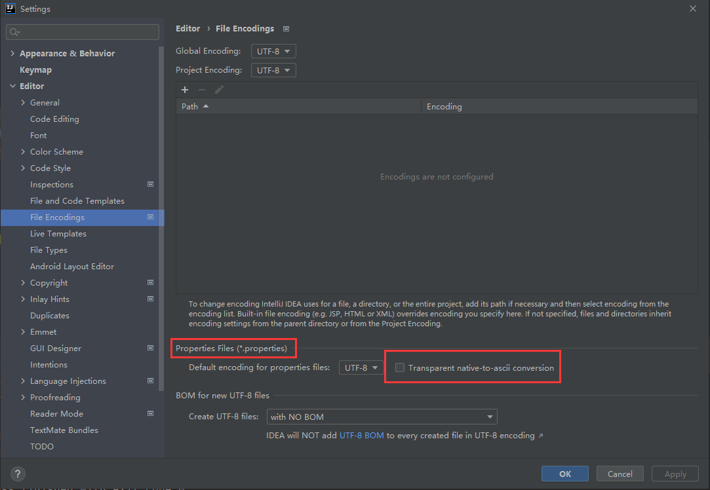

## Collections工具类

`Collections`是一个操作`Set`、`List`和`Map`等集合的工具类

`Collections`中提供了一系列**静态方法**，用来对集合元素进行排序、查询和修改等操作，还提供了对集合对象设置不可变、对集合对象实现同步控制等方法

> 操作数组的工具类：`Arrays`


**排序(静态方法)**

- `reverse(List)`：反转`List`中元素的顺序（修改`list`）
- `shuffle(List)`：对`List`中元素进行随机排序
- `sort(List)`：对`List`中元素按升序排序（根据元素的自然顺序）
- `sort(List,Comparator)`：根据指定`Comparator`的顺序对`List`中元素进行排序
- `swap(List,int,int)`：将指定`List`中的i处元素和j处元素进行交换
- `int frequency(Collection,Object)`：返回指定集合中指定元素的出现次数
- `void copy(List dest,Listsrc)`：将src中的内容复制到dest中（要求长度满足）
- `boolean replaceAll(List list,Object oldVal,Object newVal)`：使用`newVal`替换List对象的所有`oldVal`

**同步控制**

**Collections**类中提供了多个`synchronizedXxx()`方法，可以**将指定集合包装成线程同步的集合**，从而可以解决多线程并发访问集合时的线程安全问题


# 泛型

- `<E>`：E表示**类型**（必须是类，不能是基本数据类型）
- 允许在定义类、接口时通过一个标识（**类型参数**）表示类中某个属性类型或者某个方法返回值及参数类型
- 实例化集合类时指定具体的泛型类型，在集合类或者接口中定义类或者接口时，内部结构使用到类的泛型的位置都指定为实例化时的泛型类型
- 实例化时没有指明泛型类型，则默认为`java.lang.Object`

> 集合容器类在设计阶、声明阶段**不能确定容器中实际存的是什么类型的对象**
>
> - JDK5之前只能把元素类型设计为`Object`
> - JDK5之后改写了集合框架中的全部接口和类，为这些接口、类增加了泛型支持，把**元素的类型设计成一个参数**（这时除了元素的类型不确定，其他的部分是确定的），这个**类型参数**就叫做泛型。从而可以在声明集合变量、创建集合对象时传入类型实参

**优点**

- **类型安全**：只有指定类型才可以添加到集合中（**编译时**检查）
- **便捷**：读取出来的对象不需要强转，运行时就不会产生`ClassCastException`异常

> 使用Object的**缺点**
>
> - **类型不安全**：任何类型都可以添加到集合中（没有类型检查）
> - **繁琐**：读取出来的对象需要强转，可能有`ClassCastException`

```java
package com.ink.Generic;

import org.junit.Test;

import java.util.*;

public class GenericTest {
    @Test
    public void test(){
        ArrayList<Integer> list = new ArrayList<>();
        list.add(12);
        list.add(25);
//        for中可以使用int,Integer自动拆箱
        for (int number: list
             ) {
            System.out.println(number);
        }
        Iterator<Integer> iterator = list.iterator();
        while(iterator.hasNext()){
            System.out.println(iterator.next());
        }
    }
    @Test
    public void test2(){
        HashMap<String,Integer> map = new HashMap<>();
        map.put("ink",23);
        map.put("yinke",24);
//        泛型嵌套
        Set<Map.Entry<String, Integer>> entry = map.entrySet();
        Iterator<Map.Entry<String, Integer>> iterator = entry.iterator();
        while(iterator.hasNext()){
            Map.Entry<String, Integer> e = iterator.next();
            String key = e.getKey();
            Integer value = e.getValue();
            System.out.println(key + ":" + value);
        }
    }
}
```

## 自定义泛型结构

**三种结构**

- 自定义泛型类
- 自定义泛型接口
- 自定义泛型方法

**注意**

- 实例化后，操作原来泛型位置的结构必须与指定的泛型类型一致
- 泛型不同的引用不能相互赋值（`ArrayList<String>`和`ArrayList<Integer>`不能相互赋值）
- 泛型如果不指定，就会被擦除（编译不会类型检查），泛型对应的类型均按照`Object`处理
- 如果泛型结构是一个接口或抽象类，则不可创建泛型类的对象
-  JDK7后，泛型的简化操作`ArrayList<String> f = new ArrayList<>()`（后面不用再加泛型）
- 在类/接口上声明的泛型在本类或本接口中即代表某种类型，可以作为非静态属性的类型、非静态方法的参数类型、非静态方法的返回值类型。但在静态方法中不能使用类的泛型（泛型是在实例化的时候确定，但是静态方法是随着类的创建一起加载的，所以无法使用泛型）
- 异常类不能是泛型的
- 不能声明泛型数组`new E[]`，但是可以使用`Object`数组强转：`E[] elements = (E[])new Object[capacity]`

> 泛型要使用一路都用，要不用一路都不用
>
> 泛型擦除不等价于Object，因为指定Object，编译会类型检查，必须按照Object处理，擦除则编译不会类型检查


### 自定义泛型类/接口

定义时不知道数据类型（在实例化的时候才知道）就可以使用泛型

- 泛型类可以有多个参数，一起放在尖括号内，逗号隔开（`<E1,E2,E3>`） 
- 泛型类的构造器没有变化，实例化的时候需要加上`<T>`
- 如果定义了泛型类，实例化的时候就要指明类的泛型（不指明默认泛型类型是`Object`类型）

> 常用`<T>`表示（Type的缩写）

```java
package com.ink.Generic;

/**
 * @author ink
 * @date 2021年05月25日16:13
 */
public class Order<T>{
    String orderName;
    int orderId;
    // 类的内部结构可以使用类的泛型
    T orderT;

    public Order() {
    }

    public Order(String orderName, int orderId, T orderT) {
        this.orderName = orderName;
        this.orderId = orderId;
        this.orderT = orderT;
    }

    public T getOrderT() {
        return orderT;
    }

    public void setOrderT(T orderT) {
        this.orderT = orderT;
    }

    @Override
    public String toString() {
        return "Order{" +
                "orderName='" + orderName + '\'' +
                ", orderId=" + orderId +
                ", orderT=" + orderT +
                '}';
    }
}
```

```java
package com.ink.Generic;

import org.junit.Test;

import java.util.*;

public class GenericTest {
    @Test
    public void test(){
        Order<String> order = new Order<String>("A",1001,"order(A)");
        // Order{orderName='A', orderId=1001, orderT=order(A)}
        System.out.println(order.toString());
        order.setOrderT("AA:order");
        // Order{orderName='A', orderId=1001, orderT=AA:order}
        System.out.println(order.toString());
    }
}
```

**继承**

父类有泛型，子类可以选择**保留泛型**也可以选择**指定泛型类型**

指定了泛型类型的子类不再是泛型类

> 没有保留也没有指定泛型类型，则泛型擦除

```java
package com.ink.Generic;

//继承带泛型的父类时,指明了泛型类型
public class SubOrder extends Order<Integer>{
}
```

```java
package com.ink.Generic;

import org.junit.Test;

import java.util.*;

public class GenericTest {
    @Test
    public void test(){
        // 实例化时不再需要指明泛型类型
        SubOrder subOrder = new SubOrder();
        subOrder.setOrderT(1122);
        // Order{orderName='null', orderId=0, orderT=1122}
        System.out.println(subOrder.toString());
    }
}
```

保留了泛型类型的子类仍然是泛型类

> 可以全部保留也可以部分保留（部分指定），还可以增加自己的泛型

```java
package com.ink.Generic;

//继承带泛型的父类时,没有指明泛型类型
public class SubOrder<T> extends Order<T>{
}
```

```java
package com.ink.Generic;

import org.junit.Test;

import java.util.*;

public class GenericTest {
    @Test
    public void test(){
        SubOrder<String> subOrder = new SubOrder<>();
        subOrder.setOrderT("ink");
        // Order{orderName='null', orderId=0, orderT=ink}
        System.out.println(subOrder.toString());
    }
}
```


### 自定义泛型方法

在**方法中**使用了泛型结构的方法，泛型参数与类的泛型参数无关

泛型方法和所在类或接口无关（与它们是不是泛型类无关）

> 不是方法中使用了类或接口的泛型就是泛型方法


