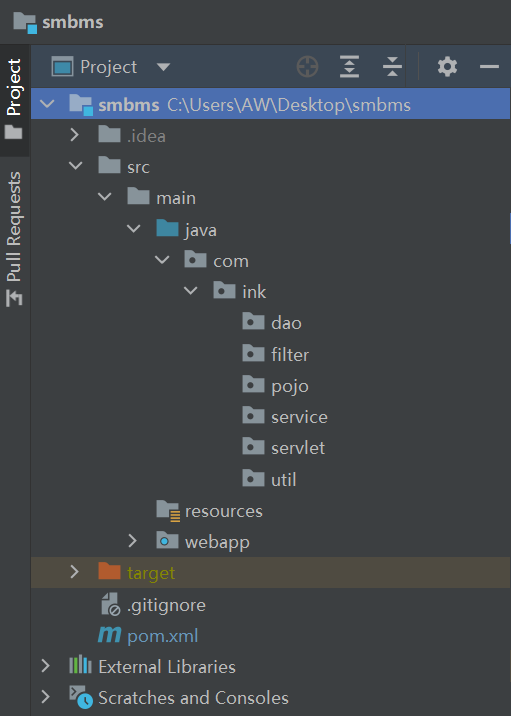
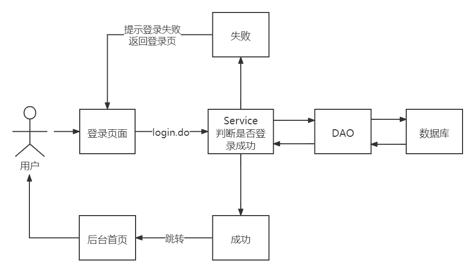

# SMBMS

## 搭建项目

1. 创建Maven模板项目

2. 删除`pom.xml`无用信息，只保留gav和打包方式

   ```xml
   <?xml version="1.0" encoding="UTF-8"?>
   
   <project xmlns="http://maven.apache.org/POM/4.0.0" xmlns:xsi="http://www.w3.org/2001/XMLSchema-instance"
     xsi:schemaLocation="http://maven.apache.org/POM/4.0.0 http://maven.apache.org/xsd/maven-4.0.0.xsd">
     <modelVersion>4.0.0</modelVersion>
   
     <groupId>com.ink</groupId>
     <artifactId>smbms</artifactId>
     <version>1.0-SNAPSHOT</version>
     <packaging>war</packaging>
   </project>
   ```

3. 修改`web.xml`

   ```xml
   <?xml version="1.0" encoding="UTF-8"?>
   <web-app xmlns="https://jakarta.ee/xml/ns/jakartaee"
            xmlns:xsi="http://www.w3.org/2001/XMLSchema-instance"
            xsi:schemaLocation="https://jakarta.ee/xml/ns/jakartaee https://jakarta.ee/xml/ns/jakartaee/web-app_5_0.xsd"
            version="5.0">
   
   </web-app>
   ```

4. 创建`java`目录和`resource`目录并标记为对应文件夹

5. 配置tomcat，路径设置为`/smbms`

6. 测试是否正常运行

7. 导入项目中需要的jar包

   1. jsp
   2. jstl
   3. standard
   4. Servlet
   5. mysql驱动
   
   > Tomcat10对应的jstl和standard包不一样
   
   ```xml
     <dependencies>
       <dependency>
         <groupId>jakarta.servlet.jsp</groupId>
         <artifactId>jakarta.servlet.jsp-api</artifactId>
         <version>3.0.0</version>
         <scope>provided</scope>
       </dependency>
       <dependency>
         <groupId>jakarta.servlet</groupId>
         <artifactId>jakarta.servlet-api</artifactId>
         <version>5.0.0</version>
         <scope>provided</scope>
       </dependency>
       <dependency>
         <groupId>javax.servlet.jsp.jstl</groupId>
         <artifactId>jstl</artifactId>
         <version>1.2</version>
       </dependency>
       <dependency>
         <groupId>taglibs</groupId>
         <artifactId>standard</artifactId>
         <version>1.1.2</version>
       </dependency>
       <dependency>
         <groupId>mysql</groupId>
         <artifactId>mysql-connector-java</artifactId>
         <version>5.1.47</version>
       </dependency>
       <dependency>
         <groupId>junit</groupId>
         <artifactId>junit</artifactId>
         <version>4.12</version>
       </dependency>
     </dependencies>
   
   ```

### 创建项目结构

创建package：`com.ink`

1. 创建实体类层：`com.ink.pojo`
2. 创建DAO层：`com.ink.dao`
3. 创建Service层：`com.ink.service`
4. 创建Servlet层：`com.ink.servlet`
5. 创建过滤器层：`com.ink.filter`
6. 创建工具类层：`com.ink.util`



### 创建数据库实体类

在`pojo`目录下创建对应数据库表的实体类

> orm映射

使用idea一键生成

1. `File-Project Structure-Modules`，点击加号，选择JPA

   

2. `View-Tool Windows`，点击`Persistence`

   

3. 选择`Generate Persistence Mapping-By Database Schema`

   

4. 选择数据库，选择实体类生成的项目路径（包），勾选要生成实体的表和字段

   


### 创建基础公共类

1. 在`resource`目录下创建数据库配置文件`db.properties`

2. 在`dao`目录下创建操作数据库的公共类`BaseDao.java`

   ```java
   package com.ink.dao;
   
   import java.io.IOException;
   import java.io.InputStream;
   import java.sql.*;
   import java.util.Properties;
   
   //操作数据库的公共类
   public class BaseDao {
       private static String driver;
       private static String url;
       private static String user;
       private static String password;
   
   //    静态代码块,在类加载的时候执行,完成初始化
       static{
   //        初始化连接参数,从配置文件里获得
           Properties properties = new Properties();
           String configFile = "db.properties";
           InputStream is = BaseDao.class.getClassLoader().getResourceAsStream(configFile);
           try {
               properties.load(is);
           } catch (IOException e) {
               e.printStackTrace();
           }
           driver = properties.getProperty("driver");
           url = properties.getProperty("url");
           user = properties.getProperty("user");
           password = properties.getProperty("password");
       }
   
   
   //    获取数据库连接
       public static Connection getConnection(){
           Connection connection = null;
           try {
               Class.forName(driver);
               connection = DriverManager.getConnection(url, user, password);
           } catch (Exception e) {
               e.printStackTrace();
           }
           return connection;
       }
   
   //    查询公共类
   //    重载
       public static ResultSet execute(Connection connection,String sql,Object[] params,PreparedStatement preparedStatement,ResultSet resultSet) throws Exception{
           preparedStatement = connection.prepareStatement(sql);
           for(int i = 0; i < params.length; i++){
               preparedStatement.setObject(i+1, params[i]);
           }
           resultSet = preparedStatement.executeQuery();
           return resultSet;
       }
   
   //    增删改公共类
       public static int execute(Connection connection,String sql,Object[] params,PreparedStatement preparedStatement) throws Exception{
           preparedStatement = connection.prepareStatement(sql);
           for(int i = 0; i < params.length; i++){
               preparedStatement.setObject(i+1, params[i]);
           }
           int updateRows = preparedStatement.executeUpdate();
           return updateRows;
       }
   
   //    释放资源
       public static boolean closeResource(Connection connection,PreparedStatement preparedStatement,ResultSet resultSet){
           boolean flag = true;
           if(resultSet != null){
               try {
                   resultSet.close();
   //                GC回收
                   resultSet = null;
               } catch (SQLException e) {
                   e.printStackTrace();
   //                没有释放成功
                   flag = false;
               }
           }
           if(preparedStatement != null){
               try {
                   preparedStatement.close();
                   preparedStatement = null;
               } catch (SQLException e) {
                   e.printStackTrace();
                   flag = false;
               }
           }
           if(connection != null){
               try {
                   connection.close();
                   connection = null;
               } catch (SQLException e) {
                   e.printStackTrace();
                   flag = false;
               }
           }
           return flag;
       }
   }
   ```

3. 在`com.ink.filter`目录下创建`CharacterEncodingFilter.java`实现字符编码过滤功能

   ```java
   public void doFilter(ServletRequest servletRequest, ServletResponse servletResponse, FilterChain filterChain) throws IOException, ServletException {
       servletRequest.setCharacterEncoding("utf-8");
       servletResponse.setCharacterEncoding("utf-8");
       filterChain.doFilter(servletRequest,servletResponse);
   }
   ```

   ```xml
   <!--    字符编码过滤器-->
       <filter>
           <filter-name>CharacterEncodingFilter</filter-name>
           <filter-class>com.ink.filter.CharacterEncodingFilter</filter-class>
       </filter>
       <filter-mapping>
           <filter-name>CharacterEncodingFilter</filter-name>
           <url-pattern>/*</url-pattern>
       </filter-mapping>
   ```


### 导入静态资源

存放在webapp目录下

> 不是`resource`目录

### 设置欢迎页

```xml
<!--    设置欢迎页-->
    <welcome-file-list>
        <welcome-file>login.jsp</welcome-file>
    </welcome-file-list>
```

## 登录

项目编写逻辑：从底层向上写

1. DAO层
2. Service层
3. Servlet层



### DAO层

数据访问层：封装对数据库的访问

在`com.ink.dao`目录下创建`user`目录

在`com.ink.dao.user`目录下创建`UserDao.java`作为获取登录用户信息的接口

```java
package com.ink.dao.user;

import com.ink.pojo.User;

import java.sql.Connection;

public interface UserDao {
//    得到登录的用户
    public User getLoginUser(Connection connection, String userCode) throws Exception;
}
```

在`com.ink.dao.user`目录下创建`UserDaoImpl.java`作为获取登录用户信息接口的实现类

```java
package com.ink.dao.user;

import com.ink.dao.BaseDao;
import com.ink.pojo.User;

import java.sql.Connection;
import java.sql.PreparedStatement;
import java.sql.ResultSet;

//UserDao实现类
public class UserDaoiml implements UserDao{
    @Override
    public User getLoginUser(Connection connection, String userCode) throws Exception {
//        BaseDao中写好了查询的方法
        PreparedStatement pstm = null;
        ResultSet rs = null;
        User user = null;
        if(connection != null){
            String sql = "select * from smbms_user where userCode=?";
            Object[] params = {userCode};
            rs = BaseDao.execute(connection,pstm,rs,sql,params);
            if(rs.next()){
                user = new User();
                user.setId(rs.getInt("id"));
                user.setUserCode(rs.getString("userCode"));
                user.setUserName(rs.getString("userName"));
                user.setUserPassword(rs.getString("userPassword"));
                user.setGender(rs.getInt("gender"));
                user.setBirthday(rs.getDate("birthday"));
                user.setPhone(rs.getString("phone"));
                user.setAddress(rs.getString("address"));
                user.setUserRole(rs.getInt("userRole"));
                user.setCreatedBy(rs.getInt("createdBy"));
                user.setCreationDate(rs.getTimestamp("creationDate"));
                user.setModifyBy(rs.getInt("modifyBy"));
                user.setModifyDate(rs.getTimestamp("modifyDate"));
            }
//                connection不用关
            BaseDao.closeResource(null, pstm, rs);
        }
        return user;
    }
}
```

### Service层

业务层：调用数据访问层代码

在`com.ink.service`目录下创建`user`目录

> 业务层都会调用DAO层，所以要引入DAO层

在`com.ink.service.user`目录下创建`UserService.java`作为处理用户登录的接口

```java
package com.ink.service.user;

import com.ink.pojo.User;

public interface UserService {
//    处理用户登录
    public User login(String userCode,String password);
}
```

在`com.ink.service.user`目录下创建`UserServiceImpl.java`作为处理用户登录接口的实现类

- 父类引用指向子类对象：`userDao = new UserDaoImpl();`

```java
package com.ink.service.user;

import com.ink.dao.BaseDao;
import com.ink.dao.user.UserDao;
import com.ink.dao.user.UserDaoImpl;
import com.ink.pojo.User;
import org.junit.Test;

import java.sql.Connection;

public class UserServiceImpl implements UserService{
//    引入DAO层，用于调用
    private UserDao userDao;
    public UserServiceImpl(){
        userDao = new UserDaoImpl();
    }

    @Override
    public User login(String userCode, String password) {
        Connection connection = null;
        User user = null;
        try {
//            通过业务层调用对应的DAO层操作
            connection = BaseDao.getConnection();
            user = userDao.getLoginUser(connection,userCode);
        } catch (Exception e) {
            e.printStackTrace();
        } finally {
//          关闭connection
            BaseDao.closeResource(connection,null,null);
        }
        return user;
    }

//    直接测试
    @Test
   public void test() {
      UserServiceImpl userService = new UserServiceImpl();
      String userCode = "admin";
      String userPassword = "12345678";
      User admin = userService.login(userCode, userPassword);
      System.out.println(admin.getUserPassword());

   }
}
```

### Servlet层

控制层：调用业务层代码

在`com.ink.servlet`目录下创建`user`目录

在`com.ink.servlet.user`目录下创建`LoginServlet.java`控制用户登录功能

```java
package com.ink.servlet.user;

import com.ink.pojo.User;
import com.ink.service.user.UserService;
import com.ink.service.user.UserServiceImpl;
import com.ink.util.Constants;
import jakarta.servlet.ServletException;
import jakarta.servlet.http.HttpServlet;
import jakarta.servlet.http.HttpServletRequest;
import jakarta.servlet.http.HttpServletResponse;

import java.io.IOException;

//控制层，调用业务层代码
public class LoginServlet extends HttpServlet {
    @Override
    protected void doGet(HttpServletRequest req, HttpServletResponse resp) throws ServletException, IOException {
//        获取前端请求的用户名和密码
        String userCode = req.getParameter("userCode");
        String password = req.getParameter("password");
//        调用业务层，和数据库中的数据进行对比
        UserService userService = new UserServiceImpl();
        User user = userService.login(userCode, password);
        if(user != null){
//            用户存在，将用户信息存入Session，然后跳转首页
//            常量抽取出来放在工具包util的类中
            req.getSession().setAttribute(Constants.USER_SESSION,user);
            resp.sendRedirect("jsp/frame.jsp");
        }
        else{
//            用户不存在，转发到登录页，并提示错误
//            设置error信息
            req.setAttribute("error","用户名或密码错误");
            req.getRequestDispatcher("login.jsp").forward(req,resp);
        }
    }

    @Override
    protected void doPost(HttpServletRequest req, HttpServletResponse resp) throws ServletException, IOException {
        doGet(req, resp);
    }
}
```

在`com.ink.servlet.user`目录下创建`LogoutServlet.java`控制用户登录的注销功能

```java
package com.ink.servlet.user;

import com.ink.util.Constants;
import jakarta.servlet.ServletException;
import jakarta.servlet.http.HttpServlet;
import jakarta.servlet.http.HttpServletRequest;
import jakarta.servlet.http.HttpServletResponse;

import java.io.IOException;

public class LogoutServlet extends HttpServlet {
    @Override
    protected void doGet(HttpServletRequest req, HttpServletResponse resp) throws ServletException, IOException {
//        清除session的用户数据
        req.getSession().removeAttribute(Constants.USER_SESSION);
//        返回登录页面
        resp.sendRedirect(req.getContextPath()+"/login.jsp");
    }

    @Override
    protected void doPost(HttpServletRequest req, HttpServletResponse resp) throws ServletException, IOException {
        doGet(req, resp);
    }
}
```

```xml
<servlet>
    <servlet-name>LoginServlet</servlet-name>
    <servlet-class>com.ink.servlet.user.LoginServlet</servlet-class>
</servlet>
<servlet-mapping>
    <servlet-name>LoginServlet</servlet-name>
    <url-pattern>/login.do</url-pattern>
</servlet-mapping>
<servlet>
    <servlet-name>LogoutServlet</servlet-name>
    <servlet-class>com.ink.servlet.user.LogoutServlet</servlet-class>
</servlet>
<servlet-mapping>
    <servlet-name>LogoutServlet</servlet-name>
    <url-pattern>/jsp/logout.do</url-pattern>
</servlet-mapping>
```

### 权限验证

使用拦截器防止未登录用户访问主页

在`com.ink.filter`目录下创建`LoginFilter.java`实现权限验证功能

```java
package com.ink.filter;

import com.ink.pojo.User;
import com.ink.util.Constants;
import jakarta.servlet.*;
import jakarta.servlet.http.HttpServlet;
import jakarta.servlet.http.HttpServletRequest;
import jakarta.servlet.http.HttpServletResponse;

import java.io.IOException;

public class LoginFilter implements Filter {
    @Override
    public void init(FilterConfig filterConfig) throws ServletException {
        Filter.super.init(filterConfig);
    }

    @Override
    public void doFilter(ServletRequest servletRequest, ServletResponse servletResponse, FilterChain filterChain) throws IOException, ServletException {
        HttpServletRequest req = (HttpServletRequest) servletRequest;
        HttpServletResponse resp = (HttpServletResponse) servletResponse;
//        从session中获取用户
        User user = (User) req.getSession().getAttribute(Constants.USER_SESSION);
        if(user == null){
//            用户未登录或者已经注销了
            resp.sendRedirect(req.getContextPath()+"error.jsp");
        }
        else{
            filterChain.doFilter(servletRequest,servletResponse);
        }
    }

    @Override
    public void destroy() {
        Filter.super.destroy();
    }
}
```

```xml
<filter>
    <filter-name>LoginFilter</filter-name>
    <filter-class>com.ink.filter.LoginFilter</filter-class>
</filter>
<filter-mapping>
    <filter-name>LoginFilter</filter-name>
    <url-pattern>/jsp/*</url-pattern>
</filter-mapping>
```

## 密码修改

### DAO层

修改`com.ink.dao.user`目录下的`UserDao`接口

- 增加修改密码功能对应的方法

```java
//    修改当前用户密码
    public int updatePwd(Connection connection, int id, int password)throws SQLException, Exception;
```

修改`com.ink.dao.user`目录下的`UserDaoImpl`实现类

- 重写对应的方法

```java
    @Override
    public int updatePwd(Connection connection, int id, String password) throws SQLException, Exception {
        System.out.println("UserDao" + password);
        PreparedStatement pstm = null;
        int execute = 0;
        if(connection != null){
            String sql = "update smbms_user set userPassword = ? where id = ?";
            Object[] param = {password, id};
            execute = BaseDao.execute(connection,pstm,sql,param);
            BaseDao.closeResource(null,pstm,null);
        }
        return execute;
    }
```

### Service层

修改`com.ink.service.user`目录下的`Userservice`接口

- 增加修改密码功能对应的方法

```java
//    修改当前用户密码
    public boolean updatePwd(int id,String password) throws SQLException;
```

修改`com.ink.service.user`目录下的`UserServiceImpl`实现类

```java
=    @Override
    public boolean updatePwd(int id, String password) throws SQLException {
        System.out.println("UserService" + password);

        Connection connection = BaseDao.getConnection();
        boolean flag = false;
        try {
            int execute = userDao.updatePwd(connection, id, password);
            if(execute > 0){
                flag = true;
            }
        } catch (Exception e) {
            e.printStackTrace();
        } finally {
            BaseDao.closeResource(connection,null,null);
        }
        return flag;
    }
```

### Servlet层

业务实现

1. 在用户登录时，已经将用户的信息存入了Session
   1. `req.getSession().setAttribute(Constants.USER_SESSION,user);`
2. 可以使用Session中的`Constants.USER_SESSION`获取user信息
3. 去数据库中修改密码

在`com.ink.servlet.user`目录下创建`UserServlet.java`控制修改密码功能

```java
package com.ink.servlet.user;

import com.ink.pojo.User;
import com.ink.service.user.UserService;
import com.ink.service.user.UserServiceImpl;
import com.ink.util.Constants;
import com.mysql.jdbc.StringUtils;
import jakarta.servlet.ServletException;
import jakarta.servlet.http.HttpServlet;
import jakarta.servlet.http.HttpServletRequest;
import jakarta.servlet.http.HttpServletResponse;

import java.io.IOException;
import java.sql.SQLException;

public class UserServlet extends HttpServlet {
    @Override
    protected void doGet(HttpServletRequest req, HttpServletResponse resp) throws ServletException, IOException {
//        先不要强制类型转换，等用的时候再转换
        Object o = req.getSession().getAttribute(Constants.USER_SESSION);
        String newpassword = req.getParameter("newpassword");

        System.out.println("UserServlet" + newpassword);

        boolean flag = false;
//        如果用户存在且新密码不为空
//        o != null && newpassword != null && newpassword.length() != 0
//        StringUtils，jdbc的工具类
        if(o != null && !StringUtils.isNullOrEmpty(newpassword)){
//            调用service层代码
            UserService userService = new UserServiceImpl();
            try {
                flag = userService.updatePwd(((User)o).getId() , newpassword);
            } catch (SQLException e) {
                e.printStackTrace();
            }
            if(flag){
                req.setAttribute("message","密码修改成功，请重新登录");
//                移除当前Session，重新登录
                req.getSession().removeAttribute(Constants.USER_SESSION);
            }
            else{
                req.setAttribute("message","密码修改失败");
            }
        }
        else{
            req.setAttribute("message","新密码存在问题");
        }
        req.getRequestDispatcher("pwdmodify.jsp").forward(req,resp);
    }

    @Override
    protected void doPost(HttpServletRequest req, HttpServletResponse resp) throws ServletException, IOException {
        doGet(req, resp);
    }
}
```

```xml
<servlet>
    <servlet-name>UserServlet</servlet-name>
    <servlet-class>com.ink.servlet.user.UserServlet</servlet-class>
</servlet>
<servlet-mapping>
    <servlet-name>UserServlet</servlet-name>
    <url-pattern>/jsp/user.do</url-pattern>
</servlet-mapping>
```

如何实现Servlet复用？

