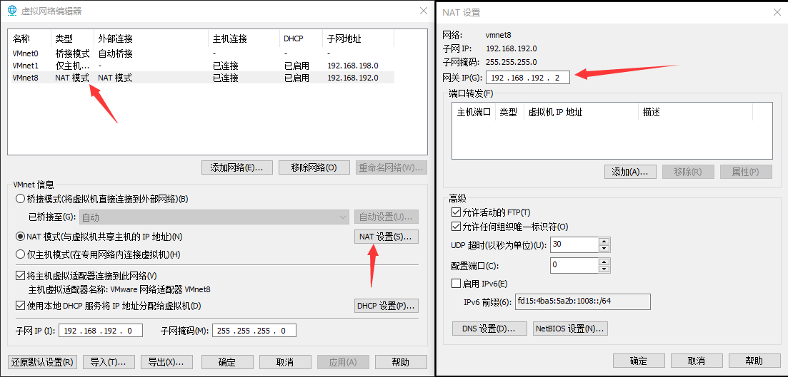
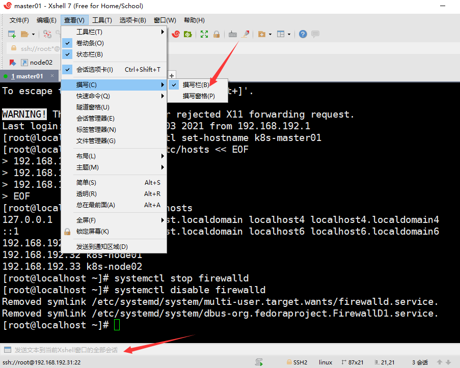

# kubernetes

kubernetes是一个软件系统，依赖于Linux容器的特性来运行异构的应用，它将底层基础设施抽象，简化应用的开发，部署和运维

基础概念： Pod，控制器类型，K8S网络通讯模式

资源清单：掌握资源清单的语法，编写 Pod，掌握Pod 的生命周期

Pod 控制器：掌握各种控制器的特点以及使用定义方式

服务发现：掌握 SVC原理及其构建方式

服务分类：

- 有状态服务：DBMS （数据库管理系统）<-- k8s -->数据持久化存储  
- 无状态服务：LVS，APACHE  <-- docker

存储：掌握多种存储类型的特点，能够在不同环境中选择合适的存储方案

调度器：掌握调度器原理，能够根据要求把Pod 定义到特定的节点运行

安全：集群的认证，鉴权，访问控制，原理及其流程

HELM：类似Linux的yum，掌握 HELM 原理，HELM模板自定义，HELM部署一些常用插件

运维：修改Kubeadm 达到证书可用期限（默认证书一年，一年更新一次），能够构建高可用的 Kubernetes 集群

高可用集群：副本数据最好是3个以上的（3，5，7，9）


## 云计算架构

经典的云计算架构分为三大服务层：

1. IaaS（Infrastructure as a Service）基础设施即服务

   IaaS 层通过虚拟化技术提供计算、存储、网络等基础资源，可以在上面部署各种 OS 以及应用程序。开发者可以通过云厂商提供的 API 控制整个基础架构，无须对其进行物理上的维护和管理

2. PaaS（Platform as a Service）平台即服务

   PaaS 层提供软件部署平台（runtime），抽象掉了硬件和操作系统，可以无缝地扩展（scaling）。开发者只需要关注自己的业务逻辑，不需要关注底层

3. SaaS（Software as a Service，软件即服务）。

   SaaS 层直接为开发者提供软件服务，将软件的开发、管理、部署等全部都交给第三方，用户不需要再关心技术问题，可以拿来即用

## Borg

Google 10年容器化基础架构（GO 语言）      

 特点：

- 轻量级：消耗资源小 
- 开源
- 弹性伸缩 
- 负载均衡：IPVS


# Kubernetes组件


**K8S架构：**

- Master：集群控制节点，执行所有的命令，通常占据一个独立服务器
  - Api Server（kube-apiserver）：所有服务访问唯一入口，提供HttpRest接口的服务进程
  - CrontrollerManager（kube-controller-manager）：所有资源对象的自动化控制中心，维持副本期望数目
  - Scheduler（kube-scheduler）：负责接受任务，选择合适的节点进行分配任务，即资源调度（Pod调度）
  - Etcd：键值对数据库，采用http协议，储存K8S集群所有重要信息。官方将它定位成一个可信赖的分布式键值存储服务，能够为整个分布式集群存储一些关键数据，协助分布式集群的正常运转（可信赖：天生支持集群化，不需要其他组件。正常运转：保存分布式存储持久化的配置信息）
- Nod：除了Master控制节点，Kubernetes集群中的其他机器(工作负载节点)
  - Kubelet：直接跟容器引擎交互实现容器的生命周期管理
  - Kube-proxy：负责写入规则至 IpTables、Ipvs 实现服务映射访问，实现Kubernetes，Service的通信与负载均衡机制的重要组件
  - Docker Engine（docker）：Docker引擎，负责容器创建和管理工作。

**Pod：**

分类（生命周期不一致）  

- 自主式 Pod：Pod 退出了，此类型的 Pod 不会被创建（无法确保稳定性）  
- 控制器管理的 Pod：在控制器的生命周期里，始终要维持 Pod 的副本数目

**编程：**

- 声明式编程（Deployment）：侧重于定义想要什么，然后告诉计算机让它帮你实现。apply > create  
- 命令式编程（ReplicaSet）：侧重于如何实现程序，把实现过程按逻辑一步步写出。   create > apply      

**其他组件：**

- CoreDns：可以为集群中的SVC创建一个域名IP的对应关系解析
- DashBoard：给 K8S 集群提供一个 B/S 结构访问体系
- IngressController：Ingress 可以实现七层代理（官方只能实现四层代理）
- Federatiom：提供一个可以跨集群中心多K8S统一管理功能
- Prometheus：提供K8S集群的监控能力
- Efk：提供 K8S 集群日志统一分析介入平台

# kubernetes集群架构

- 主节点（控制面版）
  - kubernetesAPI服务器
  - Scheculer
  - Controller Manager
  - etcd
- 工作节点
  - 容器（docker，rtk）
  - kubelet
  - kube-proxy


# 部署k8s集群1

## 系统初始化

设置系统主机名以及 Host 文件的相互解析

```bash
hostnamectl  set-hostname  k8s-master01
```

安装依赖包

```bash
yum install -y conntrack ntpdate ntp ipvsadm ipset jq iptables curl sysstat libseccomp wget vim net-tools git
```

关闭防火墙，设置防火墙为iptables

```bash
systemctl stop firewalld
systemctl disable firewalld
yum -y install iptables-services && systemctl start iptables && systemctl enable iptables && iptables -F && service iptables save
```


关闭selinux

```bash
swapoff -a && sed -i  '/ swap / s/^\(.*\)$/#\1/g' /etc/fstab
setenforce 0 && sed -i 's/^SELINUX=.*/SENLINUX=disabled/' /etc/selinux/config
```

调整内核参数

```bash
cat > kubernetes.conf <<EOF
net.bridge.bridge-nf-call-iptables=1
net.bridge.bridge-nf-call-ip6tables=1
net.ipv4.ip_forward=1
net.ipv4.tcp_tw_recycle=0
vm.swappiness=0
vm.overcommit_memory=1
vm.panic_on_oom=0
fs.inotify.max_user_instances=8192
fs.inotify.max_user_watches=1048576
fs.file-max=52706963
fs.nr_open=52706963
net.ipv6.conf.all.disable_ipv6=1
net.netfilter.nf_conntrack_max=2310720
EOF


cp kubernetes.conf /etc/sysctl.d/kubernetes.conf

sysctl -p /etc/sysctl.d/kubernetes.conf
```

关闭系统不需要服务

```bash
systemctl stop postfix && systemctl disable postfix
```

设置日志保存方式（rsyslogd和systemd journald）

```bash
# 持久化保存日志的目录
mkdir /var/log/journal
mkdir /etc/systemd/journald.conf.d
cat > /etc/systemd/journald.conf.d/99-prophet.conf <<EOF
[Journal]
# 持久化保存到磁盘
Storage=persistent
# 压缩历史日志
Compress=yes
SyncIntervalSec=5m
RateLimitInterval=30s
RateLimitBurst=1000
SystemMaxUse=10G
SystemFileSize=200M
SystemMaxUse=10G
MaxRetentionSec=2week
ForwardToSyslog=no
EOF

systemctl restart systemd-journald
```

升级内核为4.44

> CentOS 7.x 系统自带的 3.10.x 内核存在一些 Bugs，导致运行的 Docker、Kubernetes 不稳定
>
> 例如： rpm -Uvh http://www.elrepo.org/elrepo-release-7.0-3.el7.elrepo.noarch.rpm

```bash
rpm -Uvh http://www.elrepo.org/elrepo-release-7.0-3.el7.elrepo.noarch.rpm
# 安装完成后检查 /boot/grub2/grub.cfg 中对应内核 menuentry 中是否包含 initrd16 配置，如果没有，再安装一次！
yum --enablerepo=elrepo-kernel install -y kernel-lt
# 设置开机从新内核启动
grub2-set-default 'CentOS linux (4.4.189-1.el7.elrepo.x86_64)  7 (Core)'
```


## kubeadm安装

kube-proxy开启ipvs的前置条件

```bash
modprobe br_netfilter

cat > /etc/sysconfig/modules/ipvs.modules <<EOF
#!/bin/bash
modprobe -- ip_vs
modprobe -- ip_vs_rr
modprobe -- ip_vs_wrr
modprobe -- ip_vs_sh
modprobe -- nf_conntrack_ipv4
EOF

chmod 755 /etc/sysconfig/modules/ipvs.modules && bash /etc/sysconfig/modules/ipvs.modules && lsmod | grep -e ip_vs -e nf_conntrack_ipv4
```

安装Docker

```bash
yum install -y yum-utils device-mapper-persistent-data lvm2

yum-config-manager \
  --add-repo \
  http://mirrors.aliyun.com/docker-ce/linux/centos/docker-ce.repo

yum update -y && yum install -y docker-ce

systemctl start docker
systemctl enable docker

## 创建 /etc/docker 目录
mkdir /etc/docker

# 配置daemon
cat > /etc/docker/daemon.json << EOF
{
      "exec-opts": ["native.cgroupdrive=systemd"],
      "log-driver": "json-file",
      "log-opts": {
         "max-size": "100m"
      }
}
EOF

mkdir -p /etc/systemd/system/docker.service.d

systemctl daemon-reload && systemctl restart docker && systemctl enable docker
```

安装Kubeadm

```bash
cat <<EOF > /etc/yum.repos.d/kubernetes.repo
[kubernetes]
name=Kubernetes
baseurl=http://mirrors.aliyun.com/kubernetes/yum/repos/kubernetes-el7-x86_64
enabled=1
gpgcheck=0
repo_gpgcheck=0
gpgkey=http://mirrors.aliyun.com/kubernetes/yum/doc/yum-key.gpg
http://mirrors.aliyun.com/kubernetes/yum/doc/rpm-package-key.gpg
EOF

yum -y install kubeadm-1.15.1 kubectl-1.15.1 kubelet-1.15.1

systemctl enable kubelet.service
```

kubeadm-basic.images目录

```bash
vim load-images.sh

#!/bin/bash
ls /root/kubeadm-basic.images  > /tmp/image-list.txt

cd /root/kubeadm-basic.images

for i in $( cat   /tmp/image-list.txt)
do
    docker load -i $i
done


rm -rf /tmp/image-list.txt

chmod  a+x load-images.sh

./load-images.sh

scp -r kubeadm-basic.images load-images.sh root@k8s-node01:/root/
```

初始化主节点

```bash
kubeadm config print init-defaults > kubeadm-config.yaml
    localAPIEndpoint:
        advertiseAddress:192.168.66.10
    kubernetesVersion: v1.15.1
    networking:
        podSubnet: "10.244.0.0/16"
        serviceSubnet: 10.96.0.0/12"
---
    apiVersion: kubeproxy.config.k8s.io/v1alpha1
    kind: KubeProxyConfiguration
    featureGates:
        SupportIPVSProxyMode: true
    mode: ipvs

kubeadm init --config=kubeadm-config.yaml --experimental-upload-certs |tee kubeadm-init.log
```

```bash
mkdir -p $HOME/.kube

sudo cp -i /etc/kubernetes/admin.conf $HOME/.kube/config

sudo chown $(id -u):$(id -g) $HOME/.kube/config

mkdir install-8s
mv install-8s/ install-k8s
mv kubeadm-init.log kubeadm-config.yaml install-k8s/
cd install-k8s/
mkdir core
mv * core/
mkdir plugin
cd plugin/
mkdir flannel
cd flannel/

wget https://raw.githubusercontent.com/coreos/flannel/master/Documentation/kube-flannel.yml

# 部署网络
kubectl apply -f https://raw.githubusercontent.com/coreos/flannel/master/Documentation/kube-flannel.yml

kubectl create -f kube-flannel.yml
```

查看节点

```bash
kubectl get pod -n kube-system
kubectl get node
kubectl get pod -n kubu-system -w
```

子结点加入

```bash
kubeadm join 192.168.66.10:6443 --token abcdef.0123456789abcdef \
    --discovery-token-ca-cert-hash sha256:c1a94e025bfb20944d268f7f47a3781fa1ffd6c46b87bfe0e5bc0d811d845898
```

## Harbor

>  企业级 Docker 私有仓库

安装底层需求

- Python应该是应该是2.7或更高版本
- Docker引擎应为引擎应为1.10或更高版本
- Docker Compose需要为需要为1.6.0或更高版本

```bash
# 添加假证书
vim /etc/docker/daemon.json
# 中括号后加逗号，
"insecure-registries": ["[https://hub.atguigu.com](https://hub.atguigu.com/)"]

# 重启
systemctl restart docker
mv docker-compose /usr/local/bin
chmod a+x /usr/local/bin/docker-compose

# 解压
tar -zxvf harbor-offline-installer-v1.2.0.tgz
mv harbor /usr/local/
cd /usr/local/harbor
mkdir -p /data/cert

openssl genrsa -des3 -out server.key 2048
# 创建密码：123456

openssl req -new -key server.key -out server.csr
# 输入密码：123456
# 输入国家CN
# 输入城市BJ
# 默认城市BJ
# 组织atguigu

# 备份私钥
cp server.key server.key.org
# 退出密码
openssl rsa -in server.key.org -out server.key
openssl x509 -req -days 365 -in server.csr -signkey server.key -out server.crt
mkdir  /data/cert
chmod -R 777 /data/cert
docker ps -a

# 访问hub.atguigu.com
# 登陆：admin
# 密码：Harbor12345
# 访问尝试
docker login https://hub.atguigu.com
# 下载镜像
docker pull wangyanglinux/myapp:v1
# 命令名称
# 规范：docker tag SOURCE_IMAGE[:TAG] hub.atguigu.com/library/IMAGE[:TAG]
# 把SOURCE_IMAGE[:TAG]和IMAGE[:TAG]替换掉
docker tag wangyanglinux/myapp:v1 hub.atguigu.com/library/myapp:v1
# 上传镜像到仓库
docker  push hub.atguigu.com/library/myapp:v1
# 链接私有仓库
kubectl run nginx-deployment --image=hub.atguigu.com/library/myapp:v1 --port=80 --replicas=1
# replicas标识副本数目，必须保持为1
# 删除
kubectl delete pod +名称
# 修改数目
kubectl scale --replicas=3 deployment/nginx-deployment
kubectl get deployment
kubectl get node -o wide

# 查看帮助文档
kubectl expose --help
# 访问模板
kubectl expose deployment nginx --port=80 --target-port=8000
# 访问服务的80端口，访问容器的8000端口（Create a service for an nginx deployment, which serves on port 80 and connects to the containers on port 8000）
# 修改虚拟ip为外网ip
kubectl edit svc nginx-deployment
# 将type里的ClusterIP改为NodePort
netstat -anpt | grep :30000
```


# 部署k8s集群2

集群类型：

- 单Master集群
- 多Master集群

先部署一套单Master架构（3台），再扩容为多Master架构（4台或6台）

单Master服务器规划：

| **角色**   | **IP**        | **组件**                                                     |
| ---------- | ------------- | ------------------------------------------------------------ |
| k8s-master | 192.168.31.71 | kube-apiserver，kube-controller-manager，kube-scheduler，etcd |
| k8s-node1  | 192.168.31.72 | kubelet，kube-proxy，docker，etcd                            |
| k8s-node2  | 192.168.31.73 | kubelet，kube-proxy，docker，etcd                            |

服务器要求：

- 2核CPU，2G内存，30G硬盘

- 集群中所有机器之间网络互通

- 可以访问外网，需要拉取镜像（NAT）

- 禁止swap分区

- | **软件**   | **版本**               |
  | ---------- | ---------------------- |
  | 操作系统   | CentOS7.x_x64 （mini） |
  | 容器引擎   | Docker CE 19           |
  | Kubernetes | Kubernetes v1.20       |

搭建方式：

- kubeadm：K8s 部署工具，快速部署Kubernetes集群
  - kubeadm init：创建Master节点
  - kubeadm join：将Node节点加入集群`kubeadm join <Master节点IP:端口>`
- 二进制：手动部署每个组件，组成Kubernetes集群

> Kubeadm 降低部署门槛，但屏蔽了很多细节，遇到问题很难排查。
>
> 如果想更容易可控，推荐使用二进制包部署Kubernetes 集群，虽然手动部署麻烦点，但可以学习很多工作原理，也利于后期维护。

## 安装虚拟机

**新建虚拟机**

- 稍后安装OS
- 2个处理器，2个内核
- 2G内存
- 100G磁盘
- 磁盘存储为单个文件

**虚拟机设置**

- CD/DVD选择CentOS镜像
- 网络适配器选择NAT模式
- 安装位置默认
- 最小化安装
- 密码：空格

**地址分配**

| 节点         | IP             |
| ------------ | -------------- |
| k8s-master01 | 192.168.192.31 |
| k8s-node01   | 192.168.192.32 |
| k8s-node02   | 192.168.192.33 |

## 系统初始化

查看NAT网关

1. VMware-编辑-虚拟网络编辑器-更改设置
2. 选择NAT模式的网卡，点击NAT设置
3. 查看网关IP：192.168.192.2



```bash
# 设置IP地址
vi /etc/sysconfig/network-scripts/ifcfg-ens33
# 修改
BOOTPROTO=static
ONBOOT=yes
# 增加 
# 三个节点分别是31,32,33
IPADDR=192.168.192.31
NETMASK=255.255.255.0
GATEWAY=192.168.192.2

# 设置DNS
vi /etc/resolv.conf
# 增加
nameserver 192.168.192.2
# 重启
service network restart
# 验证
ping www.baidu.com

# 安装wget
yum install wget
```



同时写入三个节点

```bash
# 根据规划设置主机名
hostnamectl set-hostname <hostname>

# 添加hosts
cat >> /etc/hosts << EOF
192.168.192.31 k8s-master01
192.168.192.32 k8s-node01
192.168.192.33 k8s-node02
EOF

# 关闭防火墙
systemctl stop firewalld
systemctl disable firewalld

# 关闭selinux
sed -i 's/enforcing/disabled/' /etc/selinux/config  # 永久
setenforce 0  # 临时

# 关闭swap
swapoff -a  # 临时
sed -ri 's/.*swap.*/#&/' /etc/fstab    # 永久

# 重启

# 将桥接的IPv4流量传递到iptables的链
cat > /etc/sysctl.d/k8s.conf << EOF
net.bridge.bridge-nf-call-ip6tables = 1
net.bridge.bridge-nf-call-iptables = 1
EOF
# 生效
sysctl --system  

# 时间同步
yum install ntpdate -y
ntpdate time.windows.com

## 安装docker

Kubernetes 默认CRI（容器运行时）为Docker，因此先安装Docker

​```bash
# 下载Docker
wget https://mirrors.aliyun.com/docker-ce/linux/centos/docker-ce.repo -O /etc/yum.repos.d/docker-ce.repo

# 安装指定版本
yum -y install docker-ce-18.06.1.ce-3.el7

# 设置开机启动
systemctl enable docker && systemctl start docker

# 验证
docker --version

# 设置仓库
cat > /etc/docker/daemon.json << EOF
{
"registry-mirrors": ["https://b9pmyelo.mirror.aliyuncs.com"]
}
EOF

# 重启docker
systemctl restart docker

# 验证
docker info

# 添加yum源
cat > /etc/yum.repos.d/kubernetes.repo << EOF
[kubernetes]
name=Kubernetes
baseurl=https://mirrors.aliyun.com/kubernetes/yum/repos/kubernetes-el7-x86_64
enabled=1
gpgcheck=0
repo_gpgcheck=0
gpgkey=https://mirrors.aliyun.com/kubernetes/yum/doc/yum-key.gpg
https://mirrors.aliyun.com/kubernetes/yum/doc/rpm-package-key.gpg
EOF
```

## 安装k8s工具

- kubeadm
- kubectl
- kubelet

```bash
# 指定版本
yum install -y kubelet-1.18.0 kubeadm-1.18.0 kubectl-1.18.0

# 设置开机启动
systemctl enable kubelet
```

## 部署Master节点

- apiserver-advertise-address：当前节点IP
- image-repository：阿里云镜像
- kubernetes-version：指定版本

> 默认拉取镜像地址k8s.gcr.io国内无法访问，指定阿里云镜像仓库地址

```bash
# 在Master节点上执行
kubeadm init \
--apiserver-advertise-address=192.168.192.31 \ 
--image-repository registry.aliyuncs.com/google_containers \ 
--kubernetes-version v1.18.0 \ 
--service-cidr=10.96.0.0/12 \
--pod-network-cidr=10.244.0.0/16
```

安装成功

- 提示成功信息**initialized successfully**
- 提示接下来步骤


查看下载的镜像


按提示操作

```bash
# 在master上运行
mkdir -p $HOME/.kube
sudo cp -i /etc/kubernetes/admin.conf $HOME/.kube/config
sudo chown $(id -u):$(id -g) $HOME/.kube/config

# 查看节点,只有master节点,状态是NotReady
kubectl get nodes
```

## 添加Node节点

按提示操作

> 默认的token：`sha256:94a3812eff925d99fcc31b54febe76863bc0606da49fc09def8b97ea0e4b7227`有效期是24h，过期需要重新创建

```bash
# 在node上运行
kubeadm join 192.168.192.31:6443 --token 1f2a01.p9gda3tufqr2299x \
    --discovery-token-ca-cert-hash sha256:94a3812eff925d99fcc31b54febe76863bc0606da49fc09def8b97ea0e4b7227
    
# 查看节点,有master节点和node节点,状态都是NotReady
kubectl get nodes

# 重新创建token
kubeadm token create --print-join-command
```

## 部署CNI网络插件

节点状态NotReady：缺少网络组件

> 默认镜像地址无法访问，sed命令修改为docker hub镜像仓库。

```bash
# 下载网络插件配置
wget https://raw.githubusercontent.com/coreos/flannel/master/Documentation/kube-flannel.yml

kubectl apply -f https://raw.githubusercontent.com/coreos/flannel/master/Documentation/kube-flannel.yml

# 查看pods
kubectl get pods -n kube-system
```

状态变为Ready


[K8S应用FLANNEL失败解决INIT:IMAGEPULLBACKOFF](https://www.cnblogs.com/pyxuexi/p/14288591.html)


# 部署k8s集群3

## minikube

配置本地单节点集群

> 官方文档：https://minikube.sigs.k8s.io/docs/start/

**Installation**

下载二进制文件并存放

```bash
curl -LO https://storage.googleapis.com/minikube/releases/latest/minikube-linux-amd64

sudo install minikube-linux-amd64 /usr/local/bin/minikube
```

**Start**

```bash
minikube start
```

## kubectl

kubectl CLI客户端用来和kubernetes交互

查看集群信息

```bash
kubectl cluster-info
```


## Google Kubernetes Engine

