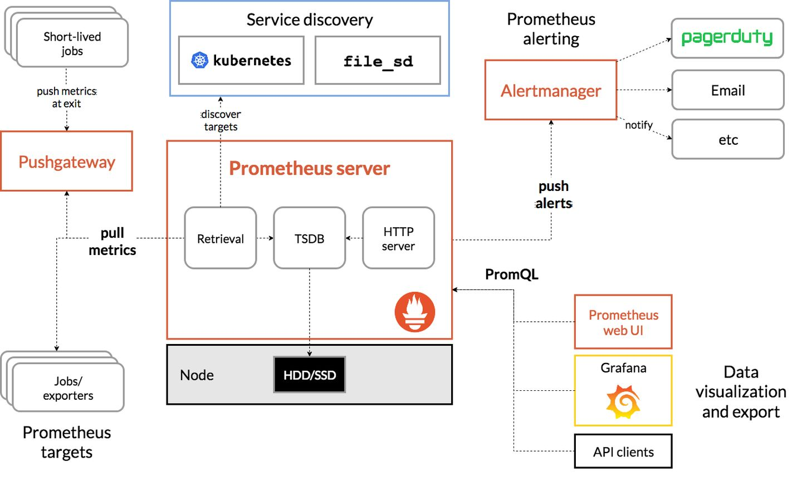
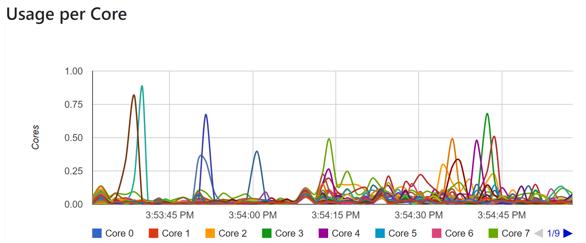
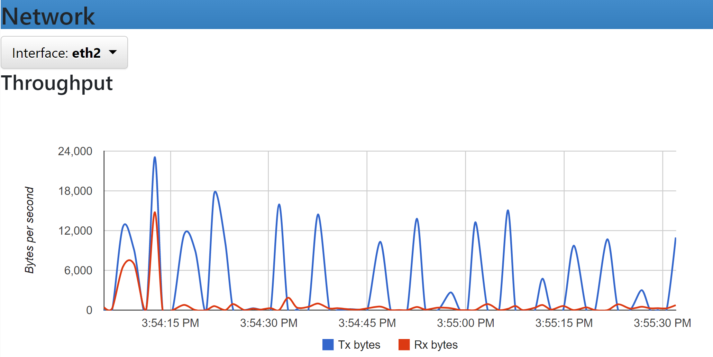
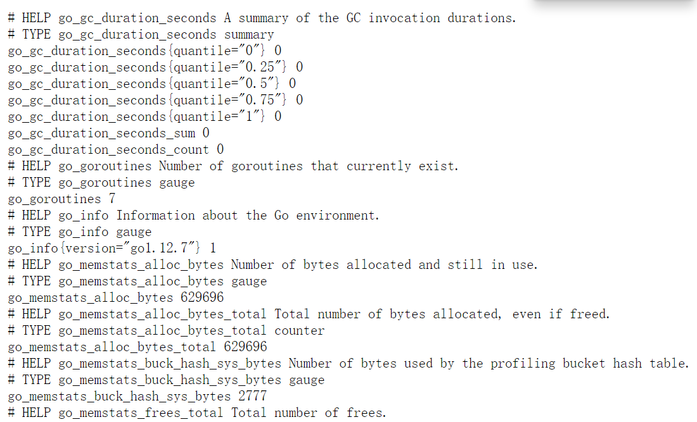
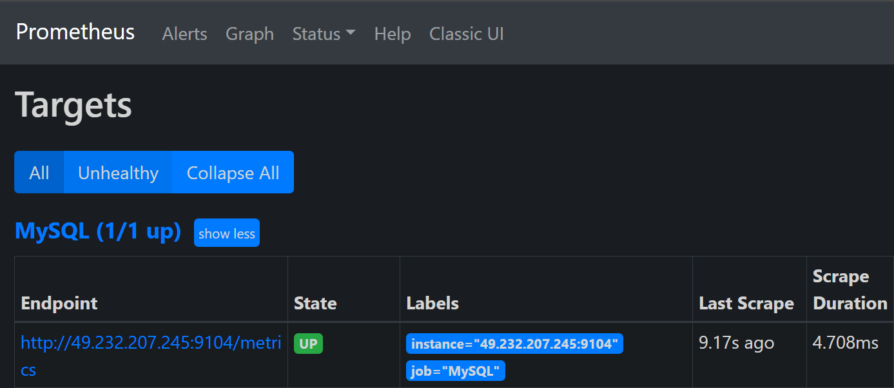

# Prometheus

Prometheus是一个开源的监控解决方案

## Prometheus架构

Prometheus生态圈由多个组件构成，其中许多组件是可选的

- **Prometheus Server**
  
  用于收集、存储和查询时间序列数据。
  通过**静态配置文件**（prometheus.yml）管理监控目标，也可以配合使用**动态服务发现**的方式动态管理监控目标，并从这些监控目标中获取数据，然后将采集到的数据按照时间序列的方式存储在本地磁盘当中或者外部的时序数据库中，可通过PromQL语言对数据的查询以及分析。
  
- **Client Library**
  
  为被监控的应用生成相应的**指标**(Metric)数据并暴露给Prometheus Server，当Prometheus Server来拉取时直接返回**实时状态**的指标数据。
  
- **Push Gateway**
  
  相当于一个代理服务，独立部署。它没有数据拉取功能，只能被动的等待数据推送。
  
  主要用于短期存在的Jobs，由于这类Jobs存在时间较短，可能在Prometheus Server来拉取数据之前就消失了。所以，这些Jobs可以直接向Push Gateway推送它们的指标数据，等到这些jobs把数据推送到Push Gateway后，Prometheus Server再从Push Gateway拉取。
  
  当由于子网络或者防火墙的原因，Prometheus Server不能直接拉取各个Target的指标数据，此时可以让各个Target往Push Gateway上推送数据，然后Prometheus去PushGateway上定时拉取
  
  在监控各个业务数据时，需要将各个不同的业务数据进行统一汇总，此时也可以采用Push Gateway来统一收集数据，然后Prometheus Server在来统一拉取
  
  即使jobs推送了所有的数据到Push Gateway，Prometheus Server也不是每次都拉取这个期间推上来的所有数据，而是只拉取jobs最后一次推送的数据。如果jobs一直没有推送新的指标（Metric）到Push Gateway，那么Prometheus Server将始终拉取最后推送上的数据，直到指标消失（默认5分钟）
  
- Exporters
  
  用于暴露已有的第三方服务的指标数据通过HTTP服务的形式暴露给Prometheus Server，比如HAProxy、StatsD、Graphite等等。
  Prometheus Server周期性的从Exporter暴露的HTTP服务地址（通常是/metrics）拉取监控样本数据
  
  输出被监控组件信息的HTTP接口被叫做exporter
  
- Alertmanager
  
  从Prometheus Server接收到告警后，Alertmanager会进行去除重复数据，分组，并路由到接收方，发出报警。
  AlertManager支持自定义告警规则。告警方式也非常灵活，支持通过邮件、slack或钉钉等多种途径发出告警。



工作流程是：

1. Prometheus Server从HTTP接口或者从Push Gateway拉取指标（Metric）数据。
2. Prometheus Server在本地存储所有采集的指标（Metric）数据，并在这些数据上运行规则，从现有数据中聚合和记录新的时间序列生成告警。
3. Alertmanager根据配置文件，对接收到的告警进行处理，发出报警。
4. 在Grafana或其他API客户端中，可视化收集的数据。

> Prometheus其实并不需要每一个精确的数据，长期保存的是中等或者低精度的数据。它每次只抓取一个数据，在固定的频率下。也能形成某种数据的趋势。


## Prometheus数据模型

Prometheus会将所有采集到的监控数据以**时间序列**的方式保存在内存数据库中，并定时保存到硬盘上。

每一条数据由三部分组成

- **指标**（Metric）：由**指标名称**和描述当前数据特征的**标签**组成
- **时间戳**（Timestamp）：一个精确到毫秒的时间戳
- **数据值**（Value）：一个float64的浮点型数据表示当前数据的值

### 指标(Metric)

**指标格式**

`指标名称{标签名称="标签值", ...}`

标签（Label）反映了当前数据的特征维度，通过这些维度Prometheus可以对数据进行过滤，聚合等操作

**指标类型**

Prometheus定义了4种不同的指标类型(Metric Type)

- **Counter**（计数器）
- **Gauge**（仪表盘）
- **Histogram**（直方图）
- **Summary**（摘要）


**Counter**

Counter类型和计数器一样，只增不减（除非系统发生重置）

一般在定义Counter类型指标的名称时推荐使用_total作为后缀。比如Prometheus Server中prometheus_http_requests_total表示Prometheus处理的HTTP请求总数

```text
# HELP prometheus_http_requests_total Counter of HTTP requests.
# TYPE prometheus_http_requests_total counter
prometheus_http_requests_total{code="200",handler="/api/v1/label/:name/values"} 3
prometheus_http_requests_total{code="200",handler="/api/v1/query"} 5
prometheus_http_requests_total{code="200",handler="/api/v1/query_range"} 15
prometheus_http_requests_total{code="200",handler="/graph"} 3
prometheus_http_requests_total{code="200",handler="/metrics"} 23
```

**Gauge**

Gauge类型侧重于反应系统的某一个**瞬时的值**，可增可减

比如Prometheus Server中go_threads表示Prometheus当前go线程的数量

```text
# HELP go_threads Number of OS threads created.
# TYPE go_threads gauge
go_threads 13
```

**Histogram**

Histogram类型由`_bucket{le=""}`，`_bucket{le="+Inf"}`, `_sum`，`_count`组成。

主要用于表示**一段时间范围内**对数据进行采样的结果，并能够对其指定区间以及总数进行统计（通常展示为直方图）

比如Prometheus Server中prometheus_http_response_size_bytes

```text
# HELP prometheus_http_response_size_bytes Histogram of response size for HTTP requests.
# TYPE prometheus_http_response_size_bytes histogram
prometheus_http_response_size_bytes_bucket{handler="/",le="100"} 1
prometheus_http_response_size_bytes_bucket{handler="/",le="1000"} 1
prometheus_http_response_size_bytes_bucket{handler="/",le="1e+06"} 1
prometheus_http_response_size_bytes_bucket{handler="/",le="+Inf"} 1
prometheus_http_response_size_bytes_sum{handler="/"} 29
prometheus_http_response_size_bytes_count{handler="/"} 1
```

**Summary**

Summary类型由 `{quantile="<φ>"}`，`_sum`，`_count` 组成。

主要用于表示**一段时间内**数据采样结果，它直接存储了**分位数据**而不是根据统计区间计算出来。

比如Prometheus Server中prometheus_target_interval_length_seconds

```text
# HELP prometheus_target_interval_length_seconds Actual intervals between scrapes.
# TYPE prometheus_target_interval_length_seconds summary
prometheus_target_interval_length_seconds{interval="15s",quantile="0.01"} 14.9986249
prometheus_target_interval_length_seconds{interval="15s",quantile="0.05"} 14.998999
prometheus_target_interval_length_seconds{interval="15s",quantile="0.5"} 15.0000428
prometheus_target_interval_length_seconds_sum{interval="15s"} 315.0013755
prometheus_target_interval_length_seconds_count{interval="15s"} 21
```


## Prometheus数据获取

Prometheus主要是通过拉取pull的方式获取数据

Prometheus每隔一段时间会从配置的**目标target**（获取数据的url）以Http协议拉取**指标metrics**，这些目标可以是应用，也可以是代理，缓存中间件，数据库等等一些中间件（需要服务端提供http的接口来获取实时的数据）

Prometheus会将拉取出来的数据存到自己的TSDB时序数据库。Prometheus的WebUI控制台以及Grafana可以对数据进行时间范围内的不断查询，绘制成实时图表工展现

Prometheus支持例如zookeeper，consul之类的服务发现中间件，用以对目标target的自动发现。而不用一个个去配置


## 配置Prometheus

访问Web管理页面( http://49.232.207.245:9090 )可以看到Prometheus服务正确启动

```bash
# 拉取镜像
docker pull prom/prometheus

# 下载prometheus的配置文件并将其存放在/root/aiops/prometheus/Config路径下 https://github.com/prometheus/prometheus/blob/master/documentation/examples/prometheus.yml

# 启动容器
# -v: 挂载到容器内/etc/prometheus/prometheus.yml
docker run --name myPrometheus \
-d -p 9090:9090 \
-v /root/aiops/prometheus/Config/prometheus.yml:/etc/prometheus/prometheus.yml \
prom/prometheus

docker run --name inkPrometheus \
-d -p 9090:9090 \
-v /home/dog/yinke/prometheus/config/prometheus.yml:/etc/prometheus/prometheus.yml \
prom/prometheus
```


## 配置Exporter

Prometheus服务负责收集、存储、查看监控数据。真正直接进行监控通过Exporter完成

Exporter相当于是Prometheus服务的客户端，负责向其提供监控数据，针对不同的被监控目标需要使用不同的Exporter

- 查看已知的端口是否被占用：`netstat -anp |grep 8089`

- 查看服务器已使用的所有端口：`netstat  -nultp`

> Exporter的实例称为Target，Prometheus通过轮询的方式定时从这些Target中获取监控数据样本，并且存储在数据库当中
>
> 使用一个Node Exporter用来采集监控的主机的运行状态(CPU、内存、磁盘等参数)，一般不推荐使用Docker来部署Node Exporter
>
> i386=Intel 80386，i386通常被用来作为对Intel（英特尔）32位微处理器的统称
>
> AMD64又称x86-64或x64”，是一种64位元的电脑处理器架构。它是建基于现有32位元的x86架构，由AMD公司所开发
>
> 简单理解： i386是32位的版本，amd64是64位的版本
>
> 报错：level=info ts=2020-07-18T04:38:46.494Z caller=tls_config.go:170 msg="TLS is disabled and it cannot be enabled on the fly." http2=false
>
> 原因：node_exporter版本升到1.0.0之后，因为安全性考虑支持了TLS，所以要添加证书


```bash
# 下载 node exporter(64bit)
wget https://github.com/prometheus/node_exporter/releases/download/v1.1.2/node_exporter-1.1.2.linux-amd64.tar.gz

# 解压
tar xvfz node_exporter-1.1.2.linux-amd64.tar.gz

# 移动到exporter 目录下
mkdir exporter
mv node_exporter-1.1.2.linux-amd64/* exporter

# 进入目录
# 将node_exporter和node_exporter.crt和node_exporter.key放在同一个目录
cd exporter

# 生成证书
# 得到node_exporter.crt和node_exporter.key两个文件
openssl req -new -newkey rsa:2048 -days 3650 -nodes -x509 -keyout node_exporter.key -out node_exporter.crt -subj "/C=CN/ST=Beijing/L=Beijing/O=test.cn/CN=localhost"

# 编写配置文件
vim config.yaml

# 复制进去
tls_server_config:
  cert_file: node_exporter.crt
  key_file: node_exporter.key

# 查看node_exporter是否正常
./node_exporter --version

# 使用配置文件启动
./node_exporter --web.config=config.yaml
```

通过 http://49.232.207.245:9100/metrics 可以看到采集的监控数据

在Prometheus服务的配置文件prometheus.yml中添加相应的配置就可以收集Node Exporter的监控数据

- 在scrape_configs下添加一个新的job
- **重启prometheus服务**然后进入其Web管理页面http://49.232.207.245:9090

- 输入up，点击Execute按钮，可看到刚刚添加的job（1表示正常，0表示异常）


> 访问http://49.232.207.245:9090/targets查看页面

```yaml
...
scrape_configs:
  # The job name is added as a label `job=<job_name>` to any timeseries scraped from this config.
  - job_name: 'prometheus'

    # metrics_path defaults to '/metrics'
    # scheme defaults to 'http'.

    static_configs:
    - targets: ['localhost:9090']

  # 收集主机的监控数据  
  - job_name: 'ink'
  	# 每隔5秒钟从http://IP:Port/actuator/prometheus拉取指标
  	scrape_interval: 5s
  	scheme: https
    tls_config:
      ca_file: node_exporter.crt
    metrics_path: '/actuator/prometheus'
    static_configs:
    # 多个node_exporter，在targets数组后面加即可
    - targets: ['49.232.207.245:9090']
```


**docker部署**

[Prometheus Exporter for machine metrics ](https://github.com/prometheus/node_exporter#using-docker)

node_exporter不建议将其部署为Docker容器，因为它需要访问主机系统。

如果要部署Docker以进行主机监视，必须使用一些额外的标志来允许node_exporter访问主机名称空间。指定`path.rootfs`参数，此参数必须与host root的bind-mount中的路径匹配。node_exporter将`path.rootfs`用作访问主机文件系统的前缀

> 注意：要监视的所有非root挂载点都需要绑定挂载到容器中

```bash
docker run -d \
  --net="host" \
  --pid="host" \
  -v "/:/host:ro,rslave" \
  quay.io/prometheus/node-exporter:latest \
  --path.rootfs=/host	
  
  
# 脚本运行  
cat > run_node_exporter.sh << 'EOF'
docker stop node_exporter
docker rm node_exporter
docker run -d --name node_exporter \
	--restart=always \
	--net="host" \
	--pid="host" \
	-v "/proc:/host/proc:ro" \
	-v "/sys:/host/sys:ro" \
	-v "/:/rootfs:ro" \
	prom/node-exporter \
	--path.procfs=/host/proc \
	--path.rootfs=/rootfs \
	--path.sysfs=/host/sys \
	--collector.filesystem.ignored-mount-points='^/(sys|proc|dev|host|etc)($$|/)'
EOF
sh run_node_exporter.sh
```

# Grafana

Grafana是一个开源的跨平台的度量分析、可视化工具

## 配置Grafana

访问http://49.232.207.245:3000进入Grafana的Web页面

默认账号密码均为admin，进入后修改密码（123456）

```bash
# 拉取镜像
docker pull grafana/grafana

# 启动容器
docker run --name iGrafana \
-d -p 3000:3000 \
grafana/grafana
```


## 添加数据源

- 设置`Configuration`
- 选择`Data Sources`
- 点击`Add data source`，
- 选择`Time series databases`时序数据库中的`Prometheus`
- 填写数据源名称和URL地址http://49.232.207.245:9090并保存


## 配置仪表盘

在Grafana中可以自定义各种监控所需的仪表盘

> 完全自己搭建较麻烦，可在现有模板的基础上根据需要进行微调

进入Grafana官网( [https://grafana.com](https://link.zhihu.com/?target=https%3A//grafana.com) )，选择仪表盘


过滤出适用Node Exporter类型的相关模板

- 选择中文版本
- 复制该**模板ID-8919**（9276）


回到Grafana的Web管理页面

- 点加号选择import导入模板，输入模板ID
- 点击loda，在VictoriaMetrics中选择Prometheus，点击import


# 配置cAdvisor

cAdvisor是Google一款开源的用于分析、展示容器运行状态的可视化工具，用于监控Dcoker整体的运行情况

cAdvisor原生支持Prometheus

```bash
# 拉取镜像
docker pull google/cadvisor

# 启动容器
docker run --name=mycAdvisor \
  -p 8081:8080 -d \
  -v /:/rootfs:ro \
  -v /var/run:/var/run:ro \
  -v /sys:/sys:ro \
  -v /var/lib/docker/:/var/lib/docker:ro \
  -v /dev/disk/:/dev/disk:ro \
  --privileged \
  --device=/dev/kmsg \
  google/cadvisor
```

在prometheus.yml配置文件添加job并重启Prometheus服务

```yaml
...
scrape_configs:
  # The job name is added as a label `job=<job_name>` to any timeseries scraped from this config.
  - job_name: 'prometheus'

    # metrics_path defaults to '/metrics'
    # scheme defaults to 'http'.

    static_configs:
    - targets: ['localhost:9090']

  # 收集Docker容器的监控数据
  - job_name: 'cAdvisor'
    static_configs:
    - targets: ['49.232.207.245:8080']
```

访问 http://49.232.207.245:8080 查看监控页面（Docker中整体及各容器的监控指标）






访问http://49.232.207.245:8080/metrics 查看到采集的监控数据


进入Grafana官网( [https://grafana.com](https://link.zhihu.com/?target=https%3A//grafana.com) )，选择适用于cAdvisor的模板

过滤条件：

- Name/Description=cAdvisor
- Data Source=Prometheus

复制**模板ID—893**

导入


# 监控MySQL

访问http://49.232.207.245:9104/metrics可查看MySQLD Exporter采集的MySQL监控数据

```bash
# 拉取镜像
docker pull prom/mysqld-exporter

# 启动容器
docker run -d --name mysqldExporter \
-p 9104:9104 \
-e DATA_SOURCE_NAME="root:123456@(49.232.207.245:3306)/"  \
prom/mysqld-exporter
```



在Prometheus服务的配置文件prometheus.yml中添加相应的配置，收集MySQLD Exporter的监控数据

重启Prometheus服务

```yaml
vim prometheus.yml

...
scrape_configs:
  # The job name is added as a label `job=<job_name>` to any timeseries scraped from this config.
  - job_name: 'prometheus'

    # metrics_path defaults to '/metrics'
    # scheme defaults to 'http'.

    static_configs:
    - targets: ['localhost:9090']

  # 收集MySQL的监控数据      
  - job_name: 'MySQL'
    static_configs:
    - targets: ['49.232.207.245:9104']
```



进入Grafana官网( [https://grafana.com](https://link.zhihu.com/?target=https%3A//grafana.com) )，选择适用于监控MySQL的模板选择仪表盘

过滤条件：

- Name/Description：mysql 
- Data Source：Prometheus

复制**模板ID—12826**

导入


