# Prometheus

Prometheus是一个开源的监控解决方案

## Prometheus架构

Prometheus生态圈由多个组件构成，其中许多组件是可选的

- **Prometheus Server**
  
  - 用于收集、存储和查询时间序列数据
  - 通过**静态配置文件**（`prometheus.yml`）管理监控目标，也可以配合使用**动态服务发现**的方式动态管理监控目标，并从这些监控目标中获取数据，然后将采集到的数据**按照时间序列的方式存储**在本地磁盘当中或者外部的时序数据库中，可通过**PromQL语言**对数据的查询以及分析
  
- **Client Library**
  
  为被监控的应用**生成相应的指标**（Metric）数据并暴露给Prometheus Server，当Prometheus Server来拉取时直接返回**实时状态**的指标数据
  
- **Push Gateway**
  
  - 相当于一个代理服务，**独立部署**。它没有数据拉取功能，**只能被动的等待数据推送**
  - 主要用于短期存在的Jobs，这类Jobs由于存在时间较短，可能在Prometheus Server来拉取数据之前就消失了。所以这些Jobs可以直**接向Push Gateway推送它们的指标数据**，等到这些jobs把数据推送到Push Gateway后，P**rometheus Server再从Push Gateway拉取**
  - 当由于子网络或者防火墙的原因，Prometheus Server不能直接拉取各个目标（target）的指标数据，此时可以让各个目标（target）往Push Gateway上推送数据，然后Prometheus Server去PushGateway上定时拉取
  - 在监控各个业务数据时，需要**将各个不同的业务数据进行统一汇总**，此时也可以采用Push Gateway来统一收集数据，然后Prometheus Server在来统一拉取
  
  > 即使jobs推送了所有的数据到Push Gateway，Prometheus Server也不是每次都拉取这个期间推上来的所有数据，而是**只拉取jobs最后一次推送的数据**。如果jobs一直没有推送新的指标（Metric）到Push Gateway，那么Prometheus Server将始终拉取最后推送上的数据，直到指标消失（默认5分钟）
  
- **Exporters**
  
  输出被监控组件信息的HTTP接口被叫做`exporter`
  
  - 用于暴露已有的第三方服务的指标（Metric）数据**通过HTTP服务的形式**暴露给Prometheus Server，比如HAProxy、StatsD、Graphite等
    Prometheus Server周期性的从Exporter暴露的HTTP服务地址（通常是/metrics）拉取监控样本数据
  
- **Alertmanager**
  
  - 从Prometheus Server接收到告警后，Alertmanager会进行去除重复数据，分组，并路由到接收方，发出报警。
  - AlertManager支持自定义告警规则。告警方式也非常灵活，支持通过邮件、slack或钉钉等多种途径发出告警。


## Prometheus工作流程

1. Prometheus Server从HTTP接口或者从Push Gateway拉取指标（Metric）数据
2. Prometheus Server在本地存储所有采集的指标（Metric）数据，并在这些数据上运行规则，从现有数据中聚合和记录新的时间序列生成告警
3. Alertmanager根据配置文件，对接收到的告警进行处理，发出报警
4. 在Grafana或其他API客户端中，可视化收集的数据

> Prometheus其实并不需要每一个精确的数据，长期保存的是中等或者低精度的数据。它每次只抓取一个数据，在固定的频率下。也能形成某种数据的趋势。


## Prometheus数据模型

Prometheus会将所有采集到的监控数据以**时间序列**的方式保存在内存数据库中并定时保存到硬盘上

**数据组成**

- **指标**（Metric）：由**指标名称**和描述当前**数据特征的标签**组成
- **时间戳**（Timestamp）：一个精确到毫秒的时间戳
- **数据值**（Value）：一个float64的浮点型数据表示当前数据的值

Prometheus是一个**时序数据库**，**相同指标相同标签的数据构成一条时间序列**

如果以传统数据库的概念来理解时序数据库

- 指标名是表名
- 标签是字段
- Timestamp是主键
- float64类型的字段表示值（

> Prometheus 里面所有值都是按 float64 存储

**指标（Metric）**

- **指标格式**

  `指标名称{标签名称="标签值"}`

  - 标签（Label）：反映了当前数据的特征维度，Prometheus通过这些维度可以对数据进行过滤，聚合等操作


例

`promhttp_metric_handler_requests_total{code="200",instance="192.168.0.107:9090",job="prometheus"} 106`

- 指标名称：`promhttp_metric_handler_requests_total`
- 标签：
  - code
  - instance
  - job
- 值：106

- **指标类型**

  Prometheus定义了4种不同的指标类型（Metric Type）

  - **Counter**（计数器）
  - **Gauge**（仪表盘）
  - **Histogram**（直方图）
  - **Summary**（摘要）

**Counter**

- Counter类型和计数器一样，只增不减（除非系统发生重置）

- 一般在定义Counter类型指标的名称时推荐使用`_total`作为后缀。比如Prometheus Server中`prometheus_http_requests_total`表示Prometheus处理的HTTP请求总数


```text
# HELP prometheus_http_requests_total Counter of HTTP requests.
# TYPE prometheus_http_requests_total counter
prometheus_http_requests_total{code="200",handler="/api/v1/label/:name/values"} 3
prometheus_http_requests_total{code="200",handler="/api/v1/query"} 5
prometheus_http_requests_total{code="200",handler="/api/v1/query_range"} 15
prometheus_http_requests_total{code="200",handler="/graph"} 3
prometheus_http_requests_total{code="200",handler="/metrics"} 23
```

**Gauge**

- Gauge类型侧重于反应系统的某一个**瞬时的值**，可增可减

- 比如Prometheus Server中`go_threads`表示Prometheus当前go线程的数量


```text
# HELP go_threads Number of OS threads created.
# TYPE go_threads gauge
go_threads 13
```

**Histogram**

- 主要用于表示**一段时间范围内**对数据进行采样的结果，并能够对其指定区间以及总数进行统计（通常展示为直方图）
- Histogram类型由`_bucket{le=""}`，`_bucket{le="+Inf"}`, `_sum`，`_count`组成
- 比如Prometheus Server中`prometheus_http_response_size_bytes`


```text
# HELP prometheus_http_response_size_bytes Histogram of response size for HTTP requests.
# TYPE prometheus_http_response_size_bytes histogram
prometheus_http_response_size_bytes_bucket{handler="/",le="100"} 1
prometheus_http_response_size_bytes_bucket{handler="/",le="1000"} 1
prometheus_http_response_size_bytes_bucket{handler="/",le="1e+06"} 1
prometheus_http_response_size_bytes_bucket{handler="/",le="+Inf"} 1
prometheus_http_response_size_bytes_sum{handler="/"} 29
prometheus_http_response_size_bytes_count{handler="/"} 1
```

**Summary**

- 主要用于表示**一段时间内**数据采样结果，它直接存储了**分位数据**而不是根据统计区间计算出来
- Summary类型由 `{quantile="<φ>"}`，`_sum`，`_count` 组成

- 比如Prometheus Server中`prometheus_target_interval_length_seconds`


```text
# HELP prometheus_target_interval_length_seconds Actual intervals between scrapes.
# TYPE prometheus_target_interval_length_seconds summary
prometheus_target_interval_length_seconds{interval="15s",quantile="0.01"} 14.9986249
prometheus_target_interval_length_seconds{interval="15s",quantile="0.05"} 14.998999
prometheus_target_interval_length_seconds{interval="15s",quantile="0.5"} 15.0000428
prometheus_target_interval_length_seconds_sum{interval="15s"} 315.0013755
prometheus_target_interval_length_seconds_count{interval="15s"} 21
```


## Prometheus数据获取

Prometheus主要是通过**拉取**（pull）的方式获取数据

Prometheus每隔一段时间会从配置的**目标（target）**（获取数据的url）以Http协议拉取**指标（metrics）**，这些目标（target）可以是应用，也可以是代理，缓存中间件，数据库等等一些中间件

> 需要服务端提供http的接口来获取实时的数据

Prometheus会将拉取出来的数据存到**自己的TSDB时序数据库**

Prometheus的WebUI控制台以及Grafana可以对数据进行时间范围内的不断查询，绘制成实时图表工展现

Prometheus支持例如zookeeper，consul之类的服务发现中间件，用以对目标（target）的自动发现。而不用一个个去配置

## Prometheus配置文件

Prometheus 默认的配置文件分为四部分

- global：Prometheus 的全局配置
  -  `scrape_interval` 表示多久抓取一次数据
  - `evaluation_interval` 表示多久检测一次告警规则
- alerting：关于Alertmanager的配置
- rule_files：告警规则
- scrape_config：定义了 Prometheus 要抓取的目标
  - 默认已经配置了一个名称为 `prometheus` 的 job，这是Prometheus在启动的时候也会通过HTTP接口暴露自身的指标数据（相当于 Prometheus自己监控自己）可以访问 http://localhost:9090/metrics查看 Prometheus暴露的指标


## 部署Prometheus Server

访问Web管理页面( http://10.2.14.105:9090 )可以看到Prometheus服务正确启动

```bash
# 拉取镜像
docker pull prom/prometheus

# 下载prometheus的配置文件并将其存放在/home/dog/yinke/prometheus/config路径下 https://github.com/prometheus/prometheus/blob/master/documentation/examples/prometheus.yml

# 启动容器
# -v: 挂载到容器内的/etc/prometheus/prometheus.yml
docker run --name inkPrometheus \
-d -p 9090:9090 \
-v /home/dog/yinke/prometheus/config/prometheus.yml:/etc/prometheus/prometheus.yml \
prom/prometheus
```


# Exporters

Prometheus服务负责收集、存储、查看监控数据，真正**直接进行监控通过Exporters完成**

Exporters相当于是Prometheus服务的客户端，**负责向其提供监控数据**，针对不同的被监控目标需要使用不同的Exporter

Exporters的实例称为目标（Target），Prometheus通过轮询的方式定时从这些目标（Target）中获取监控数据样本，并且存储在数据库中

[Exporters | Prometheus](https://prometheus.io/docs/instrumenting/exporters/)

> i386是32位的版本，amd64是64位的版本
>
> - i386=Intel 80386，i386通常被用来作为对Intel（英特尔）32位微处理器的统称
>
> - AMD64又称x86-64或x64”，是一种64位元的电脑处理器架构。它是建基于现有32位元的x86架构，由AMD公司所开发

**直接部署**

> **配置报错**
>
> level=info ts=2020-07-18T04:38:46.494Z caller=tls_config.go:170 msg="TLS is disabled and it cannot be enabled on the fly." http2=false
>
> **原因**
>
> node_exporter版本升到1.0.0之后，因为安全性考虑支持了TLS，所以要添加证书

通过 http://49.232.207.245:9100/metrics 可以看到采集的监控数据

```bash
# 下载 node exporter(64bit)
wget https://github.com/prometheus/node_exporter/releases/download/v1.1.2/node_exporter-1.1.2.linux-amd64.tar.gz
wget https://github.com/prometheus/node_exporter/releases/download/v0.16.0/node_exporter-0.16.0.linux-amd64.tar.gz

# 解压
tar xvfz node_exporter-1.1.2.linux-amd64.tar.gz

# 移动到exporter 目录下
mkdir exporter
mv node_exporter-1.1.2.linux-amd64/* exporter

# 进入目录
# 将node_exporter和node_exporter.crt和node_exporter.key放在同一个目录
cd exporter

# 生成证书
# 得到node_exporter.crt和node_exporter.key两个文件
openssl req -new -newkey rsa:2048 -days 3650 -nodes -x509 -keyout node_exporter.key -out node_exporter.crt -subj "/C=CN/ST=Beijing/L=Beijing/O=test.cn/CN=localhost"

# 编写配置文件
vim config.yaml

# 复制进去
tls_server_config:
  cert_file: node_exporter.crt
  key_file: node_exporter.key

# 查看node_exporter是否正常
./node_exporter --version

# 使用配置文件启动
./node_exporter --web.config=config.yaml
```


**docker部署**

[Monitoring Linux host metrics with the Node Exporter](https://prometheus.io/docs/guides/node-exporter/)

[Prometheus Exporter for machine metrics ](https://github.com/prometheus/node_exporter#using-docker)

官方不建议将node_exporter部署为Docker容器，因为它需要访问主机系统。

如果要部署Docker以进行主机监控，必须使用一些额外的参数来允许node_exporter访问主机名称空间。

`path.rootfs`参数，此参数必须与`host root`的`bind-mount`中的路径匹配。node_exporter将`path.rootfs`用作**访问主机文件系统的前缀**

> 要监视的所有非root挂载点都需要绑定挂载到容器中

```bash
docker run -d \
  --net="host" \
  --pid="host" \
  -v "/:/host:ro,rslave" \
  quay.io/prometheus/node-exporter \
  --path.rootfs /host
  
# 查看
curl http://localhost:9100/metrics
curl http://localhost:9100/metrics | grep "node_"
```

**配置**

在Prometheus服务的配置文件`prometheus.yml`中添加相应的配置来收集Node Exporter的监控数据

1. 在`scrape_configs`下添加一个新的job
2. **重启prometheus服务**然后进入Web管理页面 http://10.2.14.105:9090
3. 输入`up`，点击Execute按钮，可看到刚刚添加的job（1表示正常，0表示异常）

```yaml
...
scrape_configs:
  # The job name is added as a label `job=<job_name>` to any timeseries scraped from this config.
  - job_name: 'prometheus'

    # metrics_path defaults to '/metrics'
    # scheme defaults to 'http'.

    static_configs:
    - targets: ['localhost:9090']

  # 收集主机的监控数据  
  - job_name: 'exporter'
  	# 每隔5秒钟从http://IP:Port/actuator/prometheus拉取指标
  	scrape_interval: 5s
  	# scheme: https
    # tls_config:
    #   ca_file: node_exporter.crt
    # metrics_path: '/actuator/prometheus'
    static_configs:
    # 多个node_exporter，在targets数组后面加即可
    - targets: ['10.2.14.105:9100']
```


# 数据查询

进入http://10.2.14.105:9090

- Alerts：展示了定义的所有告警规则
- Status：可以查看各种Prometheus的状态信息
- Graph：可以使用PromQL查询数据，还可以通过 Prometheus 提供的 HTTP API 来查询数据
  - 查询的监控数据有列表和曲线图两种展现形式（对应上图中 Console 和 Graph 这两个标签）

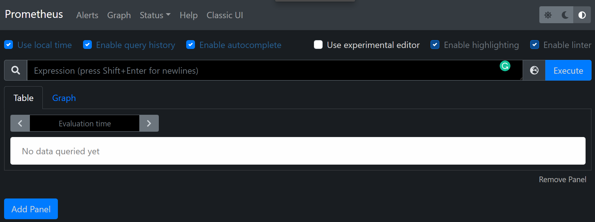


**查询**

`promhttp_metric_handler_requests_total`：表示 `/metrics` 页面的访问次数


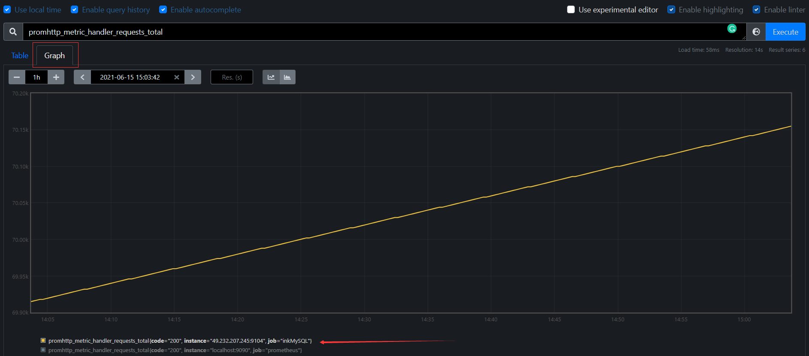


## PromQL 

**Prometheus Query Language**

`(1-(sum(increase(node_cpu_seconds_total{mode="idle"}[2m]))by(instance)) / (sum(increase(node_cpu_seconds_total[2m]))by(instance))) *100`


### sum

`sum()` 

叠加函数，可以将多核CPU进行合并为一个整体

### increase

`increase({}[time])`

针对 Counter这种持续增长的数值，截取其中一段时间的**增量**

### by 

`by()` 

这个函数可以把`sum`合并到一起的数值，按照**指定的方式进行拆分**

`by(instance)` 按照集群节点进行拆分

### CPU利用率

直接执行`node_cpu_seconds_total`查询后会出现很多监控指标，其中各种类型的比如系统态、用户态都会由mode标签来区分

查出当前**空闲的CPU**百分比来计算利用率

**cpu使用时间**

> `mode`标签值为`idle`的为空闲

- 空闲CPU使用时间：`node_cpu_seconds_total{mode="idle"}`
- 全部CPU总共使用时间：`node_cpu_seconds_total)`

**两分钟之内的cpu使用时间增量**

- 全部CPU使用时间在2分钟内的增量：`increase(node_cpu_seconds_total[2m])` 
- 空闲CPU使用时间在2分钟内的增量：`increase(node_cpu_seconds_total{mode="idle"}[2m])`

**将多核CPU进行合并为一个整体**

> sum()函数默认情况下全部内容都会进行合并，不光是CPU的核心数，同时把机器也进行合并

- 集群所有主机空闲CPU使用时间在2分钟内的增量：`sum(increase(node_cpu_seconds_total{mode="idle"}[2m]))`
- 集群所有主机CPU使用时间在2分钟内的增量：`sum(increase(node_cpu_seconds_total[2m]))`

**按主机节点进行拆分**

- 集群所有节点空闲CPU使用时间在2分钟内的增量：`sum(increase(node_cpu_seconds_total{mode="idle"}[2m]))by(instance)`
- 集群所有节点CPU使用时间在2分钟内的增量：`sum(increase(node_cpu_seconds_total[2m]))by(instance)`

### 内存利用率

> 在用接口请求的时候，报错`parse error: unexpected identifier "node_memory_Cached_bytes`
>
> 分别请求的时候可以获取到值

内存的监控项没有像CPU一样区分了很多标签，因此内存监控相较于CPU则需要结合很多个监控项

- 总内存：node_memory_MemTotal_bytes 
- 空闲内存：node_memory_MemFree_bytes
- 缓存：node_memory_Cached_bytes
- 缓冲区内存：node_memory_Buffers_bytes

监控内存利用率：

1.  空闲内存 + 缓存 + 缓冲区内存 = 空闲总内存

   `(node_memory_MemFree_bytes + node_memory_Cached_bytes+node_memory_Buffers_bytes)`

2.  空闲总内存 / 总内存 = 空闲率

   `(node_memory_MemFree_bytes + node_memory_Cached_bytes+node_memory_Buffers_bytes) / node_memory_MemTotal_bytes * 100`

3. 100 - 空闲率 = 使用率

   `100 - ((node_memory_MemFree_bytes+node_memory_Cached_bytes+node_memory_Buffers_bytes) / node_memory_MemTotal_bytes * 100)`


## HTTP API

Prometheus还提供了一种**HTTP API**的方式，可以更灵活的将 PromQL 整合到其他系统中使用，实际上Prometheus 的Graph页面查询也是使用了 HTTP API

Prometheus API 使用了 JSON 格式的响应内容。 输入时间戳可以由 RFC3339 格式或 Unix 时间戳提供。输出时间戳以 Unix 时间戳的方式呈现

所有的 API请求返回的格式均使用JSON 格式。主要有以下几种查询类型：瞬时查询、范围查询、元数据查询、配置查询。

[HTTP API | Prometheus](https://prometheus.io/docs/prometheus/latest/querying/api/)

> Grafana就是通过 Prometheus 的 HTTP API 来查询指标数据的

- `GET /api/v1/query`
- `GET /api/v1/query_range`
- GET /api/v1/series
- GET /api/v1/label/<label_name>/values
- GET /api/v1/targets
- GET /api/v1/rules
- GET /api/v1/alerts
- GET /api/v1/targets/metadata
- GET /api/v1/alertmanagers
- GET /api/v1/status/config
- GET /api/v1/status/flags
- POST /api/v1/admin/tsdb/snapshot
- POST /api/v1/admin/tsdb/delete_series
- POST /api/v1/admin/tsdb/clean_tombstones

### query_range

URL请求参数

- `query=<string>` : PromQL 表达式
- `start=<rfc3339 | unix_timestamp>` : 起始时间戳
- `end=<rfc3339 | unix_timestamp>` : 结束时间戳
- `step=<duration | float>` : 查询时间步长，时间区间内每 step 秒执行一次。
- `timeout=<duration>` : 超时设置，可选参数，默认情况下使用全局设置的参数 `-query.timeout`


每个容器正在使用的CPU

## Python API

[prometheus-api-client-python](https://github.com/AICoE/prometheus-api-client-python)

http://10.2.14.95:32099/api/v1/query_range?query=sum(rate(container_cpu_usage_seconds_total%20[5m]))%20by(container_name)&start=2021-07-01T13:11:53Z&end=2021-07-01T14:21:53Z&step=12s

`sum(rate(container_cpu_usage_seconds_total [5m])) by(container_name)`


# Grafana

Grafana是一个开源的跨平台的度量分析、可视化工具

## Grafana配置

访问http://10.2.14.105/:3000进入Grafana的Web页面

默认账号密码均为admin，进入后修改密码（123456）

```bash
# 拉取镜像
docker pull grafana/grafana

# 启动容器
docker run --name iGrafana \
-d -p 3000:3000 \
grafana/grafana
```


## 添加数据源

1. 设置`Configuration`
2. 选择`Data Sources`
3. 点击`Add data source`，
4. 选择`Time series databases`时序数据库中的`Prometheus`
5. 填写数据源名称和URL地址http://10.2.14.105.9100并保存


## 仪表盘配置

在Grafana中可以自定义各种监控所需的仪表盘

> 完全自己搭建较麻烦，可在现有模板的基础上根据需要进行微调

进入Grafana官网( [https://grafana.com](https://link.zhihu.com/?target=https%3A//grafana.com) )，选择仪表盘

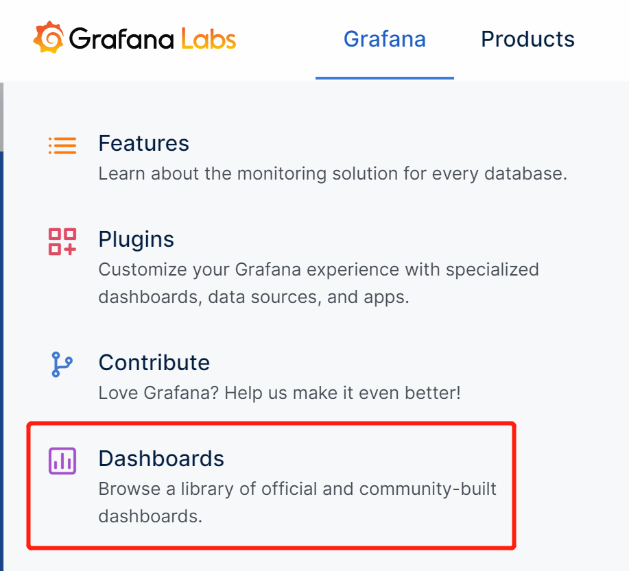

过滤出适用Node Exporter类型的相关模板

- 选择中文版本
- 复制该**模板ID-8919**（9276）


回到Grafana的Web管理页面

- 点加号选择import导入模板，输入模板ID
- 点击loda，在VictoriaMetrics中选择Prometheus，点击import

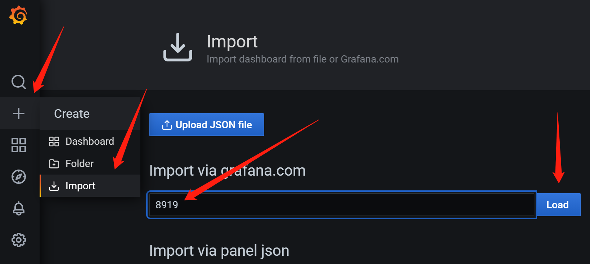


## Grafana嵌入

以`root`身份进入容器，修改Grafana配置文件

**缺省配置文件**

| 项目             | 设定值                  |
| ---------------- | ----------------------- |
| 默认配置文件目录 | /usr/share/grafana/conf |
| 默认配置文件名称 | defaults.ini            |

**配置文件设定方式**

- 使用`--config`指定配置文件
- 通过环境变量`GF_PATHS_CONFIG`指定配置文件

| 项目         | 设定值       |
| ------------ | ------------ |
| 配置文件目录 | /etc/grafana |
| 配置文件名称 | grafana.ini  |

> 分号`;`是`.ini`配置文件的标准注释方式，要去掉
>
> `:set nu` 显示行数
>
> `/`+搜索的内容
>
> 查看：`grep allow_embedding defaults.ini`

```bash
# 进入/usr/share/grafana
docker exec -u root -it 28f18fcc419f  /bin/sh
# 修改配置文件
vi defaults.ini

# 187行:允许嵌入
# set to true if you want to allow browsers to render Grafana in a <frame>, <iframe>, <embed> or <object>. default is false.
allow_embedding = true

# 313行:允许匿名登录
[auth.anonymous]
enabled = true

# 319行:需要保留editor的功能
org_role = Viewer Editor 

auto_assign_org_role llow_embedding/= Viewer

```

**修改loading图标**

修改`/usr/share/grafana/public/views/index.html`文件

> 删除loge标志
>
> 命令模式下（`ESC`）
>
> - dd：删除一行
> - yy：复制一行
> - p：粘贴

```html
.preloader__logo {
        display: inline-block;
        animation-name: preloader-squash;
        animation-duration: 0.9s;
        animation-iteration-count: infinite;
        width: 60px;
        height: 60px;
        background-repeat: no-repeat;
        background-size: contain;
        background-image: url("data:image/svg+xml,%3csvg version='1.1' id='Layer_1' xmlns='http://www.w3.org/2000/svg' xmlns:xlink='http://www.w3.org/1999/xl
      }
```

修改loading文字

```html
<div class="preloader__text">Loading Grafana</div>
```

添加代码

```html
window.addEventList("message", receiveMessage, false);
function receiveMessage(event) {
  console.log(event);
  if (event.data.showMenu === false){
	document.querySeletor('sidemenu').style.display = 'none';	
  }
}

<script>    
    document.addEventListener("keydown",function(e){        
        var event = e||window.event;        
        if(event.keyCode == 27){            
            event.returnValue = false;            
            event.stopPropagetion();        
        }    
    },true)script>
```


**重启Grafana服务**

选择`Embed`得到`iframe`链接


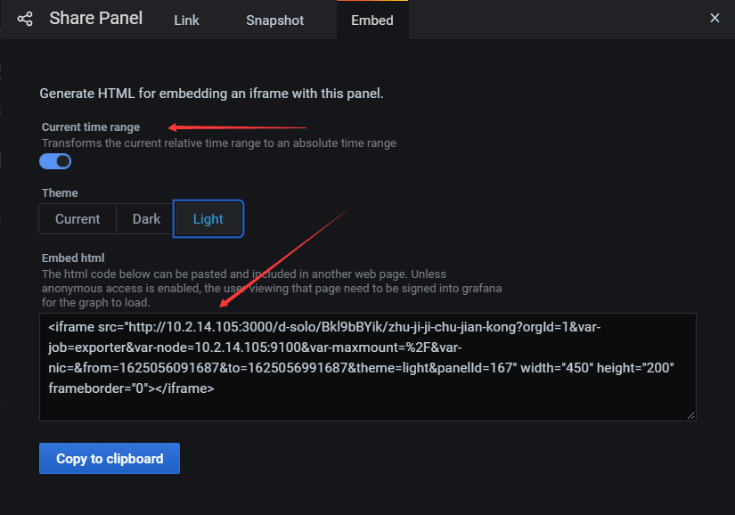

修改

- 添加`kiosk`参数
- 给`iframe`标签添加`@load`做后续操作

> kiosk参数（隐藏工具条，按ESC可返回（必要时候可以禁用按键）)

```html
<iframe src="http://10.2.14.105:3000/d-solo/Bkl9bBYik/zhu-ji-ji-chu-jian-kong?orgId=1&from=1625057045862&to=1625057046410&var-job=exporter&var-node=10.2.14.105:9100&var-maxmount=%2F&var-nic=&panelId=167&kiosk" width="450" height="200" frameborder="0" @load="load" id="gra"></iframe>
```

```javascript
    load() {
      document.getElementById('gra').contentWindow.postMessage({ showMenu: false },'*');
    },
```


# MySQL监控

[mysqld_exporter](https://github.com/prometheus/mysqld_exporter)是Prometheus官方提供的一个exporter

访问http://49.232.207.245:9104/metrics可查看MySQLD Exporter采集的MySQL监控数据

```bash
# 拉取镜像
docker pull prom/mysqld-exporter

# 启动容器
docker run -d --name mysqldExporter \
-p 9104:9104 \
-e DATA_SOURCE_NAME="root:123456@(49.232.207.245:3306)/"  \
prom/mysqld-exporter
```


在Prometheus服务的配置文件`prometheus.yml`中添加job

重启Prometheus服务

```yaml
vim prometheus.yml

...
scrape_configs:
  # The job name is added as a label `job=<job_name>` to any timeseries scraped from this config.
  - job_name: 'prometheus'

    # metrics_path defaults to '/metrics'
    # scheme defaults to 'http'.

    static_configs:
    - targets: ['localhost:9090']

  # 收集MySQL的监控数据      
  - job_name: 'MySQL'
    static_configs:
    - targets: ['49.232.207.245:9104']
```


进入Grafana官网( [https://grafana.com](https://link.zhihu.com/?target=https%3A//grafana.com) )，选择适用于监控MySQL的模板选择仪表盘

过滤条件：

- Name/Description：mysql 
- Data Source：Prometheus

复制**模板ID—12826**

导入


# CAdvisor配置

cAdvisor是Google一款开源的用于分析、展示容器运行状态的可视化工具，用于监控Dcoker整体的运行情况

> cAdvisor原生支持Prometheus

```bash
# 拉取镜像
docker pull google/cadvisor

# 启动容器
docker run --name=mycAdvisor \
  -p 8081:8080 -d \
  -v /:/rootfs:ro \
  -v /var/run:/var/run:ro \
  -v /sys:/sys:ro \
  -v /var/lib/docker/:/var/lib/docker:ro \
  -v /dev/disk/:/dev/disk:ro \
  --privileged \
  --device=/dev/kmsg \
  google/cadvisor
```

在`prometheus.yml`配置文件中添加job

重启Prometheus服务

```yaml
...
scrape_configs:
  # The job name is added as a label `job=<job_name>` to any timeseries scraped from this config.
  - job_name: 'prometheus'

    # metrics_path defaults to '/metrics'
    # scheme defaults to 'http'.

    static_configs:
    - targets: ['localhost:9090']

  # 收集Docker容器的监控数据
  - job_name: 'cAdvisor'
    static_configs:
    - targets: ['10.2.14.105:8081']
```

访问 http://10.2.14.105:8081 查看监控页面（Docker中整体及各容器的监控指标）

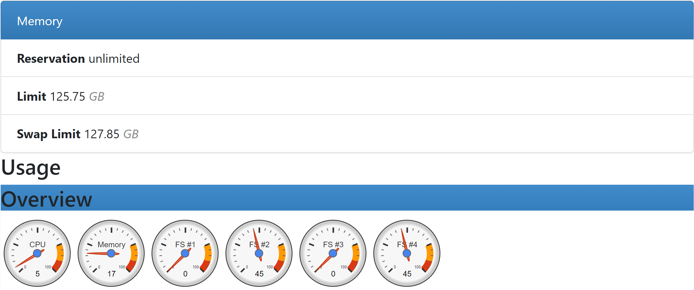


访问http://10.2.14.105:8081/metrics 查看到采集的监控数据

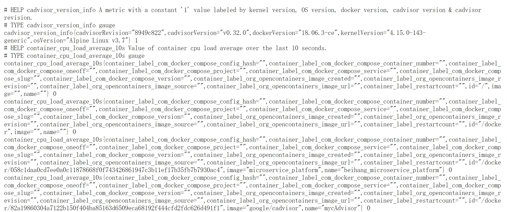

进入Grafana官网( [https://grafana.com](https://link.zhihu.com/?target=https%3A//grafana.com) )，选择适用于cAdvisor的模板

过滤条件：

- Name/Description=cAdvisor
- Data Source=Prometheus

复制**模板ID—893**

导入


# AlterManager

**Pormetheus的告警由独立的两部分组成**

- **告警**：Prometheus服务中的告警规则发送告警到Alertmanager。
- **通知**：Alertmanager管理这些告警，包括silencing, inhibition, aggregation，并通过邮件发送通知


**建立告警和通知的主要步骤**

1. 创建和配置Alertmanager
2. 启动Prometheus服务时，通过-alertmanager.url标志配置Alermanager地址，以便Prometheus服务能和Alertmanager建立连接。
3. 在Prometheus中配置告警规则


**Alert的三种状态**

- **pending**
  - 警报被激活，但是**低于配置的持续时间**，持续时间由`rule_file`中的`for`字段设置，该状态下不发送报警
- **firing**
  - 警报已被激活，而且**超出设置的持续时间**，该状态下发送报警
- **inactive**：
  - 既不是**pending**也不是**firing**的时候状态就是inactive


**Prometheus触发一条告警的过程**

1. 触发阈值
2. 超出持续时间
3. alertmanager
4. 分组|抑制|静默
5. 媒体类型：邮件|钉钉|微信等

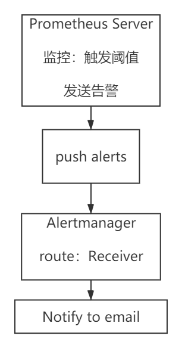


## rule_files

在`/home/dog/yinke/prometheus/config`目录下创建告警规则文件`alertrules.yml`

这个规则文件里包含了两条告警规则：

- `InstanceDown`：表示当实例宕机时（up == 0）触发告警
-  `APIHighRequestLatency`：表示有一半的API请求延迟大于1s时（api_http_request_latencies_second{quantile="0.5"} > 1）触发告警

```bash
groups:
- name: node_rules
  rules:
  # Alert for any instance that is unreachable for > 5 minutes.
  - alert: InstanceDown
    # 0不正常，1正常
    expr: up == 0
    # 持续5分钟获取不到信息，触发报警
    for: 5m
    labels:
      # 告警紧急程度
      severity: error
    # 说明内容
    annotations:
      summary: "Instance {{ $labels.instance }} down"
      description: "{{ $labels.instance }} of job {{ $labels.job }} has been down for more than 5 minutes."
 
  # Alert for any instance that has a median request latency >1s.
  - alert: APIHighRequestLatency
    expr: api_http_request_latencies_second{quantile="0.5"} > 1
    for: 10m
    labels:
      severity: warning
    annotations:
      summary: "High request latency on {{ $labels.instance }}"
      description: "{{ $labels.instance }} has a median request latency above 1s (current value: {{ $value }}s)"
  - alert: HighMemoryUsage
    expr: node_memory_MemAvailable_bytes / node_memory_MemTotal_bytes < 0.5
    for: 1m
    labels:
      severity: warning
    annotations:
      summary: High memory usage
```

因为Prometheus是docker部署的，因此`alertrules.yml`位置必须是**容器内部的目录位置**，而不是宿主机上目录

将`/home/dog/yinke/prometheus/config/alertrules.yml`拷贝到容器内`/etc/prometheus/`

```bash
# 拷贝
docker cp /home/dog/yinke/prometheus/config/alertrules.yml 8bd1ebf0daa8:/etc/prometheus/
# 进入查看是否拷贝成功
docker exec -it 8bd1ebf0daa8 /bin/sh
cd /etc/prometheus/
```

在`Prometheus.yml`的`rule_files`块中添加告警规则文件`alert.rules`

```bash
# my global config
global:
  scrape_interval:     15s # Set the scrape interval to every 15 seconds. Default is every 1 minute.
  evaluation_interval: 15s # Evaluate rules every 15 seconds. The default is every 1 minute.
  # scrape_timeout is set to the global default (10s).
 
# Alertmanager configuration
alerting:
  alertmanagers:
  - static_configs:
    - targets:
      # - alertmanager:9093
 
# Load rules once and periodically evaluate them according to the global 'evaluation_interval'.
rule_files:
  - "alert.rules"
```

重启Prometheus Server服务

访问 http://10.2.14.105:9090/rules 查看配置规则

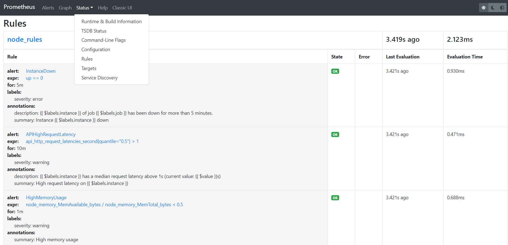

访问 http://10.2.14.105:9090/alerts 可以看到根据配置的规则生成的告警

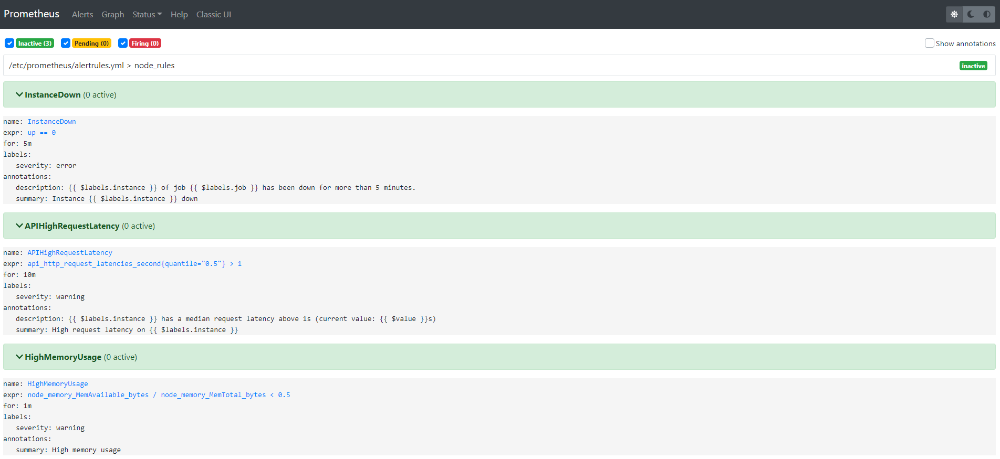

停掉两个实例node-exporter和cAdvisor

```bash
docker stop 5ce59207a273
docker stop 82a19860304a
```

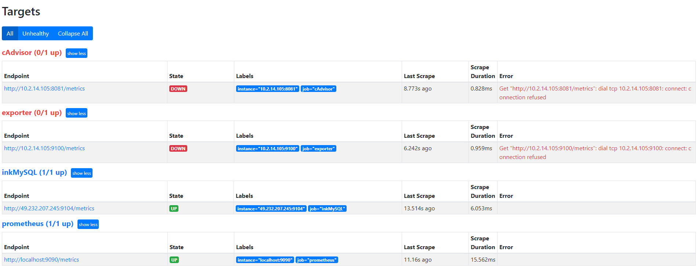

可以看到有2条alert的状态是 **PENDING**，表示已经触发了告警规则，但还没有达到告警条件。这是因为这里配置的 `for` 参数是 5m，所以5分钟后才会触发告警


5分钟后可以看到这2条alert的状态变成了 `FIRING`


## 部署AlterManager

**直接部署**

在`/home/dog/yinke/prometheus`下创建 `alertmanager`目录，进入

```bash
wget https://github.com/prometheus/alertmanager/releases/download/v0.15.2/alertmanager-0.15.2.linux-amd64.tar.gz

tar xvfz alertmanager-0.15.2.linux-amd64.tar.gz

cd alertmanager-0.15.2.linux-amd64

./alertmanager
```


**docker部署**

在`/home/dog/yinke/prometheus/alertmanager`建立email模板文件`email.tmpl`

`define`用来定义变量，分别是：`email.from`、`email.to`、`email.to.html`，可以在 `alertmanager.yml`文件中直接配置引用（`email.to.html`就是要发送的邮件内容，支持 Html 和 Text 格式）

```tmpl
{{ define "email.from" }}123456789@qq.com{{ end }}
{{ define "email.to" }}541640794@qq.com{{ end }}
{{ define "email.to.html" }}
{{ range .Alerts }}
=========start==========<br>
告警程序: prometheus_alert <br>
告警级别: {{ .Labels.severity }} 级 <br>
告警类型: {{ .Labels.alertname }} <br>
故障主机: {{ .Labels.instance }} <br>
告警主题: {{ .Annotations.summary }} <br>
告警详情: {{ .Annotations.description }} <br>
触发时间: {{ .StartsAt.Format "2021-06-16 20:21:15" }} <br>
=========end==========<br>
{{ end }}
{{ end }}
```


在`/home/dog/yinke/prometheus/alertmanager`目录下创建告警规则文件`alertmanager.yml`

- **分组**

  - 将**类似性质的告警分类为单个通知**，适用于许多系统同时发生故障并且可能同时触发数百到数千个警报时。将Alertmanager配置为分组告警，以便它发送一个压缩的通知
  - 告警的分组，告警分组通知的时间和这些通知的接收者通过配置文件来配置

  > 用户只希望获得一个页面，同时仍然能够准确查看受影响的服务实例

- **沉默**

  - 一种简单的特定时间静音提醒的机制。通过匹配器来配置，就像路由树一样。传入的警报会匹配RE，如果匹配将不会为此警报发送通知
  - 在Alertmanager的Web界面中配置沉默

- **抑制**

  - 当警报发出后停止重复发送由此警报引发其他错误的警报的机制
  - 通过Alertmanager的配置文件来配置

> `smtp.qq.com:465` ，端口使用465
>
> `smtp_require_tls: false`，默认是true，一定要改成`false`才能发送邮件

```yaml
# 全局配置,包括报警解决后的超时时间、SMTP相关配置、各种渠道通知的API地址等
global:
  # 设置处理超时时间，也是状态为解决的时间
  resolve_timeout: 5m
  # smtp配置
  smtp_from: "123456789@qq.com"
  smtp_smarthost: 'smtp.qq.com:465'
  smtp_auth_username: "123456789@qq.com"
  smtp_auth_password: '123456'
  smtp_require_tls: false
# email、企业微信的模板配置存放位置
templates:
  - '/home/dog/yinke/prometheus/alertmanager/*.tmpl'
# 用来设置报警的分发策略,是一个树状结构,按照深度优先从左向右的顺序进行匹配
route:
  # 默认告警消息接受者
  receiver: 'test_email'
  # 按alertname进行分组
  group_by: ['alertname']
  # 组内报警等待时间
  group_wait: 10s 
  # 组报警间隔时间，如果组内内容不变化，合并为一条警报信息，10s后发送
  group_interval: 10s 
  # 重复报警间隔时间
  # 当group_interval时间到后，再等待repeat_interval时间后，才进行报警
  repeat_interval: 1h 
# 配置告警消息接受者信息，例如常用的email、wechat等消息通知方式
receivers:
  - name: 'test_email'
    email_configs:
    # 接收告警的email
    - to: '{{ template "email.to" . }}'
      # 模板
      html: '{{ template "email.to.html" . }}' 
      send_resolved: true
      headers:
        subject: "报警邮件"
        from: "nlsde警报中心"
        to: "ink"
# 抑制规则配置，当存在与另一组匹配的警报（源）时，抑制规则将禁用匹配的警报目标
# 抑制规则
inhibit_rules:
  # 源标签警报触发时抑制含有目标标签的警报
  - source_match:
      severity: 'critical'
    target_match:
      severity: 'warning'
    # 确保配置的标签内容相同才会抑制
    equal: ['alertname', 'dev', 'instance']
```

运行docker容器

将`alertmanager.yml`挂载到容器内，路径为`/etc/alertmanager/alertmanager.yml`

```bash
docker run -d -p 9093:9093 \
-v /home/dog/yinke/prometheus/alertmanager/alertmanager.yml:/etc/alertmanager/alertmanager.yml \
-v /home/dog/yinke/prometheus/config/prometheus.yml:/etc/prometheus/prometheus.yml \
--name inkalertmanager \
docker.io/prom/alertmanager:latest
```

修改Prometheus的配置文件 `prometheus.yml`

```yaml
# 发生告警时，将告警信息发送到Alertmanager           
alerting:
  alertmanagers:
  - static_configs:
    - targets: ["10.2.14.105:9093"]
      # - alertmanager:9093
```

重新部署Prometheus Server

> 这里需要重新把`alertrules.yml` 拷贝进容器内
>
> ```bash
> docker cp /home/dog/yinke/prometheus/config/alertrules.yml 8bd1ebf0daa8:/etc/prometheus/
> ```

```bash
docker run --name inkPrometheus \
-d -p 9090:9090 \
-v /home/dog/yinke/prometheus/config/prometheus.yml:/etc/prometheus/prometheus.yml \
-v /home/dog/yinke/prometheus/alertmanager/alertmanager.yml:/etc/alertmanager/alertmanager.yml \
prom/prometheus
```

停止cAdvisor实例，访问http://10.2.14.105:9093可以看到Alertmanager接收到告警

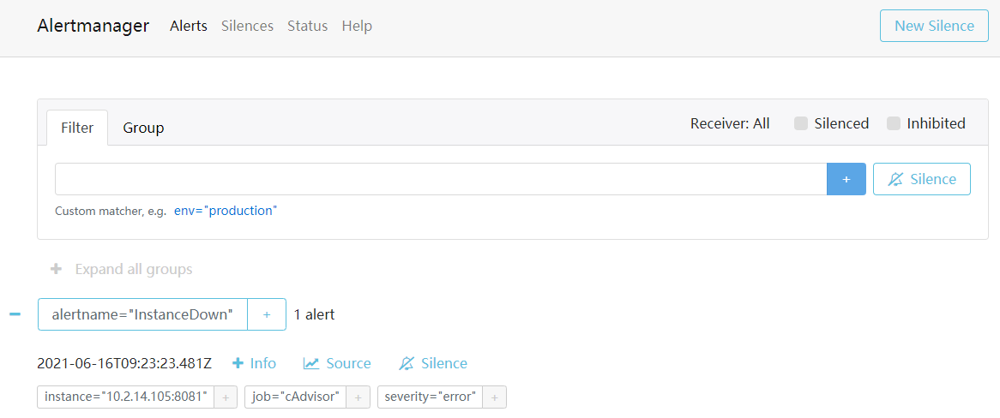


查看alertmanager日志

> 如果没有收到邮件，查看alertmanager日志是否有报错信息

```bash
docker logs -f alertmanager
```


## SMTP

在报警的邮箱中开通smtp功能，并获取授权码（smtp_auth_password中填写）

`smtp.qq.com:465` ，端口使用**465**。其他资料说用587端口也可以（如果是云服务器，25端口通常是被服务商封闭的，所有也不能使用25端口）

> 报错信息
>
> msg="Notify for alerts failed" num_alerts=1 err="*notify.loginAuth failed: 530 Must issue a STARTTLS command first."
>
> 解决方法
>
> smtp_require_tls: false 必须加上，因为smtp_require_tls默认为true


## 配置Grafana

**安装邮件发送服务** 

```bash
sudo apt-get install sendmail
sudo apt-get install sendmail-cf
```

**添加邮件配置**

进入grafana容器中，默认的配置文件在`/etc/grafana/`目录下

修改`grafana.ini`文件的smtp部分

> `.ini`文件中分号`;`是表示注释该行，更改设置必须先删除设置前面的分号`;`才能起作用

```bash
docker exec -it ContainerID /bin/bash

vim /etc/grafana/grafana.ini 

[admin@prometheus ~]$ sudo vim /etc/grafana/grafana.ini
...
enabled = true                                          #默认是false
host = smtp.mxhichina.com:465                           #smtp服务器的地址和端口，阿里云的企业邮箱。465加密端口    25非加密端口
user = 541640794@qq.com                                     #登录邮箱的账号
password =                                       #你邮箱账号的密码
from_address = 541640794@qq.com                             #发邮件的账号
from_name = Grafana                                     #自定义的名字
ehlo_identity = example.com                   #无关紧要的一个标示
...

# 重启grafana服务
sudo service grafana-server restart  
```

### 通过配置Grafana的环境变量修改

grafana的配置选项也可以使用环境变量指定覆盖配置文件中的**所有选项**

`SectionName`是`.ini`文件中**方括号中的文本**，字母大写，`.`用`_`代替

```bash
GF_<SectionName>_<KeyName>
```


# 服务发现

Prometheus 是通过 Pull 的方式主动获取监控数据，所以需要**手工指定监控节点的列表**，当监控的节点增多之后，每次增加节点都需要更改配置文件，非常麻烦，这个时候就需要通过**服务发现**（service discovery，SD）机制去解决

Prometheus 支持多种服务发现机制，可以自动获取要收集的 targets

[prometheus/discovery at main · prometheus/prometheus (github.com)](https://github.com/prometheus/prometheus/tree/main/discovery)

[Advanced Service Discovery in Prometheus 0.14.0 | Prometheus](https://prometheus.io/blog/2015/06/01/advanced-service-discovery/)

Prometheus 的配置还是 Alertmanager 的配置，都没有提供 API 供我们动态的修改。

一个很常见的场景是，需要基于 Prometheus 做一套可自定义规则的告警系统，用户可根据自己的需要在页面上创建修改或删除告警规则，或者是修改告警通知方式和联系人，

不过遗憾的是，[Simon Pasquier](https://github.com/simonpasquier) 在下面说到，目前并没有这样的 API，而且以后也没有这样的计划来开发这样的 API

# 自监控

其它系统都用 Prometheus 监控起来了，报警规则也设置好了，那 Prometheus 本身由谁来监控？

- **上生产环境之前，一定要确保至少有两个独立的 Prometheus 实例互相做交叉监控。**交叉监控的配置也很简单，每台 Prometheus 都拉取其余所有 Prometheus 的指标即可。

- 警报系统(Alertmanager)，我们再考虑一下警报系统挂掉的情况：这时候 Prometheus 可以监控到警报系统挂了，但是因为警报挂掉了，所以警报自然就发不出来，这也是应用 Prometheus 之前必须搞定的问题。这个问题可以通过给警报系统做 HA 来应对。除此之外还有一个经典的兜底措施叫做 ["Dead man's switch"](https://link.zhihu.com/?target=https%3A//en.wikipedia.org/wiki/Dead_man%27s_switch): 定义一条永远会触发的告警，不断通知，假如哪天这条通知停了，那么说明报警链路出问题了。

