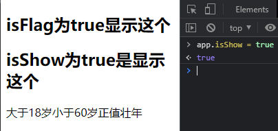

# Vue.js

渐进式JavaScript框架

> 尤雨溪。Vue 被设计为可以自底向上逐层应用
>
> Soc：Separation of concerns 关注点分离原则

Vue 的核心库只关注**视图层**（HTML + CSS + JavaScript）

- 网络通信：Axios
- 页面跳转：Vue-router
- 状态管理：Vuex
- Vue-UI：ICE，Element-UI


**虚拟DOM**

预先通过JavaScript进行各种计算，把最终的DOM计算出来并优化的技术。这个DOM操作属于预处理操作，没有真正的操作DOM。


## MVVM模式

**软件架构设计模式**

- Model：模型层
- View：视图层
- **ViewModel**：**核心**中间件，**双向数据绑定**


**MVVM架构不允许数据和视图直接通信，必须通过ViewModel来通信**

- **ViewModel能观察数据变化，对视图对应的内容进行更新**
- **ViewModel能监听视图变化，通知数据发生改变**

> Vue.js是ViewModel层的实现者
>
> 核心：
>
> - DOM监听
> - 数据绑定


**优点**：

1. **低耦合**

   View可以独立于model变化和修改。一个ViewModel可以绑定到不同的View上

   - 当View变化的时候Model可以不变
   - 当Model变化的时候View可以不变

2. **可复用**

   可以把视图逻辑放在一个ViewModel里面，让很多View复用这个视图逻辑

3. **独立开发**

4. **可测试**


## 安装Vue

**使用`<script>`标签引入**

导入后会暴露一个全局的变量`Vue()`

- [开发版本](https://cn.vuejs.org/js/vue.js)：包含完整的警告和调试模式
- [生产版本](https://cn.vuejs.org/js/vue.min.js)：删除了警告，33.30KB min+gzip

```html
<body>
<script src="vue.js"></script>
</body>
```

打开控制台查看到以下信息即成功


**CDN引入**

```html
<script src="https://cdn.jsdelivr.net/npm/vue/dist/vue.js"></script>
```


# idea

1. 创建文件夹并用idea打开（open）

2. 安装Vue插件

3. 设置Vue新建文件模板

   > file->setting->editor->file and code Templates，选择Vue Single File Component

   

**注意**：

安装完vue插件后，右键new发现没有Vue component这个选项，需要自己新建模板

> https://blog.csdn.net/weixin_38556197/article/details/113838663


# Vue基础

Vue有7个属性，8个方法，7个指令（787原则）

**7个属性**

- `el`：用来指示vue编译器从什么地方开始解析vue的语法（一个占位符）
- `data`：用来组织从view中抽象出来的属性（将视图的数据抽象出来存放在data中）
- `template`：用来设置模板，会替换页面元素（包括占位符）
- `methods`：放置页面中的业务逻辑，JavaScript**方法**一般都放置在methods中
- `render`：创建真正的Virtual Dom
- `computed`：计算属性
- `watch`：监听data中数据的变化

## 第一个Vue程序

1. **导入Vue**
2. **new一个Vue对象**
3. **对象绑定元素**
4. **存放数据**

不再和 HTML 直接交互。一个 Vue 应用会将其挂载到一个DOM 元素上对其进行完全控制

```html
<body>
<!--view层 模板-->
<div id="app">
    {{message}}
</div>

<!--导入Vue.js-->
<script src="vue.js"></script>
<script src="js/ink.js"></script>
</body>
```

```javascript
var vm = new Vue({
    // 元素element,json对象,逗号隔开
    el: "#app",
    // 对象:键值对
    // model层 数据
    data: {
        message:"Hello Vue!"
    }
})
```

**数据双向绑定**

修改**vm对象**就可以修改内容

> Vue不改变DOM


## Vue指令

指令带有前缀 `v-`，以表示它们是Vue提供的特殊 attribute，它们在渲染的DOM上应用特殊的**响应式行为**

## 绑定

`v-bind`

> 和`{{}}`一样

```html
<div id="app">
	<!-- 将这个元素节点的title attribute和Vue实例的 message property保持一致 -->
    <span v-bind:title="message">     
        鼠标悬停几秒钟查看此处动态绑定的提示信息！   
    </span> 
</div>
```

```javascript
var app = new Vue({
  el: '#app',
  data: {
      message:"Hello Vue!"
  }
})
```


## 控制结构

- `v-if`
- `v-else-if`
- `v-else`

> ===：JavaScript中：先判断类型是否一致，再比较值

```html
<body>
<div id="app">
    <h1 v-if="ok">yes</h1>
    <h1 v-else>no</h1>
</div>
<script src="vue.js"></script>
<script src="js/ink.js"></script>
</body>
```

```javascript
var vm = new Vue({
    el: "#app",
    data:{
        ok: true
    }
})
```



## 循环结构	

`v-for`

```html
<body>
<div id="app">
    <li v-for="item in items">
        {{item.message}}
    </li>
</div>
<script src="vue.js"></script>
<script src="js/ink.js"></script>
</body>
```

```javascript
var vm = new Vue({
    el: "#app",
    data: {
        items: [
            {message: 'ink'},
            {message: 'yinke'}
        ]
    }
})
```


## 事件处理

`v-on`

`v-on`指令可以监听DOM事件

通过它**调用在 Vue 实例中定义的方法**（执行事件）

> 方法定义在Vue的`methods`中

```html
<body>
<div id="app">
<!-- 通过方法响应点击事件 --> 
<button v-on:click="sayhi">点击</button>
</div>
<script src="vue.js"></script>
<script src="js/ink.js"></script>
</body>
```

```javascript
var vm = new Vue({
    el: "#app",
    data:{
        message: "hi ink"
    },
    // 方法也是K-V键值对
    methods:{
        sayhi: function (){
            alert(this.message);
        }
    }
})
```


## 双向绑定

`v-model` 

可以实现**表单输入和应用状态**之间的双向绑定

`v-model`会忽略所有表单元素的`value`，`checked`，`selected`特性的初始值而总是将**Vue实例数据**作为数据来源，所以要在JavaScript的`data`中声明初始值

> 实际上数据还是单向的
>
> v-model本质上是一个语法糖，它负责监听用户的输入事件以更新数据，并对一些极端场景进行特殊处理

```html
<body>
<div id="app">
    <!--绑定表单内容-->
    输入文本<input type="text" v-model="message"> {{message}}
</div>
<script src="vue.js"></script>
<script src="js/ink.js"></script>
</body>
```

```javascript
var vm = new Vue({
    el: "#app",
    data: {
        message: "ink"
    }
})
```

# Vue组件

`Vue.component()`

- `props`
- `template`

自定义标签组件化（**模板复用**）

> 组件系统是一种抽象。可以使用小型、独立和通常可复用的组件构建大型应用
>
> Vue 组件提供了纯自定义元素所不具备的一些重要功能，最突出的是跨组件数据流、自定义事件通信以及构建工具集成。

几乎任意类型的应用界面都可以抽象为一个组件树


## template

```html
<body>
<div id="app">
   <!-- 创建一个 ink 组件的实例 -->
   <ink></ink>
</div>
<script src="vue.js"></script>
<script src="js/ink.js"></script>
</body>
```

```javascript
// 定义名为 ink 的新组件
Vue.component("ink",{
   template: '<li>ink</li>'
});
// 创建Vue实例才可以调用
var vm = new Vue({
    el: '#app'
});
```

创建**Vue component**


## props

数据传递

> 默认规则下，`props`属性中的值不能大写

父作用域将数据传到子组件

组件中的`template`不能从Vue对象的`data`中直接获得数据

1. `v-for`遍历Vue对象中的`data`数据
2. `v-bind`绑定数据到组件中`props`定义的`item`属性中
3. `template`通过`props`获得数据

> `props`类似于一个自定义attribute

```html
<body>
<div id="app">
    <!-- 创建一个 ink 组件的实例 -->
    <!-- 等号左边的item是props定义的属性名，等号右边的item是v-for遍历的item项 -->
   <ink v-for="item in items" v-bind:item="item"></ink>

</div>
<script src="vue.js"></script>
<script src="js/ink.js"></script>
</body>
```

```javascript
// 定义名为 ink 的新组件
Vue.component('ink',{
    props: ['item'],
    template: '<li>{{item}}</li>'
});
// 定义一个 vue 对象
var vm = new Vue({
    el: '#app',
    data: {
        items: ["neau","buaa","fushan"]
    }
});
```


# 网络通信

`Axios`异步通信

开源的用在浏览器端和NodeJS的异步通信框架，主要作用是实现Ajax异步通信

[Axios API 中文文档](http://axios-js.com/)

> Vue.js是一个视图层框架，并不包含Ajax的通信功能。
>
> jQuery.ajax()可以实现网络通信，但jQuery操作DOM太频繁，不推荐使用

## 功能特点

- 从浏览器中创建`XMLHttpRequests`（XHR）
- 从node.js创建http请求
- 支持Promise API（JavaScript中链式编程）
- 拦截请求和响应
- 转换请求和响应数据
- 取消请求
- 自动转换JSON数据
- 客户端支持防御XSRF（跨站请求伪造）

> 要求ES6
>
> 

## 安装Axios

- **npm**

  ```bash
  npm install axios
  ```

- **cdn**

  ```html
  <script src="https://unpkg.com/axios/dist/axios.min.js"></script>
  ```

## Vue生命周期

`mounted`：加载Ajax的钩子函数


```html
<body>
<div id="vue">
    <div>{{info.name}}</div>
    <div>{{info.links[0].name}}</div>
    <!-- 错误:<a href="{{info.url}}">点击</a> -->
    <!-- 要用v-bind绑定-->
    <a v-bind:href="info.url">点击跳转</a>
</div>
<script src="vue.js"></script>
<script src="https://unpkg.com/axios/dist/axios.min.js"></script>
<script src="js/ink.js"></script>
</body>
```

```javascript
var vm = new Vue({
    el: '#vue',
    data: {
        // 设置info为{}，自动绑定response的各个属性
        info: {}
    },
    // 钩子函数（链式编程）
    // data.json路径
    mounted(){
        // GET请求得到返回数据绑定到data中
        axios.get('data.json').then(response=>(this.info = response.data));
    }
});
```

```json
// json文件
{
  "name": "ink",
  "url": "https://www.baidu.com/",
  "page": 1,
  "isNonProfit": true,
  "address": {
    "street": "知春路",
    "city": "北京",
    "country": "中国"
  },
  "links": [
    {
      "name": "Vue",
      "url": "https://cn.vuejs.org/"
    },
    {
      "name": "leetcode",
      "url": "https://leetcode-cn.com/"
    },
    {
      "name": "知乎",
      "url": "https://www.zhihu.com/"
    }
  ]
}
```


