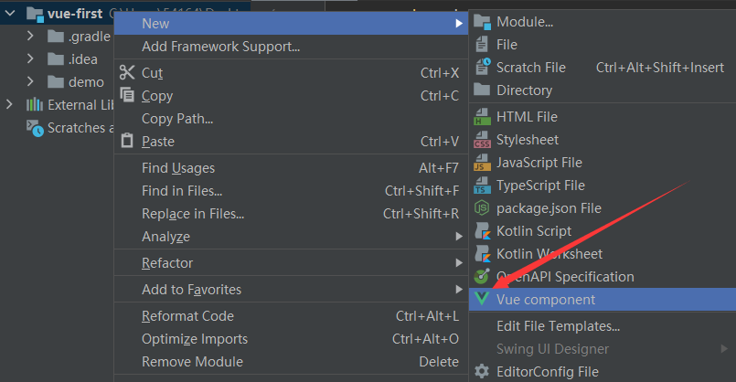
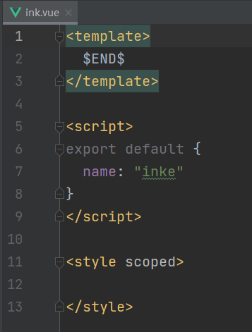
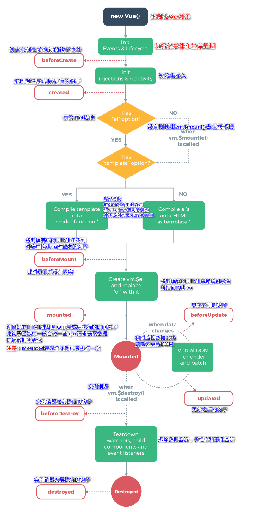

# Vue.js

渐进式JavaScript框架

> 尤雨溪
>
> Vue 被设计为可以自底向上逐层应用
>
> `Soc`：Separation of concerns 关注点分离原则

Vue 的核心库只关注**视图层**（HTML + CSS + JavaScript）

- 网络通信：Axios
- 页面跳转：Vue-router
- 状态管理：Vuex
- Vue-UI：ICE，Element-UI

**虚拟DOM**

预先通过JavaScript进行各种计算，把最终的DOM计算出来并优化的技术。这个DOM操作属于预处理操作，没有真正的操作DOM。


## MVVM模式

**软件架构设计模式**

- Model：模型层
- View：视图层
- **ViewModel**：**核心**中间件，**双向数据绑定**


**MVVM架构不允许数据和视图直接通信，必须通过ViewModel来通信**

- **ViewModel能观察数据变化，对视图对应的内容进行更新**
- **ViewModel能监听视图变化，通知数据发生改变**

> Vue.js是ViewModel层的实现者
>
> 核心：
>
> - DOM监听
> - 数据绑定


**优点**：

1. **低耦合**

   View可以独立于model变化和修改。一个ViewModel可以绑定到不同的View上

   - 当View变化的时候Model可以不变
   - 当Model变化的时候View可以不变

2. **可复用**

   可以把视图逻辑放在一个ViewModel里面，让很多View复用这个视图逻辑

3. **独立开发**

4. **可测试**


## 安装Vue

**使用`<script>`标签引入**

导入后会暴露一个全局的变量`Vue()`

- [开发版本](https://cn.vuejs.org/js/vue.js)：包含完整的警告和调试模式
- [生产版本](https://cn.vuejs.org/js/vue.min.js)：删除了警告，33.30KB min+gzip

```html
<body>
<script src="vue.js"></script>
</body>
```

打开控制台查看到以下信息即成功


**CDN引入**

```html
<script src="https://cdn.jsdelivr.net/npm/vue/dist/vue.js"></script>
```


# idea

1. 创建文件夹并用idea打开（open）

2. 安装Vue插件

3. 设置Vue新建文件模板

   > file->setting->editor->file and code Templates，选择Vue Single File Component

   

**注意**：

安装完vue插件后，右键new发现没有Vue component这个选项，需要自己新建模板

> https://blog.csdn.net/weixin_38556197/article/details/113838663


# Vue基础

**Vue有7个属性，8个方法，7个指令**（787原则）

**Vue属性**

- `el`：用来指示vue编译器从什么地方开始解析vue的语法（一个占位符）
- `data`：用来组织从view中抽象出来的属性（将视图的数据抽象出来存放在data中）
- `template`：用来设置模板，会替换页面元素（包括占位符）
- `methods`：放置页面中的业务逻辑，JavaScript**方法**一般都放置在methods中
- `render`：创建真正的Virtual Dom
- `computed`：计算属性
- `watch`：监听data中数据的变化


## Vue实例

每个 Vue 应用都是通过用 `Vue` 函数创建一个新的 **Vue 实例**开始的，所有的 Vue 组件都是 Vue 实例

1. **导入Vue**
2. **new一个Vue对象**
3. **对象绑定元素**
4. **存放数据**

不再和 HTML 直接交互。一个 Vue 应用会将其挂载到一个DOM 元素上对其进行完全控制

> 在文档中经常会使用 `vm` (ViewModel ) 这个变量名表示 Vue 实例


## 插值

### 文本

**数据绑定**最常见的形式就是使用**Mustache语法** (双大括号) 的**文本插值**

使用`v-once`指令能执行一次性地插值，当数据改变时，插值处的内容不会更新

```html
<body>
<!--view层 模板-->
<div id="app">
    {{message}}
</div>

<!--导入Vue.js-->
<script src="vue.js"></script>
<script src="js/ink.js"></script>
</body>
```

```javascript
var vm = new Vue({
    // 元素element,json对象,逗号隔开
    el: "#app",
    // 对象:键值对
    // model层 数据
    data: {
        message:"Hello Vue!"
    }
})
```

**数据双向绑定**

修改**vm对象**就可以修改内容

> Vue不改变DOM


### HTML

双大括号`{{}}`会将数据解释为普通文本，而非 HTML 代码

使用 `v-html`指令输出真正的HTML


### Attribute

`v-bind`

Mustache语法也不能作用在 HTML标签的属性（`attribute`）上

使用 `v-bind`（`:`）绑定HTML标签的属性

> 对于布尔`attribute` (它们只要存在就意味着值为 `true`)

```html
<!-- 在HTML标签中 -->
v-bind:标签属性="变量值"
```

```html
<div id="app">
	<!-- title是参数，将span标签的title属性和Vue实例的message的值绑定 -->
    <span v-bind:title="message">     
        鼠标悬停几秒钟查看此处动态绑定的提示信息！   
    </span> 
    <!-- 缩写 -->
    <span :title="message">     
        鼠标悬停几秒钟查看此处动态绑定的提示信息！   
    </span> 
</div>
```

```javascript
var app = new Vue({
  el: '#app',
  data: {
      message:"Hello Vue!"
  }
})
```

### JavaScript表达式


## 指令

### Vue指令

指令带有前缀 `v-`，表示它们是Vue提供的特殊attribute

指令的职责时当表达式的值改变时，将其产生的连带影响，**响应式**地作用于 DOM

- `v-bind`：响应式的更新HTML的`attribute``
- ``v-on` ：监听 DOM 事件

> `v-bind` 缩写 `:`，`v-on` 缩写 `@`


### 参数

上述两条指令能够接收一个**参数**，在指令名称之后以**冒号表示**

```html
<a v-bind:href="url">...</a>
```

`:`后面的`href` 就是参数，`v-bind` 指令将该元素的 `href` 属性与 `url` 的值绑定

```html
<a v-on:click="doSomething">...</a>
```

`:`后面的`click` 就是参数，它是监听的事件名


### 动态参数

可以用方括号`[]`括起来的 **JavaScript 表达式**作为一个指令的参数（求得的值作为最终的参数），也可以使用动态参数为一个**动态的事件名**绑定处理函数（不同事件不同的处理函数）

> 在 DOM 中使用模板时 (直接在一个 HTML 文件里撰写模板)，需要避免使用大写字符来命名键名，因为浏览器会把 **attribute 名全部强制转为小写**（所有字符）


### 修饰符

修饰符是以 `.` 指明的**特殊后缀**，用于指出一个指令应该以特殊方式绑定


## 条件渲染

### v-if

- `v-else-if`
- `v-else`

> ===：JavaScript中：先判断类型是否一致，再比较值

```html
<body>
<div id="app">
    <h1 v-if="ok">yes</h1>
    <h1 v-else>no</h1>
</div>
<script src="vue.js"></script>
<script src="js/ink.js"></script>
</body>
```

```javascript
var vm = new Vue({
    el: "#app",
    data:{
        ok: true
    }
})
```


### template渲染

`v-if` 是一个指令，只能将它添加到一个元素上。如果想切换多个元素，可以把一个 `template` 元素当做不可见的包裹元素，并在上面使用 `v-if`。最终的渲染结果将不包含 `template` 元素

```html
<template v-if="ok">
    <h1>Title</h1>  
    <p>Paragraph 1</p>  
    <p>Paragraph 2</p> 
</template>
```


### v-show

- 带有 `v-show` 的元素**始终会被渲染并保留在 DOM 中**
- `v-show` 只是简单地切换元素的CSS属性（`display`）
- `v-show` 不支持 `template` 元素，也不支持 `v-else`


**区别**：

- `v-if` 是“真正”的条件渲染，它会确保在切换过程中条件块内的事件监听器和子组件适当地被销毁和重建
- `v-if` 是**惰性的**：如果在初始渲染时条件为假，则什么也不做，直到条件第一次变为真时，才会开始渲染条件块
- `v-show`不管初始条件是什么，元素总是会被渲染，并且只是简单地基于 CSS 进行切换

`v-if` 有更高的切换开销，而 `v-show` 有更高的初始渲染开销

如果需要非常频繁地切换，使用 `v-show` 较好。如果在运行时条件很少改变，使用 `v-if` 较好

> 当 `v-if` 与 `v-for` 一起使用时，`v-for` 具有比 `v-if` 更高的优先级
>
> 不推荐一起使用


## 列表渲染	

`v-for`

### 遍历数组

基于一个数组来渲染一个列表，使用 `item in items` 形式的语法

-  `items` 是**源**数据数组
- `item` 是被迭代的数组元素的**别名**

> 也可以用 `of` 替代 `in` 作为分隔符

```html
<body>
<div id="app">
    <li v-for="item in items">
        {{item.message}}
    </li>
</div>
<script src="vue.js"></script>
<script src="js/ink.js"></script>
</body>
```

```javascript
var vm = new Vue({
    el: "#app",
    data: {
        items: [
            {message: 'ink'},
            {message: 'yinke'}
        ]
    }
})
```


### 父作用域

`v-for` 块中可以访问所有**父作用域**的`property`

`v-for` 还支持一个可选的第二个参数，即**当前项的索引**

```html
<ul id="app">
  <!-- 同时获取item和index -->
  <li v-for="(item, index) in items">
    {{ parentMessage }} - {{ index }} - {{ item.message }}
  </li>
</ul>
```

```javascript
var vm = new Vue({
  el: '#app',
  data: {
    parentMessage: 'Parent',
    items: [
      { message: 'Foo' },
      { message: 'Bar' }
    ]
  }
})
```


### 对象遍历

可以用 `v-for` 来遍历一个对象的`property`的值

- 可以提供第二个参数为 `property` 名称 （`key`）
- 可以提供第三个参数为索引（`index`）

> 遍历对象时会按 `Object.keys()` 的结果遍历

```html
<ul id="v-for-object" class="demo">
  <li v-for="value in object">
    <!-- 输出对象中的属性值 -->
    {{ value }}
  </li>
</ul>
```

```javascript
new Vue({
  el: '#v-for-object',
  data: {
    // 对象  
    object: {
      title: 'How to do lists in Vue',
      author: 'Jane Doe',
      publishedAt: '2016-04-10'
    }
  }
})
```


### 状态维护

Vue 更新使用 `v-for` 渲染的元素列表时默认使用“就地更新”的策略。如果数据项的顺序被改变，**Vue 将不会移动 DOM 元素来匹配数据项的顺序，而是就地更新每个元素**，确保它们在每个索引位置正确渲染

> 只适用于不依赖子组件状态或临时 DOM 状态 (例如：表单输入值) 的列表渲染输出

### 数组更新


## 事件处理

`v-on`

`v-on`(`@`)指令可以监听DOM事件并在触发时运行JavaScript代码

通过它**调用在 Vue 实例中定义的方法**（执行事件处理方法），方法定义在Vue的`methods`属性中

> `v-on`可以绑定HTML所有的事件

```html
<body>
<div id="app">
	<!-- 通过方法响应点击事件 --> 
	<button v-on:click="sayhi">点击</button>
</div>
<script src="vue.js"></script>
<script src="js/ink.js"></script>
</body>
```

```javascript
var vm = new Vue({
    el: "#app",
    data:{
        message: "hi ink"
    },
    // 方法也是K-V键值对
    methods:{
        sayhi: function (){
            alert(this.message);
        }
    }
})
```


### 事件修饰符

> 方法只有纯粹的数据逻辑，而不是去处理 DOM 事件细节

Vue为 `v-on` 提供了**事件修饰符**（修饰符是由**点开头的指令后缀**表示）

- `.stop`
- `.prevent`
- `.capture`
- `.self`
- `.once`
- `.passive`

```html
<!-- 阻止单击事件继续传播 -->
<a v-on:click.stop="doThis"></a>

<!-- 提交事件不再重载页面 -->
<form v-on:submit.prevent="onSubmit"></form>

<!-- 修饰符可以串联 -->
<a v-on:click.stop.prevent="doThat"></a>

<!-- 只有修饰符 -->
<form v-on:submit.prevent></form>

<!-- 添加事件监听器时使用事件捕获模式 -->
<!-- 即内部元素触发的事件先在此处理，然后才交由内部元素进行处理 -->
<div v-on:click.capture="doThis">...</div>

<!-- 只当在 event.target 是当前元素自身时触发处理函数 -->
<!-- 即事件不是从内部元素触发的 -->
<div v-on:click.self="doThat">...</div>
```

> 使用修饰符时，顺序很重要。相应的代码会以同样的顺序产生


## 表单输入绑定

`v-model` 

- `v-model`可以实现**表单输入和应用状态**之间的**双向绑定**，它会根据控件类型自动选取正确的方法来更新元素
- `v-model`本质上是一个语法糖，它负责监听用户的输入事件以更新数据，并对一些极端场景进行特殊处理
- `v-model` 在内部为**不同的输入元素使用不同的属性并抛出不同的事件**
  - `text/textarea`：使用 `value`属性和 `input` 事件
  - `checkbox/radio`：使用 `checked`属性和 `change` 事件
  - `select`：使用 `value`属性和`change` 作为事件

> `v-model`会忽略所有表单元素的`value`，`checked`，`selected`特性的初始值而总是**将Vue实例数据作为数据来源**，所以要在组件的`data`中声明初始值
>
> 实际上数据还是单向的

```html
<body>
<div id="vue">
    <!--绑定表单内容-->
    输入文本<input type="text" v-model="message">
    <p>{{message}}</p>
    <button type="button" @click="submit">提交</button>
    <div></div>
    <!-- 单选框-->
    <input type="checkbox" id="checkbox" v-model="checked">
    <label for="checkbox">{{ checked }}</label>
    <div></div>
    <!-- 复选框-->
    <input type="checkbox" id="jack" value="Jack" v-model="checkedNames">
    <label for="jack">Jack</label>
    <input type="checkbox" id="john" value="John" v-model="checkedNames">
    <label for="john">John</label>
    <input type="checkbox" id="mike" value="Mike" v-model="checkedNames">
    <label for="mike">Mike</label>
    <br>
    <span>Checked names: {{ checkedNames }}</span>
</div>
<script src="vue.js"></script>
<script src="https://unpkg.com/axios/dist/axios.min.js"></script>
<script src="js/ink.js"></script>
</body>
```

```javascript
var vm = new Vue({
    el: '#vue',
    data: {
        message: "ink",
        checked: "",
        checkedNames: []
    },
    methods: {
        submit: function (){
            alert(this.message)
        }
    }
});
```


## Class 与 Style 绑定

操作元素的 class 列表和内联样式是数据绑定的一个常见需求。因为它们都是 attribute，可以用 `v-bind` 处理它们

 `v-bind` 用于 `class` 和 `style` 时，Vue.js 做了专门的增强。表达式结果的类型除了字符串之外，还可以是**对象或数组**


### 对象语法

- 可以传给 `v-bind:class` 一个对象，以动态地切换 class
- 可以在对象中传入更多字段来动态切换多个 class
- `v-bind:class` 也可以与普通的 class attribute 共存
- 可以绑定一个返回对象的计算属性

 `active` 这个 class 存在与否取决于数据 property `isActive` 的truthiness

```html
<div v-bind:class="{ active: isActive }"></div>
```


### 数组语法

可以传给 `v-bind:class`一个数组，以应用一个 class 列表

```html
<div v-bind:class="[activeClass, errorClass]"></div>
```

```javascript
data: {
  activeClass: 'active',
  errorClass: 'text-danger'
}
```

相当于

```html
<div class="active text-danger"></div>
```

# Vue组件

`Vue.component()`

- `props`
- `template`

一个组件本质上是一个拥有预定义选项的**一个 Vue 实例**

> 自定义标签组件化（**模板复用**）
>
> 组件系统是一种抽象。可以使用小型、独立和通常可复用的组件构建大型应用
>
> Vue 组件提供了纯自定义元素所不具备的一些重要功能，最突出的是跨组件数据流、自定义事件通信以及构建工具集成。

几乎任意类型的应用界面都可以抽象为一个组件树


## template

Vue 将**模板**编译成虚拟 DOM 渲染函数

> 结合响应系统，Vue 能够智能地计算出最少需要重新渲染多少组件，并把 DOM 操作次数减到最少。

```html
<body>
<div id="app">
   <!-- 创建一个 ink 组件的实例 -->
   <ink></ink>
</div>
<script src="vue.js"></script>
<script src="js/ink.js"></script>
</body>
```

```javascript
// 定义名为 ink 的新组件
Vue.component("ink",{
   template: '<li>ink</li>'
});
// 创建Vue实例才可以调用
var vm = new Vue({
    el: '#app'
});
```

创建**Vue component**






## props

数据传递

> 默认规则下，`props`属性中的值不能大写

父作用域将数据传到子组件

组件中的`template`不能从Vue对象的`data`中直接获得数据

1. `v-for`遍历Vue对象中的`data`数据
2. `v-bind`绑定数据到组件中`props`定义的`item`属性中
3. `template`通过`props`获得数据

> `props`类似于一个自定义attribute

```html
<body>
<div id="app">
    <!-- 创建一个 ink 组件的实例 -->
    <!-- 等号左边的item是props定义的属性名，等号右边的item是v-for遍历的item项 -->
   <ink v-for="item in items" 
        v-bind:item="item"
   ></ink>

</div>
<script src="vue.js"></script>
<script src="js/ink.js"></script>
</body>
```

```javascript
// 定义名为 ink 的新组件
Vue.component('ink',{
    props: ['item'],
    template: '<li>{{item}}</li>'
});
// 定义一个 vue 对象
var vm = new Vue({
    el: '#app',
    data: {
        items: ["neau","buaa","fushan"]
    }
});
```


# 网络通信

`Axios`异步通信

开源的用在浏览器端和NodeJS的异步通信框架，主要作用是实现Ajax异步通信

[Axios API 中文文档](http://axios-js.com/)

> Vue.js是一个视图层框架，并不包含Ajax的通信功能。
>
> jQuery.ajax()可以实现网络通信，但jQuery操作DOM太频繁，不推荐使用

## 功能特点

- 从浏览器中创建`XMLHttpRequests`（XHR）
- 从node.js创建http请求
- 支持Promise API（JavaScript中链式编程）
- 拦截请求和响应
- 转换请求和响应数据
- 取消请求
- 自动转换JSON数据
- 客户端支持防御XSRF（跨站请求伪造）

> 要求ES6
>
> 

## 安装Axios

- **npm**

  ```bash
  npm install axios
  ```

- **cdn**

  ```html
  <script src="https://unpkg.com/axios/dist/axios.min.js"></script>
  ```

## Vue生命周期

每个 Vue 实例在被创建时都要经过一系列的初始化过程（例如需要设置数据监听、编译模板、将实例挂载到 DOM 并在数据变化时更新 DOM 等）。

同时在这个过程中也会运行一些叫做**生命周期钩子**的函数，可以让用户在不同阶段添加自己的代码

**钩子函数需要以属性（函数）的方式声明在Vue实例中**

- `beforeCreate`：实例初始化之后，数据观测和事件配置之前被调用（页面创建之前）
- `created`：在实例创建完成后被立即调用（数据观测和事件配置已经完成），但挂载阶段还没开始，`el`属性不可见
- `beforeMount`：挂载开始之前被调用，相关的渲染函数首次被调用
- `mounted`：挂载成功时调用，`el`被新创建的`vm.$el`替换
- `beforeUpdate`：数据更新时被调用
- `updated`：更新之后调用，组件 DOM已经更新
- `activated`
- `deactivated`
- `beforeDestory`
- `destroyed`




```html
<body>
<div id="vue">
    <div>{{info.name}}</div>
    <div>{{info.links[0].name}}</div>
    <!-- 错误:<a href="{{info.url}}">点击</a> -->
    <!-- 要用v-bind绑定 -->
    <a v-bind:href="info.url">点击跳转</a>
</div>
<script src="vue.js"></script>
<script src="https://unpkg.com/axios/dist/axios.min.js"></script>
<script src="js/ink.js"></script>
</body>
```

```javascript
var vm = new Vue({
    el: '#vue',
    data: {
        // 设置info为{}，自动绑定response的各个属性
        info: {}
    },
    // 钩子函数（链式编程）
    // data.json路径
    mounted(){
        // GET请求得到返回数据绑定到data中
        axios.get('data.json').then(response=>(this.info = response.data));
    }
});
```

```json
// json文件
{
  "name": "ink",
  "url": "https://www.baidu.com/",
  "page": 1,
  "isNonProfit": true,
  "address": {
    "street": "知春路",
    "city": "北京",
    "country": "中国"
  },
  "links": [
    {
      "name": "Vue",
      "url": "https://cn.vuejs.org/"
    },
    {
      "name": "leetcode",
      "url": "https://leetcode-cn.com/"
    },
    {
      "name": "知乎",
      "url": "https://www.zhihu.com/"
    }
  ]
}
```


# 计算属性

`computed`

对于任何复杂逻辑都应当使用**计算属性**

在内存中运行，能够将计算结果缓存起来的属性（将行为转换为静态的属性）


**计算属性和方法对比**

- **计算属性是基于它们的响应式依赖进行缓存的**。只在相关响应式依赖发生改变时它们才会重新求值。这就意味着只要计算值没有发生改变，多次访问计算属性会立即返回之前的计算结果而不必再次执行函数
- 每当触发重新渲染时，**方法调用将总会再次执行函数**


- methods定义方法，调用要加上`()`
- computed定义计算属性，属性可以直接调用

> computed中的方法不要和methods中的方法同名，同名时默认使用methods中的方法

```html
<body>
<div id="vue">
    <p>{{currentTime1()}}: methods</p>
    <!-- 计算属性将不再更新，因为Date.now()不是响应式依赖 -->
    <p>{{currentTime2}}: computed</p>
</div>
<script src="vue.js"></script>
<script src="https://unpkg.com/axios/dist/axios.min.js"></script>
<script src="js/ink.js"></script>
</body>
```

```javascript
var vm = new Vue({
    el: '#vue',
    data: {
        message: "ink"
    },
    methods: {
        currentTime1: function (){
            return Date.now();
        }
    },
    computed: {
        currentTime2: function (){
            return Date.now();
        }
    }
});
```


# 内容分发

`slot`：插槽

Vue.js中使用`<slot>`元素作为承载分发内容的出口，可以应用在组合组件中

每一个slot都会加载全部的插件

