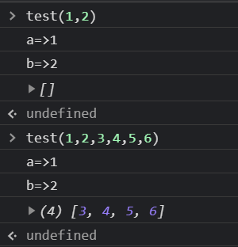
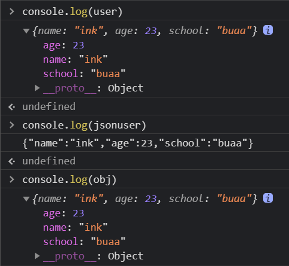
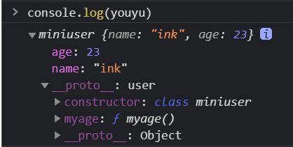
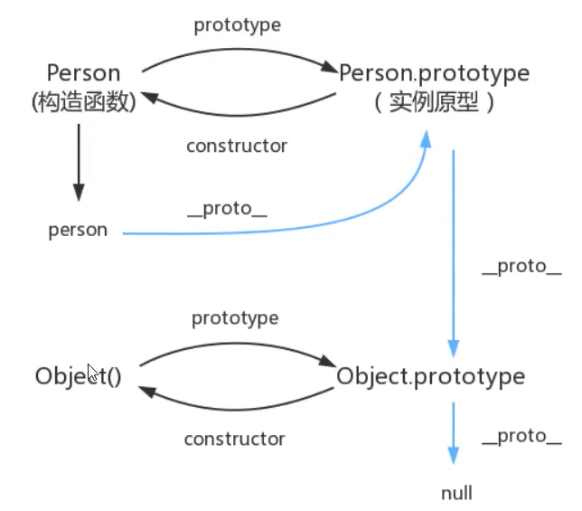
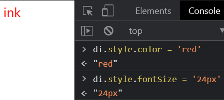
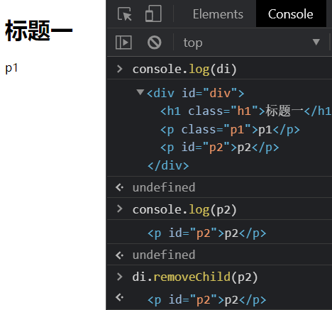
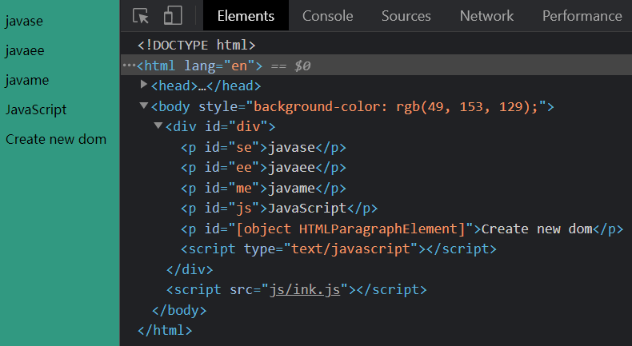
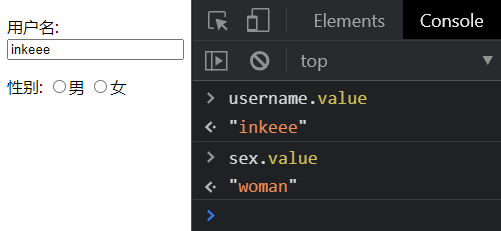

# JavaScript

弱类型**脚本语言**，源代码不需要编译，由**浏览器解释**运行。用于控制网页行为

原生JS开发按照`ECMAScript`标准（JS的一种规范），简称`ES`

- ES5：所有浏览器都支持
- ES6：主流版本，`webpack`打包成ES5支持

## JavaScript框架

- Angular（模块化开发）
- React（虚拟DOM）
- Vue（结合以上2种）

jQuery（库）

## UI框架

- Ant-Design

- ElementUI（基于Vue）

  vue-element-admin

- Bootstrap

- AmazeUI

## JavaScript构建工具

- Babel
- WebPack

# 控制台调试

可以设置断点，刷新重新运行，右侧有调试信息

- Elements：爬网站信息
- Console：调试JS
- Source：设置断点
- Network：抓包
- Application：查看网站cookie


# 引入JavaScript

文件目录格式

- js文件夹
  - script.js
- css文件夹
  - style.css
- images
- index.html

## 内部标签

`script`

JS代码写在`body`的最后

`<script type="javascript"></script>`不用定义`type`,默认是JS

```html
<body>
    <!-- script标签，写JS代码 -->
    <script>
        alert("hello world");
    </script>
</body>
```

## 外部引入

`<script src=""></script>`（不再是`link`）

```javascript
alert("hello world");
```

```html
<head>
    <meta charset="UTF-8">
    <title>Title</title>
    <script src="js/ink.js"></script>
</head>
```

# 基本语法

JavaScript**严格区分大小写**

## 定义变量

变量类型 变量名=变量值

**只有一种变量类型**`var`，所有定义都是`var`

> ES6中，局部变量用`let`定义

```javascript
var num = 1; // 变量名不能以数字或一些特殊符号开头
var 王者荣耀 = 倔强青铜;
```

## 条件控制

```javascript
if (condition){
	alert("1");
}
else if(){
    alert("2");
}
else{
    alert("3");
}
```

## alert

弹出（在控制台弹出变量时需要代码中有定义）


## console.log

在浏览器的控制台打印变量（代码中需有定义）

相当于`System.out.println()`


## 注释

- 单行注释：// + 空格
- 多行注释：/* */

# 数据类型

数值，文本，图形，音频，视频

## number

JavaScript不区分`浮点数`和`整数`

```javascript
// console控制台打印
123		// 整数
123.1 	// 浮点数
1.12e4	// 科学计数法
-99		// 负数
NaN		// not a number
Infinity	//无穷大
```

## 字符串

```javascript
"abc"
'abc'
'\n'
```

## 数组[ ]

因为各种”类型“变量都是`var`，所以数组中可以有各种“类型”

```javascript
var arr = [1,2,3,"buaa",true,null]; //推荐[ ]
new Array(1,2,3,"buaa",true,null);
```

## 对象{ }

内部属性是键值对`key-value`，每个属性用`，`隔开（最后一个不用）

```javascript
var person = {
    name:"ink", 
    age:24,
    tags:["java","js"]
}
```

取对象值：


## 布尔值

`true` `false`

```javascript
console.log(2>1)
true
```

## 逻辑运算

```javascript
&& 	 // 与
|| 	 // 或
！ 	// 非
```

## 比较运算符

不要使用`==`，使用`===`

```javascript
=   // 赋值
==  // 等于(类型不同，值相同也会判断为true)   "1" = 1
=== // 绝对等于(类型，值都相同才会判断为true)
```

NaN

- NaN和所有数值都不相等，**包括自己**。

- 只能通过`isNaN`方法判断这个数是否是NaN


浮点数比较

- 尽量避免使用浮点数进行运算，会有精度问题
- 做差判断


## Null和undefined

- Null：定义为空
- undefined：未定义

# 严格检查模式

预防JavaScript随意性导致的安全问题

ES6标准，必须写在JavaScript的**第一行**

```javascript
'use strict';
i = 1	// 局部变量用let定义，此时i会提示不规范
```

# 字符串

字符串：用`" "` `' '`包围，字符串不可变

字符串**长度**：`str.length`

## 转义字符串

用`\`

​	`\'`

​	`\n`：换行

​	`\t`：tab

```javascript
'use strict';
console.log('a\'');
console.log("a");
```


## 多行字符串

在``之中即可


```javascript
'use strict';
var str =`
    buaa
    nmb
    nlsde
`
alert(str)
```

## 模板字符串

${变量}

```javascript
'use strict';
let name = "ink";
let age = 24;
let msg = `你好,${name}`
console.log(msg)
```


# 数组

数组Array中可以有各种数据类型   

```javascript
// 一维数组,a[1]
var array = [1,2,3,4,"5","6"]
// 二维数组,a[1][1]
var array = [ [1,2],[3,4],["5","6"] ]
```

## 数组长度

`array.length`

注意：数组长度array.length可以被赋值改变，此时数组也会发生变化

- 当数组变大时：用未定义的empty填充。

- 当数组变小时，数组元素就会丢失。


## 数组遍历

- for of ：输出数组值
- for in ：输出数组索引

```javascript
'use strict';
var arr = [3,4,5];
for (let x of arr){
    console.log(x)	// 3,4,5
}
for (let x in arr){
    console.log(x) // 0,1,2
}
```

## 方法

- indexOf()：通过元素获取下标索引
- slice()：截取数组的一部分，返回一个新的数组，类似substring
- push()：向数组尾部添加一个元素
- pop()：弹出数组尾部元素（最后一个元素）
- unshift()：向数组头部添加一个元素
- shift()：弹出数组头部元素（第一个元素）
- sort()：排序
- reverse()：反转数组
- concat()：拼接数组，返回一个新的数组
- join()：使用特定字符拼接数组，返回一个字符串

# 对象

对象{ }内部属性是键值对`key-value`，每个属性用`，`隔开（最后一个不用）

```javascript
'use strict';
var person = {
    name:"ink",
    age:23,
    school:"buaa",
    position:"nmb"
}
```

对象赋值

```javascript
person.name = "inkk"
```

注意：

使用不存在的对象属性，不会报错，会提示undefined


## 动态增删属性

- delete：删除一个属性
- 直接定义一个属性(即添加)


## 属性判断

注意：**所有键key都是字符串，值value是任意类型**

- 判断属性是否在这个对象中（可以在对象的父类中）

  `"key" in 对象名`

- 判断属性是否是这个对象自身拥有

  `hasOwnProperty()`方法


# 流程控制

## if判断

```javascript
'use strict';
var age = 5;
if(age>3){
    alert("hhh");
}
else if(age<3){
    alert("jjj")
}
else{
    alert("ggg")
}
```

## while循环

```javascript
'use strict';
var age = 5;
while(age<10){
    age = age + 1
}
alert(age)
```

## for循环

注意：for循环中定义的let局部变量出循环后就无效了

```javascript
'use strict';
var age = 5;
for (let i = 0; i < 10; i++) {
    age = age + 1;
    alert(age)
}
```

# Map，Set

ES6新特性

## Map

键值对

- `get()`
- `set()`：增加
- `delete()`：删除

```javascript
'use strict';
var map = new Map([["tom",100],["jack",95]]);
var stu = map.get("tom");
map.set("admin",90);
map.delete("tom")
console.log(stu);
```


## Set

无序！不重复！集合

- `add()`：增加
- `delete()`：删除
- `has()`：判断是否含有某个元素

```javascript
'use strict';
var set = new Set([1,1,1,3]);
```


## iterator遍历

ES6新特性

> 可以用`for of`，`for in`遍历，但有轻微bug

# 函数

方法：面向对象（属性，方法）

函数：面向过程

## 函数定义

> 所有类型都一样`var`

`function`

- 执行到`return`结束
- 如果没有执行到`return`，函数会返回`undefined`（NaN）

```javascript
// 定义方式1
function abs(x){
    if (x>=0){
        return x;
    }
    else{
        return -x;
    }
}
// 定义方式2
// 这是一个匿名函数（函数=对象）
var abs = function(x){
    if (x>=0){
        return x;
    }
    else{
        return -x;
    }
}
```

## 调用函数

JavaScript可以传多个参数，也可以不传参数

```javascript
abs(10)
10
abs(-10)
10
```

### 不传参数

```javascript
// 添加判断，手动定义异常
if (typeof x !== 'number'){
    throw "Not a Number！"
}
```


### 传多个参数

**arguments**

> `arguments`是JavaScript免费赠送的一个关键字，包含传递进来的所有的参数(包括定义的参数)，是一个数组

```javascript
'use strict';
function abs(x){
    console.log("x=>"+x);
    for(let i = 0;i<arguments.length;i++){
        console.log(arguments[i]);
    }
    if (x>=0){
        return x;
    }
    else{
        return -x;
    }
}
```


**rest**

> rest包含传递进来的除定义参数外的所有的参数，是一个数组，用

```javascript
// ...rest 写在最后面
'use strict';
function test(a,b,...rest){
    console.log("a=>"+a);
    console.log("b=>"+b);
    console.log(rest);
}
```



# 变量作用域

var定义的变量存在**作用域**

- 函数体内声明的变量在函数体外不可以使用
- 不同的函数使用相同的变量名，只要在函数内就不冲突
- 内部函数可以访问外部函数的成员变量，反之不行
- 函数查找变量从自身函数开始，由内向外查找（就近原则）

```javascript
// Uncaught ReferenceError: x is not defined
'use strict';
function a(){
    var x = 1;
    x = x + 1;
}
x = x+2

// 不同函数不冲突
function a(){
    var x = 1;
    x = x + 1;
}function b(){
    var x = 2;
}

// b()可以调用a中的x,但是a不能调用b中的y
function a(){
    var x = 1;
    function b(){
        var y = x + 1;
        console.log(y);
    }
    b();
}
a();
```

## 提升变量作用域

> JavaScript执行引擎会自动把y的声明提前，但不会赋值

```javascript
// x undefined,说明y定义了但未赋值
'use strict';
function a(){
    var x = "x" + y;
    console.log(x);
    var y = "y";
}
a();
// 等价写法
function a(){
    var y;
    var x = "x" + y;
    console.log(x);
    y = "y";
}
```

## 全局变量

> 默认所有的全局变量都会自动绑定在window对象下
>
> alert()本身也是window变量

即JavaScript只有一个全局作用域。任何变量（包括定义的函数）在没有函数作用范围找到时，就会向外查找，最终查找到window。如果window也没找到，就会报错。

```javascript
'use strict';
var x = 1;
function a(){
    console.log(x);
}
a();
console.log(x); // 输出1 1
// window对象
'use strict';
var x = 1;
alert(x);
alert(window.x);
```

> 由于所有的全局变量都会自动绑定在window对象下，那么多个JavaScript文件如果使用了相同的全局变量，就会冲突

解决方法：`jQuery` `$`

定义唯一全局变量，把自己的代码全部放入自己定义的唯一空间名中

```javascript
'use strict';
// 唯一全局变量
var all = {};
// 定义全局变量
all.name = 'ink';
all.add = function (a,b){
    return a+b;
}
```

## 局部变量

ES6新特性：`let`定义局部变量

## 常量const

ES6之前：全部由大写字母命令的变量就是常量（其实可以改变）

ES6引入`const`

```javascript
'use strict';
const PI = 3.14;
console.log(PI);
PI = 3.1415 // Uncaught TypeError
```

# 方法

## 定义方法

 对象内部的函数就是方法（对象{属性，方法}）

```javascript
// 属性:person.name
// 方法:person.age()
'use strict';
var person = {
    name:'ink',
    birth:1997,
    // 方法
    age:function (){
        let now = new Date().getFullYear();
        return now - this.birth; //this代表当前对象
    }
}
```

## this

> Java中`this`是无法指向的，默认指向调用它的人

单独调用`getAge()`，`this`就会调用`window`对象

```javascript
function getAge(){
    let now = new Date().getFullYear();
    return now - this.birth;
}
var person = {
    name:'ink',
    birth:1997,
    age:getAge
}
```

## apply

JavaScript中可以控制this的指向

所有函数都有`apply`的属性

`apply()`有2个参数：

- `thisArg`：指向的对象
- `argArray`：函数参数

```javascript
'use strict';
function getAge(){
    let now = new Date().getFullYear();
    return now - this.birth;
}
var person = {
    name:'ink',
    birth:1997,
    age:getAge
}
```


# 内部对象

## 标准对象


## Date

```javascript
var now=new Date();
// 方法
now.getFullYear();	// 年
now.getMonth();		// 月(0~11)
now.getDate();		// 日
now.getDay(); 		// 星期
now.getTime(); 		// 时间戳,全世界唯一

// 返回时间
console.log(new Date(时间戳)) 

// 返回本地时间(调用方法)
now.toLocalString()
```

## JSON

### **JavaScript Object Notation**

json是一种轻量级的**数据交换格式**，**层次结构**简洁清晰，易于阅读编写，易于机器解析和生成，可以有效提升网络传输效率。

在JavaScript中一切皆对象（定义一个函数function，它也是一个对象），**任何JavaScript支持的类型都可以用JSON表示**

> 早期数据传输习惯使用xml文件（重量级）
>
> BSON（Binary JSON）也是一种计算机数据交换格式，主要用于MongDB数据库，是一种二进制表示形式。

### 格式

- 对象都用{ }
- 数组都用[ ]
- 所有键值对都是用key：value

```javascript
'use strict';
var person = {
    name:"ink",
    age:23,
    school:"buaa",
    position:"nmb"
}
```

### 转换

JSON字符串<—>JavaScript对象

- JSON：格式化的字符串（内" " ,  外' '）

              ```javascript
  '{"name": "ink", "age": 23, "school": "buaa"}'
              ```

- 对象：键值对形式

  ```javascript
  name: "ink", age: 23, school: "buaa"
  ```

```javascript
'use strict';
// 逗号隔开(最后一个不用)
var person = {
    name:"ink",
    age:23,
    school:"buaa"
}
// 对象转换为json字符串
var jsonuser = JSON.stringify()

// json字符串转换为对象
// 注意：json字符串用"",外面就得用''
var obj = JSON.parse('{"name": "ink", "age": 23, "school": "buaa"}')
```



# 面向对象

一般的面向对象，Java，C++

- 类：模板（抽象）
- 对象：实例（具体表现）

**在JavaScript中有些不同**

- 原型继承

  ```javascript
  // ink对象的原型是user对象
  ink.__proto__ = user
  ```

- class继承

  > class关键字是在ES6引入
  >
  > 本质还是查看对象原型

  ```javascript
  //定义类
  class user{
      // 构造器
      constructor(name){
          this.name = name;
      }
      hello(){
          alert('hello')
      }
  }
  var ink = new user("ink");
  
  // 继承
  class miniuser extends user{
      constructor(name,age){
          // 实现父类方法
          super(name);
          this.age = age;
      }
      myage(){
          alert(this.age);
      }
  }
  var youyu = new miniuser("ink",23);
  ```



> 原型链：
>
> JavaScript中，每个函数都有一个prototype属性，这个属性指向函数的**原型对象**



# BOM

浏览器对象模型BrowserObjectModel

> JavaScript就是为了让它在浏览器中运行（操作浏览器）

## 浏览器内核

- IE 6-12
- Chrom
- FireFox
- Safari

## BOM对象

- window：代表浏览器窗口
- Navigator：封装了浏览器的信息（可被人为修改，不建议使用）
- screen：代表全屏幕属性
- location：代表当前页面url信息（可被重定向）
- document：代表当前页面（可以获取具体的文档树节点，cookie）
- history：代表浏览器的历史记录（back后退，forward前进）

# DOM

文档对象模型`DocumentObjectModel`

> 整个浏览器网页就是一棵DOM树

操作**(需要先获得节点)**

- **更新DOM节点**
- **遍历DOM节点**
- **删除DOM节点**
- **添加DOM节点**

## 获得DOM节点

依靠css选择器，`document.getElementById`和`document.getElementsBy...`

> 因为id是唯一的，而ClassTame和TagName是会有相同的。所以一个是`getElement`，一个是`getElements`。
>
> `getElementById`返回一个dom对象，可以直接操作。`getElementsByClassName`返回一个dom数组，就要通过索引操作dom对象。


原生代码，后面使用`JQuery`

```html
<body>
<div id = "div">
    <h1 class="h1">标题一</h1>
    <p class="p1">p1</p>
    <p id="p2">p2</p>
</div>
<script src="js/ink.js"></script>
</body>
```

```javascript
var di = document.getElementById("div");
var p = document.getElementsByTagName("p");
var h1 = document.getElementsByClassName("h1");
var p1 = document.getElementsByClassName("p1");
var p2 = document.getElementById("p2");
var dc = div.children;
```


## 更新DOM节点

### 操作文本

- 修改Text文本值`innerText `


- 解析HTML文本标签`innerHTML`


### 操作CSS

- 属性使用字符串（"red"）
- 驼峰命名（fontSize）



## 删除DOM节点

步骤：

1. 获取删除目标节点的**父节点**`parentElement`
2. 通过父节点删除目标节点

```javascript
var self = document.getElementById("p2");
var father = self.parentElement;
father.removeChild(self)
```

注意：

- `removeChild`要求是dom对象，所以id选择的可以直接操作,如果是class数组,就要写成p1[0]形式
- 删除多个数组节点的时候，dom对象数组是在动态变化的，下标一定要注意（比如3个节点，删了一个后，再用索引2就会报错）



## 插入DOM节点

`innerText` 和`innerHTML`只适用于向**空**的dom节点中添加元素，**如果节点中存在元素，就会被覆盖**

- 创建节点：`createElement(tagName)`
- **追加**节点：
  - `append()`
  - `appendChild()`
  - `insertBefore(newNode,targetNode)`
- 设置属性：`setAttribute('key','value')`

```html
<body>
<p id="js">JavaScript</p>
<div id = "div">
    <p id="se">javase</p>
    <p id="ee">javaee</p>
    <p id="me">javame</p>
</div>
<script src="js/ink.js"></script>
</body>
```

```javascript
// 创建p标签
var n = document.createElement("p");
// 设置p标签的id属性
// 等价写法setAttribute('id','n');
n.id = n;
n.innerText = "Create new dom"
var js = document.getElementById("js");
var div = document.getElementById("div");
div.append(js);
div.appendChild(n);

// 创建script标签节点
var myscript = document.createElement('script');
//设置标签属性,相当于<script type="text/javascript"></script>
myscript.setAttribute('type',`text/javascript`);
div.appendChild(myscript);

// TagName返回的是一个dom数组
var body = document.getElementsByTagName('body')[0];
body.style.backgroundColor = '#319981';
```



# 表单

> 在前端验证

表单`form`也是DOM树中的一个节点，用来**提交信息**

常见表单：

1. 文本框：input（text）
2. 下拉框：select
3. 多选框：input（checkbox）
4. 隐藏域：hidden
5. 密码框：input（password）

## 操作表单

```html
<!DOCTYPE html>
<html lang="en">
<head>
    <meta charset="UTF-8">
    <title>Title</title>

    <link rel="stylesheet" href="css/style.css">
</head>
<body>
    <form action="", method="post">
        <p>
            <span>用户名:</span> <input type="text", id="username">
        </p>

        <p>
            <span>性别:</span>
            <input type="radio", name="sex", value="man">男
            <input type="radio", name="sex", value="woman">女
        </p>

    </form>
    <script src="js/ink.js" ></script>
</body>
</html>
```

```javascript
// 获取输入框中的内容
var username = document.getElementById('username');
// 设置输入框中的内容
username.value = 'inkeee';

var sex = document.getElementsByTagName('input')[2]
```




## 表单提交和验证

```html
<body>
    <form action="post">
        <p>
            <span>用户名:</span> <input type="text", id="username">
        </p>
        <p>
            <span>密码: </span> <input type="password", id="password">
        </p>
        
        <!-- 绑定事件,onclick被点击时触发事件-->
        <button type="button", onclick="f()">提交</button>

    </form>
    <script src="js/ink.js" ></script>
</body>
```

```javascript
function f() {
    alert("提交成功")
    var username = document.getElementById('username');
    var password = document.getElementById('password');
    console.log(username.value);
    console.log(password.value);
}
```

