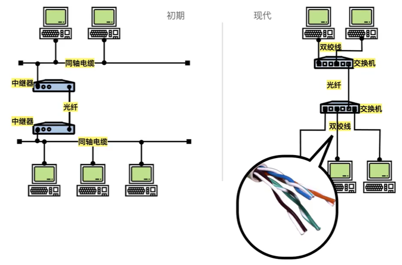
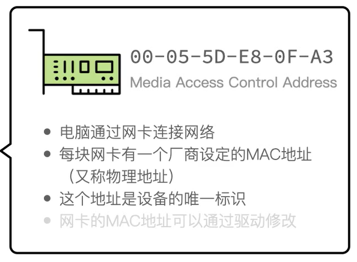

# 网络基础

## 网络传输

- 寻址和路由
- 数据链路
- 分片
- 序列码
- 封装
- 拥塞控制
- 错误检测和校正
- 数据重发
- 重组

> 协议：流程规范

## 网络模型

TCP/IP四层结构


## 以太网

> 硬件通过以太网缆线接入网络接口层上运行的以太网（协议）

以太网：设备通过物理地址（MAC地址）识别。

- 早期：同轴电缆，中继器
- 现在：双绞线，交换机和光纤

> 交换机通过MAC地址识别设备转发数据



### MAC地址

电脑通过网卡连接网络，**每台电脑可以有多块网卡**，网卡上有厂商设定的MAC地址（6个字节），原则上MAC地址是设备的唯一标识不可修改（但其实是出厂时写入网卡驱动，可以修改）



### 数据帧


`FCS`：检验传输数据是否丢失或损毁

> 通过光电创输的数据非常容易被干扰，不光是在传输线缆中，甚至在计算机的元件内，也可能以为宇宙射线或磁场从0变为1（1变0）
>
> 单粒子反转

# 协议

## IP协议

网络层协议：寻找数据传输的**主机**

ip地址：32位二进制组成（8位一写）

- 网络标识
- 主机标识

子网掩码：32位二进制组成，确定32位中哪些是网络标识（1），哪些是主机标识（0）

> `CIDR`写法：直接`ip地址/n`标识前n位是1

## 数据传输

### 同一内网

**主机-交换机-主机**

> 主机们的网段相同，可以ARP发现彼此的MAC地址，直接通信，不需要任何三层设备（网关）的介入

ARP广播（`FF-FF-FF`）获取目的ip地址对应的MAC地址，交换机转发给所有端口并自动建立（缓存）地址表

### 网络之间

**主机-交换机A-路由器A-路由器B-交换机B-主机**

> 网关`Gateway`又称网间连接器

需要由中间路由器去广播ARP请求，即主机通信的目的地址是路由器，而路由器作为新的通信发起者。

## UDP协议

传输层协议：寻找数据传输的主机上的**程序**（**端口**区分）


> 一台机器上一个端口只能由一个应用程序占用，数据传输只认端口，不看程序。
>
> 校验和：数据累加的checksum值

**常用端口：**

- `FTP`：21
- `SSH`：22
- `SMTP`：25
- `HTTP`：80
- `HTTPS`：443
- `MySQL`：3306
- `Redis`：6379
- `Prox`：8080

## TCP协议

传输层协议：建立**连接**以保证可靠性


> 校验和：头部和数据部分的和，再取反

客户端和服务器端都会维护一个属于自己的顺序码`seq`

**标志位：**

- `CWR`
- `ECE`
- `URG`
- `ACK`
- `PSH`
- `RST`
- `SYN`
- `FIN`

三次握手

> 使用动态、随机原始序列号seq更安全

```http
SYN	seq = 0
ACK	ack = 1;SYN	seq = 0
seq = 1;ACK	ack = 1
```

4次挥手

```http
FIN seq = 1
ACK ack = 2 此时服务器端的连接就已经断开
FIN seq = x
ACK ack = x+1 连接关闭
```

# 万维网

world wide  web

核心技术

- `URI`：统一资源标识符
- `HTML`：超文本标记语言
- `HTTP`：超文本传输协议

## URI

- `scheme`：协议标识（http，ftp，file等）
- `://`

- `user:password@`（可选）
- `host`：ip地址（域名），和密码用@隔开
- `port`：端口（默认80，省略）
- `path`：路径（`/`绝对路径`./`同级目录`../`上级目录）
- `query`：查询参数
- `fragment`：锚点

> URL：统一资源定位符，是一种用来标识位置的特殊的URI

## HTTP

无状态协议：所有请求都是新的请求（在服务器看来）

> 开发者工具


HTTP Message（HTTP报文）

- `Request`请求

- `Response`响应

HTTP Message 格式：

- `start line`：开始行
- `message header`：消息头
  - `Request header`
  - `Response header`
  - `Entity header`
- `CRLF`：空行
- `message body`：消息体（可空）

> `Entity`：Entity header在message header内，Entity body ≈ message body（当message header内有指定内容编码时，Entity body ≠ message body，例如message body是被压缩的Entity body）