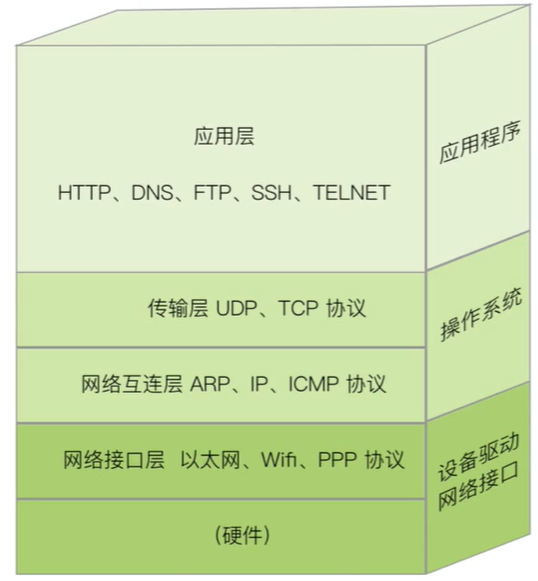
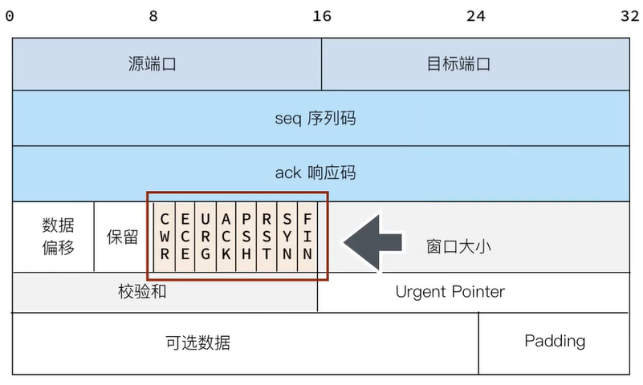
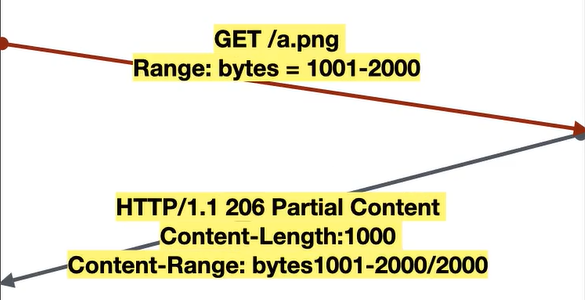
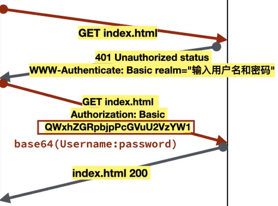

<!-- TOC -->

- [网络基础](#网络基础)
  - [网络传输](#网络传输)
  - [网络模型](#网络模型)
  - [以太网](#以太网)
    - [MAC地址](#mac地址)
    - [数据帧](#数据帧)
- [协议](#协议)
  - [IP协议](#ip协议)
  - [数据传输](#数据传输)
    - [同一内网](#同一内网)
    - [网络之间](#网络之间)
  - [UDP协议](#udp协议)
  - [TCP协议](#tcp协议)
- [万维网](#万维网)
  - [URI](#uri)
  - [HTTP](#http)
    - [HTTP Message（HTTP报文）](#http-messagehttp报文)
    - [Request](#request)
    - [Response](#response)
    - [Entity header](#entity-header)
    - [Keep-Alive](#keep-alive)
    - [内容协商](#内容协商)
    - [部分内容获取](#部分内容获取)
    - [按条件获取](#按条件获取)
    - [会话和Cookie](#会话和cookie)
    - [Basic认证](#basic认证)
    - [多内容分块传输](#多内容分块传输)

<!-- /TOC -->

# 网络基础

## 网络传输

- 寻址和路由
- 数据链路
- 分片
- 序列码
- 封装
- 拥塞控制
- 错误检测和校正
- 数据重发
- 重组

> 协议：流程规范

## 网络模型

TCP/IP四层结构



## 以太网

> 硬件通过以太网缆线接入网络接口层上运行的以太网（协议）

以太网：设备通过物理地址（MAC地址）识别。

- 早期：同轴电缆，中继器
- 现在：双绞线，交换机和光纤

> 交换机通过MAC地址识别设备转发数据


### MAC地址

电脑通过网卡连接网络，**每台电脑可以有多块网卡**，网卡上有厂商设定的MAC地址（6个字节），原则上MAC地址是设备的唯一标识不可修改（但其实是出厂时写入网卡驱动，可以修改）


### 数据帧


`FCS`：检验传输数据是否丢失或损毁

> 通过光电创输的数据非常容易被干扰，不光是在传输线缆中，甚至在计算机的元件内，也可能以为宇宙射线或磁场从0变为1（1变0）
>
> 单粒子反转

# 协议

## IP协议

网络层协议：寻找数据传输的**主机**

ip地址：32位二进制组成（8位一写）

- 网络标识
- 主机标识

子网掩码：32位二进制组成，确定32位中哪些是网络标识（1），哪些是主机标识（0）

> `CIDR`写法：直接`ip地址/n`标识前n位是1

## 数据传输

### 同一内网

**主机-交换机-主机**

> 主机们的网段相同，可以ARP发现彼此的MAC地址，直接通信，不需要任何三层设备（网关）的介入

ARP广播（`FF-FF-FF`）获取目的ip地址对应的MAC地址，交换机转发给所有端口并自动建立（缓存）地址表

### 网络之间

**主机-交换机A-路由器A-路由器B-交换机B-主机**

> 网关`Gateway`又称网间连接器

需要由中间路由器去广播ARP请求，即主机通信的目的地址是路由器，而路由器作为新的通信发起者。

## UDP协议

传输层协议：寻找数据传输的主机上的**程序**（**端口**区分）


> 一台机器上一个端口只能由一个应用程序占用，数据传输只认端口，不看程序。
>
> 校验和：数据累加的checksum值

**常用端口：**

- `FTP`：21
- `SSH`：22
- `SMTP`：25
- `HTTP`：80
- `HTTPS`：443
- `MySQL`：3306
- `Redis`：6379
- `Prox`：8080

## TCP协议

传输层协议：建立**连接**以保证可靠性



> 校验和：头部和数据部分的和，再取反

客户端和服务器端都会维护一个属于自己的顺序码`seq`

**标志位：**

- `CWR`
- `ECE`
- `URG`
- `ACK`
- `PSH`
- `RST`
- `SYN`
- `FIN`

三次握手

> 使用动态、随机原始序列号seq更安全

```http
SYN	seq = 0
ACK	ack = 1;SYN	seq = 0
seq = 1;ACK	ack = 1
```

4次挥手

```http
FIN seq = 1
ACK ack = 2 此时服务器端的连接就已经断开
FIN seq = x
ACK ack = x+1 连接关闭
```

# 万维网

world wide  web

核心技术

- `URI`：统一资源标识符
- `HTML`：超文本标记语言
- `HTTP`：超文本传输协议

## URI

- `scheme`：协议标识（http，ftp，file等）
- `://`

- `user:password@`（可选）
- `host`：ip地址（域名），和密码用@隔开
- `port`：端口（默认80，省略）
- `path`：路径（`/`绝对路径`./`同级目录`../`上级目录）
- `query`：查询参数
- `fragment`：锚点

> URL：统一资源定位符，是一种用来标识位置的特殊的URI

## HTTP

无状态协议：所有请求都是新的请求（在服务器看来）

> 开发者工具


### HTTP Message（HTTP报文）

- `Request`请求

- `Response`响应

HTTP Message 格式：

- `start line`：开始行
- `message header`：消息头
  - `Request header`
  - `Response header`
  - `Entity header`
- `<CR><LF>`：空行
- `message body`：消息体（可空）

> `Entity`：Entity header在message header内，Entity body ≈ message body（当message header内有指定内容编码时，Entity body ≠ message body，例如message body是被压缩的Entity body）

### Request

- `Request line`：请求行
  - `method`：GET，POST，HEAD，OPTIONS
  - `uri`：域名在header的host内
  - `version`：一般是1.1
- `Request header`：请求头（每一行都是一个header）
  - `Referrer`：请求发起页面的地址（在浏览器输入就是空）
  - `User-Agent`：客户端信息（如浏览器和操作系统）
  - `Host`：主机域名
  - `max-forwards`：请求最大转发次数
- `<CR><LF>`：空行
- `message body`：消息体（可空）

### Response

- `Statue line`：状态行
  - `version`：一般是1.1
  - 状态码
    - 2：表示成功
    - 3：表示请求要转发到其他地方
    - 4：表示请求出问题，问题在浏览器这边
    - 5：表示请求出问题，问题在服务器这边
- `Response header`：响应头
  - ETag：Entity的唯一编码，Entity内容修改后会被更新
  - Retry-after：N秒后重试
  - Location：转向到能处理的地方
  - Server：服务器的相关信息
- `<CR><LF>`：空行
- `message body`：消息体（可空，一般为HTML）

### Entity header

- `Allow`：服务器支持的HTTP方法（get)
- `Expires`：过期时间（秒）
- `Content-Encoding`：编码格式（gzip/deflate）
- `Content-Language`：内容语言（zh-cn）
- `Content-Length`：内容长度（字节）
- `Content-Type`：媒体类型（text/html;charset=UTF-8）

> MIME类型和文件扩展名
>
> html：text/html
>
> text：text/plain
>
> png：image/png

### Keep-Alive

HTTP1.1中增加的**长连接**

在header中的`connect`属性中可以看到是否是长连接

### 内容协商

服务器端根据客户端的一些请求来发送特定的内容

以`Accept`为前缀的都是进行内容协商的字段（如`Acceptt-Language`：zh-cn，希望要中文）

### 部分内容获取

通过`Range`字段表示只需要部分的内容，返回的状态码为`206 Partial Content`



### 按条件获取

通过`if-Modified-Since`字段表示让服务器根据某些条件部返回对应内容和相关状态码

- 文件修改过：返回`200`和文档内容，并在Response header中加上`last-modified`（修改时间）
- 文件没被修改：只返回`304 Not Modified`


### 会话和Cookie

解决HTTP的**无状态**问题

在服务器给客户端发送响应Response的时候，在`Response header`中添加`set-cookie`字段，`set-cookie`会附带一个值（如 id=1），下次客户端浏览器再次向服务器发送请求时，就会在自己的`Request header`里面写上cookie值，服务器查到对应cookie值就可以知道这是哪一个客户端了。

### Basic认证

> cookie可以被伪造，不够安全

如果访问的资源是需要Basic认证的，服务器会返回`401 unauthorized status`并添加一个`www-unauthorized Basic realm`字段，字段中附上提示信息（如，请输入用户名和密码）。客户端根据提示信息操作后会重发请求，并同时在Request header中添加一个`Authentication`的字段，字段值是Basic空格和一串**编码**。服务器核对成功后才会返回请求内容。

> 编码：用户名和密码进行base64编码得到的值
>
> 以后浏览器请求这个内容就会自动带上这个header，相当于带上了用户名和密码，不用再输入



### 多内容分块传输

`multipart`：将数据用分隔符隔开，服务器将多段数据拼接

首先令`Content-Type`=`multipart/form-data`，然后令分隔符`boundary`=`----WebKitFormBoundary`和一串字符（随即生成）

> 多用于**表单**（form）文件上传到服务器
>
> 表单一般有两种`enctype`类型，分别是`URL encode`和`multipart/form-data`，表单中有文件时，必须要使用`multipart/form-data`。否则上传时靠`URL encode`的分隔方式（用`&`和`=`分割）很容易出错